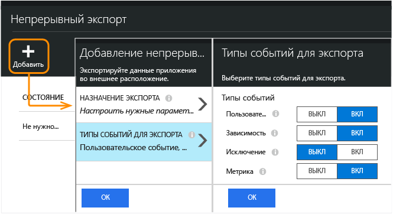

<properties 
	pageTitle="Непрерывный экспорт данных телеметрии из Application Insights" 
	description="Экспортируйте данные диагностики и использования в хранилище в Microsoft Azure и загрузите их оттуда." 
	services="application-insights" 
    documentationCenter=""
	authors="alancameronwills" 
	manager="douge"/>

<tags 
	ms.service="application-insights" 
	ms.workload="tbd" 
	ms.tgt_pltfrm="ibiza" 
	ms.devlang="na" 
	ms.topic="article" 
	ms.date="09/23/2015" 
	ms.author="awills"/>
 
# Экспорт данных телеметрии из Application Insights

Требуется специальный анализ данных телеметрии? Или, может быть, хотелось бы получать оповещения по электронной почте о событиях с определенными свойствами? Функция "Непрерывный экспорт" идеально подходит для этого. События, которые отображаются на портале Application Insights, можно экспортировать в хранилище Microsoft Azure в формате JSON. Отсюда можно загрузить данные; также вы можете написать любой код, необходимый для их обработки.

Функция непрерывного экспорта доступна в бесплатной пробной версии и в [тарифных планах Standard и Premium](http://azure.microsoft.com/pricing/details/application-insights/).

(Если требуется сделать [одноразовый экспорт](app-insights-metrics-explorer.md#export-to-excel) отображаемых в метрике или в поисковой колонке данных, щелкните "Экспорт" в верхней части колонки.)

## Создание учетной записи хранения

Если у вас еще нет «классической» учетной записи хранения, создайте ее.

1. Создайте «классическую» учетную запись хранения в подписке на [портале Azure](https://portal.azure.com).

    

2. Создание контейнера

    

## Настройка непрерывного экспорта

В колонке обзора приложения на портале Application Insights откройте раздел непрерывного экспорта:

Добавьте параметры экспорта, а затем выберите [учетную запись хранилища Azure](../storage-introduction.md), где требуется разместить данные:

Выберите типы событий, которые требуется экспортировать:

После создания параметров экспорта запускается процедура экспорта. (Вы получите только те данные, которые поступят после создания параметров экспорта.)

Возможна задержка около часа до появления данных в BLOB-объекте.

Если позднее потребуется изменить типы событий, просто изменить параметры экспорта:

Чтобы остановить поток, нажмите кнопку "Отключить". При повторном нажатии кнопки включения поток будет перезапущен с новыми данными. Пока экспорт был отключен, вы не будете получать данные, которые поступают на портал.

Чтобы остановить поток навсегда, удалите параметры экспорта. Это действие не повлечет удаление данных из хранилища.

#### Не удается добавить или изменить параметры экспорта?

* Чтобы добавить или изменить параметры экспорта, необходимы права доступа владельца, участника или участника Application Insights. [Дополнительные сведения о ролях][roles].

##  Какие события вы получаете?

Экспортированные данные представляют собой необработанные данные телеметрии, полученные из приложения, за исключением того, что мы добавляем данные расположения, которые следует вычислять по IP-адресу клиента.

Другие вычисляемые метрики не включаются. Например, мы не экспортируем показатель среднего использования ЦП, но мы экспортируем необработанные данные телеметрии, на основе которых можно вычислить это среднее значение.

Данные также содержат результаты любого [веб-теста доступности](app-insights-monitor-web-app-availability.md), который вы настроили.

## Изучение данных

Проверить хранилище можно непосредственно на портале. Нажмите кнопку **Обзор**, выберите учетную запись хранения, а затем откройте раздел **Контейнеры**.

Чтобы проверить службу хранилища Azure в Visual Studio, выберите меню **Представление** и щелкните **Обозреватель облака**. (Если этой команды нет в меню, установите пакет SDK для Azure: откройте диалоговое окно **Создание проекта**, разверните узел «Visual C#/облако» и выберите **Получить Microsoft Azure SDK для .NET**.)

При открытии хранилища больших двоичных объектов вы увидите контейнер с набором файлов больших двоичных объектов. URI для каждого файла основан на имени ресурса Application Insights, ключе инструментирования, типе телеметрии, дате и времени. (Имя ресурса содержит только строчные буквы, в ключе инструментирования опускаются дефисы).

Дата и время имеют формат UTC и соответствуют моменту, когда элемент телеметрии был внесен в хранилище (не моменту его создания). Поэтому при написании кода для загрузки данных можно линейно перемещаться по данным.

## Формат данных

* Каждый большой двоичный объект является текстовым файлом, который содержит несколько строк, разделенных символом новой строки "\\n".
* Каждая строка представляет собой неформатированный JSON-документ. Если вы хотите просмотреть его, откройте документ в Visual Studio и последовательно выберите "Правка", "Дополнительно", "Формат файла":

Продолжительность времени измеряется в тактах, где 10 000 тактов составляют 1 мс. Например, следующие значения показывают время 10 мс для отправки запроса из браузера, 30 мс для его получения и 1,8 с для обработки страницы в браузере:

	"sendRequest": {"value": 10000.0},
	"receiveRequest": {"value": 30000.0},
	"clientProcess": {"value": 17970000.0}

[Подробный справочник по модели данных типов и значений свойств.](app-insights-export-data-model.md)

## Обработка данных

Для небольших объемов данных можно написать код, который будет выделять элементы данных, записывать их в электронную таблицу и т. д. Например:

    private IEnumerable<T> DeserializeMany<T>(string folderName)
    {
      var files = Directory.EnumerateFiles(folderName, "*.blob", SearchOption.AllDirectories);
      foreach (var file in files)
      {
         using (var fileReader = File.OpenText(file))
         {
            string fileContent = fileReader.ReadToEnd();
            IEnumerable<string> entities = fileContent.Split('\n').Where(s => !string.IsNullOrWhiteSpace(s));
            foreach (var entity in entities)
            {
                yield return JsonConvert.DeserializeObject<T>(entity);
            }
         }
      }
    }

Больший пример кода см. в статье [об использовании рабочей роли][exportasa].

## Удаление старых данных
Обратите внимание на то, что вы несете ответственность за управление емкостью хранилища и удаление при необходимости старых данных.

## При повторном создании ключа хранилища...

Если изменить ключ хранилища, непрерывный экспорт перестанет работать. Вы увидите уведомление в учетной записи Azure.

Откройте колонку непрерывного экспорта и измените параметры экспорта. Измените параметр назначения экспорта, но оставьте выбранным то же самое хранилище. Нажмите кнопку "ОК" для подтверждения.

Непрерывный экспорт будет перезапущен.

## Экспорт в Power BI

[Microsoft Power BI](https://powerbi.microsoft.com/) представляет данные в виде разнообразных информативных визуальных элементов, а также позволяет объединить информацию из нескольких источников. Вы можете выполнять потоковую передачу данных телеметрии о производительности и использовании приложений из Application Insights в Power BI.

[Потоковая передача данных Application Insights в Power BI](app-insights-export-power-bi.md)

## Экспорт в SQL

Другой вариант – переместить данные в базу данных SQL, где можно выполнить более расширенную аналитику.

У нас есть примеры, в которых показано два альтернативных способа перемещения данных из хранилища больших двоичных объектов в базу данных:

* [Экспорт в SQL с использованием рабочей роли][exportcode]
* [Экспорт в SQL с использованием Stream Analytics][exportasa]

Для больших объемов данных рассмотрите возможность использования [HDInsight](http://azure.microsoft.com/services/hdinsight/) – кластеров Hadoop в облаке. HDInsight предоставляет широкий набор технологий для управления и анализа больших объемов данных.

## Вопросы и ответы

* *Все, что мне требуется, – всего лишь один раз загрузить диаграмму.*  
 
    Да, это можно сделать. В верхней части колонки щелкните [Экспорт данных](app-insights-metrics-explorer.md#export-to-excel).

* *Параметры экспорта настроены, но в хранилище нет данных.*

    Получала ли служба Application Insights какие-либо данные телеметрии из вашего приложения с момента настройки параметров экспорта? Вы получите только новые данные.

* *Я попытался настроить параметры экспорта, но было отказано в доступе.*

    Если учетная запись принадлежит организации, необходимо быть членом группы владельцев или участников.

    <!-- Your account has to be either a paid-for account, or in the free trial period. -->

* *Могу ли я экспортировать данные непосредственно в свое локальное хранилище?*

    Нет. Наш механизм экспорта в настоящее время работает только для хранилища Azure.

* *Существует ли предел для объема данных, помещаемых в мое хранилище?*

    Нет. Мы будем хранить переданные данные в хранилище, пока вы не удалите данные экспорта. Мы остановим передачу данных, если столкнемся с внешними ограничениями для хранилища больших двоичных объектов, но хранилище очень большое. Вы можете настроить объем используемого хранилища.

* *Сколько больших двоичных объектов отображается в хранилище?*

 * Для каждого типа данных, выбранных для экспорта, каждую минуту создается новый большой двоичный объект (при наличии данных).
 * Кроме того, для приложений с высоким трафиком выделяются дополнительные единицы разделов. В этом случае каждую минуту каждая единица создает большой двоичный объект.

* *После повторного создания ключа для моего хранилища или изменения имени контейнера экспорт больше не работает.*

    Измените параметры экспорта и откройте колонку назначения экспорта. Оставьте выбранным прежнее хранилище и нажмите кнопку "OK" для подтверждения. Экспорт будет перезапущен. Если это изменение было сделано в течение последних нескольких дней, данные не будут потеряны.

* *Можно ли приостановить экспорт?*

    Да. Нажмите кнопку "Отключить".

## Примеры кода

* [Потоковая передача данных Application Insights в Power BI](app-insights-export-power-bi.md)
* [Анализ экспортированного JSON при помощи рабочей роли][exportcode]
* [Экспорт в SQL с использованием Stream Analytics][exportasa]

* [Подробный справочник по модели данных типов и значений свойств.](app-insights-export-data-model.md)

<!--Link references-->

[exportcode]: app-insights-code-sample-export-telemetry-sql-database.md
[exportasa]: app-insights-code-sample-export-sql-stream-analytics.md
[roles]: app-insights-resources-roles-access-control.md

 

<!---HONumber=Sept15_HO4-->