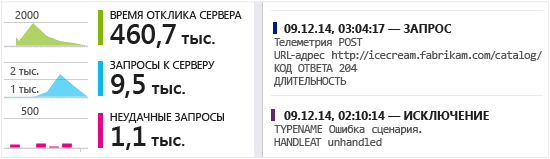
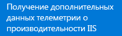
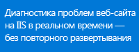
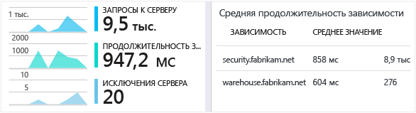
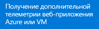
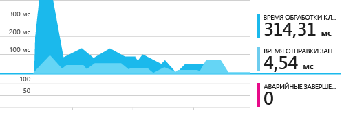
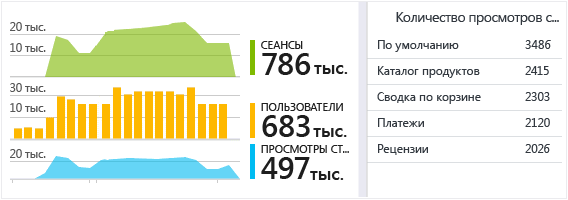
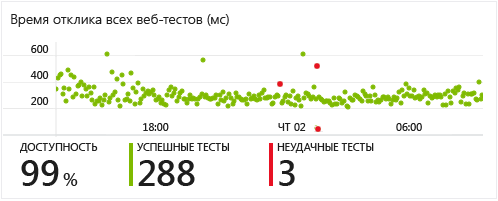
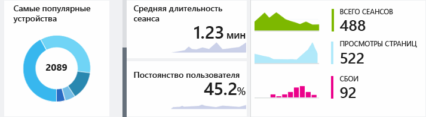

<properties
	pageTitle="Начало работы с Visual Studio Application Insights | Microsoft Azure"
	description="Анализ использования, доступности и производительности локального приложения или веб-приложения Microsoft Azure с помощью Visual Studio Application Insights."
	services="application-insights"
    documentationCenter=""
	authors="alancameronwills"
	manager="douge"/>

<tags
	ms.service="application-insights"
	ms.workload="tbd"
	ms.tgt_pltfrm="ibiza"
	ms.devlang="na"
	ms.topic="hero-article"
	ms.date="06/06/2016"
	ms.author="awills"/>

# Начало работы с Visual Studio Application Insights

*Доступна только предварительная версия Application Insights.*

Обнаружение проблем, решение проблем и постоянное усовершенствование приложений. Быстрая диагностика любых проблем в работающем приложении. Понимание действий, выполняемых пользователями с этим приложением.

Настроить службу очень легко, так что результаты будут видны уже через несколько минут.

В настоящее время поддерживаются приложения для iOS, Android и Windows, веб-приложения J2EE и ASP.NET, а также службы WCF. Веб-приложения могут работать в Azure или на локальных серверах. Пакет SDK для JavaScript работает на любых веб-страницах.

[Просмотрите этот ознакомительный анимированный ролик](https://www.youtube.com/watch?v=fX2NtGrh-Y0).

## Приступая к работе

Начните с любого сочетания и любого порядка точек входа, обозначенных на следующей диаграмме. Следуйте наиболее подходящему маршруту.

Для работы Application Insights в приложение необходимо добавить пакет SDK, который отправляет данные телеметрии на [портал Azure](https://portal.azure.com). Существуют разные пакеты SDK для многих сочетаний поддерживаемых платформ, языков и сред IDE.

Вам потребуется учетная запись в [Microsoft Azure](http://azure.com). Возможно, у вас уже есть доступ к учетной записи группы вашей организации. При необходимости можно получить учетную запись с оплатой по мере использования. Application Insights имеет уровень Free, поэтому вы можете не платить до тех пор, пока ваше приложение не станет популярным. См. страницу с [информацией о ценах](https://azure.microsoft.com/pricing/details/application-insights/).

Что вам нужно | Что следует делать | Что вы получаете
---|---|---
  | <a href="app-insights-asp-net.md">Добавить пакет SDK Application Insights в веб-проект</a>  | 
 |<a href="app-insights-monitor-performance-live-website-now.md">Установить монитор состояния на сервере IIS</a>  | 
|<a href="insights-perf-analytics.md">Включить Insights в веб-приложении Azure или в виртуальной машине</a>    | 
|<a href="app-insights-java-get-started.md">Добавить пакет SDK в проект Java</a>  | 
|<a href="app-insights-web-track-usage.md">Вставить сценарий Application Insights на свои веб-страницы</a>  | 
|<a href="app-insights-monitor-web-app-availability.md">Создать веб-тесты</a>  | 
|<a href="http://hockeyapp.net">Использовать HockeyApp</a>  | 

## Поддержка и обратная связь

* Вопросы и проблемы
 * [Устранение неполадок][qna]
 * [Форум MSDN](https://social.msdn.microsoft.com/Forums/vstudio/ru-RU/home?forum=ApplicationInsights)
 * [Stackoverflow](http://stackoverflow.com/questions/tagged/ms-application-insights)
* Предложения
 * [UserVoice](https://visualstudio.uservoice.com/forums/357324)
* Примеры кода
 * [Примеры кода](app-insights-code-samples.md)

## Видео

> [AZURE.VIDEO 218]

> [AZURE.VIDEO usage-monitoring-application-insights]

> [AZURE.VIDEO performance-monitoring-application-insights]

<!--Link references-->

[qna]: app-insights-troubleshoot-faq.md

<!---HONumber=AcomDC_0713_2016-->