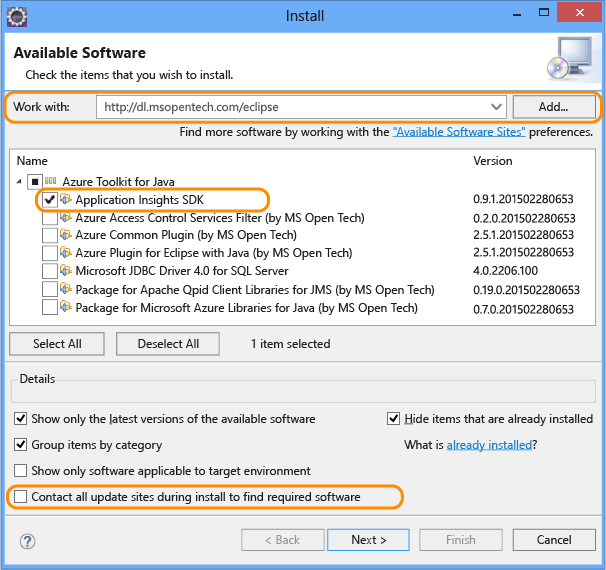
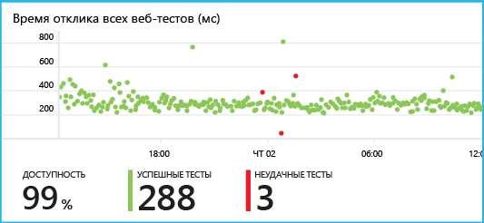

# <a name="get-started-with-application-insights-with-java-in-eclipse"></a>Приступая к работе с Application Insights на Java в Eclipse
Пакет SDK Application Insights передает телеметрию из веб-приложения Java, что позволяет вам анализировать параметры использования и производительности. Подключаемый модуль Eclipse для Application Insights автоматически устанавливает пакет SDK в проекте (что позволяет вам получать актуальную телеметрию) и интерфейс API, который можно использовать для написания пользовательских элементов телеметрии.   

## <a name="prerequisites"></a>предварительным требованиям
В настоящее время подключаемый модуль работает для проектов Maven и динамических веб-проектов в Eclipse.
([Приступая к работе с Application Insights в веб-проекте Java][java].)

Что вам понадобится:

* JRE 1.7 или 1.8;
* подписка на [Microsoft Azure](https://azure.microsoft.com/).
* [интегрированная среда разработки Eclipse для разработчиков Java EE](http://www.eclipse.org/downloads/), версия Indigo или более поздняя;
* Windows 7 или более поздней версии либо Windows Server 2008 или более поздней версии.

## <a name="install-the-sdk-on-eclipse-one-time"></a>Установка пакета SDK для Eclipse (один раз)
Необходимо выполнить один раз на каждом из компьютеров. На этом шаге устанавливается набор средств, который позволит добавить пакет SDK для каждого динамического веб-проекта.

1. В Eclipse щелкните "Help" (Справка), "Install New Software" (Установка нового программного обеспечения).

    
2. Пакет SDK находится в http://dl.microsoft.com/eclipse в набор средств Azure.
3. Снимите флажок **Contact all update sites...**

    

Оставшиеся действия выполните для каждого проекта Java.

## <a name="create-an-application-insights-resource-in-azure"></a>Создание ресурса Application Insights в Azure
1. Войдите на [портале Azure](https://portal.azure.com).
2. Создайте новый ресурс Application Insights. Задайте тип приложения: веб-приложение Java.  

      

4. Найдите ключ инструментирования нового ресурса. Далее будет необходимо вставить его в проект кода.  

      

## <a name="add-application-insights-to-your-project"></a>Добавление Application Insights в ваш проект
1. Добавьте Application Insights из контекстного меню веб-проекта Java.

    
2. Вставьте ключ инструментирования, полученный на портале Azure.

    

Ключ пересылается вместе с каждым элементом телеметрии; служба Application Insights отобразит его в ресурсе.

## <a name="run-the-application-and-see-metrics"></a>Запуск приложения и просмотр метрик
Запустите приложение.

Вернитесь к ресурсу Application Insights в Microsoft Azure.

В колонке обзора появятся данные HTTP-запросов. (Если данные отсутствуют, подождите несколько секунд и нажмите кнопку обновления).


Щелкните любую диаграмму, чтобы увидеть более подробные метрики.


[Дополнительные сведения о метриках.][metrics]

При просмотре свойств запроса можно увидеть события телеметрии, связанные с ним, такие как запросы и исключения.


## <a name="client-side-telemetry"></a>Телеметрия на стороне клиента
В колонке быстрого запуска щелкните ссылку "Получить код для мониторинга моих веб-страниц":


Вставьте фрагмент кода в заголовок HTML-файлов.

#### <a name="view-client-side-data"></a>Просмотр данных на стороне клиента
Откройте обновленные веб-страницы и выполните с ними какое-либо действие. Подождите минуту или две, а затем вернитесь в Application Insights и откройте колонку использования. (Прокрутите колонку обзора вниз и щелкните элемент "Использование".)

В колонке использования появятся метрики просмотра страниц, пользователей и сеансов:


[Дополнительные сведения о настройке телеметрии на стороне клиента][usage]

## <a name="publish-your-application"></a>Публикация приложения
Теперь опубликуйте приложение на сервере, откройте доступ для пользователей и изучайте телеметрию на портале.

* Убедитесь, что брандмауэр позволяет приложению отправлять телеметрию на следующие порты:

  * dc.services.visualstudio.com:443
  * dc.services.visualstudio.com:80
  * f5.services.visualstudio.com:443
  * f5.services.visualstudio.com:80
* На серверах Windows необходимо установить следующее:

  * [распространяемые компоненты Microsoft Visual C++.](http://www.microsoft.com/download/details.aspx?id=40784)

    (Сюда входят счетчики производительности).

## <a name="exceptions-and-request-failures"></a>Исключения и ошибки запросов
Необработанные исключения автоматически фиксируются:


Для сбора данных по другим исключениям доступны два варианта:

* [вставить в код вызовы функции TrackException](app-insights-api-custom-events-metrics.md#trackexception);
* [установить на сервере агент для Java](app-insights-java-agent.md). Необходимо указать методы, которые требуется отслеживать.

## <a name="monitor-method-calls-and-external-dependencies"></a>Мониторинг вызовов методов и внешних зависимостей.
[установить агент для Java](app-insights-java-agent.md) .

## <a name="performance-counters"></a>Счетчики производительности
Прокрутите колонку "Обзор" вниз и щелкните плитку **Серверы**. Вы увидите несколько счетчиков производительности.


### <a name="customize-performance-counter-collection"></a>Настройка сбора данных счетчиками производительности
Чтобы отключить сбор данных стандартным набором счетчиков производительности, добавьте следующий фрагмент кода в корневой узел файла ApplicationInsights.xml:

```XML

    <PerformanceCounters>
       <UseBuiltIn>False</UseBuiltIn>
    </PerformanceCounters>
```

### <a name="collect-additional-performance-counters"></a>Сбор данных дополнительными счетчиками производительности
Можно задать необходимость сбора данных дополнительными счетчиками производительности.

#### <a name="jmx-counters-exposed-by-the-java-virtual-machine"></a>Счетчики JMX (предоставляются виртуальной машиной Java)

```XML

    <PerformanceCounters>
      <Jmx>
        <Add objectName="java.lang:type=ClassLoading" attribute="TotalLoadedClassCount" displayName="Loaded Class Count"/>
        <Add objectName="java.lang:type=Memory" attribute="HeapMemoryUsage.used" displayName="Heap Memory Usage-used" type="composite"/>
      </Jmx>
    </PerformanceCounters>
```

* `displayName` — имя, отображаемое в портале Application Insights.
* `objectName` — имя объекта JMX.
* `attribute` — атрибут имени объекта JMX для выборки
* `type` (необязательно) — тип атрибута объекта JMX:
  * по умолчанию: простой тип, такой как int или long;
  * `composite`— данные счетчика производительности имеют формат "Атрибут.Данные";
  * `tabular`— данные счетчика производительности имеют формат строки таблицы.

#### <a name="windows-performance-counters"></a>Счетчики производительности Windows
Каждый [счетчик производительности Windows](https://msdn.microsoft.com/library/windows/desktop/aa373083.aspx) входит в состав категории (аналогично поле является членом класса). Категория может быть глобальной либо иметь пронумерованные или именованные экземпляры.

```XML

    <PerformanceCounters>
      <Windows>
        <Add displayName="Process User Time" categoryName="Process" counterName="%User Time" instanceName="__SELF__" />
        <Add displayName="Bytes Printed per Second" categoryName="Print Queue" counterName="Bytes Printed/sec" instanceName="Fax" />
      </Windows>
    </PerformanceCounters>
```

* displayName — имя, отображаемое в портале Application Insights.
* categoryName — категория счетчика производительности (объект производительности), с которой связан этот счетчик производительности.
* counterName — имя счетчика производительности.
* instanceName — имя экземпляра категории счетчика производительности или пустая строка (""), если категория содержит единственный экземпляр. Если categoryName имеет значение "Process", и источником данных для счетчиков производительности является текущий процесс виртуальной машины Java, на которой выполняется ваше приложение, укажите `"__SELF__"`.

Счетчики производительности отображаются как пользовательские метрики в [обозревателе метрик][metrics].


### <a name="unix-performance-counters"></a>Счетчики производительности Unix
* [установите collectd с подключаемым модулем Application Insights](app-insights-java-collectd.md) .

## <a name="availability-web-tests"></a>Доступность веб-тестов
Application Insights может тестировать ваш веб-сайт через равные промежутки времени для проверки, работает ли он и правильно ли отвечает на запросы. [Чтобы выполнить настройку][availability], прокрутите вниз и щелкните "Доступность".


Если ваш сайт выйдет из строя, вы получите диаграмму значений времени ответа, а также уведомление по электронной почте.



[Дополнительные сведения о веб-тестах для определения доступности.][availability]

## <a name="diagnostic-logs"></a>Журналы диагностики
Если вы используете Logback или Log4J (версия 1.2 или 2.0) для трассировки, можно настроить автоматическую пересылку журналов в Application Insights, где вы сможете их изучить.

[Дополнительные сведения о журналах диагностики][javalogs]

## <a name="custom-telemetry"></a>Пользовательская телеметрия
Вставьте несколько строк кода в свое веб-приложение Java, чтобы узнать, как пользователи его используют, или для диагностики неполадок.

Код можно вставить на веб-страницу JavaScript и на стороне сервера Java.

[Дополнительные сведения о пользовательской телеметрии][track]

## <a name="next-steps"></a>Дополнительная информация
#### <a name="detect-and-diagnose-issues"></a>Обнаружение и диагностика неполадок
* [Добавьте сбор данных телеметрии веб-клиента][usage] для получения телеметрии производительности из веб-клиента.
* [Настройте веб-тесты][availability], которые помогут быть уверенными в том, что приложение остается работоспособным и правильно отвечает на запросы.
* [Выполняйте поиск событий и журналов][diagnostic] для диагностики неполадок.
* [Используйте функции ведения журналов Log4J или Logback][javalogs].

#### <a name="track-usage"></a>Отслеживание использования
* [Добавьте сбор данных телеметрии веб-клиента][usage] для отслеживания просмотров страниц и основных метрик пользователей.
* [Отслеживайте пользовательские события и метрики](app-insights-web-track-usage.md) для получения сведений об использовании приложения как в клиенте, так и на сервере.

<!--Link references-->

[availability]: app-insights-monitor-web-app-availability.md
[diagnostic]: app-insights-diagnostic-search.md
[java]: app-insights-java-get-started.md
[javalogs]: app-insights-java-trace-logs.md
[metrics]: app-insights-metrics-explorer.md
[track]: app-insights-api-custom-events-metrics.md
[usage]: app-insights-javascript.md
