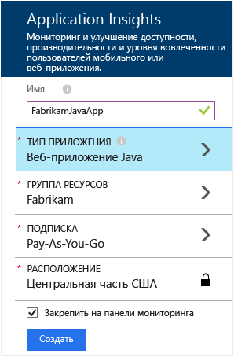
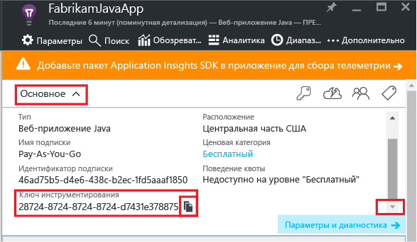
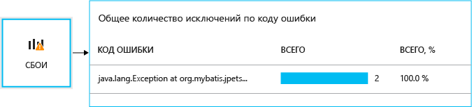
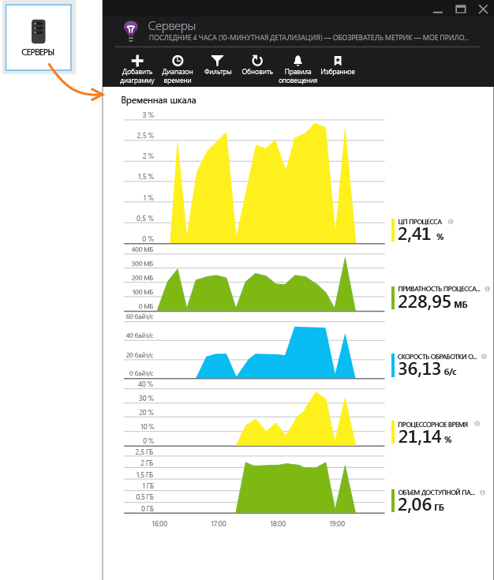
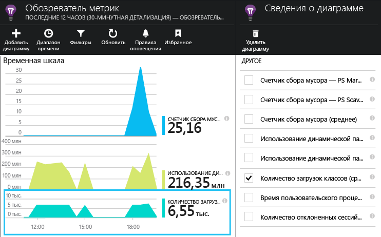

# <a name="get-started-with-application-insights-in-a-java-web-project"></a>Приступая к работе с Application Insights в веб-проекте Java


[Application Insights](https://azure.microsoft.com/services/application-insights/) — это расширяемая служба аналитики для разработчиков веб-ресурсов, позволяющая оценивать производительность и использование работающего приложения. С ее помощью можно [выявлять и диагностировать проблемы с производительностью и исключения](app-insights-detect-triage-diagnose.md), а также [писать код][api] для отслеживания действий, которые пользователи выполняют с приложением.


Надстройка Application Insights поддерживает приложения Java, работающие под управлением Linux, Unix или Windows.

Вам необходимы:

* JRE версии 1.7 или 1.8;
* подписка на [Microsoft Azure](https://azure.microsoft.com/).

*Если у вас уже есть развернутое веб-приложение, воспользуйтесь альтернативным способом, который описан в статье о [добавлении пакета SDK на веб-сервер во время выполнения](app-insights-java-live.md). В этом случае вам не нужно повторно компилировать код, но в то же время вы не сможете написать код для отслеживания действий пользователей.*

## <a name="1-get-an-application-insights-instrumentation-key"></a>1. Получение ключа инструментирования Application Insights
1. Войдите на [портал Microsoft Azure](https://portal.azure.com).
2. Создайте ресурс Application Insights. Задайте тип приложения: веб-приложение Java.

    
3. Найдите ключ инструментирования нового ресурса. Далее будет необходимо вставить его в проект кода.

    

## <a name="2-add-the-application-insights-sdk-for-java-to-your-project"></a>2. Добавление в проект пакета SDK Application Insights для Java
*Выберите подходящий метод для проекта.*

#### <a name="if-youre-using-maven-a-namemaven-setup-"></a>Если вы используете Maven<a name="maven-setup" />
Если проект уже настроен для сборки с использованием Maven, добавьте следующий код в файл pom.xml.

Затем обновите зависимости проекта, чтобы скачать двоичные файлы.

```XML

    <repositories>
       <repository>
          <id>central</id>
          <name>Central</name>
          <url>http://repo1.maven.org/maven2</url>
       </repository>
    </repositories>

    <dependencies>
      <dependency>
        <groupId>com.microsoft.azure</groupId>
        <artifactId>applicationinsights-web</artifactId>
        <!-- or applicationinsights-core for bare API -->
        <version>[2.0,)</version>
      </dependency>
    </dependencies>
```

* *Ошибки проверки сборки или контрольной суммы?* Попробуйте указать конкретную версию, например `<version>2.0.n</version>`. Сведения о последней версии см. в [заметках о выпуске пакета SDK](https://github.com/Microsoft/ApplicationInsights-Java#release-notes) или в [артефактах репозитория Maven](http://search.maven.org/#search%7Cga%7C1%7Capplicationinsights).
* *Требуется обновить пакет SDK до новой версии?* Обновите зависимости проекта.

#### <a name="if-youre-using-gradle-a-namegradle-setup-"></a>Если вы используете Gradle<a name="gradle-setup" />
Если проект уже настроен для сборки с использованием Gradle, добавьте следующий фрагмент кода в файл build.gradle.

Затем обновите зависимости проекта, чтобы скачать двоичные файлы.

```gradle

    repositories {
      mavenCentral()
    }

    dependencies {
      compile group: 'com.microsoft.azure', name: 'applicationinsights-web', version: '2.+'
      // or applicationinsights-core for bare API
    }
```

#### <a name="if-youre-using-eclipse-to-create-a-dynamic-web-project-"></a>Если вы используете Eclipse для создания динамического веб-проекта
Используйте [пакет SDK Application Insights для подключаемого модуля Java][eclipse]. Примечание. Хотя с помощью этого подключаемого модуля и Application Insights настройка и запуск выполняются быстрее (при условии, что вы не используете Maven или Gradle), это не система управления зависимостями. Таким образом, при обновлении подключаемого модуля библиотеки Application Insights в проекте не будут обновляться автоматически.

* *Ошибки проверки сборки или контрольной суммы?* Попробуйте указать конкретную версию, например `version:'2.0.n'`. Сведения о последней версии см. в [заметках о выпуске пакета SDK](https://github.com/Microsoft/ApplicationInsights-Java#release-notes) или в [артефактах репозитория Maven](http://search.maven.org/#search%7Cga%7C1%7Capplicationinsights).
* *Для обновления до последней версии пакета SDK* обновите зависимости проекта.

#### <a name="otherwise-if-you-are-manually-managing-dependencies-"></a>Если вы вручную управляете зависимостями
Скачайте [последнюю версию](https://github.com/Microsoft/ApplicationInsights-Java/releases/latest) и скопируйте необходимые файлы в проект, заменив все предыдущие версии.

### <a name="questions"></a>Вопросы
* *Каковы отношения между компонентами `-core` и `-web`?*
  * `applicationinsights-core` предоставляет чистый API. Этот компонент требуется всегда.
  * Компонент `applicationinsights-web` предоставляет метрики для отслеживания количества запросов HTTP и значений времени ответа. Его можно опустить, если автоматический сбор данных телеметрии не требуется, например, если вы хотите написать собственный код сбора данных.
  
* *Как обновить пакет SDK до последней версии?*
  * Если вы используете Gradle или Maven
    * Обновите файл сборки, чтобы указать последнюю версию либо используйте синтаксис подстановочных знаков Gradle или Maven, чтобы автоматически включить последнюю версию. Затем обновите зависимости проекта. Синтаксис подстановочных знаков можно найти в приведенных выше примерах [Gradle](#gradle-setup) или [Maven](#maven-setup).
  * Если вы вручную управляете зависимостями
    * Загрузите последнюю версию [пакета SDK Application Insights для Java](https://github.com/Microsoft/ApplicationInsights-Java/releases/latest) и установите ее вместо более старых версий. Изменения описаны в статье [Заметки о выпуске пакета SDK](https://github.com/Microsoft/ApplicationInsights-Java#release-notes).

## <a name="3-add-an-applicationinsightsxml-file"></a>3. Добавление файла ApplicationInsights.xml
Добавьте ApplicationInsights.xml в папку ресурсов проекта или проверьте, добавлен ли этот файл в путь класса развертывания проекта. Скопируйте в него следующий код XML.

Замените ключ инструментирования на полученный в портале Azure.

```XML

    <?xml version="1.0" encoding="utf-8"?>
    <ApplicationInsights xmlns="http://schemas.microsoft.com/ApplicationInsights/2013/Settings" schemaVersion="2014-05-30">


      <!-- The key from the portal: -->
      <InstrumentationKey>** Your instrumentation key **</InstrumentationKey>


      <!-- HTTP request component (not required for bare API) -->
      <TelemetryModules>
        <Add type="com.microsoft.applicationinsights.web.extensibility.modules.WebRequestTrackingTelemetryModule"/>
        <Add type="com.microsoft.applicationinsights.web.extensibility.modules.WebSessionTrackingTelemetryModule"/>
        <Add type="com.microsoft.applicationinsights.web.extensibility.modules.WebUserTrackingTelemetryModule"/>
      </TelemetryModules>

      <!-- Events correlation (not required for bare API) -->
      <!-- These initializers add context data to each event -->

      <TelemetryInitializers>
        <Add type="com.microsoft.applicationinsights.web.extensibility.initializers.WebOperationIdTelemetryInitializer"/>
        <Add type="com.microsoft.applicationinsights.web.extensibility.initializers.WebOperationNameTelemetryInitializer"/>
        <Add type="com.microsoft.applicationinsights.web.extensibility.initializers.WebSessionTelemetryInitializer"/>
        <Add type="com.microsoft.applicationinsights.web.extensibility.initializers.WebUserTelemetryInitializer"/>
        <Add type="com.microsoft.applicationinsights.web.extensibility.initializers.WebUserAgentTelemetryInitializer"/>

      </TelemetryInitializers>
    </ApplicationInsights>
```

При необходимости файл конфигурации может находиться в любом месте, доступном для приложения.  Системное свойство `-Dapplicationinsights.configurationDirectory` указывает на каталог, содержащий файл ApplicationInsights.xml. Например, файл конфигурации, расположенный в каталоге `E:\myconfigs\appinsights\ApplicationInsights.xml`, будет настроен со свойством `-Dapplicationinsights.configurationDirectory="E:\myconfigs\appinsights"`.

* Ключ инструментирования пересылается вместе с каждым элементом телеметрии; служба Application Insights отобразит его в ресурсе.
* Компонент HTTP-запросов является необязательным. Он автоматически передает на портал телеметрию о запросах и значения времени ответа.
* Корреляция события является дополнением к компоненту HTTP-запросов. Это дополнение назначает идентификатор для каждого запроса, полученного сервером, и добавляет его в качестве свойства каждого элемента телеметрии в форме "Операция.ИД". Благодаря этому можно выделить данные телеметрии, связанные с каждым из запросов. Для этого нужно установить фильтр [Diagnostic search][diagnostic] (Поиск по журналу диагностики).

### <a name="alternative-ways-to-set-the-instrumentation-key"></a>Другие способы задать ключ инструментирования
Пакет SDK Application Insights ищет ключ в следующем порядке:

1. Системное свойство: -DAPPLICATION_INSIGHTS_IKEY=your_ikey
2. Переменная среды: APPLICATION_INSIGHTS_IKEY
3. Файл конфигурации: ApplicationInsights.xml

Вы также можете [задать его в коде](app-insights-api-custom-events-metrics.md#ikey):

```Java
    TelemetryConfiguration.getActive().setInstrumentationKey(iKey);
```

## <a name="4-add-an-http-filter"></a>4. Добавление фильтра HTTP
Последний шаг настройки позволяет компоненту HTTP-запросов выполнить протоколирование каждого веб-запроса. (Не обязательно, если используется только упрощенный интерфейс API.)

### <a name="spring-boot-applications"></a>Приложения Spring Boot
Зарегистрируйте `WebRequestTrackingFilter` Application Insights в классе конфигурации:

```Java
package devCamp.WebApp.configurations;

    import javax.servlet.Filter;

    import org.springframework.boot.context.embedded.FilterRegistrationBean;
    import org.springframework.context.annotation.Bean;
    import org.springframework.core.Ordered;
    import org.springframework.beans.factory.annotation.Value;
    import org.springframework.context.annotation.Configuration;
    import com.microsoft.applicationinsights.TelemetryConfiguration;
    import com.microsoft.applicationinsights.web.internal.WebRequestTrackingFilter;


    @Configuration
    public class AppInsightsConfig {

    //Initialize AI TelemetryConfiguration via Spring Beans
        @Bean
        public String telemetryConfig() {
            String telemetryKey = System.getenv("APPLICATION_INSIGHTS_IKEY");
            if (telemetryKey != null) {
                TelemetryConfiguration.getActive().setInstrumentationKey(telemetryKey);
            }
            return telemetryKey;
        }
    
    //Set AI Web Request Tracking Filter
        @Bean
        public FilterRegistrationBean aiFilterRegistration(@Value("${spring.application.name:application}") String applicationName) {
           FilterRegistrationBean registration = new FilterRegistrationBean();
           registration.setFilter(new WebRequestTrackingFilter(applicationName));
           registration.setName("webRequestTrackingFilter");
           registration.addUrlPatterns("/*");
           registration.setOrder(Ordered.HIGHEST_PRECEDENCE + 10);
           return registration;
       } 

    //Set up AI Web Request Tracking Filter
        @Bean(name = "WebRequestTrackingFilter")
        public Filter webRequestTrackingFilter(@Value("${spring.application.name:application}") String applicationName) {
            return new WebRequestTrackingFilter(applicationName);
        }   
    }
```

Этот класс настроит `WebRequestTrackingFilter` в качестве первого фильтра в цепочке фильтров HTTP. Он также извлечет ключ инструментирования из переменной среды операционной системы, если он доступен.

> Мы используем конфигурацию веб-фильтра HTTP, а не конфигурацию Spring MVC, свойственную для приложения Spring Boot. Дополнительные сведения о конфигурации Spring MVC см. в разделах ниже.


### <a name="applications-using-webxml"></a>Приложения, использующие Web.xml
Найдите и откройте файл web.xml в проекте, добавьте следующий фрагмент кода в узел web-app, где настраиваются фильтры вашего приложения.

Для получения наиболее точных результатов этот фильтр должен применяться до всех остальных фильтров.

```XML

    <filter>
      <filter-name>ApplicationInsightsWebFilter</filter-name>
      <filter-class>
        com.microsoft.applicationinsights.web.internal.WebRequestTrackingFilter
      </filter-class>
    </filter>
    <filter-mapping>
       <filter-name>ApplicationInsightsWebFilter</filter-name>
       <url-pattern>/*</url-pattern>
    </filter-mapping>
```

#### <a name="if-youre-using-spring-web-mvc-31-or-later"></a>Если вы используете Spring Web MVC 3.1 или более поздней версии
Для включения пакета Application Insights измените следующие элементы в *-servlet.xml:

```XML

    <context:component-scan base-package=" com.springapp.mvc, com.microsoft.applicationinsights.web.spring"/>

    <mvc:interceptors>
        <mvc:interceptor>
            <mvc:mapping path="/**"/>
            <bean class="com.microsoft.applicationinsights.web.spring.RequestNameHandlerInterceptorAdapter" />
        </mvc:interceptor>
    </mvc:interceptors>
```

#### <a name="if-youre-using-struts-2"></a>Если вы используете Struts 2
Добавьте в файл конфигурации Struts следующий элемент (обычно называется struts.xml или struts-default.xml):

```XML

     <interceptors>
       <interceptor name="ApplicationInsightsRequestNameInterceptor" class="com.microsoft.applicationinsights.web.struts.RequestNameInterceptor" />
     </interceptors>
     <default-interceptor-ref name="ApplicationInsightsRequestNameInterceptor" />
```

При наличии перехватчиков, определенных в стандартном стеке, перехватчик можно добавить в стек.

## <a name="5-run-your-application"></a>5. Запуск приложения
Запустите приложение в режиме отладки на компьютере разработки или опубликуйте его на своем сервере.

## <a name="6-view-your-telemetry-in-application-insights"></a>6. Просмотр данных телеметрии в Application Insights
Вернитесь к ресурсу Application Insights на [портале Microsoft Azure](https://portal.azure.com).

В колонке обзора появятся данные HTTP-запросов. (Если данные отсутствуют, подождите несколько секунд и нажмите кнопку обновления).


[Дополнительные сведения о метриках.][metrics]

Щелкните любую диаграмму, чтобы увидеть более подробные агрегированные метрики.


> Служба Application Insights предполагает, что HTTP-запросы для приложений MVC имеют следующий формат: `VERB controller/action`. Например, `GET Home/Product/f9anuh81`, `GET Home/Product/2dffwrf5` и `GET Home/Product/sdf96vws` сгруппированы в `GET Home/Product`. Это позволяет осмысленно группировать запросы, получая, например, число запросов и среднее время выполнения запросов.
>
>

### <a name="instance-data"></a>Данные экземпляров
Щелкните тип запроса, чтобы просмотреть отдельные экземпляры.

В Application Insights отображаются два типа данных: 1) объединенные данные, хранимые и отображаемые как средние значения, количества и суммы; 2) данные экземпляров, например отдельные отчеты HTTP-запросов, исключения, число просмотров страниц или пользовательские события.

При просмотре свойств запроса можно увидеть связанные с ним события телеметрии, например запросы и исключения.


### <a name="analytics-powerful-query-language"></a>Аналитика: мощный язык запросов
По мере увеличения объема накопленных данных вы сможете использовать запросы для объедения данных и поиска отдельных экземпляров.  [Аналитика](app-insights-analytics.md) — это мощный инструмент, который не только позволяет изучать сведения о производительности и использовании, но и диагностировать возможные неполадки.


## <a name="7-install-your-app-on-the-server"></a>7. Установка приложения на сервере
Теперь опубликуйте приложение на сервере, откройте доступ для пользователей и изучайте телеметрию на портале.

* Убедитесь, что брандмауэр позволяет приложению отправлять телеметрию на следующие порты:

  * dc.services.visualstudio.com:443
  * f5.services.visualstudio.com:443

* Если исходящий трафик должен проходить через брандмауэр, определите системные свойства `http.proxyHost` и `http.proxyPort`.

* На серверах Windows необходимо установить следующее:

  * [распространяемые компоненты Microsoft Visual C++.](http://www.microsoft.com/download/details.aspx?id=40784)

    (Сюда входят счетчики производительности).


## <a name="exceptions-and-request-failures"></a>Исключения и ошибки запросов
Необработанные исключения автоматически фиксируются:



Для сбора данных по другим исключениям доступны два варианта:

* [вставить в код вызовы функции trackException()][apiexceptions];
* [установить на сервере агент для Java](app-insights-java-agent.md). Необходимо указать методы, которые требуется отслеживать.

## <a name="monitor-method-calls-and-external-dependencies"></a>Мониторинг вызовов методов и внешних зависимостей.
[установить агент для Java](app-insights-java-agent.md) .

## <a name="performance-counters"></a>Счетчики производительности
Чтобы отобразить диапазон счетчиков производительности, щелкните **Параметры**, **Серверы**.



### <a name="customize-performance-counter-collection"></a>Настройка сбора данных счетчиками производительности
Чтобы отключить сбор данных стандартным набором счетчиков производительности, добавьте следующий фрагмент кода в корневой узел файла ApplicationInsights.xml:

```XML
    <PerformanceCounters>
       <UseBuiltIn>False</UseBuiltIn>
    </PerformanceCounters>
```

### <a name="collect-additional-performance-counters"></a>Сбор данных дополнительными счетчиками производительности
Можно задать необходимость сбора данных дополнительными счетчиками производительности.

#### <a name="jmx-counters-exposed-by-the-java-virtual-machine"></a>Счетчики JMX (предоставляются виртуальной машиной Java)

```XML
    <PerformanceCounters>
      <Jmx>
        <Add objectName="java.lang:type=ClassLoading" attribute="TotalLoadedClassCount" displayName="Loaded Class Count"/>
        <Add objectName="java.lang:type=Memory" attribute="HeapMemoryUsage.used" displayName="Heap Memory Usage-used" type="composite"/>
      </Jmx>
    </PerformanceCounters>
```

* `displayName` — имя, отображаемое в портале Application Insights.
* `objectName` — имя объекта JMX.
* `attribute` — атрибут имени объекта JMX для выборки
* `type` (необязательно) — тип атрибута объекта JMX:
  * по умолчанию: простой тип, такой как int или long;
  * `composite`— данные счетчика производительности имеют формат "Атрибут.Данные";
  * `tabular`— данные счетчика производительности имеют формат строки таблицы.

#### <a name="windows-performance-counters"></a>Счетчики производительности Windows
Каждый [счетчик производительности Windows](https://msdn.microsoft.com/library/windows/desktop/aa373083.aspx) входит в состав категории (аналогично поле является членом класса). Категория может быть глобальной либо иметь пронумерованные или именованные экземпляры.

```XML
    <PerformanceCounters>
      <Windows>
        <Add displayName="Process User Time" categoryName="Process" counterName="%User Time" instanceName="__SELF__" />
        <Add displayName="Bytes Printed per Second" categoryName="Print Queue" counterName="Bytes Printed/sec" instanceName="Fax" />
      </Windows>
    </PerformanceCounters>
```

* displayName — имя, отображаемое в портале Application Insights.
* categoryName — категория счетчика производительности (объект производительности), с которой связан этот счетчик производительности.
* counterName — имя счетчика производительности.
* instanceName — имя экземпляра категории счетчика производительности или пустая строка (""), если категория содержит единственный экземпляр. Если categoryName имеет значение "Process", и источником данных для счетчиков производительности является текущий процесс виртуальной машины Java, на которой выполняется ваше приложение, укажите `"__SELF__"`.

Счетчики производительности отображаются как пользовательские метрики в [обозревателе метрик][metrics].



### <a name="unix-performance-counters"></a>Счетчики производительности Unix
* [установите collectd с подключаемым модулем Application Insights](app-insights-java-collectd.md) .

## <a name="get-user-and-session-data"></a>Получение данных о пользователях и сеансах
Итак, вы отправляете телеметрию с веб-сервера. Теперь для получения полного представления о приложении можно настроить дополнительные функции мониторинга:

* [Добавьте телеметрию на веб-страницы][usage] для мониторинга просмотров страниц и метрик пользователя.
* [Настройте веб-тесты][availability], которые помогут быть уверенными в том, что приложение остается работоспособным и правильно отвечает на запросы.

## <a name="capture-log-traces"></a>Журнал трассировки
Службу Application Insights можно использовать для протоколирования продольных и поперечных срезов данных из Log4J, Logback или других платформ ведения журнала. Записи журналов можно соотносить с HTTP-запросами и другими данными телеметрии. [Подробнее][javalogs].

## <a name="send-your-own-telemetry"></a>Отправка собственных данных телеметрии
После установки пакета SDK можно использовать интерфейс API для отправки собственных данных телеметрии.

* [Отслеживайте пользовательские события и метрики][api], чтобы знать, какие операции выполняют пользователи в приложении.
* [Выполняйте поиск событий и журналов][diagnostic] для диагностики неполадок.

## <a name="availability-web-tests"></a>Доступность веб-тестов
Application Insights может тестировать ваш веб-сайт через равные промежутки времени для проверки, работает ли он и правильно ли отвечает на запросы. [Чтобы выполнить настройку][availability], щелкните "Веб-тесты".


Если ваш сайт выйдет из строя, вы получите диаграмму значений времени ответа, а также уведомление по электронной почте.


[Дополнительные сведения о веб-тестах для определения доступности.][availability]

## <a name="questions-problems"></a>Вопросы? Проблемы?
[Устранение неполадок Java](app-insights-java-troubleshoot.md)

## <a name="video"></a>Видео

> [!VIDEO https://channel9.msdn.com/events/Connect/2016/100/player]

## <a name="next-steps"></a>Дополнительная информация
* [Отслеживайте вызовы зависимостей.](app-insights-java-agent.md)
* [Отслеживайте счетчики производительности Unix.](app-insights-java-collectd.md)
* Добавляйте [мониторинг на веб-страницы](app-insights-javascript.md), чтобы отслеживать время загрузки страниц, вызовы AJAX и исключения браузера.
* Пишите [пользовательскую телеметрию](app-insights-api-custom-events-metrics.md) для отслеживания использования в браузере или на сервере.
* Создавайте [панели мониторинга](app-insights-dashboards.md) для объединения основных диаграмм, позволяющих выполнять мониторинг системы.
* Используйте [аналитику](app-insights-analytics.md), чтобы выполнять эффективные запросы телеметрии из приложения.
* Дополнительные сведения см. в разделе [Azure for Java developers](/java/azure) (Azure для разработчиков Java).

<!--Link references-->

[api]: app-insights-api-custom-events-metrics.md
[apiexceptions]: app-insights-api-custom-events-metrics.md#trackexception
[availability]: app-insights-monitor-web-app-availability.md
[diagnostic]: app-insights-diagnostic-search.md
[eclipse]: app-insights-java-eclipse.md
[javalogs]: app-insights-java-trace-logs.md
[metrics]: app-insights-metrics-explorer.md
[usage]: app-insights-javascript.md
