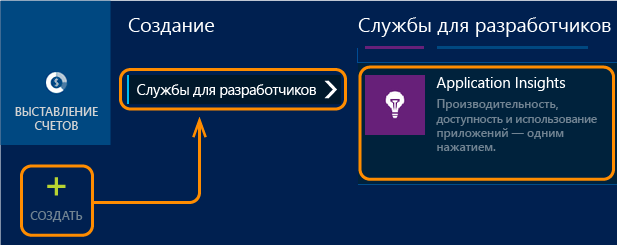

<properties
	pageTitle="Приступая к работе с Application Insights в веб-проекте Java | Microsoft Azure"
	description="Мониторинг производительности и использования веб-сайта Java с помощью Application Insights"
	services="application-insights"
    documentationCenter="java"
	authors="alancameronwills"
	manager="douge"/>

<tags
	ms.service="application-insights"
	ms.workload="tbd"
	ms.tgt_pltfrm="ibiza"
	ms.devlang="na"
	ms.topic="get-started-article"
	ms.date="11/24/2015"
	ms.author="awills"/>

# Приступая к работе с Application Insights в веб-проекте Java

*Доступна только предварительная версия компонента Application Insights.*

[AZURE.INCLUDE [app-insights-selector-get-started](../../includes/app-insights-selector-get-started.md)]

[Application Insights](https://azure.microsoft.com/services/application-insights/) — это расширяемая служба аналитики, позволяющая оценивать производительность и использование работающего приложения. С ее помощью можно [выявлять и диагностировать проблемы с производительностью и исключения](app-insights-detect-triage-diagnose.md), а также [писать код][api] для отслеживания действия, которые выполняют с приложением пользователи.

Надстройка Application Insights поддерживает приложения Java, работающие под управлением Linux, Unix или Windows.

Вам потребуется следующее:

* Oracle JRE 1.6 или более поздней версии либо Zulu JRE 1.6 или более поздней версии;
* подписка на [Microsoft Azure](http://azure.microsoft.com/). (Можно начать с [бесплатной пробной версии](http://azure.microsoft.com/pricing/free-trial/).)

*Если у вас уже есть развернутое веб-приложение, воспользуйтесь альтернативным способом, который описан в статье о [добавлении пакета SDK на веб-сервер во время выполнения](app-insights-java-live.md). В этом случае вам не нужно повторно компилировать код, но в то же время вы не сможете написать код для отслеживания действий пользователей.*

## 1\. Получение ключа инструментирования Application Insights

1. Войдите на [портал Microsoft Azure](https://portal.azure.com).
2. Создайте новый ресурс Application Insights.

    
3. Задайте тип приложения: веб-приложение Java.

    
4. Найдите ключ инструментирования нового ресурса. Далее будет необходимо вставить его в проект кода.

    

## 2\. Добавление в проект пакета SDK Application Insights для Java

*Выберите подходящий метод для проекта.*

#### Если вы создаете динамический веб-проект в Eclipse...

Используйте [пакет SDK Application Insights для подключаемого модуля Java][eclipse].

#### Если вы используете Maven...

Если проект уже настроен для сборки с использованием Maven, добавьте следующий код в файл pom.xml.

Затем обновите зависимости проекта, чтобы скачать двоичные файлы.

    <repositories>
       <repository>
          <id>central</id>
          <name>Central</name>
          <url>http://repo1.maven.org/maven2</url>
       </repository>
    </repositories>

    <dependencies>
      <dependency>
        <groupId>com.microsoft.azure</groupId>
        <artifactId>applicationinsights-web</artifactId>
        <!-- or applicationinsights-core for bare API -->
        <version>[1.0,)</version>
      </dependency>
    </dependencies>

* *Ошибки проверки сборки или контрольной суммы?* Попробуйте использовать конкретную версию, например `<version>1.0.n</version>`. Информацию о последней версии см. в статье [Заметки о выпуске пакета SDK](app-insights-release-notes-java.md) или в [артефактах репозитория Maven](http://search.maven.org/#search%7Cga%7C1%7Capplicationinsights).
* *Требуется обновить пакет SDK до новой версии?* Обновите зависимости проекта.

#### Если вы используете Gradle...

Если проект уже настроен для сборки с использованием Gradle, добавьте следующий фрагмент кода в файл build.gradle.

Затем обновите зависимости проекта, чтобы скачать двоичные файлы.

    repositories {
      mavenCentral()
    }

    dependencies {
      compile group: 'com.microsoft.azure', name: 'applicationinsights-web', version: '1.+'
      // or applicationinsights-core for bare API
    }

* *Ошибки проверки сборки или контрольной суммы? Попробуйте указать конкретную версию, например* `version:'1.0.n'`. *Информацию о последней версии см. в статье [Заметки о выпуске пакета SDK](app-insights-release-notes-java.md).*
* *Обновление пакета SDK до новой версии*
 * Обновите зависимости проекта.

#### В противном случае...

Вручную добавьте пакет SDK.

1. Загрузите [пакет SDK Application Insights для Java](https://azuredownloads.blob.core.windows.net/applicationinsights/sdk.html).
2. Извлеките из ZIP-файла двоичные файлы и добавьте их в проект.

### Вопросы

* *Каковы отношения между компонентами `-core` и `-web` в ZIP-архиве?*

 * `applicationinsights-core` предоставляет чистый API. Этот компонент требуется всегда.
 * Компонент `applicationinsights-web` предоставляет метрики для отслеживания количества запросов HTTP и значений времени ответа. Его можно опустить, если автоматический сбор данных телеметрии не требуется, например, если вы хотите написать собственный код сбора данных.

* *Чтобы обновить пакет SDK после появления новой версии:*
 * Загрузите последнюю версию [пакета SDK Application Insights для Java](http://dl.windowsazure.com/lib/applicationinsights/javabin/sdk.zip) и установите ее вместо более старых версий.
 * Изменения описаны в статье [Заметки о выпуске пакета SDK](app-insights-release-notes-java.md).

## 3\. Добавление XML-файла Application Insights

Добавьте ApplicationInsights.xml в папку ресурсов проекта или проверьте, добавлен ли этот файл в путь класса развертывания проекта. Скопируйте в него следующий код XML.

Замените ключ инструментирования на полученный в портале Azure.

    <?xml version="1.0" encoding="utf-8"?>
    <ApplicationInsights xmlns="http://schemas.microsoft.com/ApplicationInsights/2013/Settings" schemaVersion="2014-05-30">

      <!-- The key from the portal: -->

      <InstrumentationKey>** Your instrumentation key **</InstrumentationKey>

      <!-- HTTP request component (not required for bare API) -->

      <TelemetryModules>
        <Add type="com.microsoft.applicationinsights.web.extensibility.modules.WebRequestTrackingTelemetryModule"/>
        <Add type="com.microsoft.applicationinsights.web.extensibility.modules.WebSessionTrackingTelemetryModule"/>
        <Add type="com.microsoft.applicationinsights.web.extensibility.modules.WebUserTrackingTelemetryModule"/>
      </TelemetryModules>

      <!-- Events correlation (not required for bare API) -->
      <!-- These initializers add context data to each event -->

      <TelemetryInitializers>
        <Add   type="com.microsoft.applicationinsights.web.extensibility.initializers.WebOperationIdTelemetryInitializer"/>
        <Add type="com.microsoft.applicationinsights.web.extensibility.initializers.WebOperationNameTelemetryInitializer"/>
        <Add type="com.microsoft.applicationinsights.web.extensibility.initializers.WebSessionTelemetryInitializer"/>
        <Add type="com.microsoft.applicationinsights.web.extensibility.initializers.WebUserTelemetryInitializer"/>
        <Add type="com.microsoft.applicationinsights.web.extensibility.initializers.WebUserAgentTelemetryInitializer"/>

      </TelemetryInitializers>
    </ApplicationInsights>

* Ключ инструментирования пересылается вместе с каждым элементом телеметрии; служба Application Insights отобразит его в ресурсе.
* Компонент HTTP-запросов является необязательным. Он автоматически передает на портал телеметрию о запросах и значения времени ответа.
* Корреляционные данные для событий являются дополнением к компоненту HTTP-запросов. Это дополнение назначает идентификатор для каждого запроса, полученного сервером, и добавляет его в качестве свойства каждого элемента телеметрии в форме "Операция.ИД". Благодаря этому можно выделить данные телеметрии, связанные с каждым из запросов, путем установки фильтра [Поиск по журналу диагностики][diagnostic].

## 4\. Добавление фильтра HTTP

Последний шаг настройки позволяет компоненту HTTP-запросов выполнить протоколирование каждого веб-запроса. (Не обязательно, если используется только упрощенный интерфейс API.)

Найдите и откройте файл web.xml в проекте, добавьте следующий фрагмент кода в узел web-app, где настраиваются фильтры вашего приложения.

Для получения наиболее точных результатов этот фильтр должен применяться до всех остальных фильтров.

    <filter>
      <filter-name>ApplicationInsightsWebFilter</filter-name>
      <filter-class>
        com.microsoft.applicationinsights.web.internal.WebRequestTrackingFilter
      </filter-class>
    </filter>
    <filter-mapping>
       <filter-name>ApplicationInsightsWebFilter</filter-name>
       <url-pattern>/*</url-pattern>
    </filter-mapping>

#### Если вы используете MVC 3.1 или более поздней версии

Для включения пакета Application Insights измените следующие элементы:

    <context:component-scan base-package=" com.springapp.mvc, com.microsoft.applicationinsights.web.spring"/>

    <mvc:interceptors>
        <mvc:interceptor>
            <mvc:mapping path="/**"/>
            <bean class="com.microsoft.applicationinsights.web.spring.RequestNameHandlerInterceptorAdapter" />
        </mvc:interceptor>
    </mvc:interceptors>

#### Если вы используете Struts 2

Добавьте в файл конфигурации Struts следующий элемент (обычно называется struts.xml или struts-default.xml):

     <interceptors>
       <interceptor name="ApplicationInsightsRequestNameInterceptor" class="com.microsoft.applicationinsights.web.struts.RequestNameInterceptor" />
     </interceptors>
     <default-interceptor-ref name="ApplicationInsightsRequestNameInterceptor" />

(При наличии перехватчиков, определенных в стандартном стеке, перехватчик можно просто добавить в стек.)

## 5\. Запуск приложения

Запустите приложение в режиме отладки на компьютере разработки или опубликуйте его на своем сервере.

## 6\. Просмотр данных телеметрии в Application Insights

Вернитесь к ресурсу Application Insights на [портале Microsoft Azure](https://portal.azure.com).

В колонке обзора появятся данные HTTP-запросов. (Если данные отсутствуют, подождите несколько секунд и нажмите кнопку обновления).

Щелкните любую диаграмму, чтобы увидеть более подробные метрики.

При просмотре свойств запроса можно увидеть события телеметрии, связанные с ним, такие как запросы и исключения.

[Дополнительные сведения о метриках.][metrics]

#### Вычисление имени смарт-адреса

Служба Application Insights предполагает, что HTTP-запросы для приложений MVC имеют следующий формат: `VERB controller/action` (КОМАНДА контроллер/действие).

Например `GET Home/Product/f9anuh81`, `GET Home/Product/2dffwrf5` и `GET Home/Product/sdf96vws` будут сгруппированы в `GET Home/Product`.

Это позволяет осмысленно группировать запросы, получая, например, число запросов и среднее время выполнения запросов.

## 5\. Установка приложения на сервере

Теперь опубликуйте приложение на сервере, откройте доступ для пользователей и изучайте телеметрию на портале.

* Убедитесь, что брандмауэр позволяет приложению отправлять телеметрию на следующие порты:

 * dc.services.visualstudio.com:443
 * dc.services.visualstudio.com:80
 * f5.services.visualstudio.com:443
 * f5.services.visualstudio.com:80

* На серверах Windows необходимо установить следующее:

 * [распространяемые компоненты Microsoft Visual C++](http://www.microsoft.com/download/details.aspx?id=40784).

    (Сюда входят счетчики производительности).

## Исключения и ошибки запросов

Необработанные исключения автоматически фиксируются:

Для сбора данных по другим исключениям доступны два варианта:

* [вставить в код вызовы функции trackException()][apiexceptions]; 
* [установить на сервере агент для Java](app-insights-java-agent.md). Необходимо указать методы, которые требуется отслеживать.

## Мониторинг вызовов методов и внешних зависимостей.

Чтобы записывать в журнал заданные внутренние методы и вызовы, произведенные через JDBC, с указанием времени выполнения, надо [установить агент для Java](app-insights-java-agent.md).

## Счетчики производительности

Выберите элемент **Серверы**, и вы увидите ряд счетчиков производительности.

### Настройка сбора данных счетчиками производительности

Чтобы отключить сбор данных стандартным набором счетчиков производительности, добавьте следующий фрагмент кода в корневой узел файла ApplicationInsights.xml:

    <PerformanceCounters>
       <UseBuiltIn>False</UseBuiltIn>
    </PerformanceCounters>

### Сбор данных дополнительными счетчиками производительности

Можно задать необходимость сбора данных дополнительными счетчиками производительности.

#### Счетчики JMX (предоставляются виртуальной машиной Java)

    <PerformanceCounters>
      <Jmx>
        <Add objectName="java.lang:type=ClassLoading" attribute="TotalLoadedClassCount" displayName="Loaded Class Count"/>
        <Add objectName="java.lang:type=Memory" attribute="HeapMemoryUsage.used" displayName="Heap Memory Usage-used" type="composite"/>
      </Jmx>
    </PerformanceCounters>

*	`displayName` — имя, отображаемое в портале Application Insights.
*	`objectName` — имя объекта JMX.
*	`attribute` — атрибут имени объекта JMX для выборки
*	`type` (необязательно) — тип атрибута объекта JMX:
 *	по умолчанию: простой тип, такой как int или long;
 *	`composite` — данные счетчика производительности имеют формат "Атрибут.Данные";
 *	`tabular` — данные счетчика производительности имеют формат строки таблицы.

#### Счетчики производительности Windows

Каждый [счетчик производительности Windows](https://msdn.microsoft.com/library/windows/desktop/aa373083.aspx) входит в состав категории (аналогично поле является членом класса). Категория может быть глобальной либо иметь пронумерованные или именованные экземпляры.

    <PerformanceCounters>
      <Windows>
        <Add displayName="Process User Time" categoryName="Process" counterName="%User Time" instanceName="__SELF__" />
        <Add displayName="Bytes Printed per Second" categoryName="Print Queue" counterName="Bytes Printed/sec" instanceName="Fax" />
      </Windows>
    </PerformanceCounters>

*	displayName — имя, отображаемое в портале Application Insights.
*	categoryName — категория счетчика производительности (объект производительности), с которой связан этот счетчик производительности.
*	counterName — имя счетчика производительности.
*	instanceName — имя экземпляра категории счетчика производительности или пустая строка (""), если категория содержит единственный экземпляр. Если categoryName имеет значение "Process", и источником данных для счетчиков производительности является текущий процесс виртуальной машины Java, на которой выполняется ваше приложение, укажите `"__SELF__"`.

Счетчики производительности отображаются как пользовательские метрики в [обозревателе метрик][metrics].

### Счетчики производительности Unix

* Чтобы получать разнообразные системные и сетевые данные, [установите collectd с подключаемым модулем Application Insights](app-insights-java-collectd.md).

## Получение данных о пользователях и сеансах

Итак, вы отправляете телеметрию с веб-сервера. Теперь для получения полного представления о приложении можно настроить дополнительные функции мониторинга:

* [Добавьте телеметрии на веб-страницы][usage] для мониторинга просмотров страниц и метрик пользователя.
* [Настройте веб-тесты][availability], которые помогут быть уверенными в том, что приложение остается работоспособным и правильно отвечает на запросы.

## Журнал трассировки

Службу Application Insights можно использовать для протоколирования продольных и поперечных срезов данных из Log4J, Logback или других платформ ведения журнала. Записи журналов можно соотносить с HTTP-запросами и другими данными телеметрии. [Подробнее][javalogs].

## Отправка собственных данных телеметрии

После установки пакета SDK можно использовать интерфейс API для отправки собственных данных телеметрии.

* [Отслеживайте пользовательские события и метрики][api], чтобы знать, какие операции выполняют пользователи в приложении.
* [Поиск событий и журналов][diagnostic] для диагностики неполадок.

## Доступность веб-тестов

Application Insights может тестировать ваш веб-сайт через равные промежутки времени для проверки, работает ли он и правильно ли отвечает на запросы. [Чтобы выполнить настройку][availability], прокрутите вниз и щелкните «Доступность».

Если ваш сайт выйдет из строя, вы получите диаграмму значений времени ответа, а также уведомление по электронной почте.

[Дополнительные сведения о доступности веб-тестов.][availability]

## Вопросы? Проблемы?

[Устранение неполадок Java](app-insights-java-troubleshoot.md)

## Дальнейшие действия

Дополнительную информацию см. в [Центре разработчика Java](/develop/java/).

<!--Link references-->

[api]: app-insights-api-custom-events-metrics.md
[apiexceptions]: app-insights-api-custom-events-metrics.md#track-exception
[availability]: app-insights-monitor-web-app-availability.md
[diagnostic]: app-insights-diagnostic-search.md
[eclipse]: app-insights-java-eclipse.md
[javalogs]: app-insights-java-trace-logs.md
[metrics]: app-insights-metrics-explorer.md
[usage]: app-insights-web-track-usage.md

<!----HONumber=AcomDC_1203_2015-->