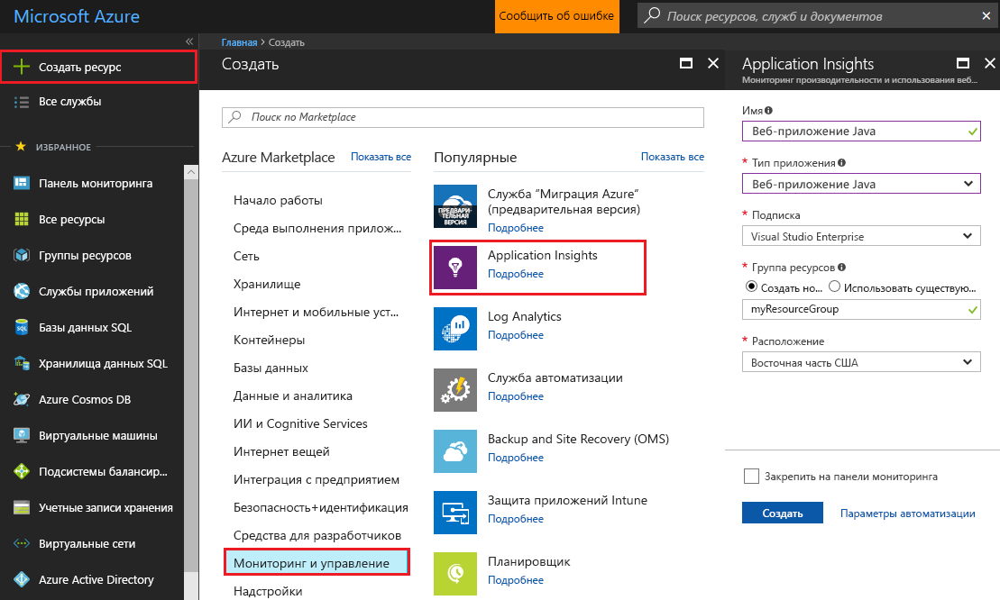
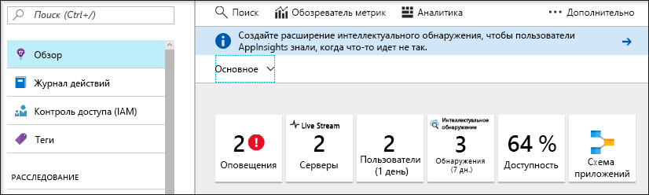
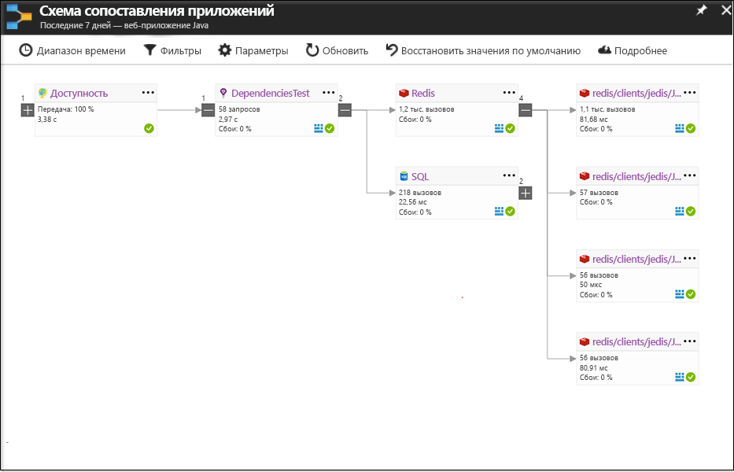
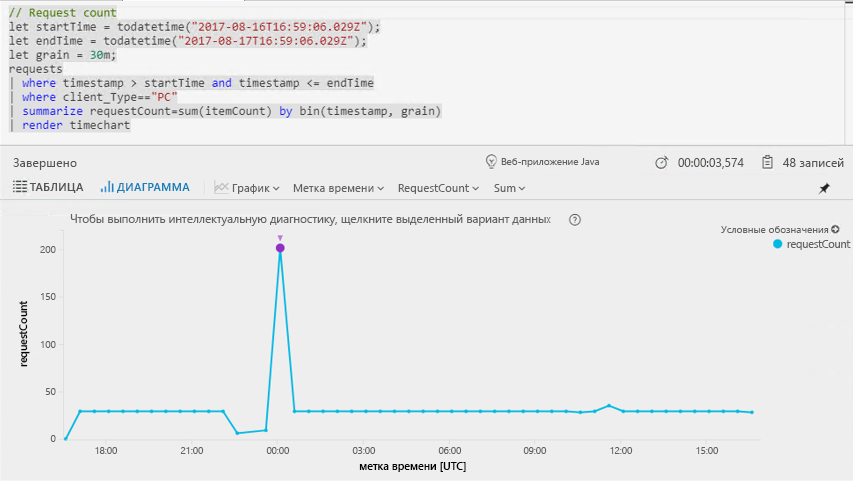
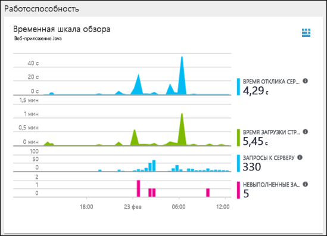
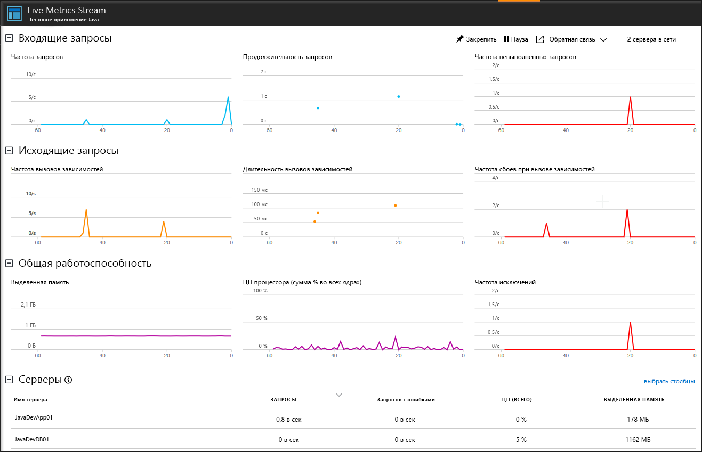

# <a name="start-monitoring-your-java-web-application"></a>Запуск мониторинга веб-приложения Java

С помощью Azure Application Insights можно легко отслеживать доступность, производительность и использование своего веб-приложения. Вы также можете быстро идентифицировать и диагностировать ошибки в приложении, не дожидаясь, пока пользователь сообщит о них. С помощью пакета SDK для Java Application Insights можно отслеживать общие пакеты сторонних разработчиков, включая MongoDB, MySQL и Redis.

Это краткое руководство поможет выполнить добавление пакета SDK для Application Insights в имеющийся веб-проект Java Dynamic.

## <a name="prerequisites"></a>предварительным требованиям

Для работы с этим кратким руководством сделайте следующее:

- Установите JRE 1.7 или 1.8.
- Установите бесплатную [интегрированную среду разработки Eclipse для разработчиков Java EE](http://www.eclipse.org/downloads/). В этом кратком руководстве используется Eclipse Oxygen (4.7).
- Подписка Azure и веб-проект Java Dynamic.
 
Если нет веб-проекта Java Dynamic, можно создать его с помощью руководства [Создание первого веб-приложения Java в Azure](https://docs.microsoft.com/azure/app-service-web/app-service-web-get-started-java).

Если у вас еще нет подписки Azure, создайте [бесплатную](https://azure.microsoft.com/free/) учетную запись Azure, прежде чем начинать работу.

## <a name="log-in-to-the-azure-portal"></a>Войдите на портал Azure.

Войдите на [портал Azure](https://portal.azure.com/).

## <a name="enable-application-insights"></a>Включение Application Insights

В Application Insights можно собирать данные телеметрии из любого подключенного к Интернету приложения, независимо от того, работает оно локально или в облаке. Чтобы просмотреть эти данные, сделайте следующее.

1. Последовательно выберите **Создать ресурс** > **Мониторинг и управление** > **Application Insights**.

   

   Откроется окно настроек, в котором нужно заполнить все поля в соответствии с приведенной ниже таблицей.

    | Параметры        | Значение           | ОПИСАНИЕ  |
   | ------------- |:-------------|:-----|
   | **Имя**      | Глобально уникальное значение | Имя, идентифицирующее отслеживаемое приложение |
   | **Тип приложения** | Веб-приложение Java | Тип отслеживаемого приложения |
   | **Группа ресурсов**     | myResourceGroup      | Имя новой группы ресурсов для размещения данных App Insights |
   | **Местоположение.** | Восток США | Выберите ближайшее расположение или расположение вблизи места размещения приложения |

2. Нажмите кнопку **Создать**.

## <a name="install-app-insights-plugin"></a>Установка подключаемого модуля App Insights

1. Запустите **Eclipse**, щелкните **Справка**, **Install New Software** (Установка нового программного обеспечения).

   

2. Скопируйте ```http://dl.microsoft.com/eclipse``` в поле Work With (Работа с), установите флажок **Azure Toolkit for Java** (Средства Azure для Java), выберите **Application Insights Plugin for Java** >  (Подключаемый модуль Application Insights для Java) и снимите флажок **Contact all update sites during install to find required software** (Связываться со всеми сайтами обновлений во время установки, чтобы найти необходимое программное обеспечение).

3. После завершения установки вам будет предложено **перезапустить Eclipse**.

## <a name="configure-app-insights-plugin"></a>Настройка подключаемого модуля пакета SDK App Insights

1. Запустите **Eclipse**, откройте **проект**, щелкните имя проекта правой кнопкой мыши в **обозревателе проектов**, выберите **Azure**, щелкните **Вход**.

2. Выберите способ проверки подлинности **Интерактивная**, щелкните **Вход**. При появлении запроса введите **учетные данные Azure** и выберите **подписку Azure**.

3. Щелкните имя проекта правой кнопкой мыши в **обозревателе проектов**, выберите **Azure**, щелкните **Configure Application Insights** (Настроить Application Insights).

4. Установите флажок **Enable telemetry with Application Insights** (Включить телеметрию с помощью Application Insights). Выберите ресурс App Insights и связанный **ключ инструментирования**, которые необходимо связать с приложением Java.

   

> [!NOTE]
> Пакет SDK Application Insights для Java может собирать и визуализировать динамические метрики, но после включения сборки данных телеметрии впервые они могут появиться на портале через несколько минут. Если это тестовое приложение со сниженным трафиком, следует помнить, что большинство метрик собираются только при наличии активных запросов или операций.

## <a name="start-monitoring-in-the-azure-portal"></a>Запуск мониторинга на портале Azure

1. Теперь можно повторно открыть страницу **Обзор** Application Insights на портале Azure, где вы извлекли ключ иснтрументирования, для просмотра сведений о выполняющемся в данный момент приложении.

   

2. Щелкните **App map** (Карта приложений), чтобы получить визуальный макет отношений зависимости между компонентами приложения. Каждый компонент показывает ключевой показатель эффективности, такие как производительность, сбои и оповещения.

   

3. Щелкните значок **аналитики приложений** . Откроется окно **Application Insights Analytics** (Application Insights — аналитика), которое предоставляет полнофункциональный язык запросов для анализа всех данных, собранных Application Insights. В этом случае создается запрос, который преобразовывает число запросов для просмотра в виде диаграммы. Вы можете записывать собственные запросы для анализа других данных.

   

4. Вернитесь к странице **Обзор** и изучите **временную шкалу обзора работоспособности**.  Эта панель мониторинга предоставляет статистические данные о работоспособности приложения, включая число входящих запросов, продолжительности этих запросов и возникающие ошибки.

   

   Чтобы включить диаграмму **Время загрузки страницы** для заполнения данных **телеметрии на стороне клиента**, добавьте этот скрипт на каждую страницу, которую требуется отслеживать:

   ```HTML
   <!-- 
   To collect end-user usage analytics about your application, 
   insert the following script into each page you want to track.
   Place this code immediately before the closing </head> tag,
   and before any other scripts. Your first data will appear 
   automatically in just a few seconds.
   -->
   <script type="text/javascript">
     var appInsights=window.appInsights||function(config){
     function i(config){t[config]=function(){var i=arguments;t.queue.push(function(){t[config].apply(t,i)})}}var t={config:config},u=document,e=window,o="script",s="AuthenticatedUserContext",h="start",c="stop",l="Track",a=l+"Event",v=l+"Page",y=u.createElement(o),r,f;y.src=config.url||"https://az416426.vo.msecnd.net/scripts/a/ai.0.js";u.getElementsByTagName(o)[0].parentNode.appendChild(y);try{t.cookie=u.cookie}catch(p){}for(t.queue=[],t.version="1.0",r=["Event","Exception","Metric","PageView","Trace","Dependency"];r.length;)i("track"+r.pop());return i("set"+s),i("clear"+s),i(h+a),i(c+a),i(h+v),i(c+v),i("flush"),config.disableExceptionTracking||(r="onerror",i("_"+r),f=e[r],e[r]=function(config,i,u,e,o){var s=f&&f(config,i,u,e,o);return s!==!0&&t["_"+r](config,i,u,e,o),s}),t
    }({
        instrumentationKey:"<instrumentation key>"
    });

    window.appInsights=appInsights;
    appInsights.trackPageView();
   </script>
    ```

5. Щелкните **Live Stream**. Здесь можно найти динамические метрики, связанные с производительностью веб-приложения Java. В **Live Metrics Stream** включена такая информация, как количество входящих запросов, их продолжительность и все возникающие ошибки. Вы также можете отслеживать важные метрики производительности, такие как процессор и память, в реальном времени.

   

Дополнительные сведения о мониторинге Java см. в статье [Приступая к работе с Application Insights в веб-проекте Java](.\app-insights-java-get-started.md).

## <a name="clean-up-resources"></a>Очистка ресурсов

Если вы планируете продолжать работу с этими руководствами по быстрому запуску или обычными руководствами, не удаляйте созданные ресурсы. Если вы не планируете продолжать работу, удалите все созданные ресурсы, выполнив на портале Azure следующие действия.

1. В меню слева на портале Azure щелкните **Группы ресурсов**, а затем выберите **myResourceGroup**.
2. На странице группы ресурсов щелкните **Удалить**, в текстовом поле введите **myResourceGroup** и щелкните **Удалить**.

## <a name="next-steps"></a>Дополнительная информация

> [!div class="nextstepaction"]
> [Аналитика в Application Insights](https://docs.microsoft.com/azure/application-insights/app-insights-analytics)