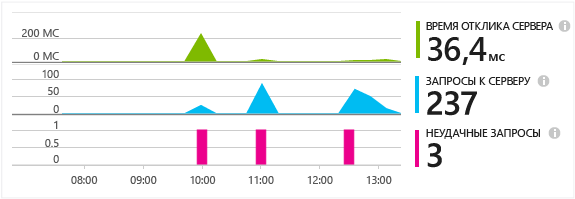
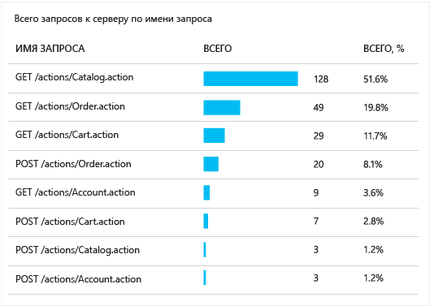
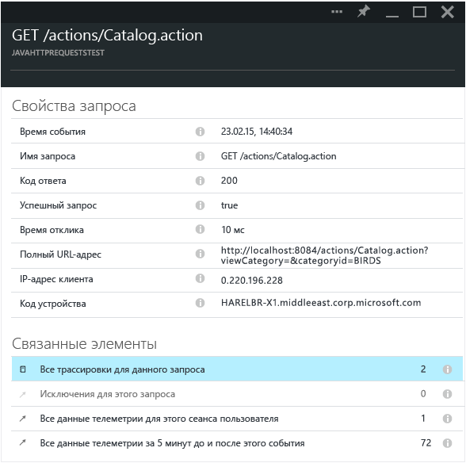

<properties 
	pageTitle="Отслеживание HTTP-запросов в веб-приложении Java" 
	description="Application Insights позволяет измерять производительность веб-приложения Java для веб-узла" 
	services="application-insights" 
    documentationCenter=""
	authors="alancameronwills" 
	manager="keboyd"/>

<tags 
	ms.service="application-insights" 
	ms.workload="tbd" 
	ms.tgt_pltfrm="ibiza" 
	ms.devlang="na" 
	ms.topic="article" 
	ms.date="05/26/2015" 
	ms.author="awills"/>
 
# Отслеживание HTTP-запросов в веб-приложении Java

Если вы используете веб-приложения Java, можно просмотреть все сведения о HTTP-запросах, отправленных приложению, например запрошенные ресурсы, неудачные запросы и значения времени отклика, на портале Application Insights.

Установите [Application Insights SDK для Java][java], если это еще не сделано.

## Добавление двоичных файлов в проект

*Выберите подходящий метод для проекта.*

### Если вы используете Maven...

Если проект уже настроен для сборки с использованием Maven, добавьте следующий фрагмент кода в файл pom.xml.

Затем обновите зависимости проекта, чтобы загрузить двоичные файлы.

    <dependencies>
      <dependency>
        <groupId>com.microsoft.azure</groupId>
        <artifactId>applicationinsights-web</artifactId>
        <version>[0.9,)</version>
      </dependency>
    </dependencies>

### Если вы используете Gradle...

Если проект уже настроен для сборки с использованием Gradle, добавьте следующий фрагмент кода в файл build.gradle.

Затем обновите зависимости проекта, чтобы загрузить двоичные файлы.

    dependencies {
      compile group: 'com.microsoft.azure', name: 'applicationinsights-web', version: '0.9.+'
    }

## Добавление в проект фильтра HTTP Application Insights

Найдите и откройте файл web.xml в проекте, добавьте следующий фрагмент кода в узел web-app, где настраиваются фильтры вашего приложения.

Для получения наиболее точных результатов этот фильтр должен применяться до всех остальных фильтров.

    <filter>
      <filter-name>ApplicationInsightsWebFilter</filter-name>
      <filter-class>
        com.microsoft.applicationinsights.web.internal.WebRequestTrackingFilter
      </filter-class>
    </filter>
    <filter-mapping>
       <filter-name>ApplicationInsightsWebFilter</filter-name>
       <url-pattern>/*</url-pattern>
    </filter-mapping>

## Добавление в проект модулей HTTP

Найдите и откройте файл ApplicationInsights.xml в проекте и добавьте следующий фрагмент кода в элемент <TelemetryModules>.

Если в этом файле нет элемента <TelemetryModules>, добавьте его в элемент <ApplicationInsights>.

    <TelemetryModules>
      <Add type="com.microsoft.applicationinsights.web.extensibility.modules.WebRequestTrackingTelemetryModule"/>
      <Add type="com.microsoft.applicationinsights.web.extensibility.modules.WebSessionTrackingTelemetryModule"/>
      <Add type="com.microsoft.applicationinsights.web.extensibility.modules.WebUserTrackingTelemetryModule"/>
    </TelemetryModules>

## Добавление инициализаторов телеметрии для корреляционного анализа событий

Данные корреляции событий позволяют связать HTTP-запрос и все события телеметрии, отправленные во время обработки этого запроса, с помощью свойства идентификатора операции, которое присоединяется к каждому из этих событий телеметрии. Это позволяет просматривать HTTP-запрос вместе со всеми событиями, которые были вызваны из него, а также упрощает диагностику и устранение проблем.

Найдите и откройте файл ApplicationInsights.xml в проекте и добавьте следующий фрагмент кода в элемент <TelemetryInitializers>.

Если в этом файле нет элемента < TelemetryInitializers>, добавьте его в элемент <ApplicationInsights>.

    <TelemetryInitializers>
     <Add  type="com.microsoft.applicationinsights.web.extensibility.initializers.WebOperationIdTelemetryInitializer"/>
     <Add type="com.microsoft.applicationinsights.web.extensibility.initializers.WebOperationNameTelemetryInitializer"/>
     <Add type="com.microsoft.applicationinsights.web.extensibility.initializers.WebSessionTelemetryInitializer"/>
     <Add type="com.microsoft.applicationinsights.web.extensibility.initializers.WebUserTelemetryInitializer"/>
     <Add type="com.microsoft.applicationinsights.web.extensibility.initializers.WebUserAgentTelemetryInitializer"/>
    </TelemetryInitializers>

## Просмотрите сведения о запросах в Application Insights

Запустите приложение.

Вернитесь к ресурсу Application Insights в Microsoft Azure.

В колонке обзора появятся данные HTTP-запросов. (Если данные отсутствуют, подождите несколько секунд и нажмите кнопку обновления).

 

Щелкните любую диаграмму, чтобы увидеть более подробные метрики.

[Дополнительные сведения о метриках.][metrics]

 

При просмотре свойств запроса можно увидеть события телеметрии, связанные с ним, такие как запросы и исключения.
 

## Дальнейшие действия

* [Поиск событий и журналов][diagnostic] для диагностики неполадок.
* [Используйте функции ведения журналов Log4J или Logback][javalogs]

<!--Link references-->

[diagnostic]: app-insights-diagnostic-search.md
[java]: app-insights-java-get-started.md
[javalogs]: app-insights-java-trace-logs.md
[metrics]: app-insights-metrics-explorer.md

 

<!---HONumber=July15_HO3-->