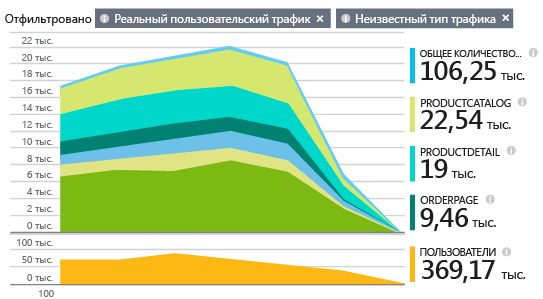
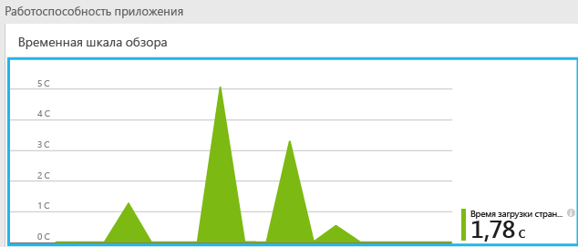
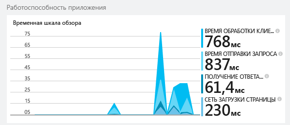
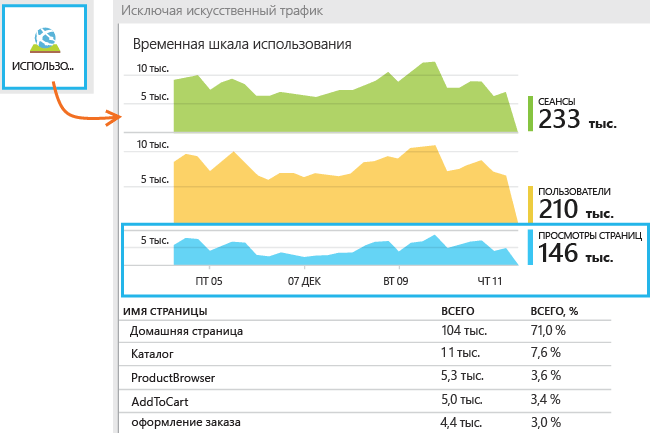
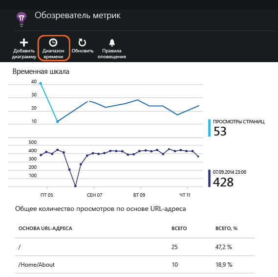
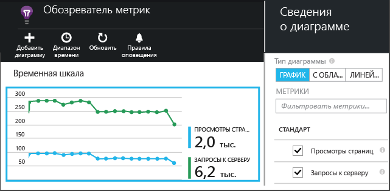

<properties
	pageTitle="Application Insights для веб-приложений JavaScript | Microsoft Azure"
	description="Получайте данные о количестве просмотров страницы и количестве сеансов, данные веб-клиента и отслеживайте закономерности использования. Выявляйте исключения и проблемы с производительностью на веб-страницах JavaScript."
	services="application-insights"
    documentationCenter=""
	authors="alancameronwills"
	manager="douge"/>

<tags
	ms.service="application-insights"
	ms.workload="tbd"
	ms.tgt_pltfrm="ibiza"
	ms.devlang="na"
	ms.topic="get-started-article"
	ms.date="11/17/2015"
	ms.author="awills"/>

# Application Insights для веб-приложений JavaScript

[AZURE.INCLUDE [app-insights-selector-get-started-dotnet](../../includes/app-insights-selector-get-started-dotnet.md)]

Узнайте о производительности и использовании своей веб-страницы. Добавьте Visual Studio Application Insights на страницу, и вы узнаете такую информацию, как количество пользователей, как часто они возвращаются на страницу и какие страницы используют чаще всего. Вы также можете получать отчеты о времени загрузки и любых исключениях. Добавляя [пользовательские события и метрики](app-insights-api-custom-events-metrics.md), вы сможете детально проанализировать самые популярные функции, распространенные ошибки и настроить свою страницу для успешного использования.

Если телеметрия сервера уже настроена для веб-приложения [ASP.NET](app-insights-asp-net.md) или [Java](app-insights-java-get-started.md), вы сможете получать данные клиента и сервера. На портале Application Insights будут интегрированы два потока.

#### Краткая демонстрация

Если у вас нет подписки Azure и вы хотите использовать Application Insights на веб-странице, посетите страницу [Try Application Insights](http://aka.ms/ainow) (Попробуйте Application Insights).

## Открытие ресурса Application Insights

Ресурс Application Insights — это место, где отображаются данные о производительности и об использовании страницы. (Если вы уже создали ресурс, чтобы собирать данные с веб-сервера, вы можете пропустить этот шаг.)

Войдите на [портал Azure](https://portal.azure.com).

Если вы уже настроили мониторинг приложения на стороне сервера, то у вас уже есть ресурс:

Если ресурса у вас нет, создайте его.

*Уже появились вопросы?* [Дополнительная информация о создании ресурса](app-insights-create-new-resource.md).

## Добавление сценария пакета SDK в приложение или на веб-страницу

В разделе «Быстрый запуск» получите сценарий для веб-страниц:

Вставьте сценарий прямо перед тегом &lt;/head&gt; на каждой странице, которую необходимо отслеживать. Если на вашем веб-сайте есть главная страница, можно разместить скрипт на ней. Например:

* В проекте ASP.NET MVC разместите сценарий на странице View\\Shared\_Layout.cshtml.
* На сайте SharePoint на панели управления откройте [Параметры сайта/Главная страница](app-insights-sharepoint.md).

Сценарий содержит ключ инструментирования, который направляет данные к ресурсу Application Insights.

([Подробное объяснение сценария.](http://apmtips.com/blog/2015/03/18/javascript-snippet-explained/))

*(Если вы используете известную платформу веб-страницы, найдите адаптеры Application Insights. Например, [модуль AngularJS](http://ngmodules.org/modules/angular-appinsights).)*

## Запуск приложения

Запустите веб-приложение, используйте его в течение непродолжительного времени для формирования телеметрии и подождите несколько секунд. Вы также можете запустить приложение на компьютере, на котором ведется разработка, нажав клавишу **F5**, или опубликовать и позволить пользователям его использовать.

Если вам надо проверить телеметрию, отправляемую веб-приложением в Application Insights, используйте инструменты отладки браузера (во многих браузерах это можно сделать нажатием клавиши **F12**). Данные отправляются по адресу dc.services.visualstudio.com.

## Изучение данных

В верхней части колонки обзора приложения есть диаграмма, на которой показано среднее время загрузки страницы в браузере:

*Еще нет данных? Нажмите кнопку **Обновить** в верхней части страницы. По-прежнему нет данных? См. раздел [Устранение неполадок](app-insights-troubleshoot-faq.md).*

Щелкните диаграмму, чтобы просмотреть более подробные данные:

Это диаграмма с накоплением, на которой время загрузки страницы разбито на [стандартные отрезки времени, определенные консорциумом W3C](http://www.w3.org/TR/navigation-timing/#processing-model).

Обратите внимание, что значение времени *подключения к сети* обычно меньше ожидаемого, так как это среднее значение по всем запросам из браузера на сервер. Для множества отдельных запросов значение времени подключения — «0» из-за наличия активного подключения к серверу.

### Производительность по страницам

Ниже в колонке подробных данных есть сетка, разбитая по URL-адресам страниц:

Если вам нужно увидеть производительность страниц по времени, дважды щелкните сетку и измените тип диаграммы:

## Обзор использования клиента

В колонке обзора щелкните **Использование**.

* **Пользователи** — количество отдельных пользователей за диапазон времени на диаграмме. (Чтобы определить пользователей, возвращающихся на страницу, используются файлы cookie).
* **Сеансы** — сеанс учитывается, если пользователь не выполнял никаких запросов в течение 30 минут.
* **Количество просмотров страницы** — подсчитывается количество вызовов функции trackPageView(), которая обычно вызывается один раз на каждой веб-странице.

### Щелкните, чтобы увидеть больше данных

Щелкните любую диаграмму, чтобы увидеть более подробные данные. Обратите внимание, что диапазоны времени диаграмм можно менять.

Щелкните диаграмму, чтоб увидеть метрики, которые она может отобразить, либо добавьте новую диаграмму и выберите метрики, которые она отображает.

> [AZURE.NOTE] Метрики могут отображаться только в определенных сочетаниях. При выборе какой-либо метрики все несовместимые метрики будут отключены.

## Настраиваемые счетчики страниц

По умолчанию счетчик страницы увеличивается на единицу каждый раз, когда страница загружается в клиентском браузере. Однако вам может потребоваться подсчитать дополнительные просмотры страницы. Например, если содержимое страницы разбито на вкладки, возможно, вы захотите, чтобы счетчик увеличивался на единицу при каждом переключении между ними. Другой пример — ситуация, когда код JavaScript на странице загружает новое содержимое, но URL-адрес в браузере при этом не меняется.

Вставьте в соответствующем месте клиентского кода вызов JavaScript наподобие следующего:

    appInsights.trackPageView(myPageName);

Имя страницы может содержать те же символы, что и URL-адрес, но все символы после "#" или "?" игнорируются.

## Изучение отдельных событий просмотра страницы

Обычно телеметрия просмотра страниц анализируется службой Application Insights, и вы видите только сводные отчеты со средними значениями для всех пользователей. Однако в целях отладки можно также изучать отдельные события просмотра страниц.

В колонке Diagnostic Search (Поиск данных диагностики) в разделе Filter (Фильтр) установите флажок Page View (Просмотр страниц).

Выберите любое событие, чтобы просмотреть подробные сведения. На странице сведений нажмите кнопку «...», чтобы открыть еще более подробные сведения.

> [AZURE.NOTE] Если вы используете [Поиск](app-insights-diagnostic-search.md), обратите внимание, что вы должны сопоставлять слова целиком: «Пр» и «о» не соответствуют «Про», в отличие от «Пр*». Поисковый запрос нельзя начинать с подстановочного знака. Например, по запросу "*нформаци" не будет найдено слово "Информация".

> [Дополнительная информация о поиске диагностических данных](app-insights-diagnostic-search.md)

### Свойства просмотра страниц

* **Длительность просмотра страницы** &#151; время, необходимое для загрузки страницы и запуска сценариев. В частности, имеется в виду промежуток времени между началом загрузки страницы и выполнением сценария trackPageView. Если после инициализации сценария trackPageView вы переместили его из обычного положения, значение будет иным.

## Отслеживание использования элементов пользователями

Хотите узнать, что пользователи делают в вашем приложении? Вставив вызовы в коде клиента и сервера, вы можете отправить свою телеметрию в Application Insights. Например, вы можете выяснить, сколько пользователей создали заказы, но не завершили их, какие ошибки проверки возникают наиболее часто или среднее количество очков, набранных пользователями в игре.

* [Дополнительные сведения об API пользовательских событий и метрик](app-insights-api-custom-events-metrics.md).
* [Справочник по API](https://github.com/Microsoft/ApplicationInsights-JS/blob/master/API-reference.md)

## Телеметрия сервера

Вы можете получить дополнительную информацию с сервера и отобразить данные сервера и клиента, если вы еще не сделали этого. Это позволит вам оценить производительность сервера и диагностировать любые проблемы. Добавьте пакет SDK Application Insights в свое приложение:

* [Добавление пакета SDK в приложение ASP.NET](app-insights-asp-net.md)
* [Добавление пакета SDK в веб-приложение Java](app-insights-java-get-started.md)

Если веб-приложение уже существует, можно добавить сервер телеметрии без необходимости повторной сборки или развертывания:

* [Мониторинг существующего приложения ASP.NET](app-insights-monitor-performance-live-website-now.md)
* [Мониторинг существующего приложения Java](app-insights-java-live.md)

## Видео «Отслеживание использования»

> [AZURE.VIDEO tracking-usage-with-application-insights]

## Дальнейшие действия

* [Отслеживание использования](app-insights-web-track-usage.md)
* [Пользовательские события и метрики](app-insights-api-custom-events-metrics.md)
* [Сборка, измерение и обучение](app-insights-overview-usage.md)

<!---HONumber=AcomDC_0128_2016-->