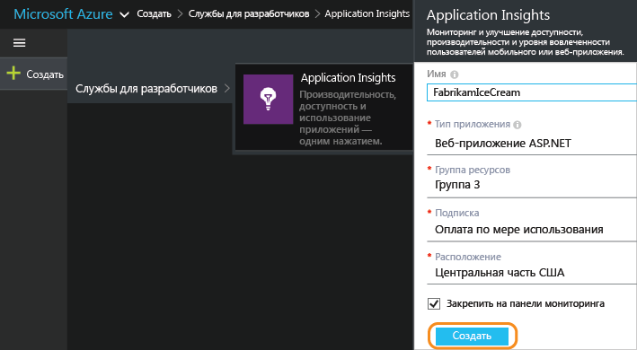
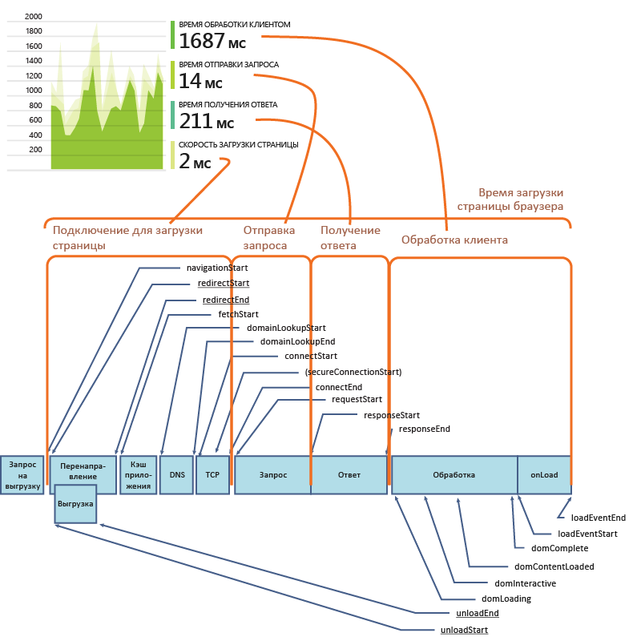
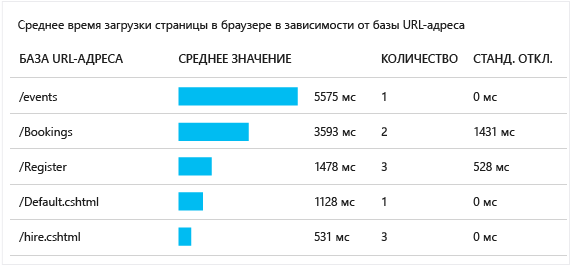
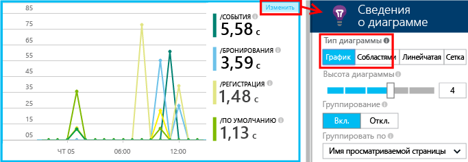
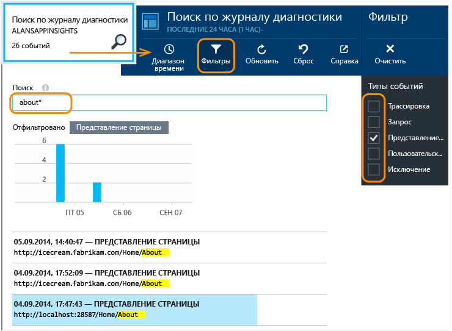

# <a name="application-insights-for-web-pages"></a>Application Insights для веб-страниц
Узнайте о производительности и использовании своей веб-страницы или приложения. Если добавить [Application Insights](app-insights-overview.md) в скрипт страницы, вы узнаете время загрузки страницы и вызовов AJAX, сведения об исключениях браузера, ошибках AJAX и их количестве, а также количество пользователей и сеансов. Все эти данные можно разбить по страницам, версии клиентской ОС и браузера, географическому расположению и другим показателям. Можно также настроить оповещения для определенного количества сбоев или медленной загрузки страниц. Кроме того, вставив вызовы трассировки в код JavaScript, вы можете отслеживать использование различных функций приложения веб-страницы.

Application Insights можно использовать с любыми веб-страницами — просто добавьте небольшой фрагмент кода JavaScript. Для веб-службы [Java](app-insights-java-get-started.md) или [ASP.NET](app-insights-asp-net.md) можно интегрировать данные телеметрии, полученные с сервера и клиентских компьютеров.


Вам понадобится подписка [Microsoft Azure](https://azure.com). Если у вашей группы есть подписка организации, попросите владельца подписки добавить в нее вашу учетную запись Майкрософт.

## <a name="set-up-application-insights-for-your-web-page"></a>Настройка Application Insights для веб-страницы
Добавьте фрагмент кода загрузчика на веб-страницы, как показано ниже.

### <a name="open-or-create-application-insights-resource"></a>Открытие или создание ресурса Application Insights
Ресурс Application Insights — это место, где отображаются данные о производительности и об использовании страницы. 

Войдите на [портал Azure](https://portal.azure.com).

Если вы уже настроили мониторинг приложения на стороне сервера, то у вас уже есть ресурс.


Если ресурса у вас нет, создайте его.



*Уже появились вопросы?* [Дополнительная информация о создании ресурса](app-insights-create-new-resource.md).

### <a name="add-the-sdk-script-to-your-app-or-web-pages"></a>Добавление сценария пакета SDK в приложение или на веб-страницу
В разделе «Быстрый запуск» получите сценарий для веб-страниц:


> [!NOTE]
> Процесс *начала работы* зависит от типа приложения, выбранного при создании ресурса Application Insights. Если для вашего приложения нет скрипта, как показано на предыдущем снимке экрана, просто воспользуйтесь приведенным ниже.

```HTML
<!-- 
To collect end-user usage analytics about your application, 
insert the following script into each page you want to track.
Place this code immediately before the closing </head> tag,
and before any other scripts. Your first data will appear 
automatically in just a few seconds.
-->
<script type="text/javascript">
var appInsights=window.appInsights||function(a){
  function b(a){c[a]=function(){var b=arguments;c.queue.push(function(){c[a].apply(c,b)})}}var c={config:a},d=document,e=window;setTimeout(function(){var b=d.createElement("script");b.src=a.url||"https://az416426.vo.msecnd.net/scripts/a/ai.0.js",d.getElementsByTagName("script")[0].parentNode.appendChild(b)});try{c.cookie=d.cookie}catch(a){}c.queue=[];for(var f=["Event","Exception","Metric","PageView","Trace","Dependency"];f.length;)b("track"+f.pop());if(b("setAuthenticatedUserContext"),b("clearAuthenticatedUserContext"),b("startTrackEvent"),b("stopTrackEvent"),b("startTrackPage"),b("stopTrackPage"),b("flush"),!a.disableExceptionTracking){f="onerror",b("_"+f);var g=e[f];e[f]=function(a,b,d,e,h){var i=g&&g(a,b,d,e,h);return!0!==i&&c["_"+f](a,b,d,e,h),i}}return c
  }({
      instrumentationKey:"<your instrumentation key>"
  });
  
window.appInsights=appInsights,appInsights.queue&&0===appInsights.queue.length&&appInsights.trackPageView();
</script>
```

Вставьте сценарий непосредственно перед тегом `</head>` каждой страницы, которую вы хотите отслеживать. Если на вашем веб-сайте есть главная страница, можно разместить сценарий на ней. Например: 

* В проекте ASP.NET MVC разместите сценарий на странице `View\Shared\_Layout.cshtml`
* На сайте SharePoint на панели управления откройте [Параметры сайта/Главная страница](app-insights-sharepoint.md).

Сценарий содержит ключ инструментирования, который направляет данные к ресурсу Application Insights. 

([Подробное объяснение сценария.](http://apmtips.com/blog/2015/03/18/javascript-snippet-explained/))

*(Если вы используете известную платформу веб-страницы, найдите адаптеры Application Insights. Например, [модуль AngularJS](http://ngmodules.org/modules/angular-appinsights).)*

## <a name="detailed-configuration"></a>Подробные сведения
Вы можете задать несколько [параметров](https://github.com/Microsoft/ApplicationInsights-JS/blob/master/API-reference.md#config), хотя в большинстве случаев это не требуется. Например, можно отключить или ограничить количество вызовов AJAX, регистрируемых при каждом просмотре страницы (чтобы уменьшить трафик). Или можно задать режим отладки, чтобы быстрее пропустить данные телеметрии через конвейер, не выполняя пакетные операции.

Чтобы задать эти параметры, найдите следующую строку в фрагменте кода и добавьте после нее несколько элементов, разделенных запятой:

    })({
      instrumentationKey: "..."
      // Insert here
    });

[Доступные параметры](https://github.com/Microsoft/ApplicationInsights-JS/blob/master/API-reference.md#config) включают:

    // Send telemetry immediately without batching.
    // Remember to remove this when no longer required, as it
    // can affect browser performance.
    enableDebug: boolean,

    // Don't log browser exceptions.
    disableExceptionTracking: boolean,

    // Don't log ajax calls.
    disableAjaxTracking: boolean,

    // Limit number of Ajax calls logged, to reduce traffic.
    maxAjaxCallsPerView: 10, // default is 500

    // Time page load up to execution of first trackPageView().
    overridePageViewDuration: boolean,

    // Set dynamically for an authenticated user.
    accountId: string,

## <a name="run"></a>Запуск приложения
Запустите веб-приложение, используйте его в течение непродолжительного времени для формирования телеметрии и подождите несколько секунд. Вы также можете запустить приложение на компьютере, на котором ведется разработка, нажав клавишу **F5**, или опубликовать и позволить пользователям его использовать.

Если вам надо проверить телеметрию, отправляемую веб-приложением в Application Insights, используйте инструменты отладки браузера (во многих браузерах это можно сделать нажатием клавиши**F12** ). Данные отправляются по адресу dc.services.visualstudio.com.

## <a name="explore-your-browser-performance-data"></a>Просмотр данных о производительности браузера
Откройте колонку "Браузер", чтобы отобразить сводные данные о производительности, поступающие из браузеров пользователей.


*Еще нет данных? Щелкните **Обновить** в верхней части страницы. По-прежнему нет данных? См. раздел [Устранение неполадок](app-insights-troubleshoot-faq.md).*

Колонка "Браузер" — это [колонка обозревателя метрик](app-insights-metrics-explorer.md) с предустановленными фильтрами и предварительно выбранными параметрами диаграмм. При необходимости можно изменить диапазон времени, фильтры и конфигурацию диаграмм и сохранить результат в избранном. Щелкните **Восстановить значения по умолчанию**, чтобы вернуться к исходной конфигурации колонки.

## <a name="page-load-performance"></a>Производительность загрузки страниц
Вверху экрана отображается сегментированная диаграмма времени загрузки страницы. Общая высота диаграммы представляет среднее время загрузки и отображения страниц приложения в браузерах пользователей. Время отсчитывается от момента, когда браузер отправляет первоначальный запрос HTTP, до момента, когда завершается обработка всех синхронных событий загрузки, включая макет и выполняющиеся сценарии. Асинхронные задачи, такие как загрузка веб-частей из вызовов AJAX, не учитываются.

На этой диаграмме общее время загрузки страницы разбито на [стандартные отрезки времени, определенные консорциумом W3C](http://www.w3.org/TR/navigation-timing/#processing-model). 



Обратите внимание, что значение времени *подключения к сети* часто меньше ожидаемого, так как это среднее значение по всем запросам из браузера на сервер. Для множества отдельных запросов значение времени подключения — «0» из-за наличия активного подключения к серверу.

### <a name="slow-loading"></a>Медленная загрузка
Медленная загрузка страниц — основная причина недовольства пользователей. Если диаграмма показывает, что страницы загружаются медленно, вы можете выполнить ряд простых диагностических исследований.

На диаграмме показано среднее время загрузки всех страниц в приложении. Чтобы узнать, связана ли проблема с определенными страницами, найдите в колонке таблицу, где данные разбиты по URL-адресам страниц:



Обратите внимание на количество просмотров страниц и стандартное отклонение. Если страниц очень мало, проблема не доставляет пользователям особых неудобств. Высокий уровень стандартного отклонения (относительно среднего уровня) указывает на большие различия между отдельными измерениями.

**Данные для отдельного URL-адреса и отдельного просмотра страницы.** Щелкните имя любой страницы, чтобы отобразить колонку диаграмм браузера, отфильтрованных только для этого URL-адреса. То же самое можно сделать для экземпляра представления страницы.


Щелкните `...`, чтобы увидеть полный список свойств для данного события или проверить вызовы AJAX и связанные события. Медленные вызовы AJAX влияют на общее время загрузки страницы, если они выполняются синхронно. К связанным событиям относятся запросы сервера для того же URL-адреса (если вы настроили Application Insights на веб-сервере).

**Производительность страниц со временем.** Вернитесь в колонку "Браузеры" и вместо таблицы "Время загрузки страницы" выберите график, на котором отображаются пиковые значения в определенное время:



**Сегментация по другим показателям.** Возможно, загрузка страниц происходит медленнее в конкретном браузере, клиентской ОС или расположении пользователя? Добавьте новую диаграмму и поэкспериментируйте с параметром **Группировать по** .


## <a name="ajax-performance"></a>Производительность вызовов AJAX
Убедитесь, что все вызовы AJAX на веб-страницах работают нормально. Они часто используются для асинхронного заполнения частей страницы. Иногда вся страница загружается быстро, но остаются пустые веб-части, данные в которых отображаются не сразу. Естественно, это вызывает раздражение пользователей.

Вызовы AJAX, выполняемые с веб-страницы, отображаются в колонке "Браузеры" как зависимости.

В верхней части колонки есть сводные диаграммы:


Подробные таблицы приводятся ниже:


Щелкните любую строку для получения подробной информации.

> [!NOTE]
> Если удалить фильтр "Браузеры" в колонке, зависимости сервера и зависимости AJAX будут включены в эти диаграммы. Чтобы повторно настроить фильтр, щелкните "Восстановить значения по умолчанию".
> 
> 

**Для быстрого анализа вызовов AJAX, завершившихся сбоем**, прокрутите вниз до таблицы сбоев зависимостей и щелкните строку, чтобы просмотреть конкретные экземпляры.


Щелкните `...`, чтобы получить полные данные телеметрии для вызова AJAX.

### <a name="no-ajax-calls-reported"></a>Вызовы AJAX не регистрируются?
Вызовы AJAX включают все вызовы HTTP/HTTPS из сценария веб-страницы. Если они не регистрируются, проверьте, не заданы ли во фрагменте кода [параметры](https://github.com/Microsoft/ApplicationInsights-JS/blob/master/API-reference.md#config) `disableAjaxTracking` или `maxAjaxCallsPerView`.

## <a name="browser-exceptions"></a>Исключения браузера
В нижней части колонке "Браузеры" есть сводная диаграмма исключений и таблица типов исключений.


Если исключения браузера не регистрируются, проверьте, не задан ли во фрагменте кода [параметр](https://github.com/Microsoft/ApplicationInsights-JS/blob/master/API-reference.md#config) `disableExceptionTracking`.

## <a name="inspect-individual-page-view-events"></a>Изучение отдельных событий просмотра страницы

Обычно телеметрия просмотра страниц анализируется службой Application Insights, и вы видите только сводные отчеты со средними значениями для всех пользователей. Однако в целях отладки можно также изучать отдельные события просмотра страниц.

В колонке Diagnostic Search (Поиск данных диагностики) в разделе Filter (Фильтр) установите флажок Page View (Просмотр страниц).



Выберите любое событие, чтобы просмотреть подробные сведения. На странице сведений нажмите кнопку «...», чтобы открыть еще более подробные сведения.

> [!NOTE]
> Если вы используете [Поиск](app-insights-diagnostic-search.md), обратите внимание, что вы должны сопоставлять слова целиком: "Пр" и "о" не соответствуют "Про".
> 
> 

Кроме того, для поиска просмотров страницы можно использовать [язык запросов Log Analytics](https://docs.microsoft.com/azure/application-insights/app-insights-analytics-tour#browser-timings-table).

### <a name="page-view-properties"></a>Свойства просмотра страниц
* **Длительность просмотра страницы** 
  
  * По умолчанию время, необходимое для загрузки страницы, от запроса клиента до полной загрузки (включая вспомогательные файлы, но за исключением асинхронных задач, таких как вызовы Ajax). 
  * Если в `overridePageViewDuration`конфигурации страницы[ указано значение ](#detailed-configuration), это интервал между запросом клиента и выполнением первого `trackPageView`. Если после инициализации сценария trackPageView вы переместили его из обычного положения, значение будет иным.
  * Если задано значение `overridePageViewDuration` и указан аргумент длительности в вызове `trackPageView()`, будет использовано значение аргумента. 

## <a name="custom-page-counts"></a>Настраиваемые счетчики страниц
По умолчанию счетчик страницы увеличивается на единицу каждый раз, когда страница загружается в клиентском браузере.  Однако вам может потребоваться подсчитать дополнительные просмотры страницы. Например, если содержимое страницы разбито на вкладки, возможно, вы захотите, чтобы счетчик увеличивался на единицу при каждом переключении между ними. Другой пример — ситуация, когда код JavaScript на странице загружает новое содержимое, но URL-адрес в браузере при этом не меняется.

Вставьте в соответствующем месте клиентского кода вызов JavaScript наподобие следующего:

    appInsights.trackPageView(myPageName);

Имя страницы может содержать те же знаки, что и URL-адрес, но все знаки после "#" или "?" игнорируются.

## <a name="usage-tracking"></a>Отслеживание использования
Хотите узнать, что пользователи делают в вашем приложении?

* [Дополнительные сведения об отслеживании использования](app-insights-web-track-usage.md)
* [Дополнительные сведения об API пользовательских событий и метрик](app-insights-api-custom-events-metrics.md).

## <a name="video"></a> Видео


> [!VIDEO https://channel9.msdn.com/events/Connect/2016/100/player]


## <a name="next"></a>Дальнейшие действия
* [Отслеживание использования](app-insights-web-track-usage.md)
* [Пользовательские события и метрики](app-insights-api-custom-events-metrics.md)
* [Сборка, измерение и обучение](app-insights-web-track-usage.md)

