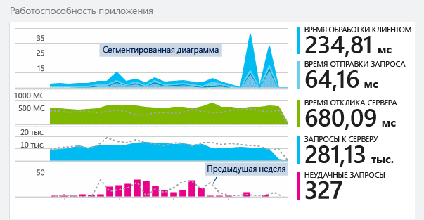
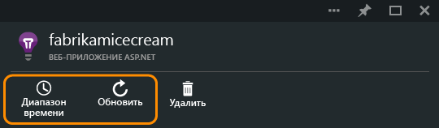
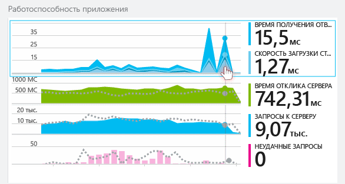
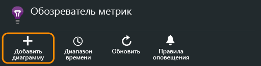
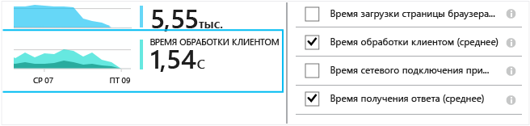
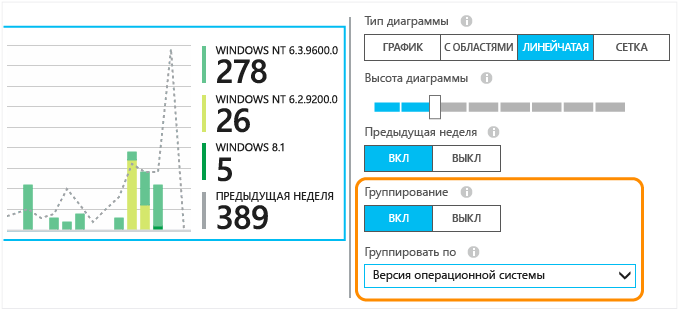
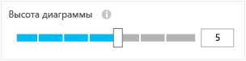
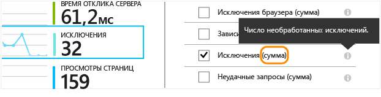
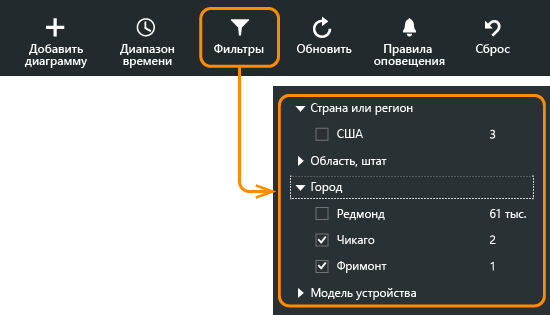
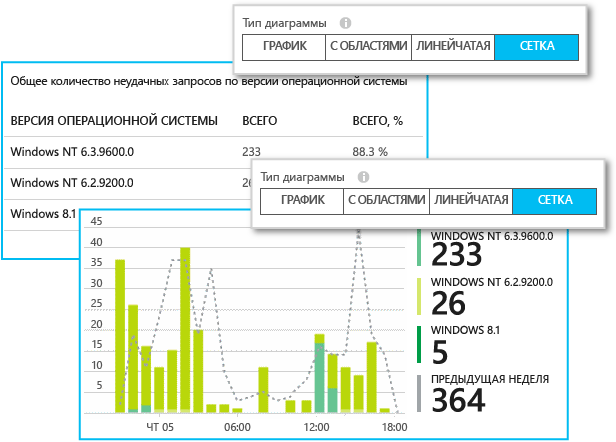

# Исследование метрик в Application Insights
Метрики в [Application Insights][start] — это измеренные значения и счетчики событий, которые передаются как данные телеметрии из приложения. Они помогают обнаруживать проблемы производительности и отслеживать тенденции в использовании приложения. Существует широкий спектр стандартных метрик, и можно также создавать собственные пользовательские метрики и события.

Метрики и счетчики событий отображаются в диаграммах агрегированных значений, например как сумма, среднее или количество.

Вот пример набора диаграмм:

Диаграммы метрик повсеместно используются на портале Application Insights. В большинстве случаев их можно настраивать, а также добавлять в колонку дополнительные диаграммы. В колонке "Обзор" щелкните более подробные диаграммы (которые имеют заголовки, такие как "Сервер") или воспользуйтесь **обозревателем метрик**, чтобы открыть новую колонку, в которой можно создавать настраиваемые диаграммы.

## Диапазон времени
В любой колонке можно изменить диапазон времени, охватываемый диаграммами или сетками.

Если ожидаются некоторые данные, которые еще не отобразились, нажмите кнопку "Обновить". Диаграммы самостоятельно обновляются через определенные интервалы, однако интервалы становятся длиннее при использовании более крупных временных отрезков. Может потребоваться некоторое время, чтобы данные были переданы через конвейер анализа в диаграмму.

Чтобы увеличить часть диаграммы, перетащите ее:

Чтобы восстановить первоначальный масштаб, нажмите кнопку Undo Zoom (Отменить изменение масштаба).

## Детализация и значения точек
Наведите указатель мыши на диаграммы для отображения значений метрик в той точке.

Значение метрики в определенной точке определяется как результат статистического вычисления за предыдущий интервал выборки.

Интервал выборки, или «степень детализации», отображается в верхней части колонки.

Степень детализации можно настроить в колонке временного диапазона:

Доступные степени детализации зависят от выбранного интервала времени. Вместо автоматической степени детализации для интервала времени можно выбрать явную степень детализации.

## Изменение диаграмм и сеток
Добавление новой диаграммы в колонку:

Вы можете **изменить** существующую или создать новую диаграмму для редактирования отображаемых данных.

Можно отобразить более одной метрики на диаграмме, хотя существуют ограничения по сочетаниям, которые могут отображаться одновременно. Когда выбрана одна метрика, некоторые другие становятся недоступными.

Если [пользовательские метрики][track] были добавлены в код приложения (вызовы TrackMetric и TrackEvent), то они будут перечислены здесь.

## Сегментация данных
Можно разделить метрику по свойствам — например, для сравнения просмотров страниц на клиентах с разными операционными системами.

Выберите диаграмму или сетку, переключитесь на группировку и выберите свойство для группировки:

> [!NOTE]
> При использовании группирования диаграммы с областями и линейчатые диаграммы отображают данные с накоплением. Это удобно, когда методом агрегирования является "Сумма". Но если методом агрегирования является "Среднее", выберите отображение линий или сетки.
>
>

Если [пользовательские метрики][track] были добавлены в код приложения и включают значения свойств, то в списке можно будет выбрать соответствующее свойство.

Диаграмма слишком мала для сегментации данных? Измените ее высоту:

## Типы агрегата
В условных обозначениях сбоку по умолчанию отображается значение, вычисленное для периода диаграммы. При наведении указателя мыши на какую-либо точку диаграммы отображается значение в этой точке.

Каждая точка данных на диаграмме вычисляется на основе значений данных, полученных на предыдущем интервале выборки (степени детализации). Степень детализации отображается в верхней части колонки и зависит от общей шкалы времени диаграммы.

Метрики можно вычислять различными способами.

* **Count** — счетчик событий, полученных в интервале выборки. Используется для событий, таких как запросы. Изменения высоты диаграммы указывают на изменения частоты, с которой происходят события. Но обратите внимание, что числовое значение изменяется при изменении интервала выборки.
* **Сумма** : суммирование значений всех точек данных, полученных в течение интервала выборки (периода диаграммы).
* **Среднее** : деление значения "Сумма" на количество точек данных, полученных в течение интервала.
* **Уникальные** : использование счетчиков для подсчета количества пользователей и учетных записей. На рисунке показано количество различных пользователей, обнаруженных в течение интервала выборки (периода диаграммы).
* **%** — версии со значением каждого агрегата в процентах применяются только в сегментированных диаграммах. Общее значение всегда равно 100 %, а на диаграмме отображается относительный вклад каждого компонента.

    

### Изменение типа агрегата

При создании диаграммы или при отмене выбора всех метрик отображается метод по умолчанию для каждой метрики.

## Закрепление оси Y 
По умолчанию на диаграмме отображаются значения оси Y от нуля до максимального значения в диапазоне данных, чтобы наглядно представить квант времени значений. Но в некоторых случаях незначительные изменения в значениях могут представлять больший интерес для исследования, чем весь квант времени. Для подобных настроек используется функция изменения диапазона оси Y, позволяющая закрепить ее минимальное или максимальное значение в нужном месте.
Установите флажок "Дополнительные параметры", чтобы открыть параметры диапазона оси Y.

## Фильтрация данных
Просмотр метрик только для выбранного набора значений свойства

Если не выбирать какие-либо значения для конкретного свойства, это будет аналогично выбору их всех: нет фильтра по этому свойству.

Обратите внимание на счетчики событий рядом с каждым значением свойства. При выборе значений одного свойства счетчики, находящиеся рядом со значениями других свойств, корректируются.

Фильтры применяются ко всем диаграммам в колонке. Если требуется применить разные фильтры к различным диаграммам, отдельно создайте и сохраните соответствующие колонки метрик. Если необходимо, вы можете закрепить диаграммы из разных колонок на панели мониторинга, чтобы их можно было видеть вместе.

### Исключение программ-роботов и веб-тест трафика
Используйте фильтр **Реальный или искусственный трафик** и установите флажок **Реальный**.

Также можно фильтровать по **источнику искусственного трафика**.

### Добавление свойств в список фильтров
Вам необходимо фильтровать данные телеметрии по выбранным вами категориям? Например, вы распределили пользователей по различным категориям и хотели бы сегментировать данные по этим категориям.

[Создайте собственное свойство](app-insights-api-custom-events-metrics.md#properties). Задайте его в [инициализаторе телеметрии](app-insights-api-custom-events-metrics.md#defaults) , чтобы оно было включено во все данные телеметрии, включая стандартные данные телеметрии, отправляемые различными модулями SDK.

## Изменение типа диаграммы
Обратите внимание, что можно переключаться между сетками и диаграммами.

## Сохранение колонки метрик
После создания диаграммы ее можно сохранить в список избранного. При использовании учетной записи организации можно выбрать, будут ли другие члены команды иметь к ней доступ.

Чтобы снова увидеть эту колонку, **перейдите в колонку "Обзор"** и откройте "Избранное":

Если выбрать относительный диапазон времени при сохранении, колонка будет обновлена с использованием последних метрик. Если выбрать абсолютного диапазона времени, каждый раз будут отображаться те же данные.

## Сброс настроек колонки
Если после изменения колонки требуется вернуться к исходному  сохраненному набору параметров, просто нажмите кнопку сброса.

## Live Metrics Stream

Чтобы получить мгновенное представление телеметрии, откройте [Live Stream](app-insights-live-stream.md). Отображение большинства метрик занимает несколько минут из-за процесса агрегирования. В противоположность этому динамические метрики оптимизированы для отображения с малой задержкой. 

## Задание предупреждений
Чтобы получать уведомления по электронной почте о нетипичных значениях любой метрики, добавьте предупреждение. Можно выбрать отправку либо по электронной почте администраторам учетной записи, либо на указанный электронный адрес.

[Дополнительные сведения об оповещениях][alerts].

## Непрерывный экспорт
Если необходимо постоянно экспортировать данные для внешней обработки, используйте [непрерывный экспорт](app-insights-export-telemetry.md).

### Power BI
Если вам нужны представления данных с еще большими возможностями, данные можно [экспортировать в Power BI](http://blogs.msdn.com/b/powerbi/archive/2015/11/04/explore-your-application-insights-data-with-power-bi.aspx).

## Аналитика
[Аналитика](app-insights-analytics.md) является более гибким способом анализа телеметрии с помощью мощного языка запросов. Используйте ее, если требуется объединить или вычислить результаты метрик либо тщательно изучить последние данные производительности приложения. 

На диаграмме с метриками можно щелкнуть значок "Аналитика", чтобы перейти непосредственно к эквивалентному запросу "Аналитика".

## Устранение неполадок
*Данные не отображаются на диаграмме.*

* Фильтры применяются ко всем диаграммам в колонке. Убедитесь, что, рассматривая какую-либо диаграмму, вы не задали фильтр, исключающий все данные на другой диаграмме.

    Если вы хотите задать разные фильтры для различных диаграмм, создайте их на разных колонках и по отдельности сохраните в избранное. Если необходимо, вы можете закрепить их на панели мониторинга, чтобы их можно было видеть вместе.
* Если сгруппировать диаграмму по свойству, которое не определено в метрике, то на диаграмме ничего не отобразится. Попробуйте убрать группировку или выберите другое свойство для группировки.
* Данные о производительности (ЦП, скорость ввода-вывода и т. д.) доступны для веб-служб Java, классических приложений Windows, [веб-приложений и служб IIS, если установлен монитор состояния](app-insights-monitor-performance-live-website-now.md), а также [облачных служб Azure](app-insights-azure.md). Такие данные для веб-сайтов Azure недоступны.

## Дальнейшие действия
* [Отслеживание использования Application Insights.](app-insights-overview-usage.md)
* [Использование диагностического поиска](app-insights-diagnostic-search.md)

<!--Link references-->

[alerts]: app-insights-alerts.md
[start]: app-insights-overview.md
[track]: app-insights-api-custom-events-metrics.md

