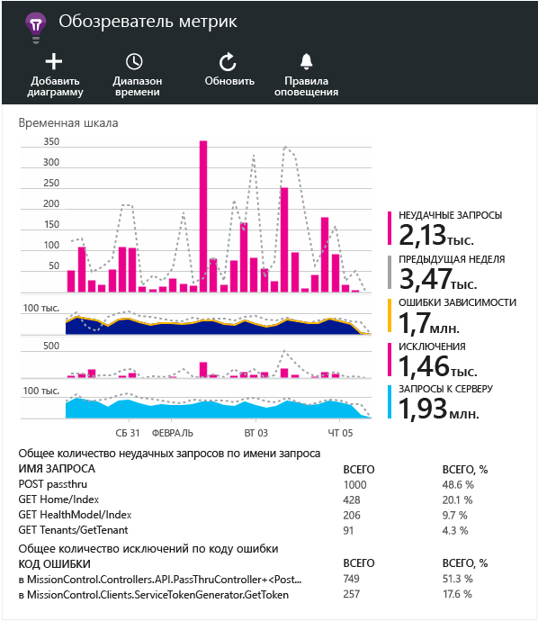

<properties 
	pageTitle="Исследование метрик в Application Insights" 
	description="Анализ использования, доступности и производительности локального приложения или веб-приложения Microsoft Azure с помощью Application Insights." 
	services="application-insights" 
    documentationCenter=""
	authors="alancameronwills" 
	manager="ronmart"/>

<tags 
	ms.service="application-insights" 
	ms.workload="tbd" 
	ms.tgt_pltfrm="ibiza" 
	ms.devlang="na" 
	ms.topic="article" 
	ms.date="05/07/2015" 
	ms.author="awills"/>
 
# Исследование метрик в Application Insights

Метрики в [Application Insights][start] — это измеренные значения и счетчики событий, которые передаются как данные телеметрии из приложения. Они помогают обнаруживать проблемы производительности и отслеживать тенденции в использовании приложения. Существует широкий спектр стандартных метрик, и можно также создавать собственные пользовательские метрики и события.

Метрики и счетчики событий отображаются в диаграммах агрегированных значений, например как сумма, среднее или количество.

Например, если добавить Application Insights в веб-приложение, рядом с верхней частью колонки обзора отобразится следующее:

Некоторые диаграммы сегментированы: общая высота диаграммы в любой точке представляет собой сумму отображаемых метрик. По умолчанию в условных обозначениях показывается наибольшее количество.

Пунктирной линией показано значение метрики за предыдущую неделю.

## Значения точек

Наведите указатель мыши на диаграммы для отображения значений метрик в той точке.

Значение метрики в определенной точке определяется как результат статистического вычисления за предыдущий интервал выборки. Это значение может варьироваться в зависимости от интервала времени всей диаграммы.

Интервал выборки, или "зерно", отображается в верхней части колонки.

## Диапазон времени

В любой колонке можно изменить диапазон времени, охватываемый большинством диаграмм или сеток.

Если ожидаются некоторые данные, которые еще не отображались, нажмите кнопку "Обновить". Диаграммы не обновляются автоматически. В режиме выпуска может потребоваться некоторое время, чтобы данные были переданы через конвейер анализа в  диаграмму.

В колонке "Обзор" перетащите часть диаграммы, чтобы в новой диаграмме данные отображались в увеличенном масштабе.

## Обозреватель метрик

Щелкните любую диаграмму в колонке "Обзор" для просмотра более подробного набора связанных диаграмм и сеток. Эти диаграммы и сетки можно изменить, чтобы получить именно те данные, которые вас интересуют.

Например, щелкните диаграмму неудачно завершенных запросов веб-приложения:

## Что означают рисунки

В условных обозначениях сбоку по умолчанию отображается  агрегированное значение за указанный в диаграмме период.

Каждая точка данных на диаграмме также является агрегатом значений данных, полученных в предыдущем интервале выборки, или "зерне". "Зерно" отображается в верхней части колонки и зависит от общей шкалы времени диаграммы.

Различные метрики агрегируются по-разному:

 * Для таких метрик, как время отклика, значения **усредняются** за период, указанный в диаграмме.
 * Для счетчиков событий, например неудачно завершенных запросов, агрегатом является **сумма** счетчиков за период.
 * Для счетчиков пользователей этим агрегатом является число **уникальных** пользователей за период. (Если пользователь отслеживается несколько раз в течение периода, он учитывается только один раз.)

Чтобы выяснить, является ли значение суммой, средним или уникальным значением, щелкните диаграмму и прокрутите список до выбранного значения. Также можно получить краткое описание метрики.

 

## Изменение диаграмм и сеток

Добавление новой диаграммы в колонку:

Выберите существующую или новую диаграмму для редактирования отображаемых данных:

Можно отобразить более одной метрики на диаграмме, хотя существуют ограничения по сочетаниям, которые могут отображаться одновременно. Когда выбрана одна метрика, некоторые другие становятся недоступными.

Если [пользовательские метрики][track] были добавлены в код приложения (вызовы TrackMetric и TrackEvent), они будут перечислены здесь.

## Сегментация данных

Выберите диаграмму или сетку, переключитесь на группировку и выберите свойство для группировки:

Если [пользовательские метрики][track] были добавлены в код приложения и включают значения свойства, в списке можно будет выбрать это свойство.

Диаграмма слишком мала для сегментации данных? Измените ее высоту:

## Фильтрация данных

Просмотр метрик только для выбранного набора значений свойства

Если не выбирать какие-либо значения для конкретного свойства, это будет аналогично выбору их всех: нет фильтра по этому свойству.

Обратите внимание на счетчики событий рядом с каждым значением свойства. При выборе значений одного свойства счетчики, находящиеся рядом со значениями других свойств, корректируются.

## Исключение программ-роботов и веб-тест трафика

Используйте фильтр **Реальный или искусственный трафик** и установите флажок **Реальный**.

Также можно фильтровать по **источнику искусственного трафика**.

## Изменение типа диаграммы

В частности, обратите внимание, что можно переключаться между сетками и диаграммами:

## Сохранение колонки метрик

После создания диаграммы ее можно сохранить в список избранного. При использовании учетной записи организации можно выбрать, будут ли другие члены команды иметь к ней доступ.

Чтобы снова увидеть эту колонку, **перейдите в колонку "Обзор"** и откройте "Избранное":

Если выбрать относительный диапазон времени при сохранении, колонка будет обновлена с использованием последних метрик. Если выбрать абсолютного диапазона времени, каждый раз будут отображаться те же данные.

## Сброс настроек колонки

Если после изменения колонки требуется вернуться к исходному  сохраненному набору параметров, просто нажмите кнопку сброса.

## Задание предупреждений

Чтобы получать уведомления по электронной почте о нетипичных значениях любой метрики, добавьте предупреждение. Можно выбрать отправку либо по электронной почте администраторам учетной записи, либо на указанный электронный адрес.

[Подробнее][alerts].

<!--Link references-->

[alerts]: app-insights-alerts.md
[start]: app-insights-get-started.md
[track]: app-insights-custom-events-metrics-api.md

<!--HONumber=54--> 