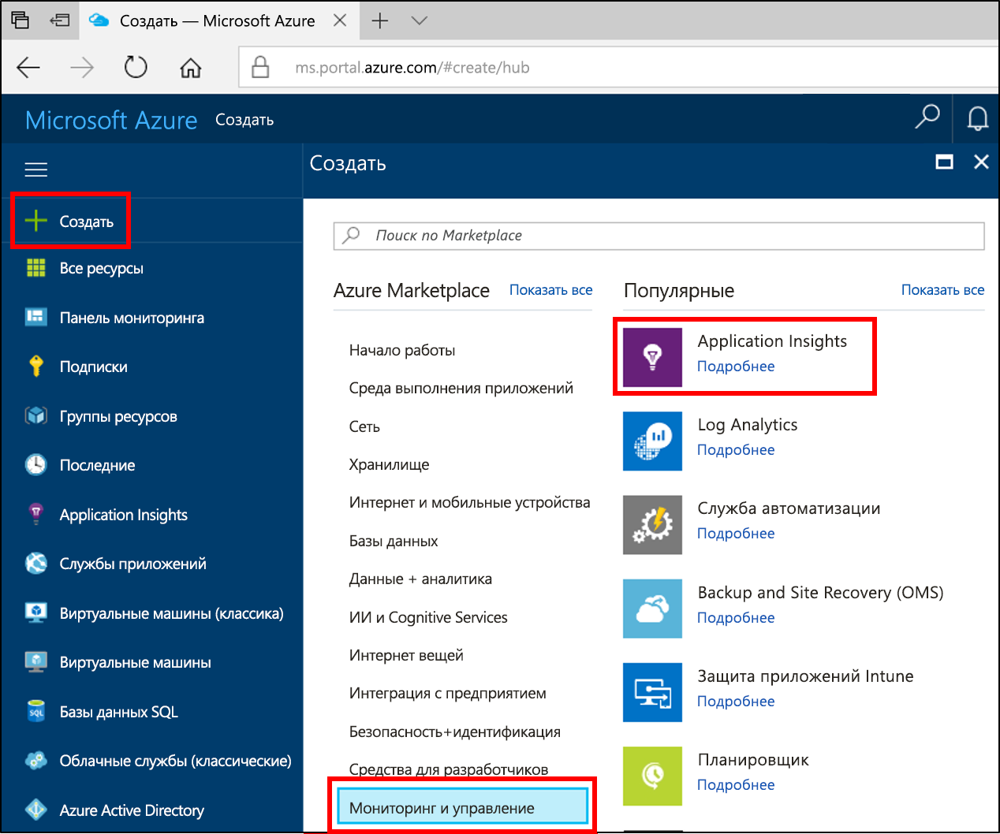
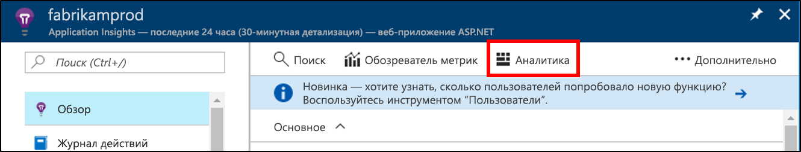
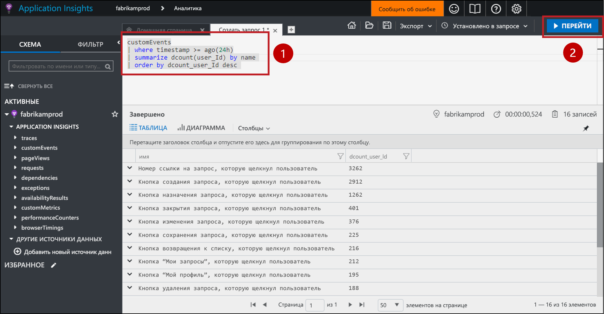
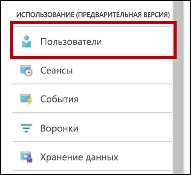
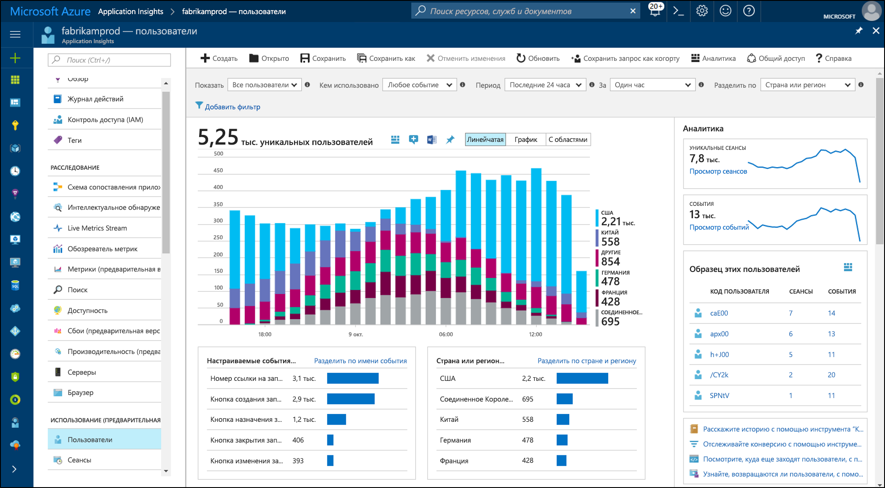
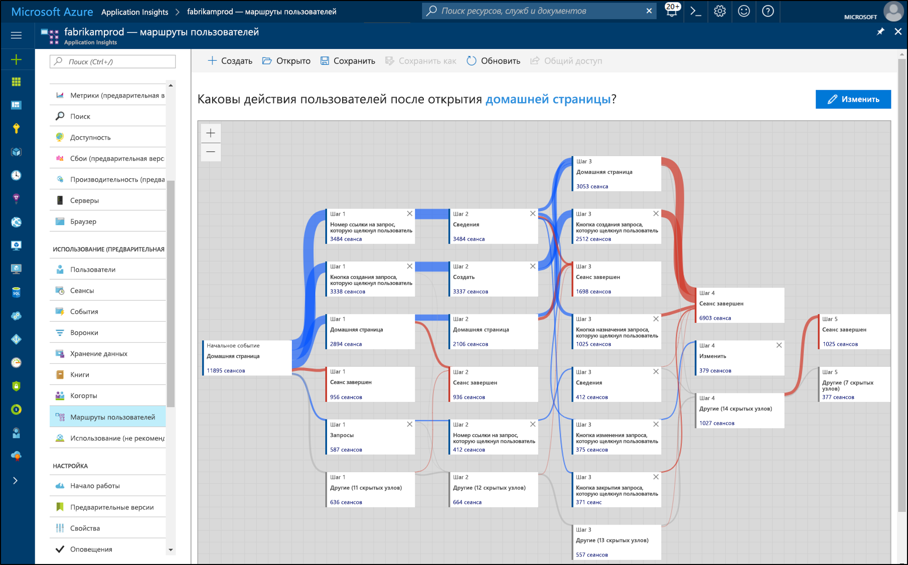

# <a name="start-analyzing-your-mobile-app-with-app-center-and-application-insights"></a>Анализ мобильного приложения с помощью App Center и Application Insights

Это краткое руководство поможет подключить экземпляр App Center вашего приложения к Application Insights. Используя Application Insights, можно выполнять запросы, сегментирование, фильтрацию и анализ данных телеметрии с помощью средств, которые более эффективны, чем средства, доступные в службе [аналитики](https://docs.microsoft.com/mobile-center/analytics/) App Center.

## <a name="prerequisites"></a>предварительным требованиям

Для работы с этим кратким руководством вам понадобится:

- Подписка Azure.
- Приложение под управлением iOS, Android, Xamarin, универсальное приложение для Windows или приложение React Native.
 
Если у вас еще нет подписки Azure, создайте [бесплатную](https://azure.microsoft.com/free/) учетную запись Azure, прежде чем начинать работу.

## <a name="onboard-to-app-center"></a>Знакомство с App Center

Прежде чем использовать службу Application Insights в мобильном приложении, ее необходимо подключить к [App Center](https://docs.microsoft.com/mobile-center/). Application Insights не получает данные телеметрии из мобильного приложения напрямую. Вместо этого приложение отправляет данные телеметрии пользовательских событий в App Center. После этого App Center экспортирует копии этих пользовательских событий в Application Insights по мере их получения.

Чтобы подключить приложение, выполните действия из краткого руководства по App Center для каждой платформы, которую поддерживает ваше приложение. Создайте отдельные экземпляры App Center для каждой платформы:

* [iOS](https://docs.microsoft.com/mobile-center/sdk/getting-started/ios);
* [Android](https://docs.microsoft.com/mobile-center/sdk/getting-started/android);
* [Xamarin](https://docs.microsoft.com/mobile-center/sdk/getting-started/xamarin);
* [универсальная платформа Windows](https://docs.microsoft.com/mobile-center/sdk/getting-started/uwp);
* [React Native](https://docs.microsoft.com/mobile-center/sdk/getting-started/react-native).

## <a name="track-events-in-your-app"></a>Отслеживание событий в приложении

После подключения к App Center приложение необходимо изменить, чтобы отправлять данные телеметрии пользовательских событий с помощью пакета SDK для App Center. Пользовательские события — это единственный тип данных телеметрии App Center, экспортируемых в Application Insights.

Чтобы отправить пользовательские события из приложений iOS, используйте методы `trackEvent` или `trackEvent:withProperties` в пакете SDK для App Center. [Дополнительные сведения об отслеживании событий из приложений iOS.](https://docs.microsoft.com/mobile-center/sdk/analytics/ios)

```Swift
MSAnalytics.trackEvent("Video clicked")
```

Чтобы отправить пользовательские события из приложений Android, используйте метод `trackEvent` в пакете SDK для App Center. [Дополнительные сведения об отслеживании событий из приложений Android.](https://docs.microsoft.com/mobile-center/sdk/analytics/android)

```Java
Analytics.trackEvent("Video clicked")
```

Чтобы отправлять пользовательские события из других платформ приложений, используйте методы `trackEvent` в соответствующих пакетах SDK для App Center.

Чтобы убедиться в том, что пользовательские события принимаются, перейдите на вкладку **События** в разделе **Аналитика** в App Center. Прежде чем отправленные из приложения события отобразятся, может пройти несколько минут.

## <a name="create-an-application-insights-resource"></a>Создание ресурса Application Insights

После того как приложение начнет отправлять пользовательские события в App Center и они будут получены, на портале Azure необходимо создать ресурс Application Insights, подходящий для App Center:

1. Войдите на [портал Azure](https://portal.azure.com/).
2. Последовательно выберите **Создать ресурс** > **Мониторинг и управление** > **Application Insights**.

    

    Появится окно настроек. Используйте таблицу ниже для заполнения полей ввода.

    | Параметры        |  Значение           | ОПИСАНИЕ  |
   | ------------- |:-------------|:-----|
   | **Имя**      | Глобальное уникальное значение, например "myApp-iOS" | Имя, идентифицирующее отслеживаемое приложение |
   | **Тип приложения** | Приложение App Center | Тип отслеживаемого приложения |
   | **Группа ресурсов**     | Новая группа ресурсов или имеющаяся в меню | Группа ресурсов, в которой требуется создать ресурс Application Insights |
   | **Местоположение.** | Расположение в меню | Выберите ближайшее расположение или расположение вблизи места размещения приложения |

3. Нажмите кнопку **Создать**.

Если приложение поддерживает несколько платформ (iOS, Android и т. д.), рекомендуется создать отдельные ресурсы Application Insights, по одной для каждой платформы.

## <a name="export-to-application-insights"></a>Экспорт в Application Insights

В новом ресурсе Application Insights на странице **Обзор** в верхней части раздела **Основные компоненты** скопируйте ключ инструментирования для этого ресурса.

В экземпляре App Center для приложения сделайте следующее:

1. На странице **Параметры** щелкните **Экспорт**.
2. Выберите **New Export** (Создать операцию экспорта), щелкните **Application Insights**, а затем — **Настроить**.
3. Вставьте ключ инструментирования Application Insights в поле.
4. Разрешите увеличение использования подписки Azure, в которой содержится ресурс Application Insights. Каждый ресурс Application Insights предоставляется бесплатно для первого 1 ГБ данных, полученных за месяц. [Дополнительные сведения о ценах на Application Insights](https://azure.microsoft.com/pricing/details/application-insights/)

Не забудьте повторить этот процесс для каждой платформы, поддерживаемой вашим приложением.

Как только [экспорт](https://docs.microsoft.com/mobile-center/analytics/export) будет настроен, каждое пользовательское событие, полученное App Center, будет скопировано в Application Insights. События могут поступать в Application Insights с задержкой в несколько минут, поэтому если они не отображаются сразу, подождите немного, прежде чем выполнять дальнейшую диагностику.

Чтобы предоставить вам дополнительные данные при первом подключении, сведения о пользовательских событиях в App Center за последние 48 часов автоматически экспортируются в Application Insights.

## <a name="start-monitoring-your-app"></a>Запуск мониторинга приложения

Application Insights может выполнять запросы, сегментирование, фильтрацию и анализ данных телеметрии пользовательских событий из ваших приложений, помимо других средств аналитики, предоставляемых в App Center.

1. **Запрос данных телеметрии пользовательских событий.** На странице **Обзор** Application Insights выберите **Аналитика**. 

   

   Откроется портал аналитики Application Insights, связанный с вашим ресурсом Application Insights. На портале аналитики можно напрямую запрашивать данные на языке запросов Log Analytics, поэтому вы можете задавать вопросы любого уровня сложности о приложении и его пользователях.
   
   Откройте новую вкладку на портале аналитики, а затем вставьте следующий запрос. Он возвращает количество уникальных пользователей, которые отправили каждое пользовательское событие из вашего приложения за последние 24 часа, отсортированное по этим различным счетчикам.

   ```AIQL
   customEvents
   | where timestamp >= ago(24h)
   | summarize dcount(user_Id) by name 
   | order by dcount_user_Id desc 
   ```

   

   1. Выберите запрос, щелкнув в любом месте запроса в текстовом редакторе.
   2. Затем щелкните **Начать**, чтобы выполнить запрос. 

   Узнайте больше об [аналитике Application Insights](app-insights-analytics.md) и [языке запросов Log Analytics](https://docs.loganalytics.io/docs/Language-Reference).


2. **Сегментирование и фильтрация данных телеметрии пользовательских событий.** На странице **Обзор** Application Insights выберите **Пользователи** в оглавлении.

   

   Средство "Пользователи" показывает, сколько пользователей приложения нажали определенные кнопки, посетили определенные окна или выполнили другие действия, отслеживаемые вами в качестве события с помощью пакета SDK для App Center. Если вы искали способ сегментирования и фильтрации событий App Center, средство "Пользователи" отлично вам подойдет.

    

   Например, сегментируйте данные об использовании по географическому расположению, выбрав **Страна или регион** в раскрывающемся меню **Разделение по**.

3. **Анализ шаблонов преобразований, периодов удержания и навигации в приложении.** На странице **Обзор** Application Insights выберите **Потоки пользователей** в оглавлении.

   

   Средство "Потоки пользователей" визуализирует, какие события пользователи отправляют после начала события. Это средство позволяет получить общее представление о том, как пользователи перемещаются приложением. Оно также показывает места, где множество пользователей покидают приложение или многократно повторяют одни и те же действия.

   Помимо средства "Потоки пользователей" в Application Insights есть несколько других средств анализа использования, которые помогают получить ответы на определенные вопросы:

   * **Воронки** для анализа и отслеживания частоты преобразований.
   * **Период удержания** для анализа того, насколько хорошо приложение сохраняет пользователей со временем.
   * **Книги** для объединения визуализаций и текста в общедоступный отчет.
   * **Когорты** для присвоения имен и сохранения конкретных групп пользователей или событий, чтобы на них можно было легко ссылаться из других средств аналитики.

## <a name="clean-up-resources"></a>Очистка ресурсов

Если вы больше не хотите использовать Application Insights с App Center, отключите экспорт в App Center и удалите ресурс Application Insights. В результате этого с вас больше не будет взиматься плата за этот ресурс в Application Insights.

Чтобы отключить экспорт в App Center, сделайте следующее:

1. В App Center перейдите на вкладку **Параметры** и выберите **Экспорт**.
2. Щелкните экспорт Application Insights, который необходимо удалить, а затем выберите **Удалить экспорт** внизу и подтвердите.

Чтобы удалить ресурс Application Insights:

1. В меню слева на портале Azure щелкните **Группы ресурсов** и выберите группу ресурсов, в которой был создан ресурс Application Insights.
2. Откройте ресурс Application Insights, который требуется удалить. Нажмите кнопку **Удалить** в верхнем меню ресурса и подтвердите. Это окончательно удалит копию данных, экспортированных в Application Insights.

## <a name="next-steps"></a>Дополнительная информация

> [!div class="nextstepaction"]
> [Узнайте, как пользователи используют ваше приложение](app-insights-usage-overview.md)