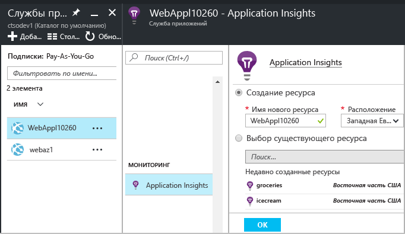
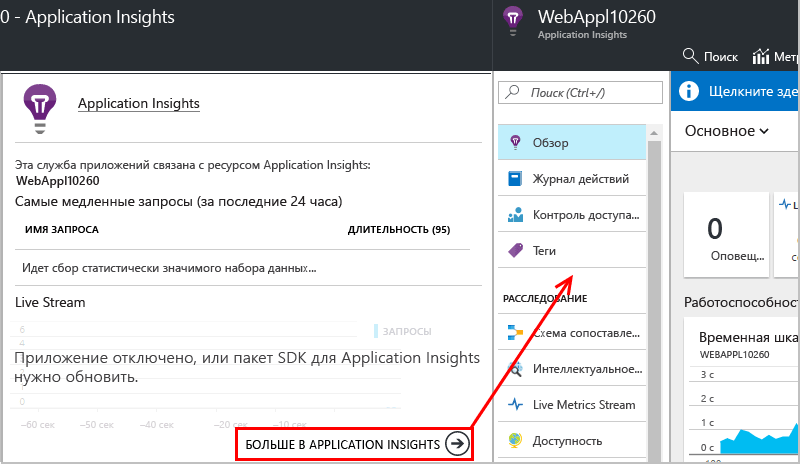

# Инструментирование веб-приложений во время выполнения с помощью Application Insights

Действующее веб-приложение можно инструментировать с помощью Azure Application Insights, не прибегая к изменению или повторному развертыванию кода. Если приложения размещены на локальном сервере IIS, можно установить монитор состояния. Если же используются веб-приложения Azure или приложения, запущенные на виртуальной машине Azure, можно установить расширение Application Insights. (См. статьи об инструментировании [динамических веб-приложений J2EE](app-insights-java-live.md) и [облачных служб Azure](app-insights-cloudservices.md).) Вам потребуется подписка [Microsoft Azure](http://azure.com) .

Вы можете выбрать один из трех указанных ниже вариантов применения Application Insights для веб-приложений .NET.

* **Во время сборки.** [Добавьте пакет SDK для Application Insights][greenbrown] в код своего веб-приложения.
* **Во время выполнения.** Инструментируйте веб-приложение на сервере, как описано ниже, без повторной сборки и развертывания кода.
* **Оба варианта.** Включите пакет SDK в код веб-приложения и примените расширения во время выполнения, чтобы воспользоваться преимуществами двух вариантов.

Ниже представлено общее сравнение предлагаемых вариантов.

|  | Во время сборки | Во время выполнения |
| --- | --- | --- |
| Запросы и исключения |Да |Да |
| [Более подробные исключения](app-insights-asp-net-exceptions.md) | |Да |
| [Диагностика зависимостей](app-insights-asp-net-dependencies.md) |На платформе .NET 4.6 или более поздней, неполные сведения |Да, полные сведения: коды результатов, текст команд SQL, HTTP-команда|
| [Счетчики производительности системы](app-insights-performance-counters.md) |Да |Да |
| [API для пользовательской телеметрии][api] |Да | |
| [Интеграция журнала трассировки](app-insights-asp-net-trace-logs.md) |Да | |
| [Просмотр страницы и пользовательские данные](app-insights-javascript.md) |Да | |
| Повторная сборка кода не требуется |Нет | |

## Мониторинг активного веб-приложения Azure

Если приложение выполняется как веб-служба Azure, переключиться на мониторинг можно следующим способом:

* Щелкните Application Insights на панели управления приложения в Azure.

    
* Когда откроется страница сводки Application Insights, щелкните ссылку внизу, чтобы открыть полный ресурс Application Insights.

    

[Мониторинг облачных приложений и приложений виртуальной машины](app-insights-azure.md).

## Мониторинг активного веб-приложения IIS

Если приложение размещено на сервере IIS, включите Application Insights с помощью монитора состояний.

1. Войдите на веб-сервер IIS с учетными данными администратора.
2. Если монитор состояний Application Insights еще не установлен, скачайте и запустите [установщик монитора состояний](http://go.microsoft.com/fwlink/?LinkId=506648).
3. В мониторе состояний выберите установленное веб-приложение или веб-сайт, который требуется отслеживать. Выполните вход с использованием учетных данных Azure.

    Настройте ресурс, в котором должны отображаться результаты на портале Application Insights. (Как правило, проще всего создать ресурс. Выберите имеющийся ресурс, если у вас уже есть [веб-тесты][availability] или [наблюдение за клиентами][client] для этого приложения.) 

    

4. Перезапустите IIS.

    

    Работа вашей веб-службы будет ненадолго прервана.

## Настройка параметров мониторинга

Если включить Application Insights, в веб-приложение будут добавлены библиотеки DLL и файл ApplicationInsights.config. Вы можете [отредактировать CONFIG-файл](app-insights-configuration-with-applicationinsights-config.md), чтобы изменить некоторые параметры.

## При повторной публикации приложения необходимо повторно включить Application Insights

Прежде чем повторно опубликовать приложение, необходимо [добавить Application Insights в код в Visual Studio][greenbrown]. Вы получите более подробные данные телеметрии и возможность написать пользовательскую телеметрию.

Если вы хотите повторно опубликовать приложение, не добавляя Application Insights в код, имейте в виду, что в процессе развертывания библиотеки DLL и файл ApplicationInsights.config могут быть удалены из опубликованного веб-сайта. Таким образом:

1. При редактировании файла ApplicationInsights.config сделайте его копию, прежде чем повторно опубликовать приложение.
2. Повторно опубликуйте приложение.
3. Повторно включите мониторинг Application Insights. (Используйте подходящий способ: панель управления веб-приложением Azure или монитор состояния на узле IIS.)
4. Восстановите изменения, внесенные в CONFIG-файл.

## Устранение неполадок конфигурации среды выполнения Application Insights

### Проблемы с подключением? Отсутствие данных телеметрии

* Чтобы монитор состояний мог работать, в брандмауэре сервера необходимо открыть [некоторые исходящие порты](app-insights-ip-addresses.md#outgoing-ports) .

* Откройте монитор состояний и на левой панели выберите свое приложение. Проверьте, не появились ли в разделе "Уведомления о конфигурации» сообщения с диагностическими сведениями для этого приложения:

  
* Если на сервере отображается сообщение "Недостаточно разрешений", выполните следующее:
  * В диспетчере IIS выберите свой пул приложений, откройте **Дополнительные параметры** и в разделе **Модель процесса** скопируйте значение параметра "Идентификация".
  * На панели управления компьютера добавьте это значение к группе пользователей монитора производительности.
* Если на вашем сервере установлен MMA/SCOM, некоторые версии могут конфликтовать. Удалите SCOM и монитор состояний и повторно установите последние версии.
* Ознакомьтесь с разделом [Устранение неполадок][qna].

## Требования к системе
Операционные системы, которые поддерживаются для монитора состояний Application Insights на сервере:

* Windows Server 2008
* Windows Server 2008 R2
* Windows Server 2012
* Windows Server 2012 R2.
* Windows Server 2016

На них должны быть установлены последний пакет обновления и платформа .NET Framework 4.5.

На клиентских компьютерах должна быть установлена ОС Windows 7, 8, 8.1 или 10 с платформой .NET Framework 4.5.

Поддерживаются такие версии IIS: 7, 7.5, 8, 8.5 (IIS – обязательный компонент).

## Автоматизация с помощью PowerShell
Мониторинг можно запускать и останавливать с помощью PowerShell на сервере IIS.

Сначала импортируйте модуль Application Insights:

`Import-Module 'C:\Program Files\Microsoft Application Insights\Status Monitor\PowerShell\Microsoft.Diagnostics.Agent.StatusMonitor.PowerShell.dll'`

Узнайте, какие приложения отслеживаются:

`Get-ApplicationInsightsMonitoringStatus [-Name appName]`

* `-Name` (необязательный параметр) — имя веб-приложения.
* Отображает состояние мониторинга Application Insights для каждого веб-приложения (или именованного приложения) на этом сервере IIS.
* Возвращает `ApplicationInsightsApplication` для каждого приложения.

  * `SdkState==EnabledAfterDeployment`: приложение отслеживается. Оно инструментировано во время выполнения с помощью монитора состояния или командлета `Start-ApplicationInsightsMonitoring`.
  * `SdkState==Disabled`: приложение не инструментировано для Application Insights. Оно либо никогда не было инструментировано, либо мониторинг во время выполнения был отключен с помощью монитора состояния или командлета `Stop-ApplicationInsightsMonitoring`.
  * `SdkState==EnabledByCodeInstrumentation`: приложение инструментировано путем добавления пакета SDK в исходный код. Этот пакет SDK нельзя обновить или остановить.
  * `SdkVersion` — отображает версию, которая используется для мониторинга этого приложения.
  * `LatestAvailableSdkVersion`— отображает версию, доступную сейчас в коллекции NuGet. Чтобы обновить приложение до этой версии, используйте командлет `Update-ApplicationInsightsMonitoring`.

`Start-ApplicationInsightsMonitoring -Name appName -InstrumentationKey 00000000-000-000-000-0000000`

* `-Name` — имя приложения на сервере IIS.
* `-InstrumentationKey` — ключ инструментирования ресурса Application Insights, в котором должны отображаться результаты.
* Этот командлет влияет только на приложения, которые еще не инструментированы, то есть SdkState==NotInstrumented.

    Командлет не влияет на приложение, которое уже было инструментировано путем добавления пакета SDK в код во время сборки или с использованием этого же командлета ранее во время выполнения.

    Версия пакета SDK для инструментирования приложения — это последняя версия, загруженная на этот сервер.

    Чтобы загрузить последнюю версию, используйте командлет Update-ApplicationInsightsVersion.
* В случае успешного выполнения возвращает `ApplicationInsightsApplication` . В случае сбоя трассировка записывается в stderr.

          Name                      : Default Web Site/WebApp1
          InstrumentationKey        : 00000000-0000-0000-0000-000000000000
          ProfilerState             : ApplicationInsights
          SdkState                  : EnabledAfterDeployment
          SdkVersion                : 1.2.1
          LatestAvailableSdkVersion : 1.2.3

`Stop-ApplicationInsightsMonitoring [-Name appName | -All]`

* `-Name` — имя приложения на сервере IIS.
* `-All` — останавливает мониторинг всех приложений на этом сервере IIS, для которых `SdkState==EnabledAfterDeployment`.
* Останавливает мониторинг для указанных приложений и удаляет инструментирование. Применимо только для приложений, инструментированных во время выполнения с использованием монитора состояния или командлета Start-ApplicationInsightsApplication. (`SdkState==EnabledAfterDeployment`)
* Возвращает ApplicationInsightsApplication.

`Update-ApplicationInsightsMonitoring -Name appName [-InstrumentationKey "0000000-0000-000-000-0000"`]

* `-Name` — имя веб-приложения на сервере IIS.
* `-InstrumentationKey` (необязательный параметр). используется для изменения ресурса, в который отправляются данные телеметрии приложения.
* Этот командлет:
  * Обновляет именованное приложение до последней версии пакета SDK, загруженной на этот компьютер (работает, только если `SdkState==EnabledAfterDeployment`).
  * Если указан ключ инструментирования, именованное приложение повторно настраивается для отправки данных телеметрии в ресурс с этим ключом (работает, если `SdkState != Disabled`).

`Update-ApplicationInsightsVersion`

* Загружает последний пакет SDK для Application Insights на сервер.

## Дальнейшие действия

Просмотр телеметрии:

* [Изучите метрики](app-insights-metrics-explorer.md), чтобы отслеживать производительность и использование.
* [Выполняйте поиск событий и журналов][diagnostic] для диагностики неполадок.
* [Аналитика](app-insights-analytics.md) для создания расширенных запросов.
* [Создайте панели мониторинга](app-insights-dashboards.md)

Добавление данных телеметрии:

* [Создайте веб-тесты][availability], чтобы убедиться, что ваш сайт продолжает работать.
* [Добавьте телеметрию веб-клиента][usage], чтобы просматривать исключения в коде веб-страницы и вставлять вызовы трассировки.
* [Добавьте пакет SDK для Application Insights в код][greenbrown], чтобы иметь возможность вставлять вызовы трассировки и журналов.

<!--Link references-->

[api]: app-insights-api-custom-events-metrics.md
[availability]: app-insights-monitor-web-app-availability.md
[client]: app-insights-javascript.md
[diagnostic]: app-insights-diagnostic-search.md
[greenbrown]: app-insights-asp-net.md
[qna]: app-insights-troubleshoot-faq.md
[roles]: app-insights-resources-roles-access-control.md
[usage]: app-insights-web-track-usage.md

<!--HONumber=Feb17_HO2-->

