<properties
	pageTitle="Диагностика проблем производительности на работающем веб-сайте IIS | Microsoft Azure"
	description="Мониторинг производительности веб-сайта без необходимости его повторного развертывания. Для получения телеметрии зависимостей используйте автономно или с пакетом SDK для Application Insights."
	services="application-insights"
    documentationCenter=".net"
	authors="alancameronwills"
	manager="douge"/>

<tags
	ms.service="application-insights"
	ms.workload="tbd"
	ms.tgt_pltfrm="ibiza"
	ms.devlang="na"
	ms.topic="get-started-article"
	ms.date="09/23/2015"
	ms.author="awills"/>

# Установка монитора состояний Application Insights для мониторинга производительности веб-сайта

*Доступна только предварительная версия Application Insights.*

C помощью монитора состояний Visual Studio Application Insights можно диагностировать исключения и проблемы производительности в приложениях ASP.NET.

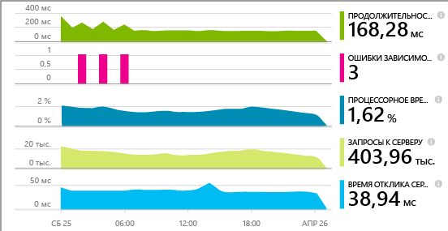

> [AZURE.TIP]Существуют отдельные статьи об инструментировании [динамических веб-приложений J2EE](app-insights-java-live.md) и [облачных служб Azure](app-insights-cloudservices.md).

Вы можете выбрать один из трех указанных ниже вариантов применения Application Insights для веб-приложений IIS.

* **Во время сборки.** [Добавьте пакет SDK для Application Insights][greenbrown] в код вашего веб-приложения и вы получите следующие преимущества:
 * Комплексная стандартная телеметрия диагностики и использования.
 * Благодаря [API Application Insights][api] вы можете написать собственную систему телеметрии для отслеживания подробных сведений об использовании или диагностики проблем.
* **Во время выполнения.** Используйте монитор состояний для инструментирования веб-приложения на сервере.
 * Мониторинг уже запущенных веб-приложений. При этом нет необходимости повторно их создавать или публиковать.
 * Комплексная стандартная телеметрия диагностики и использования.
 * Диагностика зависимостей. Получайте информацию об ошибках и низкой производительности приложения во время использования других компонентов, таких как базы данных, REST API или другие службы.
 * Устранение неполадок телеметрии.
* **Во время выполнения и во время сборки.** Выполните компиляцию пакета SDK в коде вашего веб-приложения и запустите монитор состояний на веб-сервере. Вы получаете следующие преимущества обоих способов:
 * Стандартная телеметрия диагностики и использования.
 * Диагностика зависимостей.
 * C помощью этого API вы можете написать пользовательскую систему телеметрии.
 * Устранение неполадок, связанных с пакетом SDK и телеметрией.

## Установка монитора состояний Application Insights

Вам потребуется подписка на [Microsoft Azure](http://azure.com).

### Если приложение выполняется на сервере IIS

1. Войдите на веб-сервер IIS с учетными данными администратора.
2. Скачайте и запустите [установщик монитора состояний](http://go.microsoft.com/fwlink/?LinkId=506648).
4. В мастере установки выполните вход в Microsoft Azure.

    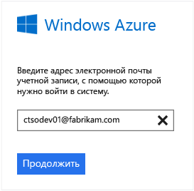

    *Возникли ошибки подключения? См. раздел [Устранение неполадок](#troubleshooting).*

5. Выберите установленное веб-приложение или веб-сайт для мониторинга и настройте ресурс, где вы будете просматривать результаты на портале Application Insights.

    

    Как правило, необходимо настроить новый ресурс и [группу ресурсов][roles].

    В противном случае используйте существующий ресурс, если для вашего сайта уже настроены [веб-тесты][availability] или [система мониторинга веб-клиентов][client].

6. Перезапустите IIS.

    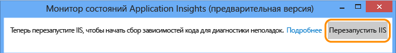

    Работа вашей веб-службы будет ненадолго прервана.

6. Обратите внимание, что в веб-приложения, для которых планируется мониторинг, вставлен файл ApplicationInsights.config.

    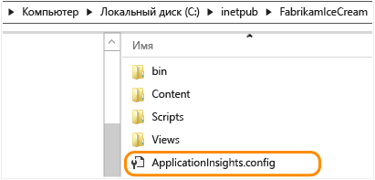

   Также некоторые изменения вносятся в файл web.config.

#### Необходимо выполнить настройку позднее?

После завершения работы мастера можно в любое время выполнить повторную настройку агента. Это можно использовать и в том случае, если агент был установлен, но на начальном этапе возникли какие-либо проблемы.

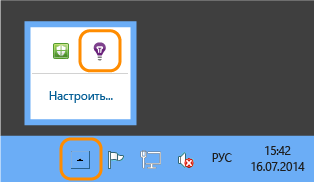

### Если приложение выполняется в качестве веб-приложения Azure

На панели управления веб-приложения Azure добавьте расширение Application Insights.

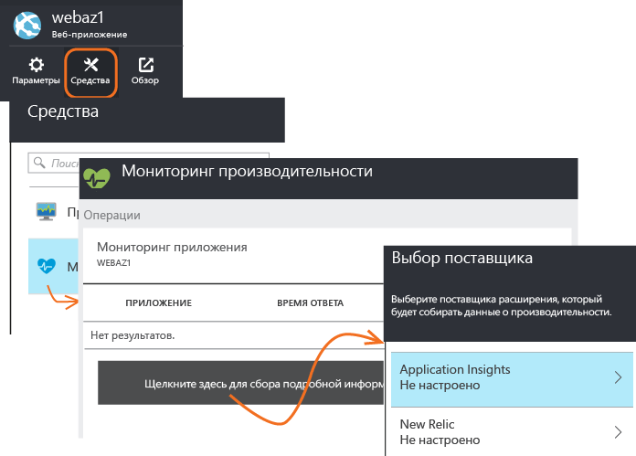

### Если это проект облачной службы Azure

[Добавьте сценарии в веб-роли и рабочие роли](app-insights-cloudservices.md).

## Просмотр телеметрии производительности

Войдите на [портал предварительной версии Azure](http://portal.azure.com), перейдите в Application Insights и откройте созданный ресурс.

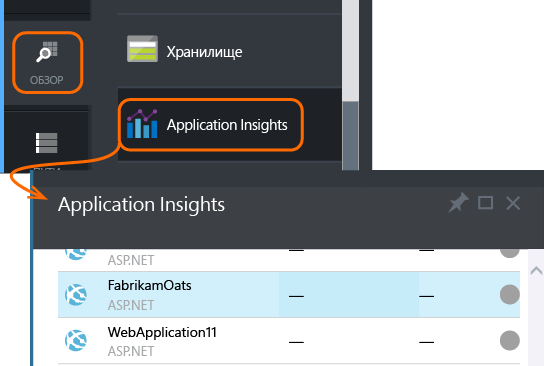

Откройте колонку "Производительность", чтобы отобразить сведения о запросе, времени отклика, зависимости и другие данные.

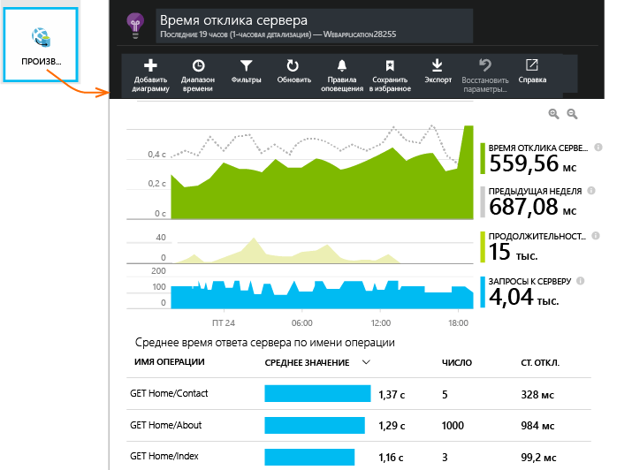

Щелкните, чтобы изменить отображаемые сведения или добавить новую диаграмму.

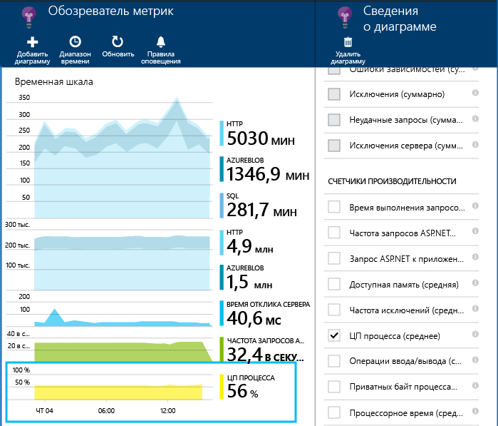

## Зависимости

На диаграмме длительности зависимостей отображается время, потраченное на выполнение вызовов вашего приложения к внешним компонентам, например базам данных, REST API или хранилищу больших двоичных объектов Azure.

Для сегментирования диаграммы по вызовам и различным зависимостям выберите необходимую диаграмму, включите функцию группирования, а затем выберите пункт "Зависимость", "Тип зависимости" или "Производительность зависимости".

Кроме того, можно отфильтровать диаграмму, чтобы отобразить определенный сегмент зависимости, типа или производительности. Щелкните "Фильтры".

#### Счетчики производительности

(Не предназначено для веб-приложений Azure.) В колонке обзора щелкните "Серверы", чтобы отобразить диаграммы счетчиков производительности серверов, например счетчиков использования ресурсов ЦП и памяти.

Добавьте новую диаграмму или щелкните любую имеющуюся, чтобы изменить отображаемые ею значения.

Кроме того, вы можете [изменить набор счетчиков производительности, данные которых передает пакет SDK](app-insights-configuration-with-applicationinsights-config.md#nuget-package-3).

#### Исключения

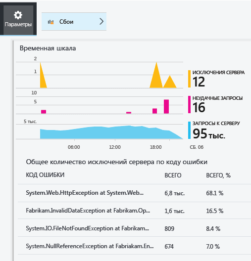

Вы можете подробно рассмотреть конкретные исключения (за последние семь дней) и получить данные трассировки стека и контекста.

## Устранение неполадок

### Ошибки подключения

Чтобы монитор состояний мог работать, необходимо открыть некоторые исходящие порты в брандмауэре сервера:

+ Телеметрия — необходимы постоянно:
 +	`dc.services.visualstudio.com:80`
 +	`f5.services.visualstudio.com:80`
 +	`dc.services.visualstudio.com:443`
 +	`f5.services.visualstudio.com:443`
 +	`dc.services.vsallin.net:443`
+ Конфигурация — необходимы только для внесения изменений:
 -	`management.core.windows.net:443`
 -	`management.azure.com:443`
 -	`login.windows.net:443`
 -	`login.microsoftonline.com:443`
 -	`secure.aadcdn.microsoftonline-p.com:443`
 -	`auth.gfx.ms:443`
 -	`login.live.com:443`
+ Установка:
 +	`packages.nuget.org:443`
 +	`appinsightsstatusmonitor.blob.core.windows.net:80`

Время от времени этот список может меняться.

### Отсутствие данных телеметрии

  * С помощью своего сайта создайте данные.
  * Подождите несколько минут, пока поступят данные, а затем щелкните **Обновить**.
  * Чтобы просмотреть отдельные события, откройте поиск по журналу диагностики, щелкнув плитку "Поиск". События часто отображаются в поле поиска по журналу диагностики перед появлением статистических данных на диаграммах.
  * Откройте монитор состояний и на левой панели выберите свое приложение. Проверьте, не появились ли в разделе "Уведомления о конфигурации» сообщения с диагностическими сведениями для этого приложения:

  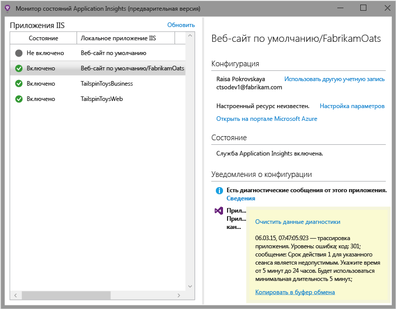

  * Убедитесь, что брандмауэр сервера пропускает исходящий трафик через перечисленные выше порты.
  * Если на сервере отображается сообщение "Недостаточно разрешений", выполните следующее:
    * В диспетчере IIS выберите ваш пул приложений, откройте **Дополнительные параметры** и в разделе **Модель процесса** скопируйте значение параметра "Идентификация".
    * На панели управления компьютера добавьте это значение к группе пользователей монитора производительности.
  * Если на вашем сервере установлен MMA/SCOM, некоторые версии могут конфликтовать. Удалите SCOM и монитор состояний и повторно установите последние версии.
  * См. раздел [Устранение неполадок][qna].

## Требования к системе

Операционные системы, которые поддерживаются для монитора состояний Application Insights на сервере:

- Windows Server 2008
- Windows Server 2008 R2
- Windows Server 2012
- Windows Server 2012 R2.

На них должны быть установлены последний пакет обновления и платформа .NET Framework 4.0 и 4.5.

На клиентских компьютерах должна быть установлена ОС Windows 7, 8 или 8.1 с платформой .NET Framework 4.0 и 4.5.

Поддерживаются такие версии IIS: 7, 7.5, 8, 8.5 (IIS – обязательный компонент).

## Дальнейшие действия

* [Создайте веб-тесты][availability], чтобы убедиться, что ваш сайт продолжает работать.
* [Поиск событий и журналов][diagnostic] для диагностики неполадок.
* [Добавьте телеметрию веб-клиента][usage], чтобы просматривать исключения в коде веб-страницы и вставлять вызовы трассировки.
* [Добавьте пакет SDK для Application Insights в код веб-службы][greenbrown], чтобы иметь возможность вставлять вызовы трассировки и журналов в серверный код.

## Видео

#### Мониторинг производительности

[AZURE.VIDEO app-insights-performance-monitoring]

<!--Link references-->

[api]: app-insights-api-custom-events-metrics.md
[availability]: app-insights-monitor-web-app-availability.md
[client]: app-insights-javascript.md
[diagnostic]: app-insights-diagnostic-search.md
[greenbrown]: app-insights-start-monitoring-app-health-usage.md
[qna]: app-insights-troubleshoot-faq.md
[roles]: app-insights-resources-roles-access-control.md
[usage]: app-insights-web-track-usage.md

<!---HONumber=Oct15_HO4-->