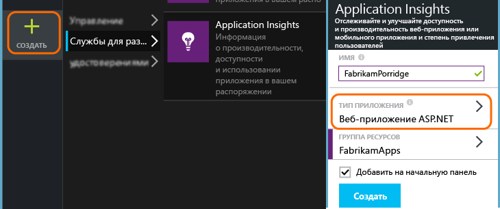
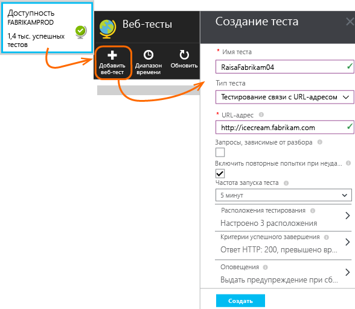
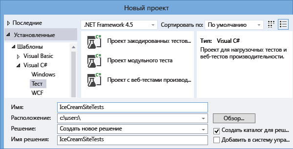
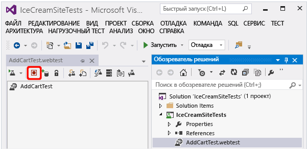
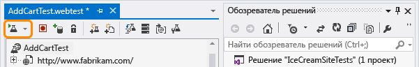
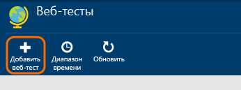
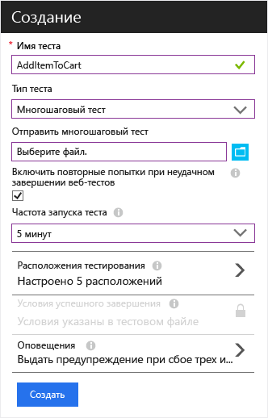
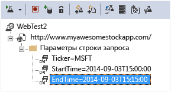
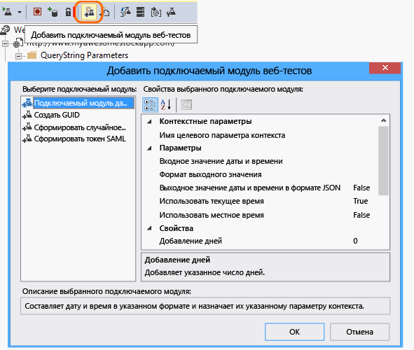
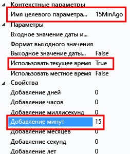

# Наблюдение за доступностью и скоростью реагирования веб-сайта
Развернув веб-приложение или веб-сайт на любом сервере, вы можете настроить тесты для наблюдения за его доступностью и скоростью реагирования. [Azure Application Insights](app-insights-overview.md) отправляет веб-запросы через одинаковые промежутки времени из разных точек по всему миру. Эта надстройка предупреждает вас, если приложение реагирует медленно или не реагирует вообще.

Вы можете настроить тесты доступности для любой конечной точки HTTP или HTTPS, доступной из Интернета. На тестируемый веб-сайт не нужно ничего добавлять. Этот сайт даже может принадлежать кому-то другому. Вы можете протестировать службу REST API, от которой зависит ваш сайт.

Существует два вида тестов доступности:

* [Тест проверки связи с URL-адресом](#create)– простой тест, который вы можете создать на портале Azure.
* [Многошаговый веб-тест](#multi-step-web-tests) — тест, который вы создаете в Visual Studio Enterprise и загружаете на портал.

Для одного ресурса приложения можно создать не более 100 тестов доступности.

> [!NOTE] 
> * Недавно тесты доступности были перемещены в центры обработки данных Azure. Благодаря этому переходу мы сможем добавлять расположения за счет растущей сети центров обработки данных Azure.  
> * Вам не нужно обновлять тесты. Все тесты перенесены и выполняются из нового расположения. 
>* Дополнительные сведения см. в записи блога об [обновлении службы](https://blogs.msdn.microsoft.com/applicationinsights-status/2018/01/24/application-insights-availability-monitoring-test-locations-updated/).

## Открытие ресурса для отчетов по тестам доступности

**Если вы уже настроили Application Insights** для веб-приложения, откройте ресурс Application Insights на [портале Azure](https://portal.azure.com).

**Чтобы увидеть отчеты в новом ресурсе**, перейдите на [портал Azure](https://portal.azure.com) и создайте ресурс Application Insights.

Щелкните **Все ресурсы** , чтобы открыть колонку обзора для нового ресурса.

## Создание теста проверки связи с URL-адресом
Откройте колонку "Доступность" и добавьте тест.

* Вы можете указать **URL-адрес** любой веб-страницы, которую требуется протестировать, но он должен быть видимым из общедоступного Интернета. URL-адрес может содержать строку запроса, поэтому вы, например, сможете немного поупражняться в работе с базой данных. Если URL-адрес указывает на перенаправление, мы будем переходить по нему до 10 раз.
* **Анализировать зависимые запросы.** Если этот флажок установлен, изображения, сценарии, файлы стилей и другие файлы, являющиеся частью тестируемых веб-страниц, запрашиваются для теста. Записанное время ответа включает время, затраченное на получение этих файлов. Тест завершается ошибкой, если эти ресурсы не удается загрузить в течение времени ожидания, актуального для всего теста. 

    Если этот флажок не установлен, то тест запросит только файл по указанному URL-адресу.

* **Enable retries** (Разрешить повторные попытки). Если этот флажок установлен, то при неудачном завершении тест будет повторяться через короткие интервалы. Сообщение об ошибке отобразится только после трех неудачных попыток подряд. Последующие тесты будут выполняться с обычной частотой. Повторные попытки будут временно приостановлены до следующей успешной попытки. Это правило действует в любом расположении тестирования. Этот вариант является рекомендуемым. В среднем около 80 % неудачных попыток решаются при повторной попытке.

* **Частота тестирования**: задает частоту выполнения теста из каждого тестового расположения. При стандартной частоте в пять минут и с пятью тестовыми расположениями ваш сайт будет проверяться в среднем каждую минуту.

* **Расположения тестирования** – это места, из которых наши серверы отправляют веб-запросы на ваш URL-адрес. Выберите несколько расположений, чтобы можно было различать проблемы веб-сайта и сетевые проблемы. Вы можете выбрать до 16 таких расположений.

* **Критерии успешного завершения**:

    **Время ожидания теста**: уменьшите значение этого параметра, чтобы получать оповещения о медленных откликах. Тест считается неудачной попыткой, если ответы от сайта не были получены в течение заданного периода. Если выбрать параметр **Анализировать зависимые запросы**, все изображения, файлы стилей, скрипты и другие зависимые ресурсы будут получены в течение этого периода.

    **HTTP-ответ**: возвращаемый код состояния, который считается успешным результатом. Код 200 указывает на возврат нормальной веб-страницы.

    **Совпадение содержимого**: строка, например «Добро пожаловать!». Проверим наличие точного совпадения (с учетом регистра) в каждом ответе. Это должна быть строка обычного текста без подстановочных знаков. Не забывайте, что если контент страницы изменяется, необходимо обновить эту строку.
* **Оповещения** по умолчанию отправляются в случае неудачных попыток в трех расположениях на протяжении 5 минут. Сбой в одном расположении, вероятно, будет вызван проблемой с сетью, а не с сайтом. Но для настройки чувствительности это пороговое значение можно изменить; можно также изменить адресатов, которые получат сообщения по электронной почте.

    Можно настроить вызов [webhook](../monitoring-and-diagnostics/insights-webhooks-alerts.md), активируемый оповещением. (Обратите внимание, что в настоящее время параметры запроса не передаются как свойства.)

### Тестирование дополнительных URL-адресов
Добавьте дополнительные тесты. Например, в дополнение к тестированию домашней страницы можно также проверить, запущена ли база данных, путем тестирования URL-адреса поиска.

## Просмотр результатов теста доступности

Через несколько минут щелкните **Обновить**, чтобы просмотреть результаты теста. 

На точечной диаграмме отобразятся примеры результатов теста со сведениями о этапах диагностического теста. Обработчик тестов хранит сведения о диагностике тестов, которые завершились сбоем. Диагностические сведения об успешно выполненных тестах хранятся для подмножества выполнений. Наведите указатель мыши на любые красные или зеленые точки, чтобы просмотреть метку времени теста, длительность теста, местоположение и его имя. Щелкните любую точку на точечной диаграмме, чтобы просмотреть сведения о результатах теста.  

Выберите конкретный тест, расположение или сократите период времени, чтобы просмотреть дополнительные результаты для нужного периода времени. Используйте обозреватель поиска, чтобы просмотреть результаты всех тестов или воспользуйтесь запросами аналитики, чтобы запустить пользовательские отчеты для этих данных.

Помимо необработанных результатов в обозревателе метрик имеются две метрики доступности: 

1. Доступность. Количество успешно выполненных тестов (в процентах). 
2. Продолжительность теста. Средняя длительность всех тестов.

Вы можете применить фильтры по имени теста или расположению, чтобы проанализировать тенденции конкретного теста и/или местоположения.

##  Изменение и проверка тестов

На странице сводки щелкните конкретный тест. Здесь можно просмотреть определенные результаты, а также изменить или временно отключить тест.

При обслуживании службы может потребоваться отключить тесты доступности или правила оповещения, связанные с ними. 

## При возникновении сбоев
Щелкните красную точку.

С помощью результатов тестов доступности можно сделать следующее:

* изучить ответ, полученный от сервера;
* диагностировать сбой на основе телеметрии на стороне сервера, собранной во время обработки экземпляра запроса, завершившегося сбоем;
* добавить в журнал проблему или зарегистрировать рабочий элемент в Git или VSTS для отслеживания проблемы; ошибка будет содержать ссылку на это событие;
* открыть результат веб-теста в Visual Studio.

*Кажется, что все работает правильно, но выдается отчет об ошибке?* Чтобы узнать о способах снижения шума, перейдите к [часто задаваемым вопросам](#qna).

> [!TIP]
> Для надежного мониторинга рекомендуем протестировать по крайней мере 2 расположения.
>

## Многошаговые веб-тесты
Вы можете отслеживать сценарий, который содержит последовательность URL-адресов. Например, в случае наблюдения за интернет-магазином вы можете проверить, что добавление товаров в корзину работает исправно.

> [!NOTE] 
> За многошаговые веб-тесты взимается плата. См. [таблицу расценок](http://azure.microsoft.com/pricing/details/application-insights/).
> 

Для создания многошагового теста вам сначала нужно записать сценарий с помощью Visual Studio Enterprise, а затем отправить запись в Application Insights. Application Insights периодически воспроизводит сценарий и проверяет ответы.

> [!NOTE]
> * В тестах нельзя использовать запрограммированные функции или циклы. Тест должен полностью находиться в WEBTEST-файле скрипта. Однако вы можете использовать стандартные подключаемые модули.
> * В многошаговых веб-тестах поддерживаются только символы английского алфавита. Если вы используете Visual Studio на других языках, обновите файл определения веб-теста, чтобы перевести или исключить символы языков, отличных от английского.
>

#### 1. Запись сценария
Для записи веб-сеанса используйте Visual Studio Enterprise.

1. Создайте проект веб-теста производительности.

    

 * *Отсутствует шаблон с веб-тестами производительности и нагрузочными тестами?* Закройте Visual Studio Enterprise. Откройте **установщик Visual Studio**, чтобы изменить установленные компоненты Visual Studio Enterprise. В разделе **Отдельные компоненты** выберите **Средства для тестирования производительности веб-сайтов и нагрузочного тестирования**.

2. Откройте WEBTEST-файл и начните запись.

    
3. Выполните действия пользователя, которые нужно смоделировать в тесте: откройте веб-сайт, добавьте продукт в корзину и т. д. Затем остановите тест.

    

    Не делайте слишком длинный сценарий. Ограничение — 100 шагов и 2 минуты.
4. Отредактируйте тест, чтобы:

   * Добавить проверки полученного текста и кодов ответов.
   * Удалить все лишние взаимодействия. Вы также можете удалить связанные запросы изображений, запросы к рекламным сайтам или сайтам отслеживания.

     Помните, что редактировать можно только тестовый сценарий — добавлять собственный код и вызывать другие веб-тесты нельзя. Не вставляйте в тест циклы. Вы можете использовать стандартные подключаемые модули для веб-тестов.
5. Запустите тест в Visual Studio и убедитесь, что он работает.

    Средство выполнения веб-тестов откроет веб-браузер и повторит записанные действия. Убедитесь, что тест работает правильно.

    

#### 2. Загрузка веб-теста в Application Insights
1. Создайте веб-тест на портале Application Insights.

    
2. Выберите многошаговый тест и загрузите WEBTEST-файл.

    

    Установите для тестовых местоположений, частоты и параметров оповещения те же значения, что и для проверок связи.

#### 3. Просмотр результатов

Просмотр результатов теста и всех ошибок выполняется так же, как и для тестов с одним URL.

Кроме того, можно скачать результаты теста, чтобы просмотреть их в Visual Studio.

#### Слишком много ошибок?

* Распространенной причиной ошибок является слишком большое время выполнения теста. Тест должен выполняться не более двух минут.

* Помните, что для успешного завершения теста на страницу должны корректно загрузиться все ресурсы, в том числе сценарии, таблицы стилей, изображения и т. д.

* Веб-тест должен полностью содержаться в WEBTEST-файле скрипта: в тесте нельзя использовать запрограммированные функции.

### Вставка времени и случайных чисел в многошаговый тест
Предположим, что вы тестируете инструмент, который получает зависящие от времени данные (например, запасы) от внешнего источника. При записи веб-теста необходимо использовать определенные значения времени, но они должны быть заданы как параметры теста StartTime и EndTime.

При запуске теста параметру EndTime следует всегда присваивать текущее время, а параметру StartTime – время за 15 минут до текущего.

Подключаемые модули веб-теста позволяют параметризовать время.

1. Добавьте подключаемые модули веб-теста для всех необходимых значений переменных параметров. На панели инструментов веб-теста выберите **Добавить подключаемый модуль веб-теста**.

    

    В этом примере используется два экземпляра подключаемого модуля даты и времени. Для первого экземпляра будет задано время за 15 минут до текущего, а для второго — текущее время.
2. Откройте свойства каждого подключаемого модуля. Присвойте ему имя и настройте его для использования текущего времени. Для одного из экземпляров задайте для параметра "Добавление минут" значение "-15".

    
3. В параметрах веб-теста используйте {{имя подключаемого модуля}} для ссылки на имя подключаемого модуля.

    

Теперь можно передать тест на портал. Он использует динамические значения при каждом тестировании.

## Работа с входом
Если пользователи входят в приложение, вы можете протестировать страницы входа, используя несколько способов имитации входа. Выбор подхода зависит от типа безопасности в приложении.

Во всех случаях учетную запись в приложении следует создавать только для целей тестирования. По возможности ограничьте разрешения для этой тестовой учетной записи, чтобы веб-тесты не доставляли неудобств реальным пользователям.

### Простое имя пользователя и пароль
Запишите веб-тест обычным образом. Сначала удалите файлы cookie.

### Проверка подлинности SAML
Используйте подключаемый модуль SAML, доступный для веб-тестов.

### Секрет клиента
Если в приложении предусмотрен маршрут входа с использованием секрета клиента, используйте этот маршрут. Azure Active Directory (AAD) — это пример службы, в которой доступен вход в систему с использованием секрета клиента. В AAD секрет клиента — это ключ приложения.

Ниже приведен пример веб-теста веб-приложения Azure с использованием ключа приложения.

1. Получите токен из Azure AD с помощью секрета клиента (AppKey).
2. Извлеките токен носителя из ответа.
3. Вызовите интерфейс API, используя токен носителя в заголовке авторизации.

Убедитесь, что веб-тест является фактическим клиентом, т. е. у него есть собственное приложение в AAD, и используйте его значения clientId и appkey. У тестируемой службы также есть собственное приложение в AAD: универсальный код ресурса URI appID этого приложения содержится в веб-тесте в поле resource.

### Открытая проверка подлинности
Пример открытой проверки подлинности — это вход с помощью учетной записи Майкрософт или Google. Многие приложения, использующие OAuth, предоставляют альтернативный вариант с использованием секрета клиента, поэтому сначала стоит попробовать эту возможность.

Если в вашем тесте должен выполняться вход с использованием OAuth, общий порядок действий таков:

* Проверьте трафик между веб-браузером, сайтом проверки подлинности и приложением при помощи Fiddler или аналогичного средства.
* Выполните вход несколько раз с разных компьютеров или из разных браузеров либо через большие промежутки времени (чтобы истек срок действия маркеров).
* Сравнивая различные сеансы, определите маркер, возвращаемый с сайта проверки подлинности, который затем передается на сервер приложения после входа.
* Запишите веб-тест с помощью Visual Studio.
* Параметризуйте маркеры, задав параметр при возврате маркера из структуры проверки подлинности и использовав его в запросе к сайту.
  (Visual Studio попытается параметризовать тест, но не сможет правильно параметризовать маркеры).

## Тесты производительности
Вы можете выполнить на своем веб-сайте нагрузочный тест. Как и при проверке доступности, вы можете отправлять простые или многошаговые запросы из точек по всему миру. В отличие от теста доступности, отправляется много запросов, что имитирует несколько одновременно работающих пользователей.

В колонке "Обзор" выберите **Параметры** и **Тесты производительности**. При создании теста вам будет предложено подключиться к учетной записи служб Visual Studio Team Services или создать ее.

По завершении теста на экране отобразится время ответа и число успешных попыток.

> [!TIP]
> Чтобы увидеть результаты теста производительности, используйте [Live Stream](app-insights-live-stream.md) и [профилировщик](app-insights-profiler.md).
>

## Служба автоматизации
* [Используйте сценарии PowerShell, чтобы настройка теста доступности](app-insights-powershell.md#add-an-availability-test) выполнялась автоматически.
* Настройте вызов [webhook](../monitoring-and-diagnostics/insights-webhooks-alerts.md), активируемый оповещением.

## Вопросы? Проблемы?
* *Периодические сбои тестирования и ошибка с уведомлением о нарушении протокола.*

    Ошибка ("нарушение протокола...За возвратом каретки должен следовать перевод строки") свидетельствует о возможной неполадке с сервером (или зависимостями). Такое происходит, когда в ответе задаются неправильно сформированные заголовки. Это может быть вызвано подсистемами балансировки нагрузки или сетями доставки содержимого (CDN). В частности, некоторые заголовки могут не использовать CRLF для указания конца строки, что нарушает спецификацию протокола HTTP и, следовательно, приводит к сбою во время проверки на уровне WebRequest .NET. Проверьте, есть ли в ответе заголовки, содержащие нарушение.
    
    Примечание. При переходе по URL-адресу в браузерах, для которых установлена упрощенная проверка заголовков HTTP, может не произойти сбой. См. подробное описание проблемы в этой записи блога: http://mehdi.me/a-tale-of-debugging-the-linkedin-api-net-and-http-protocol-violations/  
* *Сайт выглядит правильно, но возникают сбои тестирования.*

    * Проверьте все изображения, скрипты, таблицы стилей и любые другие файлы, загружаемые на страницу. Если не удается загрузить какой-либо компонент, отчет о тесте выдаст ошибку, даже если главная HTML-страница загружается правильно. Чтобы тестирование не зависело от таких сбоев ресурсов, просто снимите флажок "Разбирать зависимые запросы" в конфигурации тестирования. 

    * Чтобы уменьшить вероятность возникновения помех из-за нестабильной работы сети и т. д., установите параметр "Enable retries for test failures" (Выполнять повторные попытки при сбое тестирования). Вы также можете выполнять тестирование из любого расположения и соответствующим образом управлять пороговым значением правила генерации оповещений для предотвращения проблем с конкретными расположениями, вызывающих ненужные оповещения.
    
* *Я не вижу данные телеметрии на стороне связанного сервера и не могу диагностировать сбои тестирований.*
    
    Если служба Application Insights настроена для серверного приложения, возможно, это произошло из-за [выборки](app-insights-sampling.md) в операции.
* *Можно ли вызывать код из моего веб-теста?*

    Нет. Действия теста должны находиться в WEBTEST-файле. Кроме того, нельзя вызывать другие веб-тесты и использовать циклы. Но есть несколько подключаемых модулей, которые могут оказаться полезными.
* *Поддерживается ли протокол HTTPS?*

    Мы поддерживаем TLS 1.1 и TLS 1.2.
* *Есть ли разница между понятиями "веб-тесты" и "тесты доступности"?*

    Эти два термина могут быть взаимозаменяемыми. Тест доступности является более универсальным термином, так как кроме многошаговых веб-тестов вам доступны проверка связи с отдельным URL-адресом.
* *Мне нужно использовать тесты доступности на нашем внутреннем сервере, который работает за брандмауэром.*

    Есть два возможных решения:
    
    * Разрешите в брандмауэре входящие запросы с [IP-адресов агентов веб-тестирования](app-insights-ip-addresses.md).
    * Напишите собственный код для периодической проверки внутреннего сервера. Запустите код в виде фонового процесса на тестовом сервере за брандмауэром. Процесс тестирования может отправлять результаты в Application Insights с помощью API [TrackAvailability()](https://docs.microsoft.com/dotnet/api/microsoft.applicationinsights.telemetryclient.trackavailability) в основном пакете SDK. Для этого тестовый сервер должен иметь исходящий доступ к конечной точке приема в Application Insights, что представляет гораздо меньшую угрозу безопасности, чем разрешение входящих запросов. Результаты не будут отображаться в колонках веб-тестов доступности, но будут отображаться как результаты в обозревателе метрик, поиска и анализа.
* *Сбой отправки многошагового веб-теста.*

    Максимальный размер — 300 000.

    Циклы не поддерживаются.

    Ссылки на другие веб-тесты не поддерживаются.

    Источники данных не поддерживаются.
* *Мой многошаговый тест не выполняется.*

    Максимальное количество запросов в тесте — 100.

    Тест будет остановлен, если он выполняется дольше двух минут.
* *Как запустить тест с клиентскими сертификатами?*

    К сожалению, эта возможность не поддерживается.

## Дальнейшие действия
[Поиск по журналу диагностики в Application Insights][diagnostic]

[Устранение неполадок][qna]

[IP-адреса веб-агентов тестирования](app-insights-ip-addresses.md)

<!--Link references-->

[azure-availability]: ../insights-create-web-tests.md
[diagnostic]: app-insights-diagnostic-search.md
[qna]: app-insights-troubleshoot-faq.md
[start]: app-insights-overview.md
