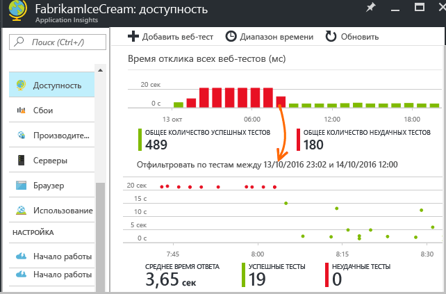
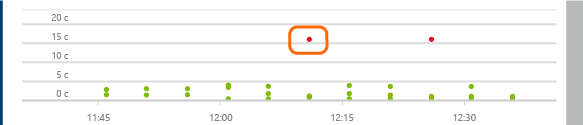
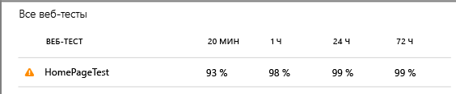
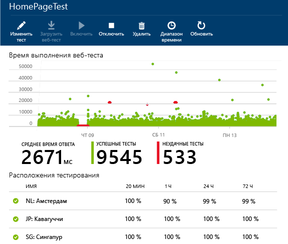
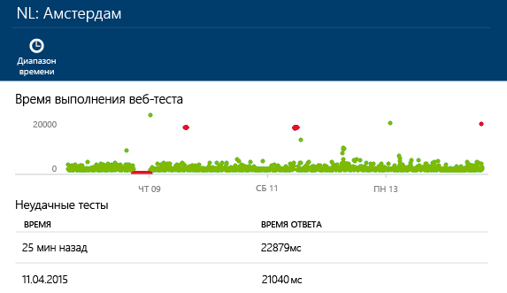
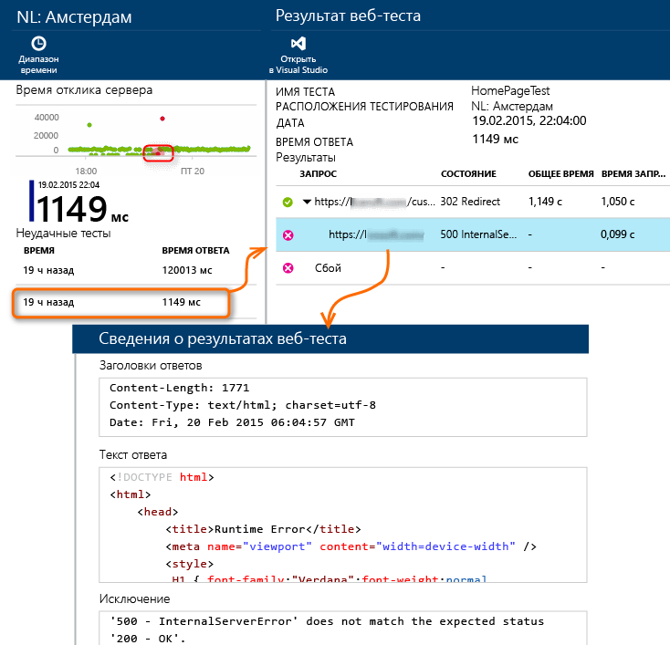

# Наблюдение за доступностью и скоростью реагирования веб-сайта
Развернув веб-приложение или веб-сайт на любом сервере, вы можете настроить веб-тесты для наблюдения за его доступностью и скоростью реагирования. [Azure Application Insights](app-insights-overview.md) отправляет веб-запросы через одинаковые промежутки времени из разных точек по всему миру. Эта надстройка предупреждает вас, если приложение реагирует медленно или не реагирует вообще.

Вы можете настроить веб-тесты для любой конечной точки HTTP или HTTPS, доступной из Интернета. На тестируемый веб-сайт не нужно ничего добавлять. Этот сайт даже может принадлежать кому-то другому. Вы можете протестировать службу REST API, от которой зависит ваш сайт.

Существует два типа веб-тестов:

* [Тест проверки связи с URL-адресом](#create)– простой тест, который вы можете создать на портале Azure.
* [Многошаговый веб-тест](#multi-step-web-tests)– тест, который вы создаете в Visual Studio Ultimate или Visual Studio Enterprise и загружаете на портал.

Для одного ресурса приложения можно создать не более 10 веб-тестов.

## 1. Создание ресурса для тестовых отчетов
Пропустите этот шаг, если вы уже [настроили ресурс Application Insights][start] для этого приложения и хотите, чтобы отчеты о доступности отображались в этом же месте.

Зарегистрируйтесь в [Microsoft Azure](http://azure.com), перейдите на [портал Azure](https://portal.azure.com) и создайте ресурс Application Insights.

Щелкните **Все ресурсы** , чтобы открыть колонку обзора для нового ресурса.

## 2. Создание теста проверки связи с URL-адресом
В ресурсе Application Insights найдите плитку "Доступность". Щелкните ее, чтобы открыть колонку "Веб-тесты" для вашего приложения, и добавьте веб-тест.

* **URL-адрес** должен быть видимым из общедоступного Интернета. Он может содержать строку запроса, поэтому вы, например, сможете немного поупражняться в работе с базой данных. Если URL-адрес указывает на перенаправление, мы будем переходить по нему до 10 раз.
* **Запросы, зависимые от синтаксического анализа**: изображения, сценарии, файлы стилей и другие ресурсы страницы запрашиваются как часть теста. Записанное время ответа включает время ответа этих ресурсов. Тест завершается ошибкой, если эти ресурсы не удается загрузить в течение времени ожидания, актуального для всего теста.
* **Разрешить повторные попытки**: при неудачном завершении тест будет повторяться через короткие интервалы. Сообщение об ошибке отобразится только после трех неудачных попыток подряд. Последующие тесты будут выполняться с обычной частотой. Повторные попытки будут временно приостановлены до следующей успешной попытки. Это правило действует в любом расположении тестирования. (Эта настройка является рекомендуемой. В среднем около 80 % неудачных попыток решаются при повторной попытке.)
* **Частота тестирования**: задает частоту выполнения теста из каждого тестового расположения. При частоте пять минут и с пятью тестовыми расположениями ваш сайт будет проверяться в среднем каждую минуту.
* **Расположения тестирования** – это места, из которых наши серверы отправляют веб-запросы на ваш URL-адрес. Выберите несколько расположений, чтобы можно было различать проблемы веб-сайта и сетевые проблемы. Вы можете выбрать до 16 таких расположений.
* **Критерии успешного завершения**:

    **Время ожидания теста**: уменьшите значение этого параметра, чтобы получать оповещения о медленных откликах. Тест считается неудачной попыткой, если ответы от сайта не были получены в течение заданного периода. Если выбрать параметр **Анализировать зависимые запросы**, все изображения, файлы стилей, скрипты и другие зависимые ресурсы будут получены в течение этого периода.

    **HTTP-ответ**: возвращаемый код состояния, который считается успешным результатом. Код 200 указывает на возврат нормальной веб-страницы.

    **Совпадение содержимого**: строка, например «Добро пожаловать!». Проверим наличие точного совпадения (с учетом регистра) в каждом ответе. Это должна быть строка обычного текста без подстановочных знаков. Не забывайте, что если контент страницы изменяется, необходимо обновить эту строку.
* **Оповещения** по умолчанию отправляются в случае неудачных попыток в трех расположениях на протяжении 5 минут. Сбой в одном расположении, вероятно, будет вызван проблемой с сетью, а не с сайтом. Но для настройки чувствительности это пороговое значение можно изменить; можно также изменить адресатов, которые получат сообщения по электронной почте.

    Можно настроить вызов [webhook](../monitoring-and-diagnostics/insights-webhooks-alerts.md), активируемый оповещением. (Обратите внимание, что в настоящее время параметры запроса не передаются как свойства.)

### Тестирование дополнительных URL-адресов
Добавьте дополнительные тесты. Например, при тестировании домашней страницы можно также проверить, запущена ли база данных, путем тестирования URL-адреса поиска.

## 3. Просмотр результатов веб-теста
Результаты отображаются через 1–2 минуты в колонке "Веб-тест".

Щелкните любой столбец сводной диаграммы, чтобы открыть подробное представление за соответствующий период.

В этих диаграммах приводятся результаты всех веб-тестов данного приложения.

## При возникновении сбоев
Щелкните красную точку.

Либо прокрутите экран вниз и щелкните тест с результатом меньше 100 %.

Отобразятся результаты теста.

Тест проводится из нескольких расположений. Выберите одно, в котором результаты меньше 100 %.

Прокрутите вниз до пункта **Неудачные тесты** и выберите результат.

Щелкните результат, чтобы проанализировать его на портале и просмотреть причину сбоя.

Можно также скачать файл результатов и изучить его в Visual Studio.

*Кажется, что все работает правильно, но выдается отчет об ошибке?*  Проверьте все изображения, скрипты, таблицы стилей и любые другие файлы, загружаемые на страницу. Если не удается загрузить какой-либо компонент, отчет о тесте выдаст ошибку, даже если главная HTML-страница загружается правильно.

### Переход к сведениям о запросе сервера и исключениях

Со страницы подробных свойств конкретного теста можно открыть отчет по запросу сервера и другие события, например исключения.

Связанные элементы могут не отображаться во время процедуры [выборки](app-insights-sampling.md).

## Многошаговые веб-тесты
Вы можете отслеживать сценарий, который содержит последовательность URL-адресов. Например, в случае наблюдения за интернет-магазином вы можете проверить, что добавление товаров в корзину работает исправно.

> [!NOTE] 
> За многошаговые веб-тесты взимается плата. См. [таблицу расценок](http://azure.microsoft.com/pricing/details/application-insights/).
> 

Для создания многошагового теста необходимо записать сценарий с помощью Visual Studio и затем отправить запись в Application Insights. Application Insights периодически воспроизводит сценарий и проверяет ответы.

Обратите внимание, что в тестах нельзя использовать запрограммированные функции: действия сценария в должны содержаться в виде сценария в WEBTEST-файле.

#### 1. Запись сценария
Для записи веб-сеанса используйте Visual Studio Enterprise или Ultimate.

1. Создайте проект веб-теста производительности.

    
2. Откройте WEBTEST-файл и начните запись.

    
3. Выполните действия пользователя, которые нужно смоделировать в тесте: откройте веб-сайт, добавьте продукт в корзину и т. д. Затем остановите тест.

    

    Не делайте слишком длинный сценарий. Ограничение — 100 шагов и 2 минуты.
4. Отредактируйте тест, чтобы:

   * Добавить проверки полученного текста и кодов ответов.
   * Удалить все лишние взаимодействия. Вы также можете удалить связанные запросы изображений, запросы к рекламным сайтам или сайтам отслеживания.

     Помните, что редактировать можно только тестовый сценарий — добавлять собственный код и вызывать другие веб-тесты нельзя. Не вставляйте в тест циклы. Вы можете использовать стандартные подключаемые модули для веб-тестов.
5. Запустите тест в Visual Studio и убедитесь, что он работает.

    Средство выполнения веб-тестов откроет веб-браузер и повторит записанные действия. Убедитесь, что тест работает правильно.

    

#### 2) Загрузка веб-теста в Application Insights
1. Создайте новый веб-тест на портале Application Insights.

    
2. Выберите многошаговый тест и загрузите WEBTEST-файл.

    

    Установите для тестовых местоположений, частоты и параметров оповещения те же значения, что и для проверок связи.

Просмотр результатов теста и всех ошибок выполняется так же, как и для тестов с одним URL.

Распространенной причиной ошибок является слишком большое время выполнения теста. Тест должен выполняться не более двух минут.

Помните, что для успешного завершения теста на страницу должны корректно загрузиться все ресурсы, в том числе сценарии, таблицы стилей, изображения и т. д.

Обратите внимание, что веб-тест должен полностью содержаться в WEBTEST-файле: в тесте нельзя использовать запрограммированные функции.

### Вставка времени и случайных чисел в многошаговый тест
Предположим, что вы тестируете инструмент, который получает зависящие от времени данные (например, запасы) от внешнего источника. При записи веб-теста необходимо использовать определенные значения времени, но они должны быть заданы как параметры теста StartTime и EndTime.

При запуске теста параметру EndTime следует всегда присваивать текущее время, а параметру StartTime – время за 15 минут до текущего.

Подключаемые модули веб-теста позволяют параметризовать время.

1. Добавьте подключаемые модули веб-теста для всех необходимых значений переменных параметров. На панели инструментов веб-теста выберите **Добавить подключаемый модуль веб-теста**.

    

    В этом примере используется два экземпляра подключаемого модуля даты и времени. Для первого экземпляра будет задано время за 15 минут до текущего, а для второго — текущее время.
2. Откройте свойства каждого подключаемого модуля. Присвойте ему имя и настройте его для использования текущего времени. Для одного из экземпляров задайте для параметра "Добавление минут" значение "-15".

    
3. В параметрах веб-теста используйте {{имя подключаемого модуля}} для ссылки на имя подключаемого модуля.

    

Теперь можно передать тест на портал. Он использует динамические значения при каждом тестировании.

## Работа с входом
Если пользователи входят в приложение, вы можете протестировать страницы входа, используя несколько способов имитации входа. Выбор подхода зависит от типа безопасности в приложении.

Во всех случаях учетную запись в приложении следует создавать только для целей тестирования. По возможности ограничьте разрешения для этой тестовой учетной записи, чтобы веб-тесты не доставляли неудобств реальным пользователям.

### Простое имя пользователя и пароль
Запишите веб-тест обычным образом. Сначала удалите файлы cookie.

### Проверка подлинности SAML
Используйте подключаемый модуль SAML, доступный для веб-тестов.

### Секрет клиента
Если в приложении предусмотрен маршрут входа с использованием секрета клиента, используйте этот маршрут. Azure Active Directory (AAD) — это пример службы, в которой доступен вход в систему с использованием секрета клиента. В AAD секрет клиента — это ключ приложения.

Ниже приведен пример веб-теста веб-приложения Azure с использованием ключа приложения.

1. Получите токен из Azure AD с помощью секрета клиента (AppKey).
2. Извлеките токен носителя из ответа.
3. Вызовите интерфейс API, используя токен носителя в заголовке авторизации.

Убедитесь, что веб-тест является фактическим клиентом, т. е. у него есть собственное приложение в AAD, и используйте его значения clientId и appkey. У тестируемой службы также есть собственное приложение в AAD: универсальный код ресурса URI appID этого приложения содержится в веб-тесте в поле resource.

### Открытая проверка подлинности
Пример открытой проверки подлинности — это вход с помощью учетной записи Майкрософт или Google. Многие приложения, использующие OAuth, предоставляют альтернативный вариант с использованием секрета клиента, поэтому сначала стоит попробовать эту возможность.

Если в вашем тесте должен выполняться вход с использованием OAuth, общий порядок действий таков:

* Проверьте трафик между веб-браузером, сайтом проверки подлинности и приложением при помощи Fiddler или аналогичного средства.
* Выполните вход несколько раз с разных компьютеров или из разных браузеров либо через большие промежутки времени (чтобы истек срок действия маркеров).
* Сравнивая различные сеансы, определите маркер, возвращаемый с сайта проверки подлинности, который затем передается на сервер приложения после входа.
* Запишите веб-тест с помощью Visual Studio.
* Параметризуйте маркеры, задав параметр при возврате маркера из структуры проверки подлинности и использовав его в запросе к сайту.
  (Visual Studio попытается параметризовать тест, но не сможет правильно параметризовать маркеры).

##  Изменение или отключение теста
Откройте отдельный тест, чтобы изменить или отключить его.

Отключение веб-тестов может потребоваться при выполнении обслуживания в службе.

## Тесты производительности
Вы можете выполнить на своем веб-сайте нагрузочный тест. Как и при проверке доступности, вы можете отправлять простые или многошаговые запросы из точек по всему миру. В отличие от теста доступности, отправляется много запросов, что имитирует несколько одновременно работающих пользователей.

В колонке "Обзор" выберите **Параметры** и **Тесты производительности**. При создании теста вам будет предложено подключиться к учетной записи служб Visual Studio Team Services или создать ее.

По завершении теста на экране отобразится время ответа и число успешных попыток.

## Автоматизация
* [Используйте сценарии PowerShell, чтобы настройка веб-теста](https://azure.microsoft.com/blog/creating-a-web-test-alert-programmatically-with-application-insights/) выполнялась автоматически.
* Настройте вызов [webhook](../monitoring-and-diagnostics/insights-webhooks-alerts.md), активируемый оповещением.

## Вопросы? Проблемы?
* *Можно ли вызывать код из моего веб-теста?*

    Нет. Действия теста должны находиться в WEBTEST-файле. Кроме того, нельзя вызывать другие веб-тесты и использовать циклы. Но есть несколько подключаемых модулей, которые могут оказаться полезными.
* *Поддерживается ли протокол HTTPS?*

    Мы поддерживаем TLS 1.1 и TLS 1.2.
* *Есть ли разница между понятиями «веб-тесты» и «тесты доступности»?*

    Мы используем эти термины как взаимозаменяемые.
* *Мне нужно использовать тесты доступности на нашем внутреннем сервере, который работает за брандмауэром.*

    Разрешите в брандмауэре запросы с [IP-адресов агентов веб-тестирования](app-insights-ip-addresses.md).
* *Сбой отправки многошагового веб-теста.*

    Максимальный размер — 300 000.

    Циклы не поддерживаются.

    Ссылки на другие веб-тесты не поддерживаются.

    Источники данных не поддерживаются.
* *Мой многошаговый тест не выполняется.*

    Максимальное количество запросов в тесте — 100.

    Тест будет остановлен, если он выполняется дольше двух минут.
* *Как запустить тест с клиентскими сертификатами?*

    К сожалению, эта возможность не поддерживается.

## Видео
> [!VIDEO https://channel9.msdn.com/Series/Application-Insights-on-Azure-Preview-Portal/Monitoring-Availability-with-Application-Insights/player]
>
>

## Дальнейшие действия
[Поиск по журналу диагностики в Application Insights][diagnostic]

[Устранение неполадок][qna]

[IP-адреса веб-агентов тестирования](app-insights-ip-addresses.md)

<!--Link references-->

[azure-availability]: ../insights-create-web-tests.md
[diagnostic]: app-insights-diagnostic-search.md
[qna]: app-insights-troubleshoot-faq.md
[start]: app-insights-overview.md

<!--HONumber=Dec16_HO2-->

