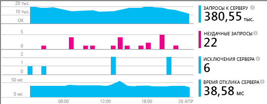
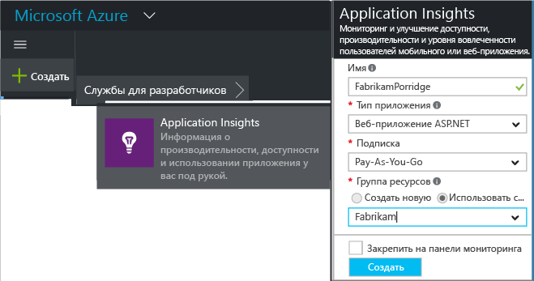
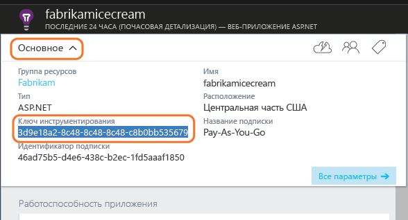
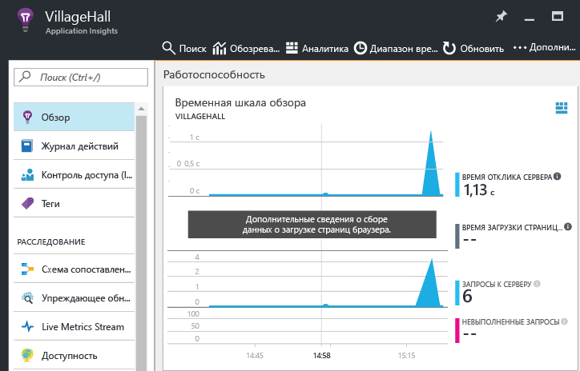

# <a name="add-application-insights-sdk-to-monitor-your-nodejs-app"></a>Добавление пакета SDK Application Insights для отслеживания работы приложения Node.js
*Доступна только предварительная версия Application Insights.*

[Visual Studio Application Insights](app-insights-overview.md) выполняет мониторинг работы действующего приложения, благодаря чему вы можете [обнаруживать и диагностировать проблемы, связанные с производительностью и исключениями](app-insights-detect-triage-diagnose.md), а также [просматривать показатели использования приложения](app-insights-overview-usage.md). Например, с веб-приложениями Azure или приложениями, размещенными на ваших локальных серверах IIS либо виртуальных машинах Azure.

Пакет SDK автоматически собирает сведения о частоте входящих HTTP-запросов и ответы на них, счетчики производительности (ЦП, память, RPS) и необработанные исключения. Кроме того, вы можете добавить настраиваемые вызовы, чтобы отслеживать зависимости, метрики и другие события.



#### <a name="before-you-start"></a>Перед началом работы
Вам необходимы:

* Visual Studio 2013 или более поздняя версия. Чем новее версия, тем лучше.
* подписка на [Microsoft Azure](http://azure.com). Если у вашей группы или организации есть подписка Azure, владелец может добавить вас в нее с помощью вашей [учетной записи Майкрософт](http://live.com).

## <a name="a-nameaddacreate-an-application-insights-resource"></a><a name="add"></a>Создание ресурса Application Insights
Войдите на [портал Azure][portal] и создайте новый ресурс Application Insights. [Ресурс][roles] в Azure — это экземпляр службы. В этом ресурсе будет анализироваться и представляться телеметрия из вашего приложения.



Выберите "Другое" в качестве типа приложения. От выбранного типа приложения зависит содержимое по умолчанию столбцов ресурсов и свойств, отображаемых в [обозревателе метрик][metrics].

#### <a name="copy-the-instrumentation-key"></a>Копирование ключа инструментирования
Ключ идентифицирует ресурс, и вы установите его в пакет SDK для направления данных ресурсу.



## <a name="a-namesdka-install-the-sdk-in-your-application"></a><a name="sdk"></a> Установка пакета SDK в приложении
```
npm install applicationinsights --save
```

## <a name="usage"></a>Использование
Это позволит отслеживать запросы, необработанные подключения и производительность системы (ЦП/память/RPS).

```javascript

var appInsights = require("applicationinsights");
appInsights.setup("<instrumentation_key>").start();
```

Ключ инструментирования можно задать также в переменной среды APPINSIGHTS_INSTRUMENTATIONKEY. В этом случае для вызова `appInsights.setup()` и `appInsights.getClient()` не требуются аргументы.

Вы можете попробовать пакет SDK, не отправляя данные телеметрии. Для этого сделайте ключ инструментирования непустой строкой.

## <a name="a-nameruna-run-your-project"></a><a name="run"></a>Запуск проекта
Запустите приложение и попробуйте им воспользоваться. Открывайте разные страницы, чтобы создать некоторый объем данных телеметрии.

## <a name="a-namemonitora-view-your-telemetry"></a><a name="monitor"></a> Просмотр своих данных телеметрии
Вернитесь на [портал Azure](https://portal.azure.com) и перейдите к своему ресурсу Application Insights.

Поищите данные на странице "Обзор". Сначала вы увидите только одну или две точки. Например:



Щелкните любую диаграмму, чтобы увидеть более подробные метрики. [Дополнительные сведения о метриках.][perf]

#### <a name="no-data"></a>Данные отсутствуют?
* Используйте приложение, открывая различные страницы, чтобы создать некоторый объем данных телеметрии.
* Откройте плитку [Поиск](app-insights-diagnostic-search.md) , чтобы просмотреть отдельные события. Иногда для прохождения событий через конвейер метрики требуется чуть больше времени.
* Подождите несколько секунд и нажмите **Обновить**. Диаграмма периодически обновляется, однако ее можно обновить и вручную, если вы ждете появления каких-либо данных.
* См. [Устранение неполадок][qna].

## <a name="publish-your-app"></a>Публикация приложения
Теперь разверните свое приложение в IIS или Azure и наблюдайте за тем, как накапливаются данные.

#### <a name="no-data-after-you-publish-to-your-server"></a>Отсутствуют данные после публикации на сервере?
Откройте следующие порты для исходящего трафика в брандмауэре сервера:

* `dc.services.visualstudio.com:443`
* `f5.services.visualstudio.com:443`

#### <a name="trouble-on-your-build-server"></a>Проблемы на сервере сборки?
Изучите [этот элемент устранения неполадок](app-insights-asp-net-troubleshoot-no-data.md#NuGetBuild).

## <a name="customized-usage"></a>Настройка использования
### <a name="disabling-autocollection"></a>Отключение автоматического сбора
```javascript
import appInsights = require("applicationinsights");
appInsights.setup("<instrumentation_key>")
    .setAutoCollectRequests(false)
    .setAutoCollectPerformance(false)
    .setAutoCollectExceptions(false)
    // no telemetry will be sent until .start() is called
    .start();
```

### <a name="custom-monitoring"></a>Настраиваемый мониторинг
```javascript
import appInsights = require("applicationinsights");
var client = appInsights.getClient();

client.trackEvent("custom event", {customProperty: "custom property value"});
client.trackException(new Error("handled exceptions can be logged with this method"));
client.trackMetric("custom metric", 3);
client.trackTrace("trace message");
```

[Дополнительные сведения об интерфейсе API телеметрии](app-insights-api-custom-events-metrics.md).

### <a name="using-multiple-instrumentation-keys"></a>Использование нескольких ключей инструментирования
```javascript
import appInsights = require("applicationinsights");

// configure auto-collection with one instrumentation key
appInsights.setup("<instrumentation_key>").start();

// get a client for another instrumentation key
var otherClient = appInsights.getClient("<other_instrumentation_key>");
otherClient.trackEvent("custom event");
```

## <a name="examples"></a>Примеры
### <a name="tracking-dependency"></a>Отслеживание зависимостей
```javascript
import appInsights = require("applicationinsights");
var client = appInsights.getClient();

var startTime = Date.now();
// execute dependency call
var endTime = Date.now();

var elapsedTime = endTime - startTime;
var success = true;
client.trackDependency("dependency name", "command name", elapsedTime, success);
```


### <a name="manual-request-tracking-of-all-get-requests"></a>Отслеживание вручную всех запросов GET
```javascript
var http = require("http");
var appInsights = require("applicationinsights");
appInsights.setup("<instrumentation_key>")
    .setAutoCollectRequests(false) // disable auto-collection of requests for this example
    .start();

// assign common properties to all telemetry sent from the default client
appInsights.client.commonProperties = {
    environment: process.env.SOME_ENV_VARIABLE
};

// track a system startup event
appInsights.client.trackEvent("server start");

// create server
var port = process.env.port || 1337
var server = http.createServer(function (req, res) {
    // track all "GET" requests
    if(req.method === "GET") {
        appInsights.client.trackRequest(req, res);
    }

    res.writeHead(200, { "Content-Type": "text/plain" });
    res.end("Hello World\n");
}).listen(port);

// track startup time of the server as a custom metric
var start = +new Date;
server.on("listening", () => {
    var end = +new Date;
    var duration = end - start;
    appInsights.client.trackMetric("StartupTime", duration);
});
```

## <a name="next-steps"></a>Дальнейшие действия
* [Навигация и панели мониторинга на портале Application Insights](app-insights-dashboards.md)
* [Знакомство с аналитикой в Application Insights](app-insights-analytics-tour.md)

<!--Link references-->

[knowUsers]: app-insights-overview-usage.md
[metrics]: app-insights-metrics-explorer.md
[perf]: app-insights-web-monitor-performance.md
[portal]: http://portal.azure.com/
[qna]: app-insights-troubleshoot-faq.md
[roles]: app-insights-resources-roles-access-control.md


<!--HONumber=Nov16_HO2-->


