<properties
	pageTitle="Анализ использования с помощью Application Insights"
	description="Общие сведения об аналитике использования с помощью Application Insights"
	services="application-insights"
    documentationCenter=""
	authors="alancameronwills"
	manager="douge"/>

<tags
	ms.service="application-insights"
	ms.workload="tbd"
	ms.tgt_pltfrm="ibiza"
	ms.devlang="multiple"
	ms.topic="article" 
	ms.date="08/06/2015"
	ms.author="awills"/>

# Анализ использования с помощью Application Insights

Знание особенностей работы пользователей с приложением позволяет сосредоточить разработку на сценариях, которые наиболее важны для их работы, и выявить цели, которые кажутся пользователям простыми и сложными для достижения.

Application Insights дает ясное представление, как используется приложение, и помогает повысить удобство работы пользователей и соответствовать вашим бизнес-целям.

Application Insights работает как для отдельных приложений (в iOS, Android и Windows), так и для веб-приложений (размещенных в .NET или в J2EE).

## Добавление Application Insights в ваш проект

Чтобы приступить к работе, получите подписку на [Microsoft Azure](https://azure.com). (Имеется бесплатный пробный период, после которого вы можете использовать уровень обслуживания Free.)

На [портале Azure](https://portal.azure.com) создайте ресурс Application Insights. Именно здесь будут отображаться данные об использовании и производительности приложения.

**Если ваше приложение представляет собой приложение устройства,** добавьте Application Insights SDK в свой проект. Точная процедура отличается в зависимости от [IDE и платформы](app-insights-platforms.md). Для приложений Windows просто щелкните правой кнопкой проект в Visual Studio и выберите "Добавить Application Insights".

**Если вы используете веб-приложение,** откройте колонку "Быстрый запуск" и получите фрагмент кода, который необходимо будет добавить к вашим веб-страницам. Повторно опубликуйте их с этим кодом.

Вы можете также добавить Application Insights в свой серверный код [ASP.NET](app-insights-start-monitoring-app-health-usage.md) или [J2EE](app-insights-java-get-started.md), чтобы сочетать телеметрию клиента и сервера.

### Запустите ваш проект и ознакомьтесь с первыми результатами

Запустите проект в режиме отладки на несколько минут, после чего перейдите на [портал Azure](http://portal.azure.com) и найдите ресурс своего проекта в Application Insights.

Опубликуйте ваше приложение, чтобы получить больше телеметрии и узнайте, что делают пользователи с вашим приложением.

## Готовая к использованию служба аналитики

Щелкните плитку "Просмотры страниц", чтобы ознакомиться со сведениями об использовании.

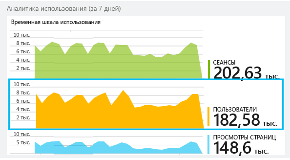

Наведите указатель мыши на пустую область над диаграммой для просмотра счетчиков в определенной точке. В иных случаях числа указывают значение, агрегированное за период, например среднее, итоговое или число уникальных пользователей за этот период.

В веб-приложениях пользователи подсчитываются с помощью файлов cookie. Пользователь, который использует несколько браузеров, очищает файлы cookie или использует функцию конфиденциальности, будет учитываться несколько раз.

Веб-сеанс считается законченным после 30 минут бездействия. Сеанс на телефоне или другом устройстве считается законченным при приостановке приложения на несколько секунд.

Щелкните любую диаграмму, чтобы увидеть более подробные данные. Например:

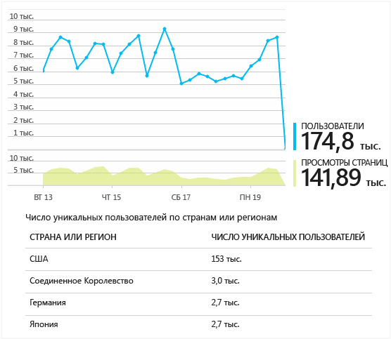

(Этот пример взят с веб-сайта, но диаграмма выглядит схожим образом для приложений, работающих на устройствах.)

Сравните с данными за предыдущую неделю, чтобы узнать, что изменилось:

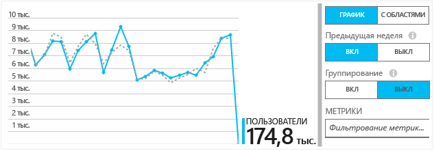

Сравните две метрики, например пользователей и новых пользователей:

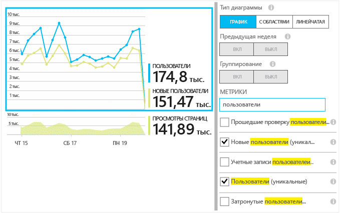

Группируйте (сегментируйте) данные по свойству, например обозревателю, операционной системе или городу:

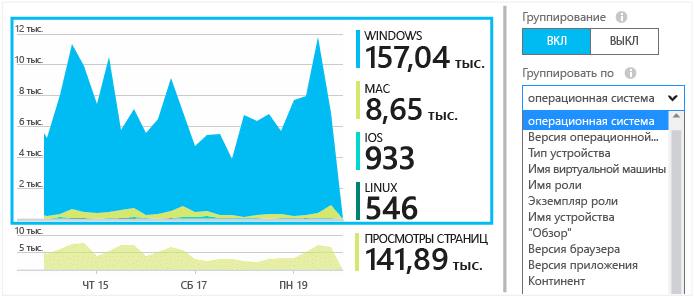

## Использование страницы

Щелкните плитку просмотров страниц, чтобы получить данные по наиболее популярным страницам.

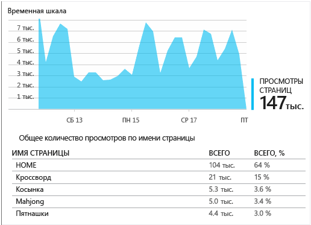

Приведенный выше пример взят с игрового веб-сайта. Из него можно сразу же увидеть следующее:

* Использование не увеличилось за прошлую неделю. Возможно, стоит задуматься о поисковой оптимизации?
* Гораздо меньше пользователей просматривают страницы игр, по сравнению с домашней страницей. Почему домашняя страница не привлекает людей играть в игры?
* "Кроссворд" является наиболее популярной игрой. Ему следует отдать приоритет в получении новых идей и улучшениях.

## Настраиваемое отслеживание

Предположим, что вместо создания отдельной страницы для каждой игры вы решили реорганизовать их все в одностраничное приложение, большинство функций которого реализовано с помощью кода JavaScript на веб-странице. Это позволяет пользователям быстро переключаться между играми или иметь несколько игр на одной странице.

Но вы все равно хотите, чтобы служба Application Insights протоколировала, сколько раз каждая игра была открыта, точно так же, как если бы игры находились на отдельных веб-страницах. Это несложно: просто вставьте вызов модуля телеметрии в код JavaScript в то место, где нужно сделать запись о том, что открыта новая "страница":

	telemetryClient.trackPageView(game.Name);

## Настраиваемые события

Телеметрию можно использовать различными способами, чтобы понять, как используется приложение. Однако не всегда нужно смешивать сообщения с просмотрами страниц. Вместо этого используйте настраиваемые события. Их можно отправлять из приложений устройств, веб-страниц или веб-сервера:

JavaScript

    telemetryClient.trackEvent("GameEnd");

C#

    var tc = new Microsoft.ApplicationInsights.TelemetryClient();
    tc.TrackEvent("GameEnd");

Visual Basic

    Dim tc = New Microsoft.ApplicationInsights.TelemetryClient()
    tc.TrackEvent("GameEnd")

В колонке обзора перечислены наиболее частые настраиваемые события.

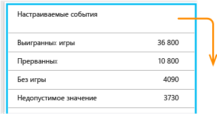

Щелкните заголовок таблицы для просмотра общего числа событий. Можно сегментировать диаграммы по различным атрибутам, например имени события:

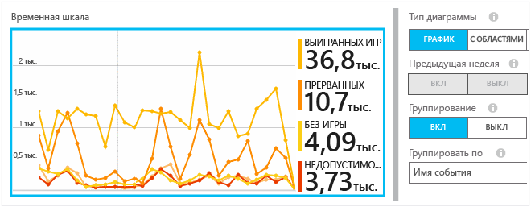

Особенно полезная функция временной шкалы — это возможность сопоставлять изменения с другими метриками и событиями. Например, в некоторых случаях, когда играемых игр становится больше, можно также ожидать увеличение числа прерванных игр. Но если увеличение числа прерванных игр является диспропорциональным, необходимо выяснить, не является ли высокая нагрузка причиной неприемлемой для пользователей проблемы.

## Детализация определенных событий

Чтобы лучше понимать, как проходит обычный сеанс, может потребоваться сосредоточиться на пользовательском сеансе, который содержит определенный тип события.

В этом примере создано настраиваемое событие NoGame, которое вызывается, если пользователь выходит из системы без фактического запуска игры. Почему пользователь так поступил? Возможно, если проанализировать некоторые повторяющиеся случаи, удастся выяснить причину.

Настраиваемые события, получаемые от приложения, перечислены по алфавиту в колонке "Обзор":

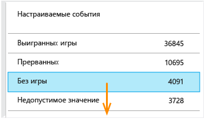

Щелкните интересующее событие и выберите последний конкретный случай:

Давайте рассмотрим все данные телеметрии для сеанса, в котором произошло конкретное событие "NoGame".

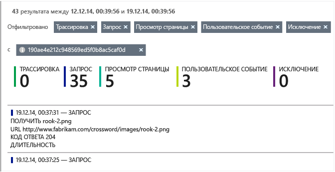

Исключений не возникало, поэтому пользователю не мешал играть какой-либо сбой.

Для этого сеанса мы можем отфильтровать все типы телеметрии, оставив просмотры страниц:

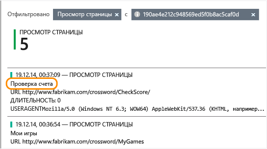

И теперь видно, что этот пользователь вошел в систему просто для того, чтобы проверить последний счет игры. Возможно, нам следует учесть рассмотренную пользовательскую историю, упростив эти действия. (И мы можем создать настраиваемое событие, чтобы отслеживать возникновения этой конкретной истории.)

## Фильтрация, поиск и сегментация данных с помощью свойств
Событиям можно присваивать произвольные теги и числовые значения.

JavaScript на стороне клиента

    appInsights.trackEvent("WinGame",
        // String properties:
        {Game: currentGame.name, Difficulty: currentGame.difficulty},
        // Numeric measurements:
        {Score: currentGame.score, Opponents: currentGame.opponentCount}
    );

C# на стороне сервера

    // Set up some properties:
    var properties = new Dictionary <string, string>
        {{"game", currentGame.Name}, {"difficulty", currentGame.Difficulty}};
    var measurements = new Dictionary <string, double>
        {{"Score", currentGame.Score}, {"Opponents", currentGame.OpponentCount}};

    // Send the event:
    telemetry.TrackEvent("WinGame", properties, measurements);

VB на стороне сервера

    ' Set up some properties:
    Dim properties = New Dictionary (Of String, String)
    properties.Add("game", currentGame.Name)
    properties.Add("difficulty", currentGame.Difficulty)

    Dim measurements = New Dictionary (Of String, Double)
    measurements.Add("Score", currentGame.Score)
    measurements.Add("Opponents", currentGame.OpponentCount)

    ' Send the event:
    telemetry.TrackEvent("WinGame", properties, measurements)

Таким же образом прикрепите свойства к просмотрам страниц:

JavaScript на стороне клиента

    appInsights.trackPageView("Win",
        {Game: currentGame.Name},
        {Score: currentGame.Score});

В колонке поиска по журналу диагностики можно просматривать свойства, щелкая отдельные вхождения события.

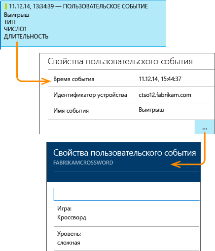

Используйте поле поиска для просмотра вхождений события с определенным значением свойства.

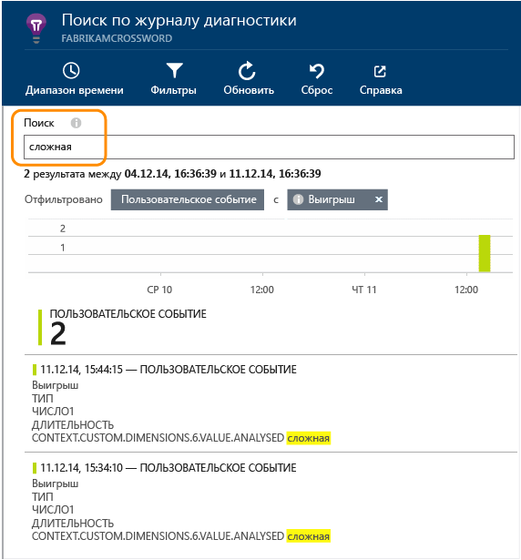

## Тестирование A или B

Если неизвестно, какой вариант функции будет более эффективен, выпустите их оба, чтобы каждый из них был доступен для разных пользователей. Измерьте успешность каждого варианта, а затем перейдите к единой версии.

В рамках этого способа необходимо присвоить разные теги всем данным телеметрии, отправляемым каждой версией приложения. Для этого нужно определить свойства в активном контексте телеметрии TelemetryContext. Эти свойства по умолчанию добавляются к каждому сообщению телеметрии, которое отправляет приложение, — не только к настраиваемым сообщениям, но также к стандартным данным телеметрии.

Затем, чтобы сравнить различные версии, на портале Application Insights можно будет отфильтровать и сгруппировать (сегментировать) данные по тегам.

C# на стороне сервера

    using Microsoft.ApplicationInsights.DataContracts;

    var context = new TelemetryContext();
    context.Properties["Game"] = currentGame.Name;
    var telemetry = new TelemetryClient(context);
    // Now all telemetry will automatically be sent with the context property:
    telemetry.TrackEvent("WinGame");

VB на стороне сервера

    Dim context = New TelemetryContext
    context.Properties("Game") = currentGame.Name
    Dim telemetry = New TelemetryClient(context)
    ' Now all telemetry will automatically be sent with the context property:
    telemetry.TrackEvent("WinGame")

Некоторые данные телеметрии могут отличаться от значений по умолчанию.

Можно настроить универсальный инициализатор, чтобы все новые клиенты телеметрии TelemetryClient автоматически использовали ваш контекст.

    // Telemetry initializer class
    public class MyTelemetryInitializer : IContextInitializer
    {
        public void Initialize (TelemetryContext context)
        {
            context.Properties["AppVersion"] = "v2.1";
        }
    }

В инициализаторе приложения, например Global.asax.cs:

    protected void Application_Start()
    {
        // ...
        TelemetryConfiguration.Active.ContextInitializers
        .Add(new MyTelemetryInitializer());
    }

## Создание — измерение — обучение

При использовании аналитики она становится неотъемлемой частью цикла разработки, а не просто поводом поразмышлять над решением проблем. Ниже приведен ряд советов.

* Определите ключевые метрики своего приложения. Необходимо привлечь максимальное число пользователей или лучше немного пользователей, но зато довольных? Необходимо увеличить число посещений или объем продаж?
* Планируйте протоколирование каждой истории. Если создается новый компонент или пользовательская история или их необходимо обновить, всегда думайте о том, как определить успешность изменения. Прежде чем начинать писать код, задайте вопрос: "Как этот код повлияет на метрики, когда он будет работать? Следует ли отслеживать новые события?" И, конечно, когда компонент становится рабочим, обязательно просматривайте аналитику и действуйте исходя из результатов.
* Соотносите другие метрики с ключевой метрикой. Например, если вы добавили компонент "Избранное", следует узнать, как часто пользователи добавляют в "Избранное". Но, возможно, еще интереснее узнать, как часто они обращаются к своему избранному. И, самое главное, стали ли пользователи, использующие "Избранное", в конечном счете больше покупать?
* Осторожное тестирование. Настройте переключатель, позволяющий делать новый компонент видимым только некоторым пользователям. С помощью Application Insights узнайте, используется ли новый компонент так, как было предусмотрено. Внесите корректировки, а затем сделайте компонент доступным для более широкого круга пользователей.
* Общайтесь с пользователями! Самой по себе аналитики недостаточно, она дополняет поддержание хороших отношений с клиентами.

## Подробнее

* [Обнаруживайте, исследуйте и диагностируйте случаи непредвиденного сбоя и снижения производительности в вашем приложении](app-insights-detect-triage-diagnose.md)
* [Начните работу с Application Insights на нескольких платформах](app-insights-detect-triage-diagnose.md)

## Видео

> [AZURE.VIDEO usage-monitoring-application-insights]

<!--Link references-->

[start]: app-insights-overview.md
 

<!---HONumber=Oct15_HO3-->