# Что такое Azure Application Insights?
Application Insights — это расширяемая служба управления производительностью приложений (APM) для веб-разработчиков на нескольких платформах. Используйте ее для мониторинга вашего работающего веб-приложения. Она автоматически обнаруживает аномалии производительности. Эта служба включает мощные аналитические средства, которые помогут вам диагностировать проблемы и понять, что пользователи фактически делают в вашем приложении.  Эта служба помогает постоянно улучшать производительность и удобство использования. Application Insights работает с приложениями на самых разнообразных платформах, включая .NET, Node.js и J2EE, с локальным или облачным размещением. Эта служба интегрируется с процессом DevOps и содержит точки подключения ко многим инструментам разработки. Она может выполнять мониторинг и анализ данных телеметрии из мобильных приложений благодаря интеграции с Visual Studio App Center и HockeyApp.

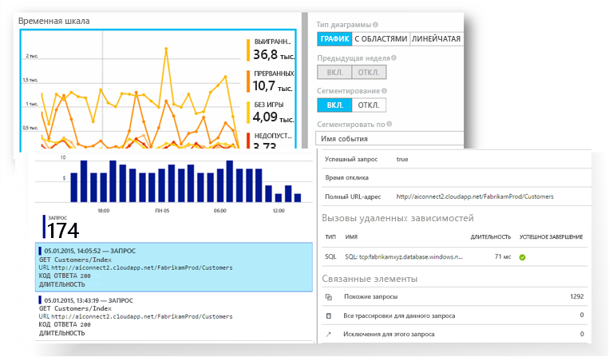

[Просмотрите этот ознакомительный анимированный ролик](https://www.youtube.com/watch?v=fX2NtGrh-Y0).

## Как работает Application Insights?
Вы устанавливаете небольшой пакет инструментирования в приложение и настраиваете ресурс Application Insights на портале Microsoft Azure. Пакет инструментирования отслеживает приложение и отправляет данные телеметрии на портал. (Приложение может работать где угодно. Его не обязательно размещать в Azure.)

Вы можете инструментировать не только приложение веб-службы, но и любые фоновые компоненты, а также JavaScript на веб-страницах. 

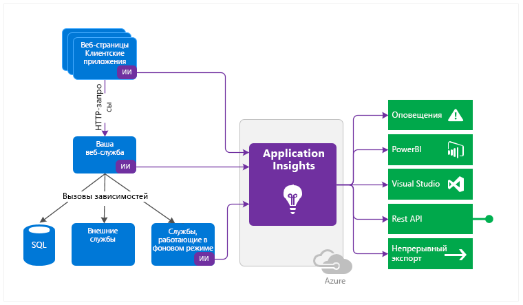

Кроме того, можно извлечь данные телеметрии из сред размещения, например данные счетчиков производительности, диагностики Azure или журналов Docker. Вы также можете настроить веб-тесты, которые периодически отправляют искусственные запросы в веб-службу.

Эти потоки данных телеметрии интегрированы на портале Azure, где к необработанным данным можно применять мощные инструменты анализа и поиска.

### Увеличение нагрузки
Влияние на производительность вашего приложения очень мало. Вызовы отслеживания не приводят к блокировке, выполняются в пакетном режиме и отправляется в отдельном потоке.

## Как работает монитор Application Insights?

Служба Application Insights предназначена для команды разработчиков. Она позволяет получить сведения о производительности и использовании приложения. Она отслеживает следующее:

* **Частота запросов, время отклика и частота сбоев.** Узнайте, какие страницы наиболее популярны, в какое время дня их посещают чаще всего, а также узнайте о расположении пользователей. Узнайте, какие страницы работают лучше всего. Если при увеличении количества запросов повышается время отклика и частота сбоев, возможно, возникла проблема с ресурсами. 
* **Частота зависимостей, время отклика и частота сбоев.** Узнайте, замедляют ли внешние службы вашу работу.
* **Исключения.** Проанализируйте сводные статистические данные или выберите конкретные экземпляры и выполните детализацию трассировки стека и связанных запросов. Исключения сервера и браузера регистрируются.
* **Просмотры страниц и производительность загрузки.** Эти сведения сообщаются через браузеры пользователей.
* **Вызовы AJAX** с веб-страницы. Скорость, время отклика и частота сбоев.
* **Количество пользователей и сеансов.**
* **Счетчики производительности** с компьютеров с сервером Windows или Linux, такие как ЦП, память и использование сети. 
* **Размещение диагностики** из Docker или Azure. 
* **Журналы диагностики трассировки** из вашего приложения. Предназначены для сопоставления событий трассировки с запросами.
* **Пользовательские события и метрики**, которые вы напишете самостоятельно в коде клиента или сервера, для отслеживания бизнес-событий, таких как количество проданных единиц или выигранных игр.

## Где отображаются мои данные телеметрии?

Существует множество способов изучения данных. Ознакомьтесь со следующими статьями:

|  |  |
| --- | --- |
| [**Интеллектуальное обнаружение в Application Insights**](app-insights-proactive-diagnostics.md) Автоматические оповещения адаптируются к стандартным шаблонам телеметрии приложения и активируются, когда что-то не соответствует стандартному шаблону. Также можно [настроить оповещения](app-insights-alerts.md) для определенных уровней пользовательских или стандартных метрик. |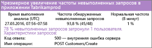 |
| [**Схема сопоставления приложений в Application Insights**](app-insights-app-map.md) Компоненты приложения с основными метриками и оповещениями. |  |
| [**Профилирование динамических веб-приложений Azure с помощью Application Insights (предварительная версия)**](app-insights-profiler.md) Проверьте профили запросов выборки. |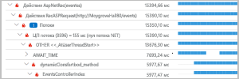 |
| [**Usage analysis for web applications with Application Insights**](app-insights-usage-overview.md) (Аналитики использования для веб-приложений с Application Insights) Анализируйте сегментацию пользователей и хранение.| |
| [**Работа с Application Insights в Visual Studio**](app-insights-diagnostic-search.md) Поиск и фильтрация событий, таких как запросы, исключения, вызовы зависимостей, журналы трассировки и просмотры страниц.  |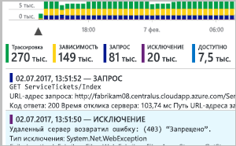 |
| [**Исследование метрик в Application Insights**](app-insights-metrics-explorer.md) Просмотр, фильтрация и сегментирование объединенных данных, таких как частоты запросов, ошибок и исключений, время отклика и время загрузки страницы. | |
| [**Панели мониторинга**](app-insights-dashboards.md#dashboards) Объединение разнородных данных из нескольких ресурсов и их совместное использование с другими пользователями. Идеальное решение для многокомпонентных приложений, а также для непрерывного отображения в комнате команды. | |
| [**Динамический поток метрик: мгновенные метрики для подробного отслеживания**](app-insights-live-stream.md) При развертывании новой сборки просматривайте эти индикаторы производительности в режиме, близком к реальному времени, чтобы убедиться, что все работает правильно. |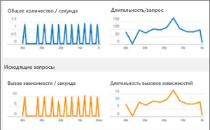 |
| [**Аналитика в Application Insights**](app-insights-analytics.md) Получите ответы на сложные вопросы о производительности и использовании приложения с помощью этого мощного языка запросов. | |
| [**Работа с Application Insights в Visual Studio**](app-insights-visual-studio.md) Просматривайте данные производительности в коде. Перейдите к коду из трассировки стека.|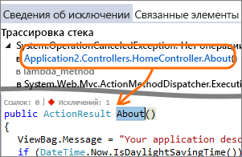 |
| [**Debug Snapshots on Exceptions in .NET Apps**](app-insights-snapshot-debugger.md) (Отладка моментальных снимков при исключениях в приложениях .NET) Отладка моментальных снимков, выбранных из активных операций со значениями параметров.|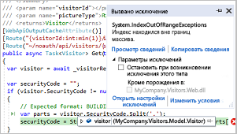 |
| [**Использование данных Application Insights в Power BI**](app-insights-export-power-bi.md) Интегрируйте метрики использования с другими метриками бизнес-аналитики.| 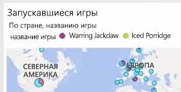|
| [**Use the Application Insights REST API to build custom solutions**](https://dev.applicationinsights.io/) (Использование интерфейса REST API Application Insights для создания пользовательских решений) Напишите код для выполнения запросов с помощью метрик и необработанных данных.|  |
| [**Экспорт данных телеметрии из Application Insights**](app-insights-export-telemetry.md) Выполняйте массовый экспорт необработанных данных в хранилище по мере их поступления. |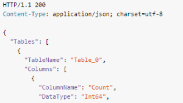 |

## Как использовать Application Insights?

### Мониторинг
Установите Application Insights в веб-приложении, настройте [доступность веб-тестов](app-insights-monitor-web-app-availability.md) и:

* настройте [панель мониторинга](app-insights-dashboards.md) для комнаты своей команды, чтобы следить за нагрузкой, скоростью реагирования и производительностью зависимостей, загрузки страниц и вызовов AJAX;
* узнавайте, какие запросы выполняются медленнее всех и какие чаще всего не выполняются;
* просматривайте [Live Stream](app-insights-live-stream.md) при развертывании новых выпусков, чтобы сразу же узнавать о любом снижении производительности.

### Обнаружение и диагностика
При получении предупреждения или обнаружении проблемы:

* Оцените, сколько пользователей столкнулось с проблемами.
* сопоставляйте сбои с исключениями, вызовами зависимостей и трассировками;
* изучите профилировщик, моментальные снимки, дамп стека и журналы трассировки.

### Создание, измерение и обучение
[Оцените эффективность](app-insights-usage-overview.md) каждой новой развертываемой функции.

* планируйте измерение того, как пользователи используют новые UX или бизнес-функции;
* записывайте пользовательскую телеметрию в свой код;
* основывайте следующий цикл разработки на объективных данных телеметрии.

## Начало работы
Application Insights — одна из многих служб, размещенных в Microsoft Azure, и данные телеметрии отправляются в нее для анализа и представления. Поэтому, чтобы приступить к каким-либо действиям, вам потребуется подписка на [Microsoft Azure](http://azure.com). Плата за регистрацию не взимается, и если выбрать [тарифный план](https://azure.microsoft.com/pricing/details/application-insights/) "Базовый" Application Insights, то плата не будет взиматься, пока ваше приложение не начнет значительно использовать ресурсы. Если у вашей организации уже есть подписка, в нее можно добавить вашу учетную запись Майкрософт.

Начать работу можно несколькими способами. Начните с того, который вам лучше подходит. Остальные можно использовать позже.

* **Во время выполнения — инструментирование веб-приложения на сервере.** Не допускает обновление кода. Требуется административный доступ на сервер.
  * [**Локальные или размещенные на виртуальной машине службы IIS**](app-insights-monitor-performance-live-website-now.md);
  * [**веб-приложения или виртуальные машины Azure**](app-insights-monitor-performance-live-website-now.md);
  * [**J2EE**](app-insights-java-live.md).
* **Во время разработки — добавление Application Insights в код.** Таким образом вы получаете возможность записывать пользовательскую телеметрию, а также инструментировать серверные и классические приложения.
  * [Visual Studio](app-insights-asp-net.md) 2013 с обновлением 2 или более поздняя версия.
  * Java в [Eclipse](app-insights-java-eclipse.md) или [другие средства](app-insights-java-get-started.md);
  * [Node.js](app-insights-nodejs.md)
  * [другие платформы.](app-insights-platforms.md)
* **[Инструментирование веб-страниц](app-insights-javascript.md)** для получения сведений о просмотрах страниц, вызовах AJAX и других данных телеметрии на стороне клиента.
* **[Анализ данных использования мобильного приложения](app-insights-mobile-center-quickstart.md)** с помощью интеграции с Visual Studio App Center.
* **[Тесты доступности](app-insights-monitor-web-app-availability.md)** с наших серверов для регулярной проверки связи с вашим веб-сайтом.

## Дополнительная информация
Приступите к работе во время выполнения с помощью:

* [сервера IIS;](app-insights-monitor-performance-live-website-now.md)
* [сервера J2EE.](app-insights-java-live.md)

Приступите к работе во время разработки с помощью:

* [ASP.NET](app-insights-asp-net.md)
* [Java](app-insights-java-get-started.md)
* [Node.js](app-insights-nodejs.md)

## Поддержка и обратная связь
* Вопросы и проблемы
  * [Устранение неполадок][qna]
  * [Форум MSDN](https://social.msdn.microsoft.com/Forums/vstudio/home?forum=ApplicationInsights)
  * [Stackoverflow](http://stackoverflow.com/questions/tagged/ms-application-insights)
* Ваши предложения:
  * [UserVoice](https://visualstudio.uservoice.com/forums/357324)
* Блог:
  * [Блог Application Insights](https://azure.microsoft.com/blog/tag/application-insights)

## Видеоролики

[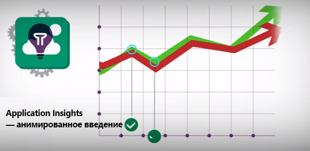](https://www.youtube.com/watch?v=fX2NtGrh-Y0)

> [!VIDEO https://channel9.msdn.com/events/Connect/2016/100/player] 

<!--Link references-->

[android]: app-insights-mobile-center-quickstart.md
[azure]: ../insights-perf-analytics.md
[client]: app-insights-javascript.md
[desktop]: app-insights-windows-desktop.md
[detect]: app-insights-detect-triage-diagnose.md
[greenbrown]: app-insights-asp-net.md
[ios]: app-insights-mobile-center-quickstart.md
[java]: app-insights-java-get-started.md
[knowUsers]: app-insights-web-track-usage.md
[platforms]: app-insights-platforms.md
[portal]: http://portal.azure.com/
[qna]: app-insights-troubleshoot-faq.md
[redfield]: app-insights-monitor-performance-live-website-now.md
