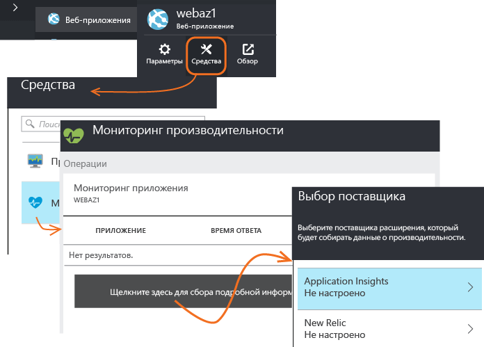
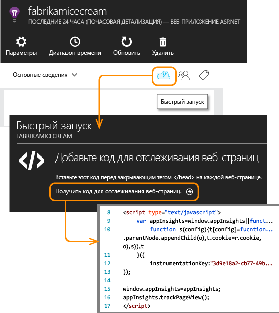

<properties
	pageTitle="Добавление пакета SDK Application Insights для отслеживания работы приложения ASP.NET | Microsoft Azure"
	description="Анализ использования, доступности и производительности локального приложения или веб-приложения Microsoft Azure с помощью Application Insights."
	services="application-insights"
    documentationCenter=".net"
	authors="alancameronwills"
	manager="douge"/>

<tags
	ms.service="application-insights"
	ms.workload="tbd"
	ms.tgt_pltfrm="ibiza"
	ms.devlang="na"
	ms.topic="get-started-article"
	ms.date="09/23/2015"
	ms.author="awills"/>


# Добавление пакета SDK Application Insights для отслеживания работы приложения ASP.NET

*Доступна только предварительная версия Application Insights.*

[AZURE.INCLUDE [app-insights-selector-get-started](../../includes/app-insights-selector-get-started.md)]


Visual Studio Application Insights осуществляет наблюдение за действующим приложением, помогая [обнаруживать и диагностировать проблемы производительности и исключения][detect], а также [исследовать, как используется ваше приложение][knowUsers]. Этот компонент можно использовать с самыми разнообразными типами приложений. Например, с веб-приложениями Azure или приложениями, размещенными на ваших локальных серверах IIS либо виртуальных машинах Azure.


*См. также:*

* [ASP.NET 5](app-insights-asp-net-five.md)
* [Приложения для устройств и серверы Java][platforms]

#### Перед началом работы

Для многих типов приложений [Visual Studio может добавлять Application Insights в приложение](#ide) так, что от вас почти ничего не потребуется. Но поскольку вы читаете этот раздел, чтобы лучше понять, что происходит, мы рассмотрим выполнение соответствующих действий вручную.


Вам необходимы:

* подписка на [Microsoft Azure](http://azure.com). Если у вашей группы или организации есть подписка Azure, владелец может добавить вас в нее с помощью вашей [учетной записи Майкрософт](http://live.com).
* Visual Studio 2013 или более поздняя версия.

## <a name="add"></a> 1. Создание ресурса Application Insights

Войдите на [портал Azure][portal] и создайте новый ресурс Application Insights. Выберите приложение ASP.NET в качестве типа приложения.


[Ресурс][roles] в Azure — это экземпляр службы. В этом ресурсе будет анализироваться и представляться телеметрия из вашего приложения.

От выбранного типа приложения зависит содержимое по умолчанию столбцов ресурсов и свойств, отображаемых в [обозревателе метрик][metrics].

#### Копирование ключа инструментирования

Ключ идентифицирует ресурс, и вы установите его в пакет SDK для направления данных ресурсу.


Действия по созданию нового ресурса, которые вы только что выполнили, являются хорошей отправной точкой для реализации мониторинга в любых приложениях. Теперь вы можете отправить на этот ресурс данные.

## <a name="sdk"></a> 2. Установка пакета SDK в приложении

Установка и настройка пакета SDK Application Insights зависит от платформы, на которой вы работаете. С приложениями ASP.NET все просто.

1. В Visual Studio отредактируйте пакеты NuGet вашего проекта классического приложения.

    

2. Установите пакет SDK Application Insights для веб-приложений.

    

3. Отредактируйте файл ApplicationInsights.config (который был добавлен при установке NuGet). Вставьте следующий фрагмент непосредственно перед закрывающим тегом:

    `<InstrumentationKey>` *скопированный ключ инструментирования* `</InstrumentationKey>`

    (Можно также [задать ключ, написав код][apikey] в вашем приложении.)

#### Обновление до будущих версий пакета SDK

Время от времени мы выпускаем новую версию пакета SDK.

Чтобы выполнить обновление до [нового выпуска пакета SDK](app-insights-release-notes-dotnet.md), еще раз откройте диспетчер пакетов NuGet и выполните фильтрацию по установленным пакетам. Выберите элемент **Microsoft.ApplicationInsights.Web**, а затем — элемент **Обновление**.

Если были выполнены какие-либо настройки файла ApplicationInsights.config, то, прежде чем выполнять обновление, сохраните его копию, а затем объедините изменения в новой версии.


## <a name="run"></a> 3. Запуск проекта

Запустите приложение, нажав клавишу **F5**, и попробуйте открывать разные страницы, чтобы создать некоторый объем данных телеметрии.

В Visual Studio вы увидите число отправленных событий.


## <a name="monitor"></a> 4. Просмотр телеметрии

Вернитесь на [портал Azure][portal] и перейдите к своему ресурсу Application Insights.


Выполните поиск данных в диаграммах "Обзор". Сначала вы увидите только одну или две точки. Например:


Щелкните любую диаграмму, чтобы увидеть более подробные метрики. [Дополнительные сведения о метриках.][perf]

#### Данные отсутствуют?

* Откройте плитку [Поиск][diagnostic], чтобы просмотреть отдельные события.
* Используйте приложение, открывая различные страницы, чтобы создать некоторый объем данных телеметрии.
* Подождите несколько секунд и нажмите **Обновить**. Диаграмма периодически обновляется, однако ее можно обновить и вручную, если вы ждете появления каких-либо данных.
* См. раздел [Устранение неполадок][qna].

## Публикация приложения

Теперь разверните свое приложение в IIS или Azure и наблюдайте за тем, как накапливаются данные.

При работе в режиме отладки телеметрия передается через конвейер, поэтому данные должны появиться в течение нескольких секунд. При развертывании приложения данные накапливаются медленнее.

#### Отсутствуют данные после публикации на сервере?

Откройте следующие порты для исходящего трафика в брандмауэре сервера:

+ `dc.services.visualstudio.com:443`
+ `f5.services.visualstudio.com:443`


#### Проблемы на сервере сборки?

Изучите [этот элемент устранения неполадок](app-insights-troubleshoot-faq.md#NuGetBuild).


## Отслеживание версии приложения

Убедитесь, что в процессе сборки создается `buildinfo.config`. Добавьте в CSPROJ-файл:

```XML

    <PropertyGroup>
      <GenerateBuildInfoConfigFile>true</GenerateBuildInfoConfigFile>    <IncludeServerNameInBuildInfo>true</IncludeServerNameInBuildInfo>
    </PropertyGroup> 
```

При наличии данных сборки веб-модуль Application Insights автоматически добавляет **версию приложения** как свойство для каждого элемента телеметрии. Это позволяет использовать фильтр по версии при [диагностическом поиске][diagnostic] или [изучении метрик][metrics].


## 5\. Добавление функции отслеживания зависимостей (и счетчиков производительности IIS)

Для получения доступа к некоторым данным пакету SDK необходима определенная помощь. В частности, этот дополнительный шаг позволит вам автоматизировать измерение вызовов от приложения к базам данных, API REST и другим внешним компонентам. Эти метрики зависимостей могут пригодиться при диагностике проблем с производительностью.

Если вы используете собственный сервер IIS, то с помощью этого действия можно отобразить системные счетчики производительности в [обозревателе метрик](app-insights-metrics-explorer.md).

#### Если приложение выполняется на сервере IIS

Войдите на сервер с правами администратора и установите [монитор состояний Application Insights](http://go.microsoft.com/fwlink/?LinkId=506648).

Возможно, потребуется [открыть дополнительные исходящие порты в брандмауэре](app-insights-monitor-performance-live-website-now.md#troubleshooting).

Это действие также включает [отчеты о счетчиках производительности](app-insights-web-monitor-performance.md#system-performance-counters), например для ЦП, памяти и загрузки сети.

#### Если приложение является веб-приложением Azure

На панели управления веб-приложения Azure добавьте расширение Application Insights.




#### Если это проект облачной службы Azure

[Добавьте сценарии в веб-роли и рабочие роли](app-insights-cloudservices.md).


## 6\. Добавление наблюдения на стороне клиента

Вы установили пакет SDK, который отправляет телеметрию с серверной стороны вашего приложения. Теперь можно добавить мониторинг на стороне клиента. Он обеспечит вас данными по пользователям, сеансам, просмотрам страниц, а также исключениям или сбоям, возникшим на стороне клиента.

Вы также можете написать собственный код для отслеживания работы пользователей с вашим приложением вплоть до детализации щелчков мышью и нажатий клавиш.

#### Если ваши клиенты — веб-браузеры

Если ваше приложение отображает веб-страницы, добавьте в каждую страницу фрагмент кода JavaScript. Скопируйте код из ресурса Application Insights:



Обратите внимание, что код содержит ключ инструментирования, идентифицирующий ресурс приложения.

[Дополнительные сведения об отслеживании веб-страниц.](app-insights-web-track-usage.md)

#### Если ваши клиенты — приложения для устройств

Если ваше приложение обслуживает такие клиенты, как телефоны и другие устройства, добавьте в приложение для устройств [соответствующий пакет SDK](app-insights-platforms.md).

При настройке клиентского пакета SDK с тем же ключом инструментирования, как у серверного пакета SDK, потоки объединяются и отображаются вместе.


## 7\. Завершение установки

Для получения полного представления о приложении можно выполнить несколько дополнительных действий.

* [Настройте веб-тесты][availability], которые помогут быть уверенными в том, что приложение остается работоспособным и правильно отвечает на запросы.
* [Запись трассировки журналов][netlogs] из предпочтительной платформы ведения журналов
* [Отслеживание пользовательских событий и метрик][api] на клиенте, на сервере или с обеих сторон для получения сведений об использовании приложения.

## <a name="ide"></a> Автоматизированный способ

Как уже отмечалось в начале статьи, мы покажем, как создавать ресурсы Application Insights вручную, а затем установим пакет SDK. Мы считаем, что важно ознакомиться с обеими сторонами этой процедуры. Для приложений ASP.NET (и многих других) есть еще более быстрые автоматические решения.

Вам потребуются [Visual Studio 2013](http://go.microsoft.com/fwlink/?linkid=397827&clcid=0x409) (с обновлением 3 или более поздней версии) и учетная запись в [Microsoft Azure](http://azure.com).

#### Добавление в новый проект

При создании проекта в Visual Studio установите флажок **Добавить Application Insights**.


Visual Studio создает ресурс в Application Insights, добавляет этот пакет SDK в проект и помещает ключ в файл `.config`.

Если проект содержит веб-страницы, он также добавляет [пакет SDK JavaScript][client] на эталонную веб-страницу.

#### ... или, если это существующий проект

В обозревателе решений щелкните проект правой кнопкой мыши и выберите пункт **Добавить Application Insights**.


Visual Studio создает ресурс в Application Insights, добавляет этот пакет SDK в проект и помещает ключ в файл `.config`.

В этом случае он не добавляет [пакет SDK JavaScript][client] на веб-страницы — рекомендуется сделать это на следующем шаге.

#### Параметры настройки

Если вы делаете это впервые, вам будет предложено войти в предварительную версию Microsoft Azure или зарегистрироваться в ней.

Если это приложение является частью большего приложения, можно использовать элемент **Настройка параметров**, чтобы поместить его в ту же группу ресурсов, где находятся другие компоненты.

*Нет параметра для добавления Application Insights? Убедитесь, что вы используете Visual Studio 2013 с обновлением 3 или более позднюю версию и что инструменты Application Insights включены в разделе "Расширения и обновления".*

#### Откройте Application Insights из проекта.


## <a name="video"></a>Видео

> [AZURE.VIDEO getting-started-with-application-insights]


<!--Link references-->

[api]: app-insights-api-custom-events-metrics.md
[apikey]: app-insights-api-custom-events-metrics.md#ikey
[availability]: app-insights-monitor-web-app-availability.md
[azure]: ../insights-perf-analytics.md
[client]: app-insights-javascript.md
[detect]: app-insights-detect-triage-diagnose.md
[diagnostic]: app-insights-diagnostic-search.md
[knowUsers]: app-insights-overview-usage.md
[metrics]: app-insights-metrics-explorer.md
[netlogs]: app-insights-asp-net-trace-logs.md
[perf]: app-insights-web-monitor-performance.md
[platforms]: app-insights-platforms.md
[portal]: http://portal.azure.com/
[qna]: app-insights-troubleshoot-faq.md
[redfield]: app-insights-monitor-performance-live-website-now.md
[roles]: app-insights-resources-roles-access-control.md
[start]: app-insights-get-started.md

<!---HONumber=Oct15_HO1-->