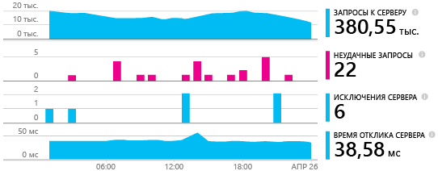
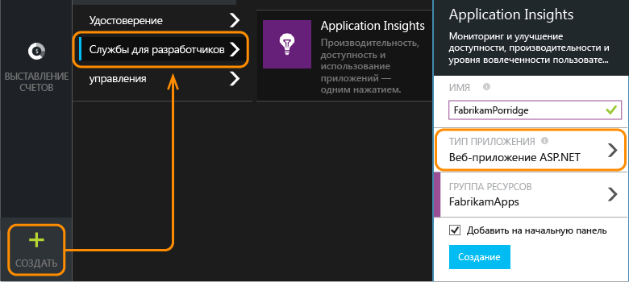
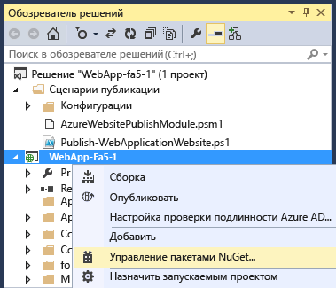
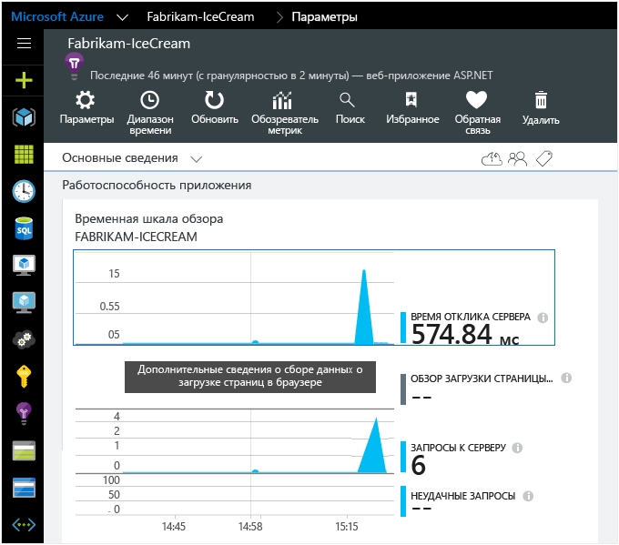

<properties 
	pageTitle="Добавление пакета SDK Application Insights для отслеживания работы приложения ASP.NET" 
	description="Анализ использования, доступности и производительности локального приложения или веб-приложения Microsoft Azure с помощью Application Insights." 
	services="application-insights" 
    documentationCenter=".net"
	authors="alancameronwills" 
	manager="ronmart"/>

<tags 
	ms.service="application-insights" 
	ms.workload="tbd" 
	ms.tgt_pltfrm="ibiza" 
	ms.devlang="na" 
	ms.topic="article" 
	ms.date="05/21/2015" 
	ms.author="awills"/>

# Добавление пакета SDK Application Insights для отслеживания работы приложения ASP.NET

*Доступна только предварительная версия Application Insights.*

[AZURE.INCLUDE [app-insights-selector-get-started](../../includes/app-insights-selector-get-started.md)]

Visual Studio Application Insights осуществляет наблюдение за действующим приложением, помогая [обнаруживать и диагностировать проблемы производительности и исключения][detect], а также [исследовать, как используется ваше приложение][knowUsers]. Этот компонент можно использовать с самыми разнообразными типами приложений. Например, с веб-приложениями Azure или приложениями, размещенными на ваших локальных серверах IIS либо виртуальных машинах Azure. ([Также рассматриваются приложения для устройств и серверы Java][start].)

Для многих типов приложений [Visual Studio может добавлять Application Insights в приложение](#ide) так, что от вас почти ничего не потребуется. Но поскольку вы читаете этот раздел, чтобы лучше понять, что происходит, мы рассмотрим выполнение соответствующих действий вручную.

#### Перед началом работы

Вам необходимы:

* подписка на [Microsoft Azure](http://azure.com). Если у вашей группы или организации есть подписка Azure, владелец может добавить вас в нее с помощью вашей [учетной записи Майкрософт](http://live.com).
* Visual Studio 2013 или более поздняя версия.

##  1. Создание ресурса Application Insights

Войдите на [портал Azure][portal] и создайте новый ресурс Application Insights. Выберите приложение ASP.NET в качестве типа приложения.

[Ресурс][roles] в Azure — это экземпляр службы. В этом ресурсе будет анализироваться и представляться телеметрия из вашего приложения.

От выбранного типа приложения зависит содержимое по умолчанию столбцов ресурсов и свойств, отображаемых в [обозревателе метрик][metrics].

####  Сделайте копию ключа инструментирования

Ключ идентифицирует ресурс, и вы установите его в пакет SDK для направления данных ресурсу.

##  2. Установка пакета SDK в приложении

1. В Visual Studio отредактируйте пакеты NuGet вашего проекта классического приложения.

    

2. Установите пакет SDK Application Insights для веб-приложений.

    

3. Отредактируйте файл ApplicationInsights.config (который был добавлен установкой NuGet). Вставьте следующий фрагмент непосредственно перед закрывающим тегом:

    `<InstrumentationKey>` *скопированный ключ инструментирования* `</InstrumentationKey>`

    (Можно также [задать ключ, написав код][apikey] в вашем приложении.)

#### Обновление до будущих версий пакета SDK

Чтобы выполнить обновление до [нового выпуска пакета SDK](app-insights-release-notes-dotnet.md), еще раз откройте диспетчер пакетов NuGet и выполните фильтрацию по установленным пакетам. Выберите элемент Microsoft.ApplicationInsights.Web, а затем — элемент «Обновление».

Если были выполнены какие-либо настройки файла ApplicationInsights.config, то, прежде чем выполнять обновление, сохраните его копию, а затем объедините изменения в новой версии.

##  3. Запуск проекта

Запустите приложение, нажав клавишу F5, и попробуйте открывать разные страницы, чтобы создать некоторый объем данных телеметрии.

В Visual Studio вы увидите число отправленных событий.

##  4. Просмотр телеметрии

Вернитесь на [портал Azure][portal] и перейдите к своему ресурсу Application Insights.

Выполните поиск данных в диаграммах «Обзор». Сначала вы увидите только одну или две точки. Например:

Щелкните любую диаграмму, чтобы увидеть более подробные метрики. [Дополнительные сведения о метриках.][perf]

Теперь разверните свое приложение и наблюдайте за тем, как накапливаются данные.

При работе в режиме отладки телеметрия передается через конвейер, поэтому данные должны появиться в течение нескольких секунд. При развертывании приложения данные накапливаются медленнее.

#### Данные отсутствуют?

* Откройте плитку [Поиск][diagnostic], чтобы просмотреть отдельные события.
* Используйте приложение, открывая различные страницы, чтобы создать некоторый объем данных телеметрии.
* Подождите несколько секунд и нажмите «Обновить».
* См. раздел [Устранение неполадок][qna].

#### Проблемы на сервере сборки?

Изучите [этот элемент устранения неполадок](app-insights-troubleshoot-faq.md#NuGetBuild).

## Завершение установки

Для получения полного представления о приложении можно выполнить несколько дополнительных действий.

* [Добавьте пакет SDK JavaScript на веб-страницы][client], которые позволяют получать браузерные данные телеметрии, такие как пользователь, сеанс, число просмотров страниц, время загрузки страницы, исключения скриптов, и записывать настраиваемую телеметрию в скрипты страниц.
* Добавьте отслеживание зависимостей для диагностики проблем, связанных с базами данных или другими компонентами, используемыми приложением:
 * [в веб-приложениях или виртуальной машине Azure;][azure]
 * [на локальном сервере IIS.][redfield]
* [Запись трассировки журналов][netlogs] из предпочтительной платформы ведения журналов
* [Отслеживание пользовательских событий и метрик][api] на клиенте, на сервере или с обеих сторон для получения сведений об использовании приложения.
* [Настройте веб-тесты][availability], которые помогут быть уверенными в том, что приложение остается работоспособным и правильно отвечает на запросы.

##  Автоматизированный способ

Если вы предпочитаете использовать Visual Studio для настройки, процедура очень проста.

Вам потребуется [Visual Studio 2013, обновление 3](http://go.microsoft.com/fwlink/?linkid=397827&clcid=0x409) или более поздняя версия и учетная запись в [Microsoft Azure](http://azure.com).

#### Добавление в новый проект

При создании нового проекта в Visual Studio установите флажок для компонента Application Insights.

Visual Studio создает ресурс в Application Insights, добавляет этот пакет SDK в проект и помещает ключ в файл `.config`.

Если проект содержит веб-страницы, он также добавляет [пакет SDK JavaScript][client] на эталонную веб-страницу.

#### ... или, если это существующий проект

В обозревателе решений щелкните проект правой кнопкой мыши и выберите пункт Add Application Insights (Добавить Application Insights).

Visual Studio создает ресурс в Application Insights, добавляет этот пакет SDK в проект и помещает ключ в файл `.config`.

В этом случае он не добавляет [пакет SDK JavaScript][client] на веб-страницы — рекомендуется сделать это на следующем шаге.

#### Параметры настройки

Если вы делаете это впервые, вам будет предложено войти в предварительную версию Microsoft Azure или зарегистрироваться в ней. (При этом создается учетная запись, не связанная с учетной записью Visual Studio Online.)

Если это приложение является частью большего приложения, можно использовать элемент **Настройка параметров**, чтобы поместить его в ту же группу ресурсов, где находятся другие компоненты.

*Нет параметра для добавления Application Insights? Убедитесь, что вы используете Visual Studio 2013 с обновлением 3 или более позднюю версию, что инструменты Application Insights включены в разделе "Расширения и обновления" и что вы создаете веб-проект.*

#### Откройте Application Insights из проекта.

## Видео

> [AZURE.VIDEO getting-started-with-application-insights]

<!--Link references-->

[api]: app-insights-api-custom-events-metrics.md
[apikey]: app-insights-api-custom-events-metrics.md#ikey
[availability]: app-insights-monitor-web-app-availability.md
[azure]: ../insights-perf-analytics.md
[client]: app-insights-javascript.md
[detect]: app-insights-detect-triage-diagnose.md
[diagnostic]: app-insights-diagnostic-search.md
[knowUsers]: app-insights-overview-usage.md
[metrics]: app-insights-metrics-explorer.md
[netlogs]: app-insights-asp-net-trace-logs.md
[perf]: app-insights-web-monitor-performance.md
[portal]: http://portal.azure.com/
[qna]: app-insights-troubleshoot-faq.md
[redfield]: app-insights-monitor-performance-live-website-now.md
[roles]: app-insights-resources-roles-access-control.md
[start]: app-insights-get-started.md

 

<!---HONumber=58_postMigration-->