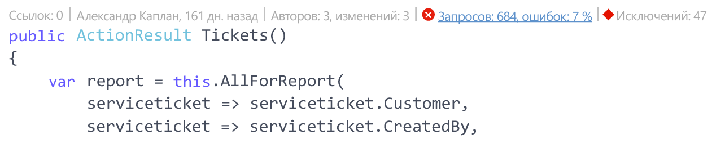
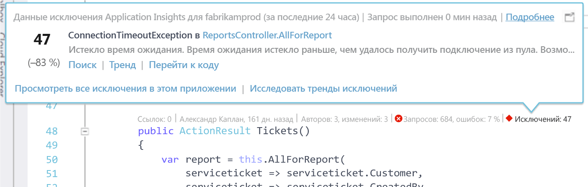
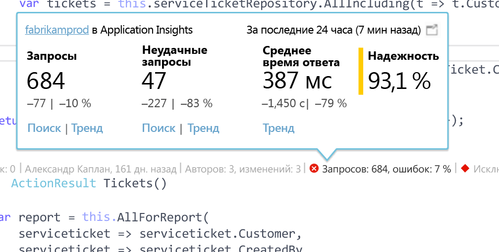

# Телеметрия Application Insights в Visual Studio CodeLens
Методы в коде веб-приложения можно обозначить с помощью данных телеметрии об исключениях во время выполнения и времени ответа на запрос. Если установить в приложении [Azure Application Insights](app-insights-overview.md), данные телеметрии будут отображаться в Visual Studio [CodeLens](https://msdn.microsoft.com/library/dn269218.aspx) в виде примечаний в верхней части данных о функции. Там обычно приведены такие полезные сведения, как число расположений со ссылками на функцию или имя пользователя, который последним вносил в нее изменения.

> [!NOTE]
> Надстройка Application Insights в CodeLens доступна в Visual Studio 2015 с обновлением 3 и более поздних версиях, а также в [расширении средств анализа для разработчиков](https://visualstudiogallery.msdn.microsoft.com/82367b81-3f97-4de1-bbf1-eaf52ddc635a). Компонент CodeLens доступен в выпусках Visual Studio Enterprise и Professional.
> 
> 

## Поиск данных Application Insights
Данные телеметрии Application Insights отображаются в индикаторах CodeLens методов открытых запросов в веб-приложении. Индикаторы CodeLens отображаются над объявлениями метода и другими объявлениями в коде C# и Visual Basic. При наличии данных Application Insights для метода вы увидите индикаторы запросов и исключений, например "Запросов: 100, не выполнено: 1 %" или "Исключений: 10". Для получения дополнительных сведений щелкните индикатор CodeLens. 

> [!TIP]
> Индикаторы запросов и исключений Application Insights могут загрузиться через несколько секунд после появления других индикаторов CodeLens.
> 
> 

## Исключения в CodeLens

Индикатор исключений CodeLens показывает количество исключений, возникших за последние 24 часа, для 15 наиболее часто возникающих в приложении исключений за период обработки запросов, выполненных с помощью метода.

Щелкните индикатор исключения CodeLens для получения дополнительных сведений:

* Процентное изменение в количестве исключений за последние 24 часа по сравнению с предыдущими 24 часами.
* Выберите **Перейти к коду** , чтобы перейти к исходному коду функции, которая выдает исключение.
* Выберите **Поиск** , чтобы запросить все экземпляры этого исключения, возникшие за последние 24 часа.
* Выберите **Тренд** , чтобы отобразить тренды возникновения этого исключения за последние 24 часа.
* Выберите **Просмотреть все исключения в этом приложении** , чтобы запросить все исключения, возникшие за последние 24 часа.
* Выберите **Исследовать тренды исключений** , чтобы просмотреть тренды возникновения всех исключений за последние 24 часа. 

> [!TIP]
> Если в CodeLens отображается индикатор "Исключений: 0", но известно, что исключения должны быть, убедитесь, что в CodeLens выбран нужный ресурс Application Insights. Чтобы выбрать другой ресурс, щелкните проект правой кнопкой мыши в обозревателе решений и выберите **Application Insights > Выбрать источник телеметрии**. В CodeLens отображаются только 15 наиболее часто встречающихся исключений в приложении за последние 24 часа, поэтому, если исключение на 16-м или одном из последующих мест по частоте возникновения, вы увидите индикатор "Исключений: 0". Исключения из представлений ASP.NET могут не отображаться в методах контроллера, с помощью которых были созданы эти представления.
> 
> [!TIP]
> Если в CodeLens отображается индикатор "Исключений: ?", необходимо связать учетную запись Azure с Visual Studio. Также это возможно, если срок действия учетных данных Azure истек. В любом случае щелкните индикатор "Исключений: ?" и выберите **Добавить учетную запись...**, чтобы указать учетные данные.
> 
> 

## Запросы в CodeLens

Индикатор запросов CodeLens показывает количество HTTP-запросов, выполненных с помощью метода за последние 24 часа, а также процент невыполненных запросов.

Щелкните индикатор запросов CodeLens для получения дополнительных сведений.

* Абсолютное и процентное изменение количества запросов, невыполненных запросов и среднее время ответа за последние 24 часа по сравнению с предыдущими 24 часами.
* Надежность метода, которая вычисляется как процент запросов, не завершившихся сбоем, за последние 24 часа.
* Выберите **Поиск** для запросов или невыполненных запросов, чтобы запросить все (невыполненные) запросы за последние 24 часа.
* Выберите **Тренд** , чтобы просмотреть тренды запросов, невыполненных запросов или среднего времени ответа за последние 24 часа.
* Выберите имя ресурса Application Insights в верхнем левом углу подробного представления CodeLens, чтобы изменить ресурс, который является источником данных CodeLens.

## Дальнейшие действия
|  |  |
| --- | --- |
| **[Работа с Application Insights в Visual Studio](app-insights-visual-studio.md)** Поиск телеметрии, просмотр данных в CodeLens и настройка Application Insights — все это в Visual Studio | |
| **[Добавление данных](app-insights-asp-net-more.md)** Мониторинг использования, доступности, зависимостей и исключений. Интеграция трассировок из платформ ведения журналов. Написание пользовательской телеметрии. | |
| **[Работа с порталом Application Insights](app-insights-dashboards.md)** Панели мониторинга, эффективные средства диагностики и анализа, оповещения, карта динамических зависимостей приложения, а также экспорт данных телеметрии. | |

