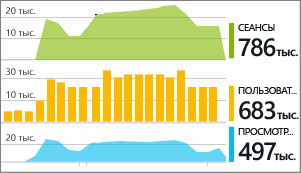

# Работа с Azure Application Insights в Visual Studio
В Visual Studio 2015 и более поздних версиях можно анализировать производительность веб-приложения ASP.NET и диагностировать проблемы во время отладки и в рабочей среде с помощью телеметрии из [Azure Application Insights](app-insights-overview.md).

Если вы создали веб-приложение ASP.NET с помощью Visual Studio 2017 или более поздней версии, оно уже содержит пакет SDK Application Insights. Если вы используете другую версию, [добавьте Application Insights в свое приложение](app-insights-asp-net.md), если вы еще это не сделали.

Чтобы отслеживать приложение в рабочей среде, можно просматривать данные телеметрии Application Insights на [портале](https://portal.azure.com) (там же можно настроить оповещения и применить эффективные средства мониторинга). Но для приложения в состоянии отладки можно также искать и анализировать данные телеметрии в Visual Studio. С помощью Visual Studio вы можете анализировать телеметрию рабочего сайта и выполнения отладки на компьютере разработчика. В последнем случае вы можете анализировать выполнения отладки, даже если вы еще не настроили пакет SDK для отправки данных телеметрии на портал Azure. 

##  Отладка проекта
Нажмите клавишу F5, чтобы запустить веб-приложение в режиме локальной отладки. Откройте разные страницы, чтобы создать некоторый объем данных телеметрии.

В Visual Studio вы увидите число событий, которые были зарегистрированы в модуле Application Insights вашего проекта.

Нажмите эту кнопку для поиска данных телеметрии. 

## Поиск Application Insights
В окне поиска Application Insights отображаются события, которые были зарегистрированы. Если во время настройки Application Insights вы вошли в Azure, эти же события вы сможете найти на портале Azure.

> [!NOTE] 
> Выберите фильтры или отмените их выбор. Нажмите кнопку поиска в конце текстового поля поиска.
>

Бесплатный полнотекстовый поиск охватывает все поля в журнале событий. Например, можно выполнить поиск по фрагменту URL-адреса страницы, а также по значению свойства (например, город клиента) или ключевым словам в журнале трассировки.

Выберите любое событие, чтобы подробно просмотреть его свойства.

Чтобы выполнить запрос к веб-приложению, щелкните код.

Чтобы продиагностировать невыполненные запросы или исключения, вы можете открыть связанные элементы.

## Исключения и неудачно завершенные запросы
Отчеты об исключениях отображаются в окне поиска. В некоторых типах приложений ASP.NET предыдущих версий необходимо [настроить отслеживание исключений](app-insights-asp-net-exceptions.md), чтобы просматривать исключения, которые обрабатываются платформой.

Щелкните исключение, чтобы просмотреть трассировку стека. Если код приложения открыт в среде Visual Studio, можно щелкнуть трассировку стека в соответствующей строке кода.

## Сводные данные запросов и исключений в коде
В строке группы связанных элементов кода над каждым методом-обработчиком указано число исключений, зарегистрированных Application Insights за последние 24 часа.

> [!NOTE] 
> Группа связанных элементов кода показывает данные Application Insights, только если вы [настроили приложение для отправки данных телеметрии на портал Application Insights](app-insights-asp-net.md).
>

[Телеметрия Application Insights в Visual Studio CodeLens](app-insights-visual-studio-codelens.md)

## Тренды
Тренды — это средство для визуализации того, как изменяется поведение приложения со временем. 

Нажмите кнопку **Обзор трендов телеметрии** на панели инструментов Application Insights или в окне поиска Application Insights. Выберите один из пяти стандартных запросов, чтобы приступить к работе. Анализировать разные наборы данных можно на основе типов данных телеметрии, диапазонов времени и других свойств. 

Чтобы найти аномалии в данных, выберите один из вариантов аномалий в раскрывающемся списке "Тип представления". Параметры фильтрации в нижней части окна позволяют легко находить конкретные подмножества данных телеметрии.

[Дополнительные сведения о тенденциях](app-insights-visual-studio-trends.md)

## Локальный мониторинг
(Относится к Visual Studio 2015 с обновлением 2) Если ваш пакет SDK не отправляет данные телеметрии на портал Application Insights (то есть в файле ApplicationInsights.config нет ключа инструментирования), окно диагностики отображает данные телеметрии, полученные в ходе последнего сеанса отладки. 

Это предпочтительно, если вы уже опубликовали предыдущую версию своего приложения. Кроме того, не рекомендуется, чтобы данные телеметрии, полученные на ваших сеансах отладки, смешивались с данными телеметрии на портале Application Insights, полученными от опубликованного приложения.

Это также полезно, если у вас есть [данные пользовательской телеметрии](app-insights-api-custom-events-metrics.md) , которые необходимо отладить перед отправкой на портал.

* *Сначала мы полностью настроили Application Insights для отправки данных телеметрии на портал. Но теперь нужно, чтобы данные телеметрии отображались только в Visual Studio.*
  
  * В параметрах окна поиска можно включить поиск локальной диагностики, который будет выполняться, даже если ваше приложение отправляет данные телеметрии на портал.
  * Чтобы остановить отправку данных телеметрии на портал, закомментируйте строку `<instrumentationkey>...` в файле ApplicationInsights.config. Когда данные телеметрии будут готовы к отправке на портал, раскомментируйте ее.

## Что дальше?
|  |  |
| --- | --- |
| **[Добавление данных](app-insights-asp-net-more.md)** Мониторинг использования, доступности, зависимостей и исключений. Интеграция трассировок из платформ ведения журналов. Написание пользовательской телеметрии. | |
| **[Работа с порталом Application Insights](app-insights-dashboards.md)** Панели мониторинга, эффективные средства диагностики и анализа, оповещения, карта динамических зависимостей приложения, а также экспорт данных телеметрии. | |

