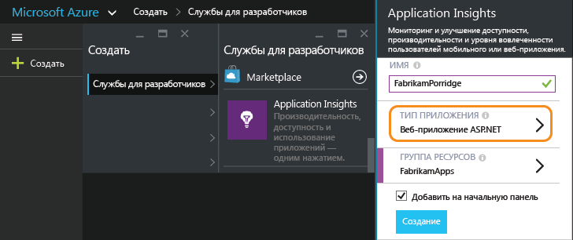
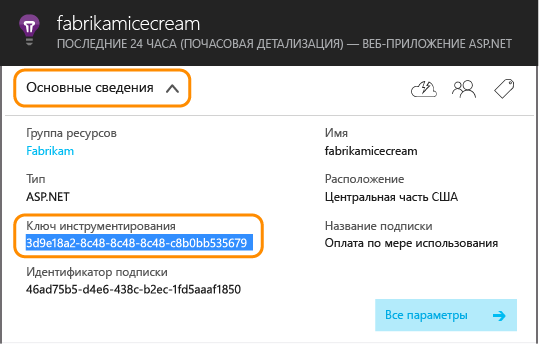
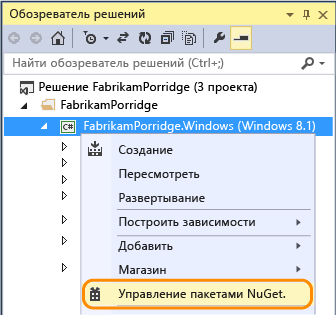
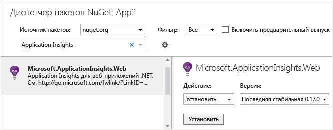
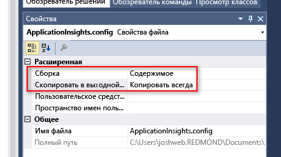
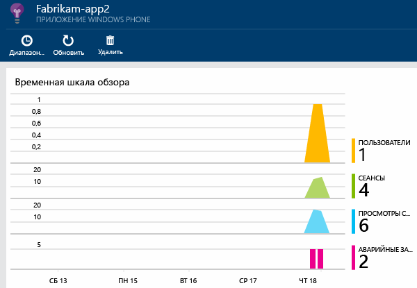
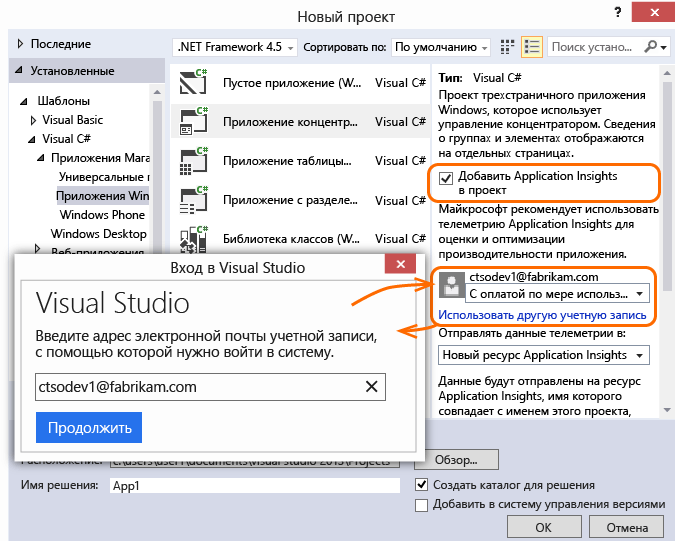
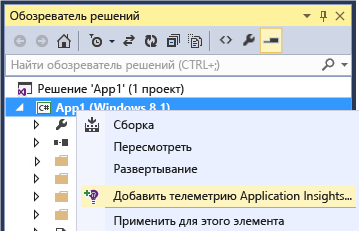

<properties
	pageTitle="Application Insights для приложений Windows Phone и Магазина Windows | Microsoft Azure"
	description="Анализ использования и производительности приложения для устройства Windows с помощью Application Insights."
	services="application-insights"
    documentationCenter="windows"
	authors="alancameronwills"
	manager="douge"/>

<tags
	ms.service="application-insights"
	ms.workload="tbd"
	ms.tgt_pltfrm="ibiza"
	ms.devlang="na"
	ms.topic="get-started-article"
	ms.date="06/16/2015"
	ms.author="awills"/>

# Application Insights для приложений Windows Phone и Магазина Windows

*Application Insights находится в состоянии предварительной версии.*

[AZURE.INCLUDE [app-insights-selector-get-started](../../includes/app-insights-selector-get-started.md)]

С помощью Visual Studio Application Insights можно отслеживать следующие показатели опубликованного приложения.

* [**Использование**][windowsUsage] &#151; узнайте, сколько пользователей у вас есть и что они делают с вашим приложением.
* [**Сбои**][windowsCrash] &#151; получайте диагностические отчеты о сбоях и исследуйте их влияние на пользователей.


Для многих типов приложений [Visual Studio может добавлять Application Insights в приложение](#ide) так, что от вас почти ничего не потребуется. Но поскольку вы читаете этот раздел, чтобы лучше понять, что происходит, мы рассмотрим выполнение соответствующих действий вручную.

Вам потребуется следующее:

* подписка на [Microsoft Azure][azure];
* Visual Studio 2013 или более поздняя версия.

## 1\. Создание ресурса Application Insights

На [портале Azure][portal] создайте новый ресурс Application Insights.



[Ресурс][roles] в Azure — это экземпляр службы. В этом ресурсе будет анализироваться и представляться телеметрия из вашего приложения.

#### Копирование ключа инструментирования

Этот ключ идентифицирует ресурс. Он потребуется вам, чтобы настроить пакет SDK для отправки данных в ресурс.




## 2\. Добавление пакета SDK Application Insights в приложение

В Visual Studio добавьте соответствующий пакет SDK в свой проект.

Если это универсальное приложение для Windows, повторите эти шаги для проекта Windows Phone и для проекта Windows.

1. Щелкните правой кнопкой мыши проект в обозревателе решений и выберите пункт **Управление пакетами NuGet**.

    

2. Найдите Application Insights.

    

3. Выберите **Application Insights для приложений Windows**.

4. Добавьте файл ApplicationInsights.config в корневой каталог проекта и вставьте скопированный c портала ключ инструментирования. Ниже приведен пример XML-кода для этого файла конфигурации.

	```xml

		<?xml version="1.0" encoding="utf-8" ?>
		<ApplicationInsights>
			<InstrumentationKey>YOUR COPIED INSTRUMENTATION KEY</InstrumentationKey>
		</ApplicationInsights>
	```

    Задайте для файла ApplicationInsights.config такие свойства: **Действие при построении** == **Содержимое**, **Копировать в выходной каталог** == **Копировать всегда**.

	

5. Добавьте приведенный ниже код инициализации. Рекомендуем добавить этот код в конструктор `App()`. Если выполнить это действие в другом месте, можно пропустить автоматический сбор сведений о первых просмотрах страниц.

```C#

    using Microsoft.ApplicationInsights;
    ...

	public App()
	{
	   // Add this initilization line.
	   WindowsAppInitializer.InitializeAsync();

	   this.InitializeComponent();
	   this.Suspending += OnSuspending;
	}  
```

**Универсальные приложения Windows**. Повторите эти действия для проектов Windows Phone и Магазина Windows. [Пример универсального приложения для Windows 8.1](https://github.com/Microsoft/ApplicationInsights-Home/tree/master/Samples/Windows%208.1%20Universal).

## <a name="network"></a>3. Включение доступа к сети для вашего приложения

Если приложение еще не [запросило доступ к Интернету](https://msdn.microsoft.com/library/windows/apps/hh452752.aspx), вам нужно добавить это в его манифест как [обязательную возможность](https://msdn.microsoft.com/library/windows/apps/br211477.aspx).

## <a name="run"></a>4. Запуск проекта

[Запустите приложение с помощью клавиши F5](http://msdn.microsoft.com/library/windows/apps/bg161304.aspx) и используйте его, чтобы создать некоторый объем телеметрии.

В Visual Studio вы увидите число полученных событий.


В режиме отладки телеметрия отправляется сразу же после ее создания. В режиме выпуска телеметрия хранится на устройстве и отправляется только тогда, когда приложение возобновляет работу.


## <a name="monitor"></a>5. Просмотр данных мониторинга

Выполните вход на [портал Azure](https://portal.azure.com) и перейдите к ресурсу Application Insights, который вы создали ранее.

Сначала вы увидите только одну или две точки. Например:



Если вам требуется больше данных, через несколько секунд нажмите кнопку **Обновить**.

Щелкните любую диаграмму, чтобы просмотреть более подробные сведения.


## <a name="deploy"></a>5. Публикация приложения в Магазине

[Опубликуйте свое приложение](http://dev.windows.com/publish) и наблюдайте за данными, которые собираются по мере загрузки и использования этого приложения пользователями.

## Настройка телеметрии

#### Выбор сборщиков

Пакет SDK Application Insights включает несколько сборщиков, которые автоматически собирают различные типы данных из приложения. По умолчанию все они активны, однако сборщики для инициализации в конструкторе приложений можно выбрать.

    WindowsAppInitializer.InitializeAsync( "00000000-0000-0000-0000-000000000000",
       WindowsCollectors.Metadata
       | WindowsCollectors.PageView
       | WindowsCollectors.Session
       | WindowsCollectors.UnhandledException);

#### Отправка собственных данных телеметрии

Для отправки событий, метрик и данных диагностики в службу Application Insights используйте [API][api]. Ниже приведены эти инструкции.

```C#

 var tc = new TelemetryClient(); // Call once per thread

 // Send a user action or goal:
 tc.TrackEvent("Win Game");

 // Send a metric:
 tc.TrackMetric("Queue Length", q.Length);

 // Provide properties by which you can filter events:
 var properties = new Dictionary{"game", game.Name};

 // Provide metrics associated with an event:
 var measurements = new Dictionary{"score", game.score};

 tc.TrackEvent("Win Game", properties, measurements);

```

Дополнительную информацию см. в статье [Общие сведения об API. Пользовательские события и метрики][api].

## Что дальше?

* [Обнаружение и диагностика сбоев в приложении][windowsCrash]
* [Дополнительная информация о метриках][metrics]
* [Дополнительная информация о поиске по журналу диагностики][diagnostic]


## <a name="ide"></a>Автоматизированная настройка

Если вы предпочитаете использовать Visual Studio для выполнения шагов настройки, это можно сделать с приложениями Windows Phone, Магазина Windows и многими другими типами приложений.

### <a name="new"></a> Если создается новый проект приложения Windows...

Выберите **Application Insights** в диалоговом окне **Создание проекта**.

Если отобразится предложение войти, воспользуйтесь данными вашей учетной записи Azure.




### <a name="existing"></a>Или если это существующий проект...

Добавьте Application Insights из обозревателя решений.




## Обновление до новой версии пакета SDK

После выпуска [новой версии пакета SDK](app-insights-release-notes-windows.md):

* Щелкните правой кнопкой мыши проект и выберите "Управление пакетами NuGet".
* Выберите установленные пакеты Application Insights и нажмите **Обновить**.


## <a name="usage"></a>Дальнейшие действия


[Обнаружение и диагностика сбоев в приложении][windowsCrash]

[Ведение журналов диагностики и поиск по ним][diagnostic]


[Отслеживание использования приложения][windowsUsage]

[Использование API для отправки пользовательской телеметрии][api]

[Устранение неполадок][qna]


<!--Link references-->

[api]: app-insights-api-custom-events-metrics.md
[azure]: ../insights-perf-analytics.md
[diagnostic]: app-insights-diagnostic-search.md
[metrics]: app-insights-metrics-explorer.md
[portal]: http://portal.azure.com/
[qna]: app-insights-troubleshoot-faq.md
[roles]: app-insights-resources-roles-access-control.md
[windowsCrash]: app-insights-windows-crashes.md
[windowsUsage]: app-insights-windows-usage.md

<!---HONumber=Oct15_HO1-->