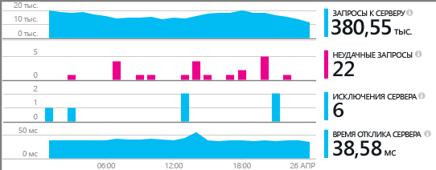
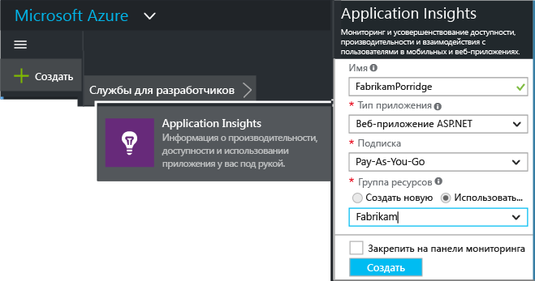
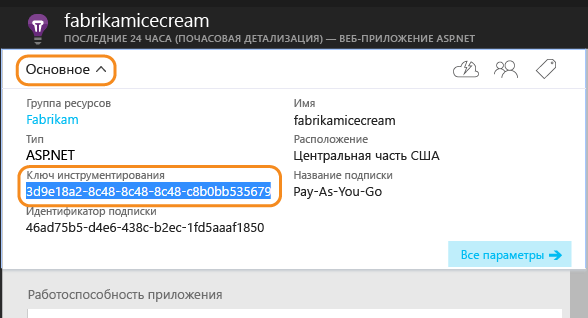
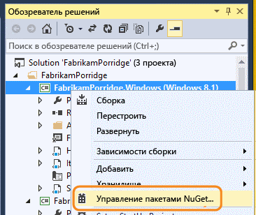
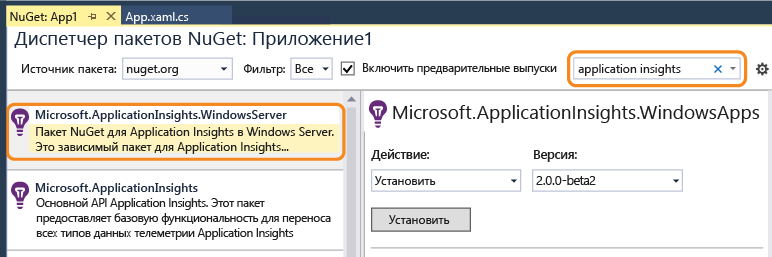
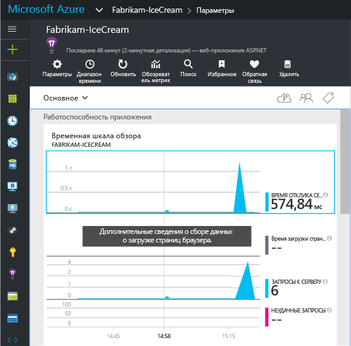
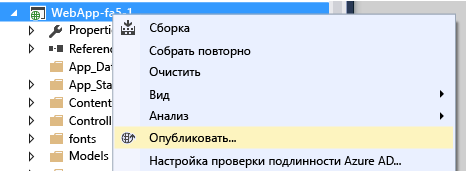

# Настройка Application Insights вручную для приложений .NET

Вы можете настроить [Application Insights](app-insights-overview.md) для мониторинга разнообразных приложений, ролей приложений, компонентов или микрослужб. Для веб-приложений и служб Visual Studio предлагает [одноэтапную настройку](app-insights-asp-net.md). Для других типов приложений .NET, таких как внутренние роли сервера или классические приложения, вы можете настроить Application Insights вручную.

#### Перед началом работы

Вам необходимы:

* подписка на [Microsoft Azure](http://azure.com). Если у вашей группы или организации есть подписка Azure, владелец может добавить вас в нее с помощью вашей [учетной записи Майкрософт](http://live.com).
* Visual Studio 2013 или более поздняя версия.

## 1. Выбор ресурса Application Insights

Ресурс — место, где ваши данные собираются и отображаются на портале Azure. Определитесь, что вам нужно: создать еще один ресурс или совместно использовать имеющийся.

### Часть большего приложения. Использование имеющегося ресурса

Если веб-приложение состоит из нескольких компонентов, например интерфейсное веб-приложение и одна или несколько серверных служб, вы должны отправлять телеметрию со всех компонентов в один ресурс. Так они будут отображаться на единой схеме сопоставления приложений, а вы сможете отслеживать запрос от одного компонента к другому.

Если вы уже отслеживаете другие компоненты этого приложения, просто используйте тот же ресурс.

Откройте ресурс на [портале Azure](https://portal.azure.com/). 

### Автономное приложение. Создание ресурса

Если новое приложение не связано с другими приложениями, оно должно иметь свой ресурс.

Войдите на [портал Azure](https://portal.azure.com/)и создайте новый ресурс Application Insights. Выберите приложение ASP.NET в качестве типа приложения.

От выбранного типа приложения зависит содержимое по умолчанию столбцов ресурсов.

## 2) Копирование ключа инструментирования
Ключ идентифицирует ресурс. Вы установите его в пакет SDK для направления данных ресурсу.

## 3. Установка пакета Application Insights в приложении
Установка и настройка пакета Application Insights зависит от платформы, на которой вы работаете. 

1. В Visual Studio щелкните проект правой кнопкой мыши и выберите пункт **Управление пакетами NuGet**.
   
    
2. Установите пакет Application Insights Microsoft.ApplicationInsights.WindowsServer. для приложений Windows Server.
   
    
   
    *Какую версию выбрать?*

    Установите флажок **Включить предварительные выпуски**, если вы хотите воспользоваться нашими новыми функциями. Дополнительные сведения о том, нужна ли вам предварительная версия, см. в соответствующих документах или блогах.
    
    *Можно ли использовать другие пакеты?*
   
    Да. Выберите Microsoft.ApplicationInsights, если вы хотите использовать API для отправки собственной телеметрии. Пакет Windows Server включает API, а также ряд других пакетов, например для сбора данных счетчиков производительности и отслеживания зависимостей. 

### Обновление до будущих версий пакета
Время от времени мы выпускаем новую версию пакета SDK.

Чтобы выполнить обновление до [нового выпуска пакета](https://github.com/Microsoft/ApplicationInsights-dotnet-server/releases/), еще раз откройте диспетчер пакетов NuGet и выполните фильтрацию по установленным пакетам. Выберите **Microsoft.ApplicationInsights.WindowsServer**, а затем — **Обновить**.

Если были выполнены какие-либо настройки файла ApplicationInsights.config, то, прежде чем выполнять обновление, сохраните его копию, а затем объедините изменения в новой версии.

## 4. Отправка данных телеметрии
**Если установлен только пакет API:**

* Задайте ключ инструментирования в коде, например в `main()`: 
  
    `TelemetryConfiguration.Active.InstrumentationKey = "` *ваш ключ* `";` 
* [Создайте собственную телеметрию с помощью](app-insights-api-custom-events-metrics.md#ikey).

**Если у вас установлены другие пакеты Application Insights** , ключ инструментирования можно задать с помощью CONFIG-файла:

* Отредактируйте файл ApplicationInsights.config (который был добавлен при установке NuGet). Вставьте следующий фрагмент непосредственно перед закрывающим тегом:
  
    `<InstrumentationKey>` *скопированный ключ инструментирования* `</InstrumentationKey>`
* Убедитесь, что свойства файла ApplicationInsights.config в обозревателе решений имеют следующие значения: **"Действие сборки = содержимое", "Копировать в выходной каталог = копировать"**.

Если вы хотите [изменить ключ для разных конфигураций сборки](app-insights-separate-resources.md), можно задать ключ инструментирования в коде. Если ключ задан в коде, его не нужно задавать в файле `.config`.

## Запуск проекта
Запустите приложение, нажав клавишу **F5** , и попробуйте открывать разные страницы, чтобы создать некоторый объем данных телеметрии.

В Visual Studio вы увидите число отправленных событий.

##  Просмотр своих данных телеметрии
Вернитесь на [портал Azure](https://portal.azure.com/) и перейдите к своему ресурсу Application Insights.

Выполните поиск данных в диаграммах "Обзор". Сначала вы увидите только одну или две точки. Например:

Щелкните любую диаграмму, чтобы увидеть более подробные метрики. [Дополнительные сведения о метриках.](app-insights-web-monitor-performance.md)

### Данные отсутствуют?
* Используйте приложение, открывая различные страницы, чтобы создать некоторый объем данных телеметрии.
* Откройте плитку [Поиск](app-insights-diagnostic-search.md) , чтобы просмотреть отдельные события. Иногда для прохождения событий через конвейер метрики требуется чуть больше времени.
* Подождите несколько секунд и нажмите **Обновить**. Диаграмма периодически обновляется, однако ее можно обновить и вручную, если вы ждете появления каких-либо данных.
* См. раздел [Устранение неполадок](app-insights-troubleshoot-faq.md).

## Публикация приложения
Теперь разверните свое приложение на сервере или в Azure и наблюдайте за тем, как накапливаются данные.

При работе в режиме отладки телеметрия передается через конвейер, поэтому данные должны появиться в течение нескольких секунд. При развертывании приложения в конфигурации выпуска данные накапливаются медленнее.

### Отсутствуют данные после публикации на сервере?
Откройте порты для исходящего трафика в брандмауэре сервера. Список необходимых адресов можно просмотреть на [этой странице](https://docs.microsoft.com/azure/application-insights/app-insights-ip-addresses). 

### Проблемы на сервере сборки?
Изучите [этот элемент устранения неполадок](app-insights-asp-net-troubleshoot-no-data.md#NuGetBuild).

> [!NOTE]
> Если приложение генерирует много телеметрических данных, модуль адаптивной выборки автоматически сокращает объем отправляемых на портал данных, пересылая только репрезентативную часть событий. При этом связанные с тем же запросом события отбираются как группа, что позволяет перемещаться между связанными событиями. 
> [Дополнительная информация о выборке](app-insights-sampling.md).
> 
> 

## Видео

> [!VIDEO https://channel9.msdn.com/events/Connect/2016/100/player]

## Дальнейшие действия
* [добавить дополнительную телеметрию](app-insights-asp-net-more.md) .

