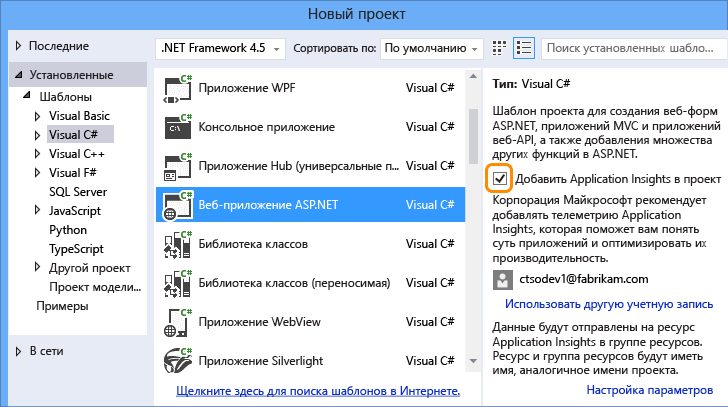
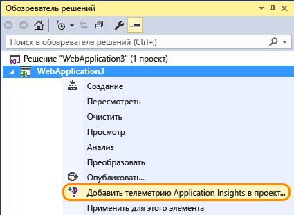
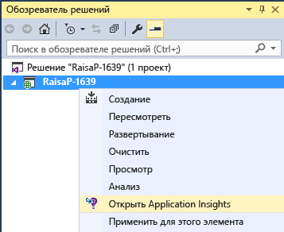
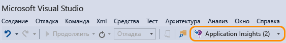

<properties 
	pageTitle="Наблюдение за производительностью и использованием вашего приложения с помощью Application Insights" 
	description="Анализ использования, доступности и производительности локального приложения или веб-приложения Microsoft Azure с помощью Application Insights." 
	services="application-insights" 
    documentationCenter=""
	authors="alancameronwills" 
	manager="ronmart"/>

<tags 
	ms.service="application-insights" 
	ms.workload="tbd" 
	ms.tgt_pltfrm="ibiza" 
	ms.devlang="na" 
	ms.topic="article" 
	ms.date="04/26/2015" 
	ms.author="awills"/>

# Наблюдение за производительностью и использованием вашего приложения с помощью Application Insights

*Application Insights находится в состоянии предварительной версии*

Visual Studio Application Insights осуществляет наблюдение за действующим приложением, помогая [обнаруживать и диагностировать проблемы производительности и исключения][detect], а также [исследовать, как используется ваше приложение][knowUsers]. Эта служба может использоваться с различными типами приложений, такими как веб-приложения ASP.NET и Java, приложения для устройств iOS, Android, Windows и других устройств, приложения HTML + JavaScript.

В этой статье мы рассмотрим типы приложений, которые разрабатываются в Visual Studio. Существуют также расширения Application Insights для других IDE.

Вам потребуется [Visual Studio 2013, обновление 3](http://go.microsoft.com/fwlink/?linkid=397827&clcid=0x409) или более поздняя версия и учетная запись в [Microsoft Azure](http://azure.com).

##  Добавление Application Insights в проект

#### Добавление в новый проект

При создании нового проекта в Visual Studio установите флажок для компонента Application Insights.

Visual Studio создает ресурс в Application Insights, добавляет этот пакет SDK в проект и помещает ключ в файл `.config`.

Если проект содержит веб-страницы, он также добавляет [пакет SDK JavaScript][client] на эталонную веб-страницу.

#### ... или, если это существующий проект

В обозревателе решений щелкните проект правой кнопкой мыши и выберите пункт Add Application Insights (Добавить Application Insights).

Visual Studio создает ресурс в Application Insights, добавляет этот пакет SDK в проект и помещает ключ в файл `.config`.

В этом случае он не добавляет [пакет SDK JavaScript][client] на веб-страницы — рекомендуется сделать это на следующем шаге.

#### Параметры настройки

Если вы делаете это впервые, вам будет предложено войти в предварительную версию Microsoft Azure или зарегистрироваться в ней. (При этом создается учетная запись, не связанная с учетной записью Visual Studio Online.)

Если это приложение является частью большего приложения, можно использовать элемент **Настройка параметров**, чтобы поместить его в ту же группу ресурсов, где находятся другие компоненты.

*Нет параметра для добавления Application Insights? В некоторых типах проектов вы можете использовать Application Insights, [вручную добавив пакет SDK][windows].*

#### Откройте Application Insights из проекта.

##  3. Запуск проекта

Запустите приложение, нажав клавишу F5, и попробуйте открывать разные страницы, чтобы создать некоторый объем данных телеметрии.

В Visual Studio вы увидите число отправленных событий.

##  4. Просмотр телеметрии

Вернитесь на [портал Azure][portal] и перейдите к своему ресурсу Application Insights.

Выполните поиск данных в диаграммах «Обзор». Сначала вы увидите только одну или две точки. Например:

Щелкните любую диаграмму, чтобы увидеть более подробные метрики. [Дополнительные сведения о метриках.][perf]

Теперь разверните свое приложение и наблюдайте за тем, как накапливаются данные.

При работе в режиме отладки телеметрия передается через конвейер, поэтому данные должны появиться в течение нескольких секунд. При развертывании приложения данные накапливаются медленнее.

#### Данные отсутствуют?

* Откройте плитку [Поиск по журналу диагностики][diagnostic], чтобы просмотреть отдельные события.
* Используйте приложение, открывая различные страницы, чтобы создать некоторый объем данных телеметрии.
* Подождите несколько секунд и нажмите «Обновить».
* См. раздел [Устранение неполадок][qna].

## Дальнейшие действия

Теперь, когда вы отправляете данные с серверной стороны вашего приложения на стороне сервера, можно выполнить несколько приведенных ниже действий, чтобы получить более широкое представление.

* [Настройте веб-тесты][availability], которые помогут быть уверенными в том, что приложение остается работоспособным и правильно отвечает на запросы.
* [Добавьте пакет SDK JavaScript на веб-страницы][client], которые позволяют получать браузерные данные телеметрии, такие как число просмотров страниц, время загрузки страницы, исключения скриптов, и записывать настраиваемую телеметрию в скрипты страниц.
* Добавление отслеживания зависимостей для диагностики проблем, связанных с базами данных или другими компонентами, используемыми приложением 
 * [Добавление отслеживания зависимостей на сервер IIS][redfield]
 * [Добавление отслеживания зависимостей в Azure Web App][azure]
* [Запись трассировки журналов][netlogs] из предпочтительной платформы ведения журналов
* [Отслеживание пользовательских событий и метрик][api] на клиенте, на сервере или с обеих сторон для получения сведений об использовании приложения.

<!--Link references-->

[api]: app-insights-api-custom-events-metrics.md
[availability]: app-insights-monitor-web-app-availability.md
[azure]: ../insights-perf-analytics.md
[client]: app-insights-javascript.md
[detect]: app-insights-detect-triage-diagnose.md
[diagnostic]: app-insights-diagnostic-search.md
[knowUsers]: app-insights-overview-usage.md
[netlogs]: app-insights-asp-net-trace-logs.md
[perf]: app-insights-web-monitor-performance.md
[portal]: http://portal.azure.com/
[qna]: app-insights-troubleshoot-faq.md
[redfield]: app-insights-monitor-performance-live-website-now.md
[windows]: app-insights-windows-get-started.md

 

<!---HONumber=July15_HO3-->