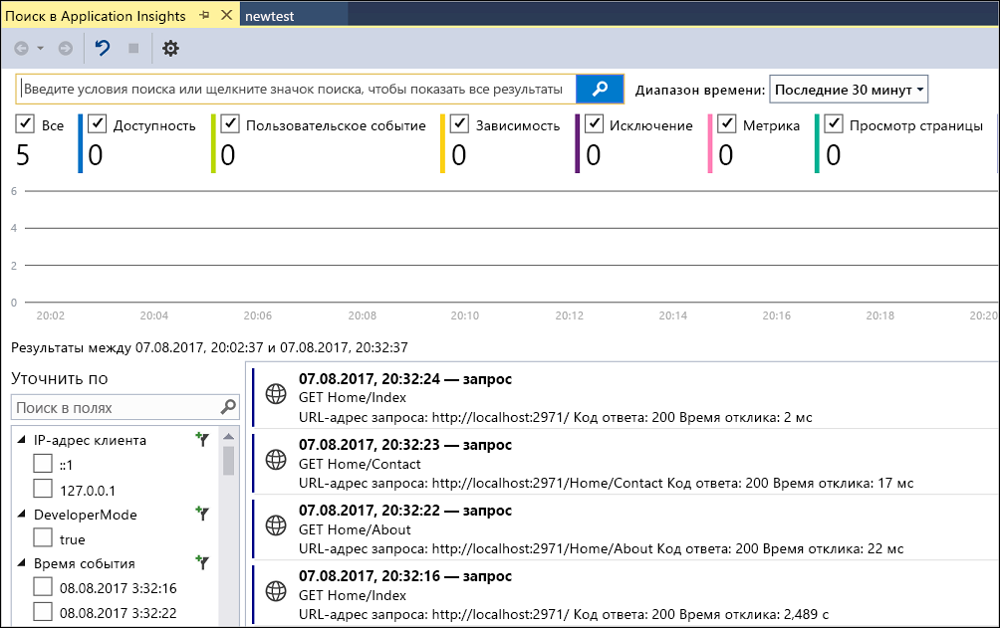
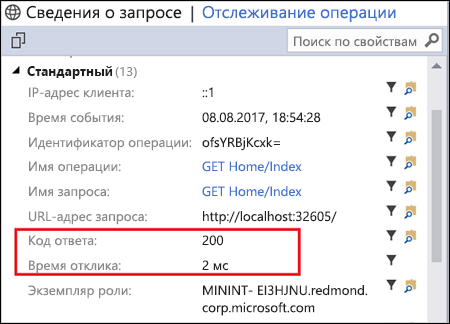
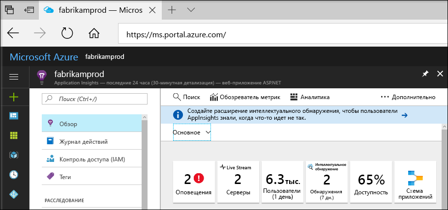
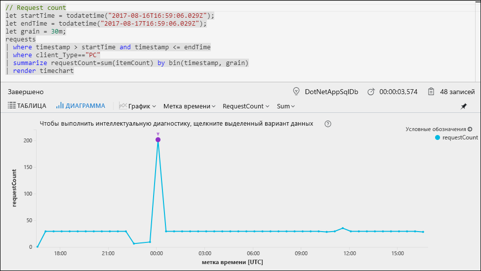
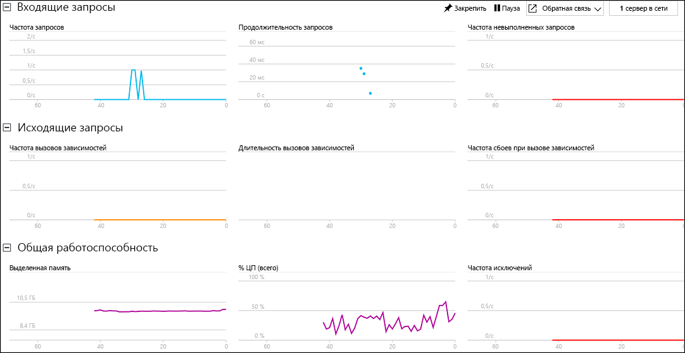

# Запуск мониторинга веб-приложения ASP.NET

С помощью Azure Application Insights можно легко отслеживать доступность, производительность и использование своего веб-приложения.  Вы также можете быстро идентифицировать и диагностировать ошибки в приложении, не дожидаясь, пока пользователь сообщит о них.  На основе сведений о производительности и эффективности приложения, получаемых из Application Insights, можно сделать обдуманный выбор по поддержке и улучшению приложения.

В этом руководстве показано, как добавить Application Insights в имеющееся веб-приложение ASP.NET и начать анализировать статистику в реальном времени с помощью одного из различных методов, которые можно использовать для анализа работы приложения. Если у вас нет веб-приложения ASP.NET, его можно создать, следуя руководству [по созданию веб-приложения ASP.NET в Azure](../app-service/app-service-web-get-started-dotnet.md).

## предварительным требованиям
Для работы с этим кратким руководством сделайте следующее:

- Установите [Visual Studio 2017](https://www.visualstudio.com/downloads/) с указанными ниже рабочими нагрузками:
    - ASP.NET и веб-разработка.
    - разработка Azure;

Если у вас еще нет подписки Azure, создайте [бесплатную](https://azure.microsoft.com/free/) учетную запись Azure, прежде чем начинать работу.

## Включение Application Insights

1. Откройте проект в Visual Studio 2017.
2. В меню "Проект" выберите **Настроить Application Insights**. С помощью Visual Studio пакет SDK Application Insights добавляется в приложение.
3. Щелкните **Начать бесплатно**, выберите предпочитаемый план выставление счетов и щелкните **Зарегистрировать**.

    

4. Запустите приложение, выбрав в меню **Отладить** пункт **Начать отладку** или нажав клавишу F5.

## Подтверждение настройки приложения

Application Insights собирает данные телеметрии из приложения независимо от того, где оно работает. Чтобы просмотреть эти данные, сделайте следующее.

1. Откройте Application Insights, выбрав **Проект** -> **Application Insights** -> **Поиск телеметрии сеанса отладки**.  Это телеметрия из текущего сеанса.  

2. Щелкните первый запрос в списке (в этом примере GET Home/Index), чтобы просмотреть сведения о нем. Обратите внимание, что состояние кода и время ответа поставляются вместе с другой ценной информацией о запросе.  

## Запуск мониторинга на портале Azure

Теперь можно открыть Application Insights на портале Azure для просмотра различных сведений о запущенном приложении.

1. Щелкните правой кнопкой мыши папку **Connected Services Application Insights** (Подключенные службы Application Insights) в обозревателе решений и щелкните **Открыть портал Application Insights**.  Появятся некоторые сведения о приложении и разнообразные параметры.

    

2. Щелкните **Карта приложений**, чтобы получить визуальный макет отношений зависимости между компонентами приложения.  Каждый компонент показывает ключевой показатель эффективности, такие как производительность, сбои и оповещения.

    

3. Щелкните значок **Аналитика приложений**  на одном из компонентов приложений.  Откроется окно **Application Insights Analytics** (Application Insights — аналитика), которое предоставляет полнофункциональный язык запросов для анализа всех данных, собранных Application Insights.  В этом случае создается запрос, который преобразовывает число запросов для просмотра в виде диаграммы.  Вы можете записывать собственные запросы для анализа других данных.

    

4. Вернитесь на страницу **Обзор** и щелкните **Live Stream**.  После этого появится статистика приложения во время его работы.  Включается такая информация, как число входящих запросов, их продолжительность и все возникающие ошибки.  Вы также можете проверить важные метрики производительности, такие как процессор и память.

    

Если вы готовы к размещению приложения в Azure, его можно опубликовать сейчас. Выполните действия, описанные в разделе [Обновление и повторное развертывание приложения](../app-service/app-service-web-get-started-dotnet.md#update-the-app-and-redeploy).

## Дополнительная информация
В этом кратком руководстве было показано, как включить мониторинг приложения с помощью Azure Application Insights.  Перейдите к руководствам, чтобы узнать как использовать статистику мониторинга и обнаруживать проблемы в своем приложении.

> [!div class="nextstepaction"]
> [Find and diagnose run-time exceptions with Azure Application Insights](app-insights-tutorial-runtime-exceptions.md) (Поиск и диагностика исключений времени выполнения с помощью Azure Application Insights)