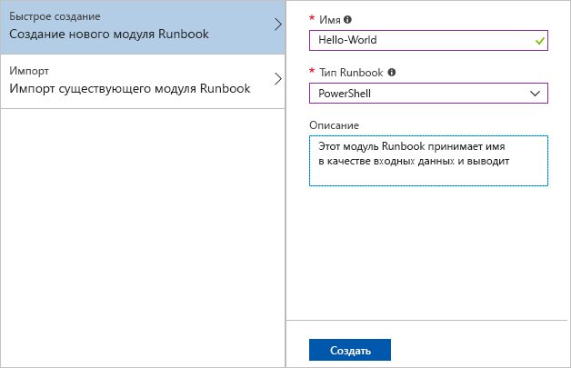
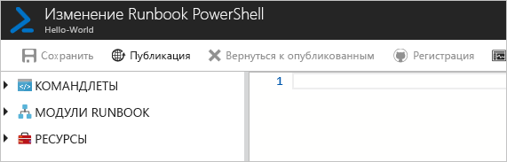
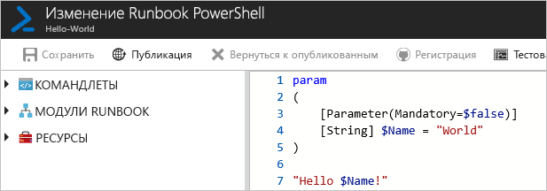
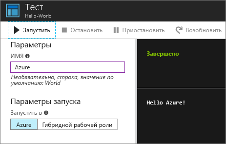
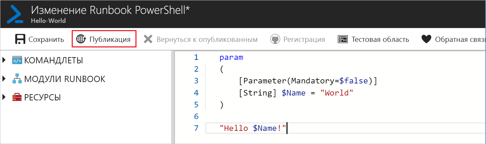
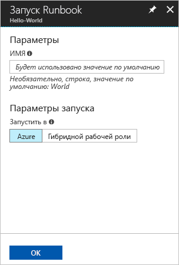
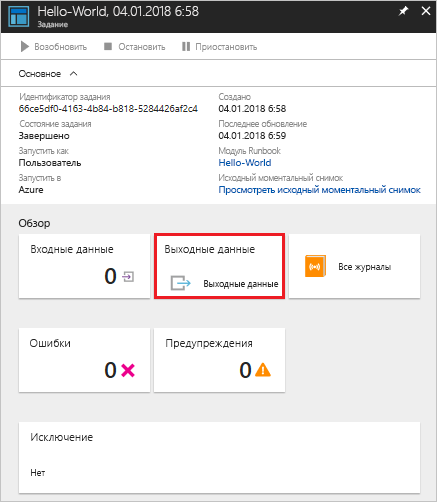
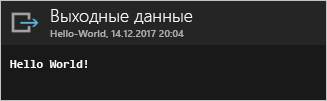

# <a name="create-an-azure-automation-runbook"></a>Создание runbook службы автоматизации Azure

В Azure можно создавать runbook для службы автоматизации Azure. Вам предоставляется браузерный пользовательский интерфейс для создания runbook службы автоматизации. В этом кратком руководстве описаны процедуры создания, изменения, тестирования и публикации runbook PowerShell службы автоматизации.

Если у вас еще нет подписки Azure, создайте [бесплатную учетную запись](https://azure.microsoft.com/free/?WT.mc_id=A261C142F) Azure, прежде чем начинать работу.

## <a name="log-in-to-azure"></a>Вход в Azure

Войдите в Azure: https://portal.azure.com

## <a name="create-runbook"></a>Создание модуля Runbook

Для начала создайте runbook. В этом кратком руководстве вы создадите простой пример runbook, который по умолчанию выводит `Hello World`.

1. Откройте учетную запись автоматизации.

1. Щелкните **Модули Runbook** в разделе **Автоматизация процессов**. Отобразится список модулей runbook.

1. Нажмите кнопку **Добавить Runbook** в верхней части списка. На странице **Добавление Runbook** выберите **Быстрое создание**.

1. Введите "Hello World" в качестве значения для параметра **Имя**, а затем выберите вариант **PowerShell** в списке **Тип Runbook**. Нажмите кнопку **Создать**.

   

1. Это действие создает новый runbook и открывает страницу **Изменение Runbook PowerShell**.

    

1. Наберите следующий код в панели редактирования или скопируйте и вставьте его туда. Этот код создает необязательный входной параметр с именем Name и значением по умолчанию World и выводит строку, содержащую значение этого входного параметра:
   
   ```powershell-interactive
   param
   (
       [Parameter(Mandatory=$false)]
       [String] $Name = "World"
   )

   "Hello $Name!"
   ```

1. Нажмите кнопку **Сохранить**, чтобы сохранить черновую копию runbook.

    

## <a name="test-the-runbook"></a>Тестирование модуля Runbook

Созданный runbook нужно протестировать, чтобы проверить правильность выполнения.

1. Щелкните **Область тестирования**, чтобы открыть страницу **Тест**.

1. Введите значение для параметра **Name** и щелкните **Запустить**. Это действие запускает задание тестирования и отображение его состояния и выходных данных.

    

1. Закройте окно **Тест**, нажав крестик (**x**) в правом верхнем углу. Нажмите **ОК** во всплывающем окне.

1. На странице **Изменение Runbook PowerShell** щелкните **Опубликовать**, чтобы опубликовать официальную версию runbook в учетной записи.

   

## <a name="run-the-runbook"></a>Запуск runbook

После публикации runbook отобразится страница с общими сведениями.

1. Щелкните **Запустить** на этой странице, чтобы открыть страницу конфигурации **Запустить Runbook** для этого runbook.

   

1. Оставьте поле **Имя** пустым, чтобы применить значение по умолчанию, и щелкните **ОК**. Задание runbook отправится на выполнение, после чего откроется страница этого задания.

   

1. Если **состояние задания** имеет значение **Выполняется** или **Завершено**, щелкнув элемент **Выходные данные**, вы откроете панель **Выходные данные**, где отображается результат работы runbook.

   

## <a name="clean-up-resources"></a>Очистка ресурсов

Удалите runbook, если он больше не нужен. Для этого выберите ненужный runbook в списке и щелкните **Удалить**.

## <a name="next-steps"></a>Дополнительная информация

В этом руководстве вы создали, изменили, протестировали и опубликовали runbook, а затем запустили задание runbook. Дополнительные сведения о runbook службы автоматизации см. в статьях о разных типах runbook, которые можно создавать и использовать в службе автоматизации.

> [!div class="nextstepaction"]
> [Automation How To - Runbook Types](./automation-runbook-types.md) (Типы модулей Runbook в службе автоматизации Azure)
