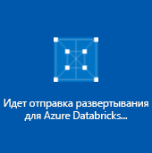
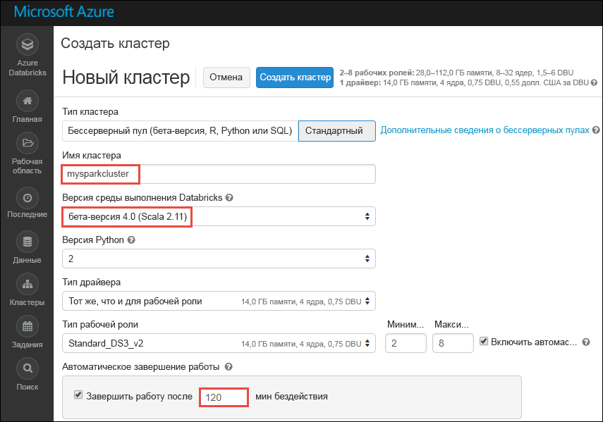

# Руководство по анализу тональности данных потоковой передачи с использованием Azure Databricks

Из этого руководства вы узнаете, как выполнять анализ тональности при потоковой передаче данных практически в реальном времени с использованием Azure Databricks. Вам следует настроить прием данных с использованием концентраторов событий Azure. Затем вы получите сообщения из концентраторов событий в Databricks Azure с помощью соединителя концентраторов событий Spark. И наконец, вы выполните анализ тональности данных потоковой передачи с использованием API Microsoft Cognitive Service.

Заканчивая работу с этим руководством, вы получите потоковые твиты из приложения Twitter с термином Azure и выполните анализ тональности в них.

На следующем рисунке показан поток в приложении.

В рамках этого руководства рассматриваются следующие задачи:

> [!div class="checklist"]
> * Создание рабочей области Azure Databricks
> * Создание кластера Spark в Azure Databricks.
> * Создание приложения Twitter для доступа к потоковым данных
> * Создание записных книжек в Azure Databricks.
> * Подключение библиотек к концентраторам событий и API Twitter.
> * Создание учетной записи Microsoft Cognitive Services и получение ключа доступа.
> * Отправка твитов в концентраторы событий.
> * Чтение твитов из концентраторов событий.
> * Анализ тональности твитов

Если у вас еще нет подписки Azure, [создайте бесплатную учетную запись Azure](https://azure.microsoft.com/free/), прежде чем начинать работу.

## предварительным требованиям

Прежде чем приступить к изучению этого руководства, убедитесь, что выполнены следующие требования.
- Пространство имен концентраторов событий Azure.
- В пространстве имен имеется концентратор событий.
- Имеется строка подключения для получения доступа к пространству имен концентраторов событий. Строка подключения должна иметь формат `Endpoint=sb://<namespace>.servicebus.windows.net/;SharedAccessKeyName=<key name>;SharedAccessKey=<key value>`.
- Имя политики общего доступа и ключ политики для концентраторов событий.

Соответствие этим требованиям можно проверить, выполнив шаги из статьи [Создание пространства имен концентраторов событий и концентратора событий с помощью портала Azure](../event-hubs/event-hubs-create.md).

## Войдите на портал Azure.

Войдите на [портал Azure](https://portal.azure.com/).

## Создание рабочей области Azure Databricks

В этом разделе вы создадите рабочую область Azure Databricks с помощью портала Azure.

1. На портале Azure выберите **Создать ресурс** > **Данные и аналитика** > **Azure Databricks**.

    

3. В разделе **службы Azure Databricks** укажите значения для создания рабочей области Databricks.

    

    Укажите следующие значения.

    |Свойство  |ОПИСАНИЕ  |
    |---------|---------|
    |**Имя рабочей области**     | Укажите имя рабочей области Databricks.        |
    |**Подписка**     | Выберите подписку Azure в раскрывающемся списке.        |
    |**Группа ресурсов**     | Укажите, следует ли создать новую группу ресурсов или использовать имеющуюся. Группа ресурсов — это контейнер, содержащий связанные ресурсы для решения Azure. Дополнительные сведения см. в [обзоре группы ресурсов Azure](../azure-resource-manager/resource-group-overview.md). |
    |**Местоположение.**     | Выберите регион **Восточная часть США 2**. Другие доступные регионы см. в статье о [доступности служб Azure по регионам](https://azure.microsoft.com/regions/services/).        |
    |**Ценовая категория**     |  Вы можете выбрать уровень **Стандартный** или **Премиум**. Дополнительные сведения об этих ценовых категориях см. на [странице цен на Databricks](https://azure.microsoft.com/pricing/details/databricks/).       |

    Установите флажок **Закрепить на панели мониторинга** и щелкните **Создать**.

4. Создание учетной записи займет несколько минут. Во время создания учетной записи на портале с правой стороны отображается плитка **Submitting deployment for Azure Databricks** (Идет отправка развертывания для Databricks). Возможно, вам потребуется прокрутить панель мониторинга, чтобы увидеть эту плитку. В верхней части экрана также будет отображаться индикатор хода выполнения. Следить за выполнением можно с помощью любого из этих элементов.

    

## Создание кластера Spark в Databricks

1. На портале Azure перейдите к созданной рабочей области Databricks, а затем выберите **Launch Workspace** (Запуск рабочей области).

2. Вы будете перенаправлены на портал Azure Databricks. На портале выберите **Кластер**.

    

3. На странице **создания кластера** укажите значения для создания кластера.

    

    Для всех остальных параметров, кроме следующих, примите значения по умолчанию:

    * Введите имя кластера.
    * В рамках этой статьи создайте кластер со средой выполнения **4.0 (бета-версия)**.
    * Убедитесь, что установлен флажок **Terminate after ___ minutes of activity** (Завершить работу после ___ минут отсутствия активности). Укажите длительность (в минутах) для завершения работы кластера, если тот не используется.

    Выберите **Create cluster** (Создать кластер). После запуска кластера можно вложить записные книжки в кластер и запустить задания Spark.

## Создание приложения Twitter

Для получения потока твитов создайте приложение в Twitter. Следуйте инструкциям по созданию приложения Twitter и запишите значения, необходимые для выполнения заданий из этого руководства.

1. В веб-браузере перейдите в раздел [Twitter Application Management](https://apps.twitter.com/) (Управление приложением Twitter) и выберите **Создание приложения**.

    

2. На странице **Create an application** (Создание приложения) укажите сведения для нового приложения, а затем выберите **Create your Twitter application** (Создать приложение Twitter).

    

3. На странице приложения перейдите на вкладку **Keys and Access Tokens** (Ключи и маркеры доступа) и скопируйте значения **ключа потребителя** и **секрета потребителя**. Кроме того, выберите **Create my access token** (Создать маркер доступа), чтобы создать маркеры доступа. Скопируйте значения **маркера доступа** и **секрета маркера доступа**.

    

Сохраните значения, полученные для приложения Twitter. Они понадобятся вам позже при работе с этим руководством.

## Подключение библиотек к кластеру Spark

В этом руководстве для отправки твитов в концентраторы событий используются API-интерфейсы Twitter. Для чтения и записи данных в концентраторах событий Azure используется [соединитель концентраторов событий Apache Spark](https://github.com/Azure/azure-event-hubs-spark). Чтобы использовать эти API-интерфейсы в рамках кластера, добавьте их в Azure Databricks в качестве библиотек, а затем свяжите их с кластером Spark. Ниже показано, как добавить библиотеку в папку **Shared** (Общая) в рабочей области.

1.  В рабочей области Azure Databricks выберите **Рабочая область** и щелкните правой кнопкой мыши **Shared** (Общая). В контекстном меню выберите **Создать** > **Библиотека**.

    

2. На странице новой библиотеки для параметра **Источник** выберите **Maven Coordinate** (Координата Maven). В поле **Coordinate** (Координата) введите координату пакета, который требуется добавить. Ниже указаны координаты Maven для библиотек, используемых в рамках этого руководства.

    * Соединитель концентраторов событий Spark — `com.microsoft.azure:azure-eventhubs-spark_2.11:2.3.1`
    * API Twitter — `org.twitter4j:twitter4j-core:4.0.6`

    

3. Выберите **Create Library** (Создать библиотеку).

4. Выберите папку, в которую добавлена библиотека, а затем выберите имя библиотеки.

    

5. На странице библиотеки выберите кластер, в котором нужно использовать библиотеку. Сразу после успешного установления связи между библиотекой и кластером состояние библиотеки изменяется на **Подключено**.

    

6. Повторите эти действия для пакета Twitter `twitter4j-core:4.0.6`.

## Получение ключа доступа Cognitive Services

В этом руководстве для анализа тональности потока твитов практически в реальном времени используются [API анализа текста Microsoft Cognitive Services](../cognitive-services/text-analytics/overview.md). Прежде чем использовать API, необходимо создать учетную запись Microsoft Cognitive Services в Azure и получить ключ доступа к API анализа текста.

1. Войдите на [портале Azure](https://portal.azure.com/).

2. Выберите действие **Создать ресурс**.

3. В Azure Marketplace выберите **Искусственный интеллект и Cognitive Services** > **API анализа текста**.

    

4. В диалоговом окне **Создать** введите следующие значения.

    

    - Введите имя учетной записи Cognitive Services.
    - Выберите подписку Azure, в рамках которой создается учетная запись.
    - Выберите расположение Azure.
    - Выберите ценовую категорию для службы. Дополнительные сведения о ценах на Cognitive Services см. на[странице расценок](https://azure.microsoft.com/pricing/details/cognitive-services/).
    - Укажите, следует ли создать новую группу ресурсов или использовать имеющуюся.

    Нажмите кнопку **Создать**.

5. После создания учетной записи выберите на вкладке **Обзор** раздел **Show access keys** (Показать ключи доступа).

    

    Кроме того, скопируйте часть URL-адреса конечной точки, как показано на снимке экрана. Этот URL-адрес понадобится для работы с руководством.

6. В разделе **Управление ключами** нажмите значок копирования возле выбранного ключа.

    

7. Сохраните значения URL-адреса конечной точки и ключа доступа, полученные на этом этапе. Они понадобятся в дальнейшем при работе с этим руководством.

## Создание записных книжек в Databricks

В этом разделе в рабочей области Databricks создается две записные книжки со следующими именами.

- **SendTweetsToEventHub** — записная книжка производителя, которая используется для получения твитов из приложения Twitter и для их потоковой передачи в концентраторы событий.
- **AnalyzeTweetsFromEventHub** — клиентская записная книжка объекта-получателя для чтения твитов из концентраторов событий и выполнения анализа тональности.

1. В левой области выберите **Рабочая область**. В раскрывающемся списке **Рабочая область** выберите **Создать**, а затем **Записная книжка**.

    

2. В диалоговом окне **Create Notebook** (Создание записной книжки) введите **SendTweetsToEventHub**, а затем выберите **Scala** в качестве языка и выберите созданный ранее кластер Spark.

    

    Нажмите кнопку **Создать**.

3. Повторите эти шаги для создания записной книжки **AnalyzeTweetsFromEventHub**.

## Отправка твитов в концентраторы событий

В записной книжке **SendTweetsToEventHub** вставьте следующий код и замените заполнители значениями вашего пространства имен концентраторов событий и созданного ранее приложения Twitter. Эта записная книжка выполняет потоковую передачу твитов с ключевым словом Azure в концентраторы событий в режиме реального времени.

    import java.util._
    import scala.collection.JavaConverters._
    import com.microsoft.azure.eventhubs._
    import java.util.concurrent._

    val namespaceName = "<EVENT HUBS NAMESPACE>"
    val eventHubName = "<EVENT HUB NAME>"
    val sasKeyName = "<POLICY NAME>"
    val sasKey = "<POLICY KEY>"
    val connStr = new ConnectionStringBuilder()
                .setNamespaceName(namespaceName)
                .setEventHubName(eventHubName)
                .setSasKeyName(sasKeyName)
                .setSasKey(sasKey)

    val pool = Executors.newFixedThreadPool(1)
    val eventHubClient = EventHubClient.create(connStr.toString(), pool)

    def sendEvent(message: String) = {
      val messageData = EventData.create(message.getBytes("UTF-8"))
      eventHubClient.get().send(messageData)
      System.out.println("Sent event: " + message + "\n")
    }

    import twitter4j._
    import twitter4j.TwitterFactory
    import twitter4j.Twitter
    import twitter4j.conf.ConfigurationBuilder

    // Twitter configuration!
    // Replace values below with yours

    val twitterConsumerKey = "<CONSUMER KEY>"
    val twitterConsumerSecret = "<CONSUMER SECRET>"
    val twitterOauthAccessToken = "<ACCESS TOKEN>"
    val twitterOauthTokenSecret = "<TOKEN SECRET>"

    val cb = new ConfigurationBuilder()
      cb.setDebugEnabled(true)
      .setOAuthConsumerKey(twitterConsumerKey)
      .setOAuthConsumerSecret(twitterConsumerSecret)
      .setOAuthAccessToken(twitterOauthAccessToken)
      .setOAuthAccessTokenSecret(twitterOauthTokenSecret)

    val twitterFactory = new TwitterFactory(cb.build())
    val twitter = twitterFactory.getInstance()

    // Getting tweets with keyword "Azure" and sending them to the Event Hub in realtime!

    val query = new Query(" #Azure ")
    query.setCount(100)
    query.lang("en")
    var finished = false
    while (!finished) {
      val result = twitter.search(query)
      val statuses = result.getTweets()
      var lowestStatusId = Long.MaxValue
      for (status <- statuses.asScala) {
        if(!status.isRetweet()){
          sendEvent(status.getText())
        }
        lowestStatusId = Math.min(status.getId(), lowestStatusId)
        Thread.sleep(2000)
      }
      query.setMaxId(lowestStatusId - 1)
    }

    // Closing connection to the Event Hub
    eventHubClient.get().close()

Чтобы запустить записную книжку, нажмите клавиши **SHIFT+ВВОД**. Вывод должен выглядеть также, как показано в следующем фрагменте кода. Каждое событие в выходных данных представляет собой твит, передающийся в концентраторы событий.

    Sent event: @Microsoft and @Esri launch Geospatial AI on Azure https://t.co/VmLUCiPm6q via @geoworldmedia #geoai #azure #gis #ArtificialIntelligence

    Sent event: Public preview of Java on App Service, built-in support for Tomcat and OpenJDK
    https://t.co/7vs7cKtvah
    #cloudcomputing #Azure

    Sent event: 4 Killer #Azure Features for #Data #Performance https://t.co/kpIb7hFO2j by @RedPixie

    Sent event: Migrate your databases to a fully managed service with Azure SQL Database Managed Instance | #Azure | #Cloud https://t.co/sJHXN4trDk

    Sent event: Top 10 Tricks to #Save Money with #Azure Virtual Machines https://t.co/F2wshBXdoz #Cloud

    ...
    ...

## Чтение твитов из концентраторов событий

В записной книжке **AnalyzeTweetsFromEventHub** вставьте следующий код и замените заполнители значениями созданных ранее концентраторов событий Azure. Эта записная книжка считывает твиты, переданные ранее в концентраторы событий с помощью записной книжки **SendTweetsToEventHub**.

    import org.apache.spark.eventhubs._

    // Build connection string with the above information
    val connectionString = ConnectionStringBuilder("<EVENT HUBS CONNECTION STRING>")
      .setEventHubName("<EVENT HUB NAME>")
      .build

    val customEventhubParameters =
      EventHubsConf(connectionString)
      .setMaxEventsPerTrigger(5)

    val incomingStream = spark.readStream.format("eventhubs").options(customEventhubParameters.toMap).load()

    incomingStream.printSchema

    // Sending the incoming stream into the console.
    // Data comes in batches!
    incomingStream.writeStream.outputMode("append").format("console").option("truncate", false).start().awaitTermination()

Вы получите следующие выходные данные:

    root
     |-- body: binary (nullable = true)
     |-- offset: long (nullable = true)
     |-- seqNumber: long (nullable = true)
     |-- enqueuedTime: long (nullable = true)
     |-- publisher: string (nullable = true)
     |-- partitionKey: string (nullable = true)

    -------------------------------------------
    Batch: 0
    -------------------------------------------
    +------+------+--------------+---------------+---------+------------+
    |body  |offset|sequenceNumber|enqueuedTime   |publisher|partitionKey|
    +------+------+--------------+---------------+---------+------------+
    |[50 75 62 6C 69 63 20 70 72 65 76 69 65 77 20 6F 66 20 4A 61 76 61 20 6F 6E 20 41 70 70 20 53 65 72 76 69 63 65 2C 20 62 75 69 6C 74 2D 69 6E 20 73 75 70 70 6F 72 74 20 66 6F 72 20 54 6F 6D 63 61 74 20 61 6E 64 20 4F 70 65 6E 4A 44 4B 0A 68 74 74 70 73 3A 2F 2F 74 2E 63 6F 2F 37 76 73 37 63 4B 74 76 61 68 20 0A 23 63 6C 6F 75 64 63 6F 6D 70 75 74 69 6E 67 20 23 41 7A 75 72 65]                              |0     |0             |2018-03-09 05:49:08.86 |null     |null        |
    |[4D 69 67 72 61 74 65 20 79 6F 75 72 20 64 61 74 61 62 61 73 65 73 20 74 6F 20 61 20 66 75 6C 6C 79 20 6D 61 6E 61 67 65 64 20 73 65 72 76 69 63 65 20 77 69 74 68 20 41 7A 75 72 65 20 53 51 4C 20 44 61 74 61 62 61 73 65 20 4D 61 6E 61 67 65 64 20 49 6E 73 74 61 6E 63 65 20 7C 20 23 41 7A 75 72 65 20 7C 20 23 43 6C 6F 75 64 20 68 74 74 70 73 3A 2F 2F 74 2E 63 6F 2F 73 4A 48 58 4E 34 74 72 44 6B]            |168   |1             |2018-03-09 05:49:24.752|null     |null        |
    +------+------+--------------+---------------+---------+------------+

    -------------------------------------------
    Batch: 1
    -------------------------------------------
    ...
    ...

Так как выходные данные отображаются в двоичном режиме, используйте следующий фрагмент кода, чтобы преобразовать их в строку.

    import org.apache.spark.sql.types._
    import org.apache.spark.sql.functions._

    // Event Hub message format is JSON and contains "body" field
    // Body is binary, so we cast it to string to see the actual content of the message
    val messages =
      incomingStream
      .withColumn("Offset", $"offset".cast(LongType))
      .withColumn("Time (readable)", $"enqueuedTime".cast(TimestampType))
      .withColumn("Timestamp", $"enqueuedTime".cast(LongType))
      .withColumn("Body", $"body".cast(StringType))
      .select("Offset", "Time (readable)", "Timestamp", "Body")

    messages.printSchema

    messages.writeStream.outputMode("append").format("console").option("truncate", false).start().awaitTermination()

Выходные данные будут выглядеть, как следующий фрагмент кода:

    root
     |-- Offset: long (nullable = true)
     |-- Time (readable): timestamp (nullable = true)
     |-- Timestamp: long (nullable = true)
     |-- Body: string (nullable = true)

    -------------------------------------------
    Batch: 0
    -------------------------------------------
    +------+-----------------+----------+-------+
    |Offset|Time (readable)  |Timestamp |Body
    +------+-----------------+----------+-------+
    |0     |2018-03-09 05:49:08.86 |1520574548|Public preview of Java on App Service, built-in support for Tomcat and OpenJDK
    https://t.co/7vs7cKtvah
    #cloudcomputing #Azure          |
    |168   |2018-03-09 05:49:24.752|1520574564|Migrate your databases to a fully managed service with Azure SQL Database Managed Instance | #Azure | #Cloud https://t.co/sJHXN4trDk    |
    |0     |2018-03-09 05:49:02.936|1520574542|@Microsoft and @Esri launch Geospatial AI on Azure https://t.co/VmLUCiPm6q via @geoworldmedia #geoai #azure #gis #ArtificialIntelligence|
    |176   |2018-03-09 05:49:20.801|1520574560|4 Killer #Azure Features for #Data #Performance https://t.co/kpIb7hFO2j by @RedPixie                                                    |
    +------+-----------------+----------+-------+
    -------------------------------------------
    Batch: 1
    -------------------------------------------
    ...
    ...

Таким образом мы почти в реальном времени передаем потоком данные из концентраторов событий Azure в Azure Databricks, используя соединитель концентраторов событий для Apache Spark. Дополнительные сведения о том, как использовать соединитель концентраторов событий для Spark, см. в [документации соединителя](https://github.com/Azure/azure-event-hubs-spark/tree/master/docs).

## Анализ тональности твитов

В этом разделе выполняется анализ тональности твитов, полученных с помощью API приложения Twitter. В этом разделе добавляется фрагменты кода к той же записной книжке **AnalyzeTweetsFromEventHub**.

Начните с добавления новой ячейки кода в записной книжке и вставьте фрагмент кода, приведенный ниже. Этот фрагмент кода определяет типы данных для работы с API языка и тональности.

    import java.io._
    import java.net._
    import java.util._

    class Document(var id: String, var text: String, var language: String = "", var sentiment: Double = 0.0) extends Serializable

    class Documents(var documents: List[Document] = new ArrayList[Document]()) extends Serializable {

        def add(id: String, text: String, language: String = "") {
            documents.add (new Document(id, text, language))
        }
        def add(doc: Document) {
            documents.add (doc)
        }
    }

Добавить новую ячейку кода и вставьте фрагмент кода, приведенный ниже. Этот фрагмент кода требуется для синтаксического анализа строк в формате JSON.

    class CC[T] extends Serializable { def unapply(a:Any):Option[T] = Some(a.asInstanceOf[T]) }
    object M extends CC[scala.collection.immutable.Map[String, Any]]
    object L extends CC[scala.collection.immutable.List[Any]]
    object S extends CC[String]
    object D extends CC[Double]

Добавьте новую ячейку кода и вставьте фрагмент кода, приведенный ниже. В этом фрагменте кода определяется объект, содержащий функции вызова API анализа текста для определение языка и выполнения анализа тональности. Убедитесь, что вы заменили заполнители `<PROVIDE ACCESS KEY HERE>` и `<PROVIDE HOST HERE>` на значения, полученные для вашей учетной записи Cognitive Services.

    import javax.net.ssl.HttpsURLConnection
    import com.google.gson.Gson
    import com.google.gson.GsonBuilder
    import com.google.gson.JsonObject
    import com.google.gson.JsonParser
    import scala.util.parsing.json._

    object SentimentDetector extends Serializable {

      // Cognitive Services API connection settings
      val accessKey = "<PROVIDE ACCESS KEY HERE>"
      val host = "<PROVIDE HOST HERE>"
      val languagesPath = "/text/analytics/v2.0/languages"
      val sentimentPath = "/text/analytics/v2.0/sentiment"
      val languagesUrl = new URL(host+languagesPath)
      val sentimenUrl = new URL(host+sentimentPath)

      def getConnection(path: URL): HttpsURLConnection = {
        val connection = path.openConnection().asInstanceOf[HttpsURLConnection]
        connection.setRequestMethod("POST")
        connection.setRequestProperty("Content-Type", "text/json")
        connection.setRequestProperty("Ocp-Apim-Subscription-Key", accessKey)
        connection.setDoOutput(true)
        return connection
      }

      def prettify (json_text: String): String = {
        val parser = new JsonParser()
        val json = parser.parse(json_text).getAsJsonObject()
        val gson = new GsonBuilder().setPrettyPrinting().create()
        return gson.toJson(json)
      }

      // Handles the call to Cognitive Services API.
      // Expects Documents as parameters and the address of the API to call.
      // Returns an instance of Documents in response.
      def processUsingApi(inputDocs: Documents, path: URL): String = {
        val docText = new Gson().toJson(inputDocs)
        val encoded_text = docText.getBytes("UTF-8")
        val connection = getConnection(path)
        val wr = new DataOutputStream(connection.getOutputStream())
        wr.write(encoded_text, 0, encoded_text.length)
        wr.flush()
        wr.close()

        val response = new StringBuilder()
        val in = new BufferedReader(new InputStreamReader(connection.getInputStream()))
        var line = in.readLine()
        while (line != null) {
            response.append(line)
            line = in.readLine()
        }
        in.close()
        return response.toString()
      }

      // Calls the language API for specified documents.
      // Returns a documents with language field set.
      def getLanguage (inputDocs: Documents): Documents = {
        try {
          val response = processUsingApi(inputDocs, languagesUrl)
          // In case we need to log the json response somewhere
          val niceResponse = prettify(response)
          val docs = new Documents()
          val result = for {
                // Deserializing the JSON response from the API into Scala types
                Some(M(map)) <- scala.collection.immutable.List(JSON.parseFull(niceResponse))
                L(documents) = map("documents")
                M(document) <- documents
                S(id) = document("id")
                L(detectedLanguages) = document("detectedLanguages")
                M(detectedLanguage) <- detectedLanguages
                S(language) = detectedLanguage("iso6391Name")
          } yield {
                docs.add(new Document(id = id, text = id, language = language))
          }
          return docs
        } catch {
              case e: Exception => return new Documents()
        }
      }

      // Calls the sentiment API for specified documents. Needs a language field to be set for each of them.
      // Returns documents with sentiment field set, taking a value in the range from 0 to 1.
      def getSentiment (inputDocs: Documents): Documents = {
        try {
          val response = processUsingApi(inputDocs, sentimenUrl)
          val niceResponse = prettify(response)
          val docs = new Documents()
          val result = for {
                // Deserializing the JSON response from the API into Scala types
                Some(M(map)) <- scala.collection.immutable.List(JSON.parseFull(niceResponse))
                L(documents) = map("documents")
                M(document) <- documents
                S(id) = document("id")
                D(sentiment) = document("score")
          } yield {
                docs.add(new Document(id = id, text = id, sentiment = sentiment))
          }
          return docs
        } catch {
            case e: Exception => return new Documents()
        }
      }
    }

    // User Defined Function for processing content of messages to return their sentiment.
    val toSentiment = udf((textContent: String) => {
      val inputDocs = new Documents()
      inputDocs.add (textContent, textContent)
      val docsWithLanguage = SentimentDetector.getLanguage(inputDocs)
      val docsWithSentiment = SentimentDetector.getSentiment(docsWithLanguage)
      if (docsWithLanguage.documents.isEmpty) {
        // Placeholder value to display for no score returned by the sentiment API
        (-1).toDouble
      } else {
        docsWithSentiment.documents.get(0).sentiment.toDouble
      }
    })

Добавьте последнюю ячейку кода, чтобы подготовить кадр данных с содержимым твита и тональностью, связанной с этим твитом.

    // Prepare a dataframe with Content and Sentiment columns
    val streamingDataFrame = incomingStream.selectExpr("cast (body as string) AS Content").withColumn("Sentiment", toSentiment($"Content"))

    // Display the streaming data with the sentiment
    streamingDataFrame.writeStream.outputMode("append").format("console").option("truncate", false).start().awaitTermination()

Вы должны увидеть выходные данные, подобные следующему фрагменту кода:

    -------------------------------------------
    Batch: 0
    -------------------------------------------
    +--------------------------------+------------------+
    |Content                         |Sentiment         |
    +--------------------------------+------------------+
    |Public preview of Java on App Service, built-in support for Tomcat and OpenJDK
    https://t.co/7vs7cKtvah   #cloudcomputing #Azure          |0.7761918306350708|
    |Migrate your databases to a fully managed service with Azure SQL Database Managed Instance | #Azure | #Cloud https://t.co/sJHXN4trDk    |0.8558163642883301|
    |@Microsoft and @Esri launch Geospatial AI on Azure https://t.co/VmLUCiPm6q via @geoworldmedia #geoai #azure #gis #ArtificialIntelligence|0.5               |
    |4 Killer #Azure Features for #Data #Performance https://t.co/kpIb7hFO2j by @RedPixie                                                    |0.5               |
    +--------------------------------+------------------+

Чем ближе значение в колонке**Тональность** к **1**, тем большее удовлетворение от работы в Azure. Чем ближе значение к **0**,тем больше проблем испытывают пользователи при работе с Microsoft Azure.

Вот и все! С помощью Azure Databricks вы успешно выполнили потоковую передачу данных, использовали данные потока в соединителе концентраторов событий Azure и выполнили анализ тональности данных потоковой передачи практически в реальном времени.

## Очистка ресурсов

После выполнения заданий из этого руководства вы можете завершить работу кластера. Для этого в рабочей области Azure Databricks на левой панели выберите **Кластеры**. Для кластера, работу которого необходимо завершить, переместите указатель мыши на многоточие в столбце **Actions** (Действия) и выберите значок **Завершить**.

Если не завершить работу кластера вручную, это можно сделать автоматически, выбрав флажок **Terminate after __ minutes of inactivity** (Завершить работу после __ минут бездействия) во время создания кластера. В этом случае работа кластера должна завершиться автоматически, если кластер был неактивным в течение определенного времени.

## Дополнительная информация
В этом руководстве вы узнали, как с помощью Azure Databricks выполнить потоковую передачу данных в концентраторы событий Azure с последующим чтением данных потоковой передачи из концентраторов событий в реальном времени. Вы научились выполнять следующие задачи:
> [!div class="checklist"]
> * Создание рабочей области Azure Databricks
> * Создание кластера Spark в Azure Databricks.
> * Создание приложения Twitter для доступа к потоковым данных
> * Создание записных книжек в Azure Databricks.
> * Добавление и подключение библиотек для концентраторов событий и API Twitter.
> * Создание учетной записи Microsoft Cognitive Services и получение ключа доступа.
> * Отправка твитов в концентраторы событий.
> * Чтение твитов из концентраторов событий.
> * Анализ тональности твитов.

Перейдите к следующему руководству, чтобы ознакомиться с выполнением задач машинного обучения с помощью Azure Databricks.

> [!div class="nextstepaction"]
>[Decision Trees Example](https://docs.azuredatabricks.net/spark/latest/mllib/decision-trees.html) (Пример деревьев принятия решений)
