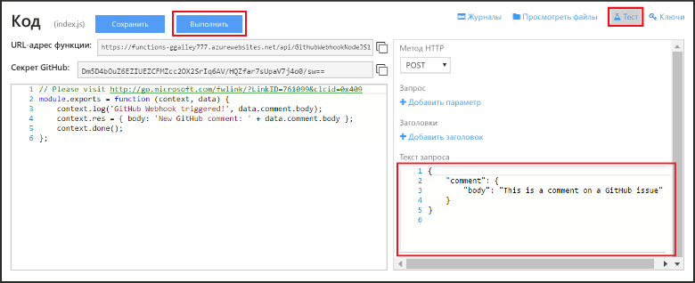

# Создание функции Azure объекта webhook или API
Функции Azure — это управляемая событиями среда вычислений по требованию. Она позволяет создавать выполняемые по расписанию или активируемые блоки кода, реализуемые с помощью разных языков программирования. Дополнительные сведения о функциях Azure см. в статье [Обзор функций Azure](functions-overview.md).

В этой статье показано, как создать функцию JavaScript, вызываемую объектом webhook GitHub. Новая функция создается на основе стандартного шаблона на портале функций Azure. Вы также можете ознакомиться с коротким видео, чтобы увидеть, как эти действия выполняются на портале.

Общую процедуру, описанную в этом руководстве, можно также использовать для создания функции на языке C# или F#, а не JavaScript. 

## Просмотреть видео
Из этого видео вы узнаете, как выполнять основные шаги в этом руководстве. 

>[!VIDEO https://channel9.msdn.com/Series/Windows-Azure-Web-Sites-Tutorials/Create-a-Web-Hook-or-API-Azure-Function/player]
>
>

## Предварительные требования

Для работы с этим учебником необходимо следующее.

+ Активная учетная запись Azure. Если у вас нет учетной записи, вы можете [зарегистрироваться для получения бесплатной учетной записи Azure](https://azure.microsoft.com/free/).  
 Чтобы выполнить действия, описанные в этой статье, без учетной записи Azure, можно также использовать [возможность быстрого создания Функций](https://functions.azure.com/try).
+ Учетная запись GitHub. Если у вас ее нет, вы можете [зарегистрироваться для получения бесплатной учетной записи GitHub](https://github.com/join). 

## Создание активируемой объектом webhook функции на основе шаблона
Выполнение функций в Azure происходит с помощью приложения функций. 

1. Перейдите на [портал функций Azure](https://functions.azure.com/signin) и войдите, используя свою учетную запись Azure.

2. Если у вас есть готовое приложение функций, выберите его из списка **приложений функций** и нажмите кнопку **Открыть**. Чтобы создать приложение-функцию, введите уникальное **имя** нового приложения-функции или воспользуйтесь созданным. Выберите предпочтительный **регион**, а затем щелкните **Создать и начать работу**. 

3. В приложении-функции щелкните **+ New Function** (+ Создать функцию) > **GitHub Webhook - JavaScript** (Объект webhook GitHub — JavaScript) > **Создать**. При этом из указанного шаблона будет создана функция с именем по умолчанию. Кроме того, функцию можно создать на языке C# или F#.
   
     

4. На вкладке **Разработка** запишите пример функции express.js в окне **Код**. Эта функция получает запрос GitHub из объекта webhook примечания к вопросу, регистрирует текст вопроса в журнале и отправляет ответ в объект webhook как `New GitHub comment: <Your issue comment text>`.

     

1. Скопируйте и сохраните значения параметров **URL-адрес функции** и **Секрет GitHub**. Эти значения понадобятся вам в следующем разделе для настройки объекта webhook в GitHub. 

2. Щелкните **Тест**, запишите стандартный текст JSON примечания к вопросу в области **Текст запроса**, а затем щелкните **Запустить**. 

    
   
    > [!NOTE]
    > Новую функцию на основе шаблона всегда можно протестировать прямо на вкладке **Разработка**, указав любые ожидаемые данные текста запроса JSON и нажав кнопку **Запустить**. В этом случае шаблон включает стандартный текст примечания к вопросу. 

Затем потребуется создать фактический объект webhook в репозитории GitHub.

## Настройка объекта webhook
1. На сайте GitHub перейдите в свой репозиторий. Вы можете использовать любые репозитории, для которых создали ответвления.
 
2. Щелкните **Settings** (Параметры) > **Webhooks & services** (Объекты webhook и службы)  > **Add webhook** (Добавить объект webhook).
   
       

3. Вставьте URL-адрес и секрет функции в поле **Payload URL** (URL-адрес полезных данных) и **Секрет**, а для параметра **Тип содержимого** выберите значение **application/json**.

4. Установите переключатель **Let me select individual events** (Выбрать отдельные события), выберите **Issue comment** (Примечание к вопросу) и щелкните **Add webhook** (Добавить объект webhook).
   
     

На этом этапе объект webhook GitHub настраивается для активации функции при добавлении нового примечания к вопросу.  
Теперь проверим его работу.

## Проверка функции
1. В репозитории GitHub откройте вкладку **Issues** (Вопросы) в новом окне браузера,

2. щелкните **New Issue** (Создать вопрос), введите название, а затем щелкните **Submit new issue** (Отправить новый вопрос). Можно также открыть существующий вопрос.

2. В вопросе введите комментарий и нажмите кнопку **Comment**(Добавить примечание). 

3. В другом окне GitHub щелкните **Edit** (Изменить) рядом с новым объектом webhook, прокрутите к разделу **Recent Deliveries** (Последние доставленные объекты) и убедитесь, что запрос объекта webhook был отправлен и текст запроса — `New GitHub comment: <Your issue comment text>`.

3. На портале функций прокрутите страницу до раздела журналов. Вы увидите, что функция была активирована и значение `New GitHub comment: <Your issue comment text>` записано в журналы потоковой передачи.

## Дальнейшие действия
Дополнительные сведения о функциях Azure см. в следующих статьях.

* [Справочник разработчика по функциям Azure](functions-reference.md)  
  Справочник программиста по созданию функций.
* [Testing Azure Functions](functions-test-a-function.md)  
  Описание различных средств и методов тестирования функций.
* [Масштабирование функций Azure](functions-scale.md)  
  Обсуждение планов обслуживания, доступных для использования с функциями Azure (включая план потребления), а также выбор подходящего плана.  

[!INCLUDE [Getting Started Note](../../includes/functions-get-help.md)]

