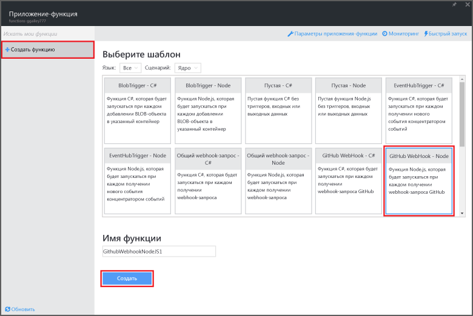
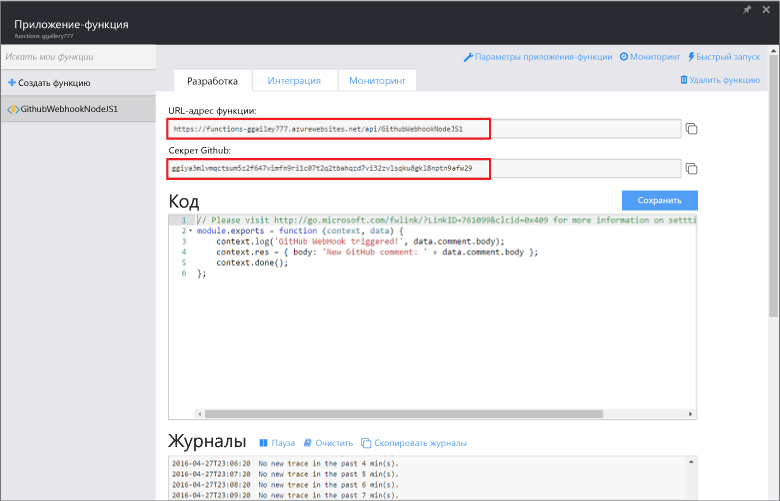
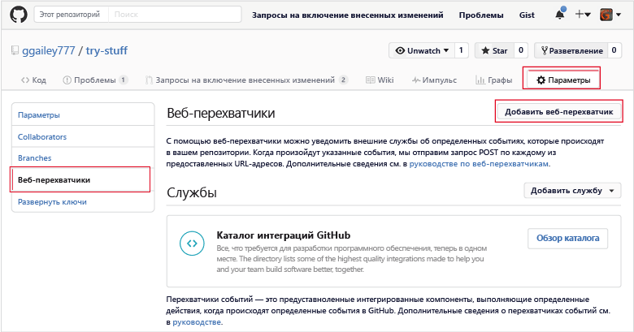
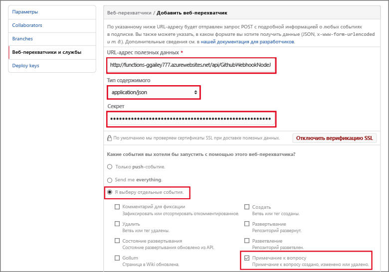

<properties
   pageTitle="Создание обработчика webhook или функции API Azure | Microsoft Azure"
   description="Используйте Функции Azure для создания функции, инициируемой обработчиком webhook или вызовом API."
   services="azure-functions"
   documentationCenter="na"
   authors="ggailey777"
   manager="erikre"
   editor=""
   tags=""
   />

<tags
   ms.service="functions"
   ms.devlang="multiple"
   ms.topic="get-started-article"
   ms.tgt_pltfrm="multiple"
   ms.workload="na"
   ms.date="08/30/2016"
   ms.author="glenga"/>
   
# Создание функции Azure объекта webhook или API

Функции Azure — это ориентированная на события среда вычислений по требованию, которая позволяет создавать выполняемые по расписанию или активируемые блоки кода, реализованные с помощью разных языков программирования. Дополнительные сведения о функциях Azure см. в статье [Обзор функций Azure](functions-overview.md).

В этом разделе демонстрируется создание функции Node.js, вызываемой объектом webhook GitHub. Новая функция создается на основе стандартного шаблона на портале функций Azure. Вы также можете ознакомиться с коротким видео, чтобы увидеть, как эти действия выполняются на портале.

## Просмотреть видео

В этом видео показано, как выполнять основные шаги, описанные в этом руководстве.

[AZURE.VIDEO create-a-web-hook-or-api-azure-function]

##Создание активируемой объектом webhook функции на основе шаблона

Выполнение функций в Azure происходит с помощью приложения функций. Для создания функций необходима активная учетная запись Azure. Если у вас ее нет, воспользуйтесь [бесплатной учетной записью Azure](https://azure.microsoft.com/free/).

1. Перейдите на [портал функций Azure](https://functions.azure.com/signin) и войдите, используя свою учетную запись Azure.

2. Если у вас есть готовое приложение функций, выберите его в списке **приложений функций** и нажмите кнопку **Открыть**. Чтобы создать приложение функций, введите уникальное **имя** нового приложения функций или воспользуйтесь созданным, выберите предпочтительный **регион**, а затем щелкните **Создать + приступить к работе**.

3. В приложении функций щелкните **+ Создать функцию** > **Объект Webhook GitHub - узел** > **Создать**. При этом будет создана функция с именем по умолчанию, основанная на указанном шаблоне.

	

4. На вкладке **Разработка** запишите пример функции express.js в окне **Код**. Эта функция получает запрос GitHub из объекта webhook примечания к вопросу, регистрирует текст вопроса в журнале и отправляет ответ в объект webhook как `New GitHub comment: <Your issue comment text>`.

	

5. Скопируйте значения **URL-адрес функции** и **Секрет GitHub**. Они потребуются вам при создании объекта webhook в GitHub.

6. Прокрутите страницу до раздела **Запуск**, запишите стандартный текст JSON примечания к вопросу в тексте запроса, затем щелкните **Запустить**.
 
	Новую функцию на основе шаблона всегда можно протестировать прямо на вкладке **Разработка**, указав любые ожидаемые данные текста запроса JSON и нажав кнопку **Запустить**. В этом случае шаблон включает стандартный текст примечания к вопросу.
 
Затем потребуется создать фактический объект webhook в репозитории GitHub.

##Настройка объекта webhook

1. В GitHub перейдите в принадлежащий вам репозиторий (включая все разветвления репозитория).
 
2. Щелкните **Settings** (Параметры) > **Webhooks & services** (Объекты webhook и службы) > **Add webhook** (Добавить объект webhook).

	

3. Вставьте URL-адрес и секрет функции в поле **Payload URL** (URL-адрес полезных данных) и **Secret** (Секрет), а затем щелкните **Let me select individual events** (Выбрать отдельные события), выберите **Issue comment** (Примечание к вопросу) и щелкните **Add webhook** (Добавить объект webhook).

	

На этом этапе объект webhook GitHub настраивается для активации функции при добавлении нового примечания к вопросу. Теперь проверим его работу.

##Проверка функции

1. В репозитории GitHub откройте вкладку **Issues** (Вопросы) в новом окне браузера, щелкните **New Issue** (Создать вопрос), введите название, а затем щелкните **Submit new issue** (Отправить новый вопрос). Можно также открыть существующий вопрос.

2. В вопросе введите комментарий и нажмите кнопку **Comment** (Добавить примечание). На этом этапе вы можете вернуться к новому объекту webhook в GitHub и в разделе **Recent Deliveries** (Последние доставленные объекты) вы увидите, что запрос объекта webhook был отправлен и текст запроса — `New GitHub comment: <Your issue comment text>`.

3. На портале функций прокрутите страницу до раздела журналов. Вы увидите, что функция была активирована и значение `New GitHub comment: <Your issue comment text>` записано в журналы потоковой передачи.

##Дальнейшие действия

Дополнительные сведения о функциях Azure см. в следующих статьях.

+ [Справочник разработчика по функциям Azure](functions-reference.md) Справочник программиста по созданию функций.
+ [Testing Azure Functions](functions-test-a-function.md) (Тестирование функций Azure). Описание различных средств и методов тестирования функций.
+ [How to scale Azure Functions](functions-scale.md) (Масштабирование функций Azure). Обсуждение планов обслуживания Azure, доступных для использования с функциями Azure (включая динамический план обслуживания), а также выбор подходящего плана.

[AZURE.INCLUDE [Начало работы](../../includes/functions-get-help.md)]

<!---HONumber=AcomDC_0928_2016-->