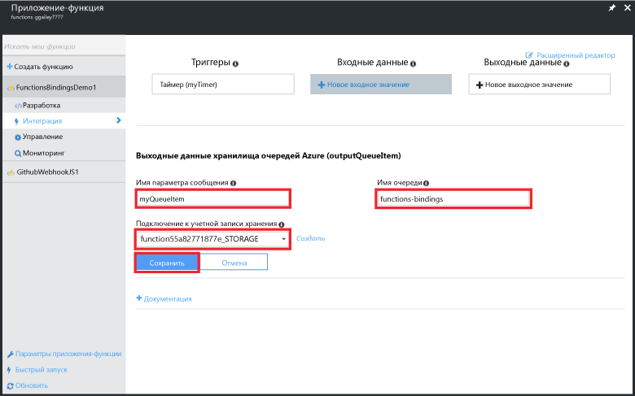
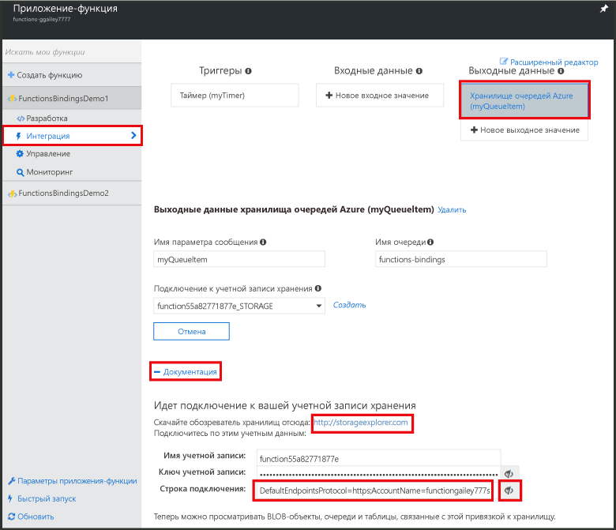
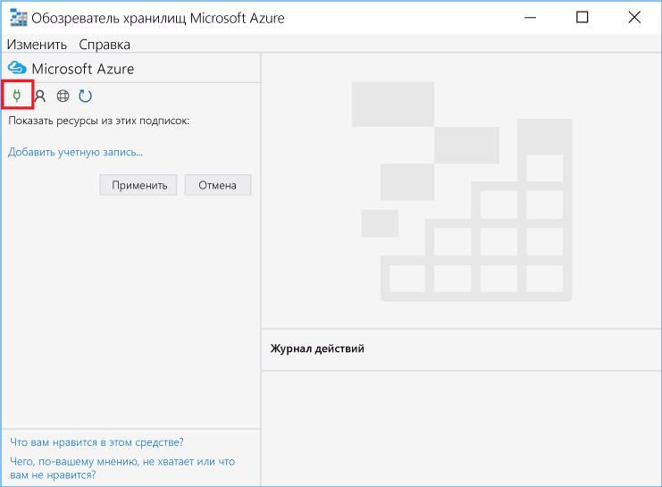
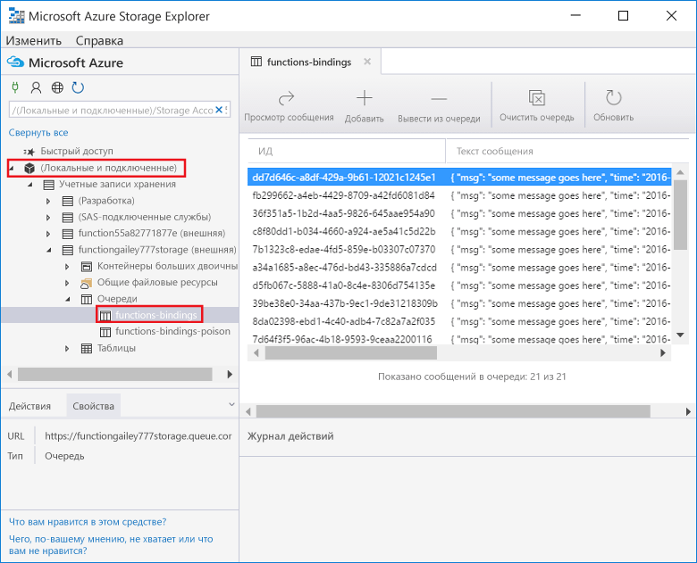
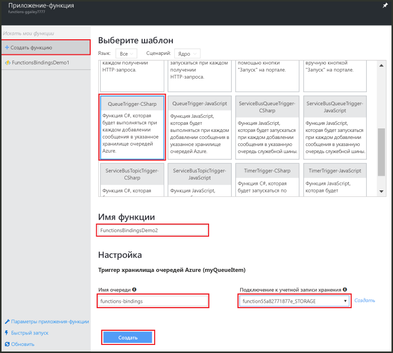
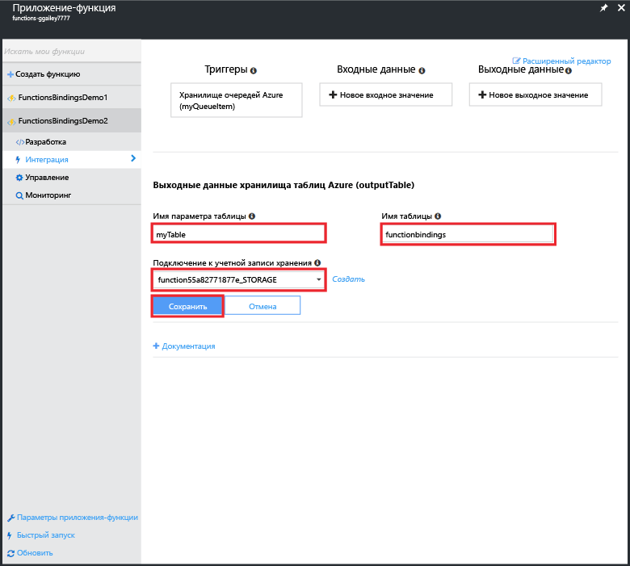
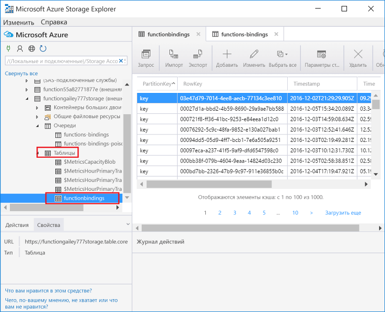

# <a name="create-an-azure-function-connected-to-an-azure-service"></a>Создание функции Azure, подключенной к службе Azure

В этой статье показано, как создать функцию Azure, прослушивающую сообщения в очереди службы хранилища Azure и копирующую их в строки таблицы службы хранилища Azure. Функция, активируемая с помощью таймера, используется для загрузки сообщений в очередь. Вторая функция считывает из очереди и записывает сообщения в таблицу. Функции Azure создают очередь и таблицу автоматически на основе определений привязки. 

Чтобы усложнить задачу, одна функция написана на языке JavaScript, а другая — с использованием скрипта C#. На этом примере показано, что приложение-функция может содержать функции на разных языках.

## <a name="watch-the-video"></a>Просмотреть видео
>[!VIDEO https://channel9.msdn.com/Series/Windows-Azure-Web-Sites-Tutorials/Create-an-Azure-Function-which-binds-to-an-Azure-service/player]
>
>

## <a name="create-a-function-that-writes-to-the-queue"></a>Создание функции, выполняющей запись в очередь

Перед подключением к очереди хранилища необходимо создать функцию, загружающую очередь сообщений. Эта функция JavaScript использует триггер с таймером, записывающий сообщение в очередь каждые 10 секунд. Если у вас нет учетной записи Azure, [попробуйте использовать Функции Azure](https://functions.azure.com/try) или [создайте бесплатную учетную запись Azure](https://azure.microsoft.com/free/).

1. Войдите на портал Azure и найдите свое приложение-функцию.

2. Щелкните **Новая функция** > **TimerTrigger-JavaScript**. 

3. Присвойте функции имя **FunctionsBindingsDemo1**, введите значение выражения CRON `0/10 * * * * *` в поле **Расписание** и нажмите кнопку **Создать**.
   
    

    Вы создали функцию, активируемую с помощью таймера, которая запускается каждые 10 секунд.

5. На вкладке **Разработка** щелкните **Журналы** и просмотрите действия в журнале. Каждые 10 секунд в журнале будет появляться запись.
   
    

## <a name="add-a-message-queue-output-binding"></a>Добавление выходной привязки очереди сообщений

1. На вкладке **Интегрировать** выберите **Новые выходные данные** > **Хранилище очередей Azure** > **Выбрать**.

    

2. Введите `myQueueItem` в поле **Имя параметра сообщения** и `functions-bindings` — в поле **Имя очереди**. Выберите существующее **подключение к учетной записи хранения** или щелкните **new** (создать), чтобы создать подключение к учетной записи хранения, а затем нажмите кнопку **Сохранить**.  

    

1. Вернитесь к вкладке **Разработка** и добавьте следующий код в функцию:
   
    ```javascript
   
    function myQueueItem() 
    {
        return {
            msg: "some message goes here",
            time: "time goes here"
        }
    }
   
    ```
2. Найдите оператор *if* в строке 9 функции и вставьте после него следующий оператор.
   
    ```javascript
   
    var toBeQed = myQueueItem();
    toBeQed.time = timeStamp;
    context.bindings.myQueueItem = toBeQed;
   
    ```  
   
    Этот код создает элемент **myQueueItem** и задает для его свойства **time** текущую метку времени. Затем он добавляет новый элемент очереди в привязку **myQueue** контекста.

3. Щелкните **Сохранить и запустить**.

## <a name="view-storage-updates-by-using-storage-explorer"></a>Просмотр обновлений хранилища с помощью обозревателя службы хранилища
Выполнение функции можно проверить, просмотрев сообщения в созданной очереди.  Подключиться к очереди хранилища можно с помощью Cloud Explorer в Visual Studio. Тем не менее благодаря обозревателю службы хранилища Microsoft Azure подключение к учетной записи хранения на портале упрощено.

1. На вкладке **Интегрировать** щелкните выходную привязку очереди и элемент **Документация**, раскройте узел со строкой подключения для учетной записи хранения и скопируйте значение. Это значение используется для подключения к учетной записи хранения.

    


2. Если это еще не сделано, скачайте и установите [обозреватель службы хранилища Microsoft Azure](http://storageexplorer.com). 
 
3. В обозревателе службы хранилища щелкните значок для подключения к службе хранилища Azure, вставьте строку подключения в поле и завершите работу с мастером.

    

4. В разделе **Local and attached** (Локальные и присоединенные) разверните узел **Учетные записи хранения** > ваша учетная запись хранения > **Очереди** > **functions-bindings** и убедитесь, что сообщения записываются в очередь.

    

    Если очередь не существует или она пустая, скорее всего, произошла проблема с привязкой или кодом функции.

## <a name="create-a-function-that-reads-from-the-queue"></a>Создание функции, выполняющей чтение из очереди

Создав функцию для добавления сообщений в очередь, можно создать другую функцию, выполняющую чтение из очереди и окончательную запись сообщений в таблицы службы хранилища Azure.

1. Щелкните **Новая функция** > **QueueTrigger-CSharp**. 
 
2. Присвойте функции имя `FunctionsBindingsDemo2`, введите **functions-bindings** в поле **Имя очереди**, выберите существующую учетную запись хранения или создайте ее и нажмите кнопку **Создать**.

     

3. (Необязательно.) Вы можете проверить, выполняется ли новая функция, просмотрев новую очередь в обозревателе службы хранилища, как и раньше. Кроме того, можно использовать Cloud Explorer в Visual Studio.  

4. (Необязательно.) Обновите очередь **functions-bindings**. Обратите внимание, что элементы удалены из очереди. Это происходит, так как функция привязана к очереди **functions-bindings** в качестве входного триггера и она считывает очередь. 
 
## <a name="add-a-table-output-binding"></a>Добавление выходной привязки таблицы

1. В FunctionsBindingsDemo2 щелкните **Интегрировать** > **Новые выходные данные** > **Хранилище таблиц Azure** > **Выбрать**.

     

2. Введите `TableItem` в поле **Имя таблицы** и `functionbindings` — в поле **Имя параметра таблицы**, выберите **подключение к учетной записи хранения** или создайте его и нажмите кнопку **Сохранить**.

    
   
3. На вкладке **Разработка** замените имеющийся код функции на приведенный ниже:
   
    ```cs
    
    using System;
    
    public static void Run(QItem myQueueItem, ICollector<TableItem> myTable, TraceWriter log)
    {    
        TableItem myItem = new TableItem
        {
            PartitionKey = "key",
            RowKey = Guid.NewGuid().ToString(),
            Time = DateTime.Now.ToString("hh.mm.ss.ffffff"),
            Msg = myQueueItem.Msg,
            OriginalTime = myQueueItem.Time    
        };
        
        // Add the item to the table binding collection.
        myTable.Add(myItem);
    
        log.Verbose($"C# Queue trigger function processed: {myItem.RowKey} | {myItem.Msg} | {myItem.Time}");
    }
    
    public class TableItem
    {
        public string PartitionKey {get; set;}
        public string RowKey {get; set;}
        public string Time {get; set;}
        public string Msg {get; set;}
        public string OriginalTime {get; set;}
    }
    
    public class QItem
    {
        public string Msg { get; set;}
        public string Time { get; set;}
    }
    ```
    Класс **TableItem** представляет собой строку в таблице службы хранилища. Добавьте элемент в коллекцию `myTable` объектов **TableItem**. Необходимо задать свойства **PartitionKey** и **RowKey** для вставки в таблицу.

4. Щелкните **Сохранить**.  Вы можете проверить, выполняется ли функция, просмотрев таблицу в обозревателе службы хранилищ или Cloud Explorer в Visual Studio.

5. (Необязательно.) В учетной записи хранения в обозревателе службы хранилища разверните узел **Таблицы** > **functionsbindings** и убедитесь, что строки добавляются в таблицу. Это также можно сделать в Cloud Explorer в Visual Studio.

    

    Если таблица не существует или она пустая, скорее всего, произошла проблема с привязкой или кодом функции. 
 
[!INCLUDE [More binding information](../../includes/functions-bindings-next-steps.md)]

## <a name="next-steps"></a>Дальнейшие действия
Дополнительные сведения о функциях Azure см. в следующих статьях.

* [Справочник разработчика по функциям Azure](functions-reference.md)  
   Справочник программиста по созданию функций, а также определению триггеров и привязок.
* [Testing Azure Functions](functions-test-a-function.md)  
   Описание различных средств и методов тестирования функций.
* [Масштабирование функций Azure](functions-scale.md)  
  Обсуждение планов обслуживания, доступных для использования с функциями Azure (включая план потребления), а также выбор подходящего плана. 

[!INCLUDE [Getting help note](../../includes/functions-get-help.md)]


<!--HONumber=Dec16_HO2-->


