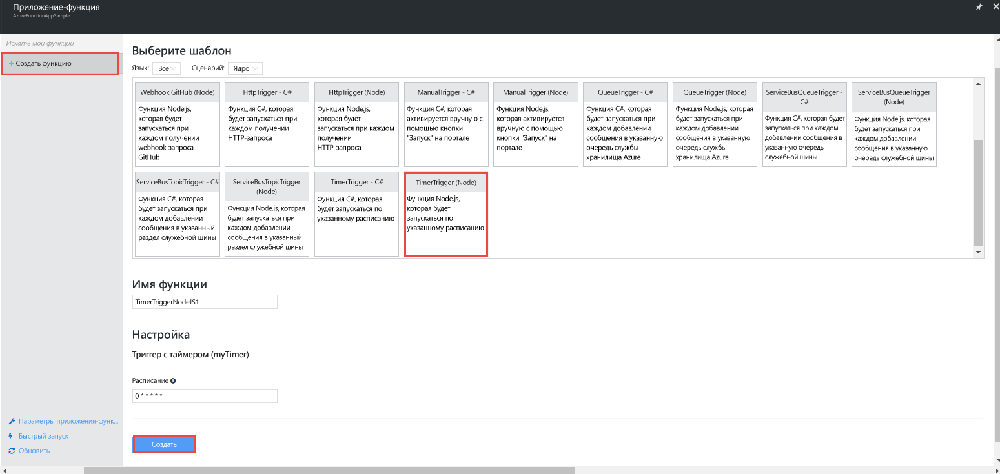
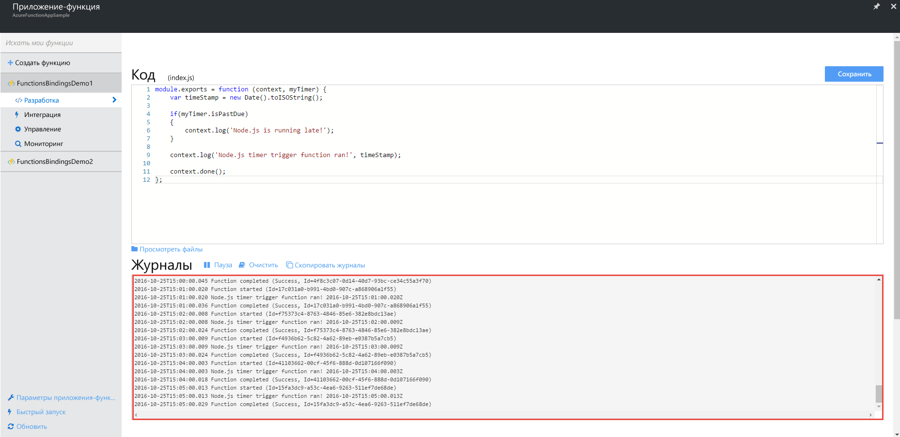
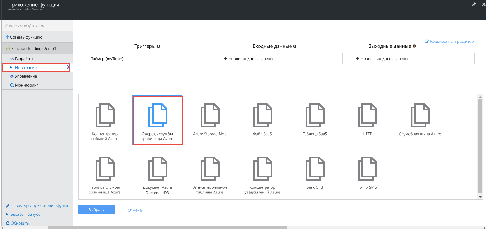
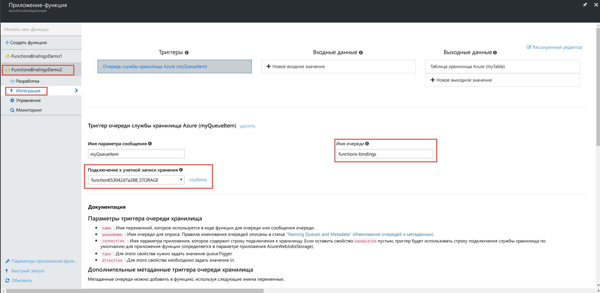

# <a name="create-an-azure-function-which-binds-to-an-azure-service"></a>Создание функции Azure, привязанной к службе Azure
[!INCLUDE [Getting Started Note](../../includes/functions-getting-started.md)]

В этом коротком видеоролике вы узнаете, как создать функцию Azure, прослушивающую сообщения в очереди Azure и копирующую их в большой двоичный объект Azure.

## <a name="watch-the-video"></a>Просмотреть видео
>[!VIDEO https://channel9.msdn.com/Series/Windows-Azure-Web-Sites-Tutorials/Create-an-Azure-Function-which-binds-to-an-Azure-service/player]
>
>

## <a name="create-an-input-queue-trigger-function"></a>Создание функции триггера входной очереди
Функция триггера входной очереди записывает сообщения в очередь каждые 10 секунд. Для этого необходимо создать функцию и очереди сообщений, а затем добавить код для записи сообщений в созданные очереди.

1. Войдите на портал Azure и найдите свое приложение-функцию Azure.
2. Щелкните **Новая функция** > **TimerTrigger — Node**. Задайте для функции имя **FunctionsBindingsDemo1**.
3. Для параметра "Расписание" укажите значение "0/10 * * * * *". Это значение указывается в формате выражения CRON. В этом случае таймер запускается каждые 10 секунд.
4. Нажмите кнопку **Создать**, чтобы создать функцию.
   
    
5. Просмотрите журнал активности и убедитесь, что функция работает. При необходимости, чтобы отобразить область журнала, щелкните в верхнем правом углу ссылку **Журналы**.
   
   

### <a name="add-a-message-queue"></a>Добавление очереди сообщений
1. Перейдите на вкладку **Integrate** (Интеграция).
2. Выберите **Новое выходное значение** > **Очередь службы хранилища Azure** > **Выбрать**.
3. В текстовом поле **Имя параметра сообщения** введите **myQueueItem**.
4. Выберите имеющуюся учетную запись хранения или щелкните **Создать**, чтобы создать новую.
5. В текстовом поле **Имя очереди** введите **functions-bindings**.
6. Щелкните **Сохранить**.  
   
   

### <a name="write-to-the-message-queue"></a>Запись сообщений в очередь
1. Вернитесь на вкладку **Разработка** и добавьте следующий код после имеющегося кода.
   
    ```javascript
   
    function myQueueItem() 
      {
        return {
        msg: "some message goes here",
        time: "time goes here"
      }
    }
   
    ```
2. Измените имеющийся код функции, чтобы вызвать код, добавленный на шаге 1. Вставьте в строку 9 следующий код после оператора *if*.
   
    ```javascript
   
    var toBeQed = myQueueItem();
    toBeQed.time = timeStamp;
    context.bindings.myQueue = toBeQed;
   
    ```
   
    Этот код создает элемент **myQueueItem** и задает для его свойства **time** текущую метку времени. Затем эта команда добавляет новый элемент очереди в привязку myQueue контекста.
3. Щелкните **Сохранить и запустить**.
4. Убедитесь, что код работает, проверив очередь в Visual Studio.
   
   * Откройте Visual Studio и выберите **Просмотреть** > **Облако** **Проводник**.
   * Найдите учетную запись хранения и очередь **functions-bindings**, используемые при создании очереди myQueue. Вы должны увидеть строки данных журнала. Возможно, вход в Azure понадобится выполнить через Visual Studio.  

## <a name="create-an-output-queue-trigger-function"></a>Создание функции триггера для выходной очереди
1. Щелкните **Новая функция** > **QueueTrigger — C#**. Задайте для функции имя **FunctionsBindingsDemo2**. Обратите внимание, что в приложении-функции можно использовать разные языки (в этом случае Node и C#).
2. В поле **Имя очереди** введите **functions-bindings**.
3. Выберите для использования имеющуюся учетную запись хранения или создайте новую.
4. Нажмите кнопку **Создать**
5. Убедитесь, что функция работает, проверив наличие обновлений в Visual Studio и журнале. В журнале функции показано, что функция запущена и элементы выведены из очереди. Так как функция привязана к выходной очереди **functions-bindings** как входной триггер, после обновления очереди **functions-bindings** в Visual Studio элементы должны исчезнуть. Они были выведены из очереди.   
   
      

### <a name="modify-the-queue-item-type-from-json-to-object"></a>Изменение типа элемента очереди JSON на Object
1. Замените код в функции **FunctionsBindingsDemo2** следующим кодом.    
   
    ```cs
   
    using System;
   
    public static void Run(QItem myQueueItem, ICollector<TableItem> myTable, TraceWriter log)
    {
      TableItem myItem = new TableItem
      {
        PartitionKey = "key",
        RowKey = Guid.NewGuid().ToString(),
        Time = DateTime.Now.ToString("hh.mm.ss.ffffff"),
        Msg = myQueueItem.Msg,
        OriginalTime = myQueueItem.Time    
      };
      log.Verbose($"C# Queue trigger function processed: {myQueueItem.Msg} | {myQueueItem.Time}");
    }
   
    public class TableItem
    {
      public string PartitionKey {get; set;}
      public string RowKey {get; set;}
      public string Time {get; set;}
      public string Msg {get; set;}
      public string OriginalTime {get; set;}
    }
   
    public class QItem
    {
      public string Msg { get; set;}
      public string Time { get; set;}
    }
   
    ```
   
    Этот код добавляет два класса, **TableItem** и **QItem**, используемые для чтения и записи в очереди. Кроме того, функция **Run** теперь принимает параметры **QItem** и **TraceWriter**, а не **string** и **TraceWriter**. 
2. Нажмите кнопку **Сохранить** .
3. Убедитесь, что код работает, проверив журнал. Обратите внимание, что функции Azure автоматически сериализуют и десериализуют объект, что, в свою очередь, упрощает передачу данных из очереди объектно-ориентированным методом. 

## <a name="store-messages-in-an-azure-table"></a>Хранение сообщений в таблице Azure
Теперь, когда очереди работают совместно, необходимо добавить таблицу Azure в качестве постоянного хранилища данных очереди.

1. Перейдите на вкладку **Integrate** (Интеграция).
2. Создайте таблицу службы хранилища Azure для выходной очереди и назовите ее **myTable**.
3. В качестве таблицы для записи данных укажите **functionsbindings**.
4. Измените значение параметра **PartitionKey** с **{project-id}** на **{partition}**.
5. Выберите имеющуюся учетную запись хранения или создайте новую.
6. Щелкните **Сохранить**.
7. Перейдите на вкладку **Разработка**.
8. Создайте класс **TableItem**, который будет представлять таблицу Azure, и настройте поддержку созданного объекта TableItem в функции Run. Обратите внимание, что для обеспечения поддержки необходимо использовать свойства **PartitionKey** и **RowKey**.
   
    ```cs
   
    public static void Run(QItem myQueueItem, ICollector<TableItem> myTable, TraceWriter log)
    {    
      TableItem myItem = new TableItem
      {
        PartitionKey = "key",
        RowKey = Guid.NewGuid().ToString(),
        Time = DateTime.Now.ToString("hh.mm.ss.ffffff"),
        Msg = myQueueItem.Msg,
        OriginalTime = myQueueItem.Time    
      };
   
      log.Verbose($"C# Queue trigger function processed: {myQueueItem.RowKey} | {myQueueItem.Msg} | {myQueueItem.Time}");
    }
   
    public class TableItem
    {
      public string PartitionKey {get; set;}
      public string RowKey {get; set;}
      public string Time {get; set;}
      public string Msg {get; set;}
      public string OriginalTime {get; set;}
    }
    ```
9. Щелкните **Сохранить**.
10. Убедитесь, что код работает, проверив активность функции в журналах и Visual Studio. Чтобы проверить активность в Visual Studio, используйте **Cloud Explorer**, чтобы перейти к таблице Azure **functionbindings**. Если функция активна, таблица должна содержать строки.

[!INCLUDE [Getting Started Note](../../includes/functions-bindings-next-steps.md)]

[!INCLUDE [Getting Started Note](../../includes/functions-get-help.md)]


<!--HONumber=Nov16_HO2-->


