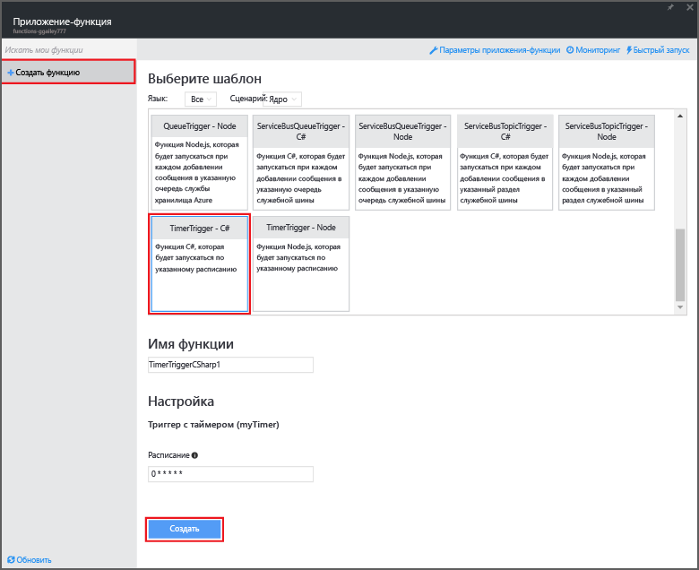
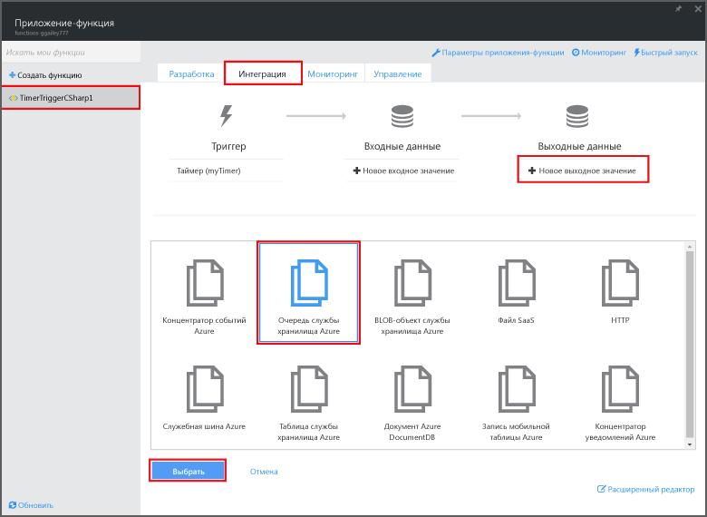
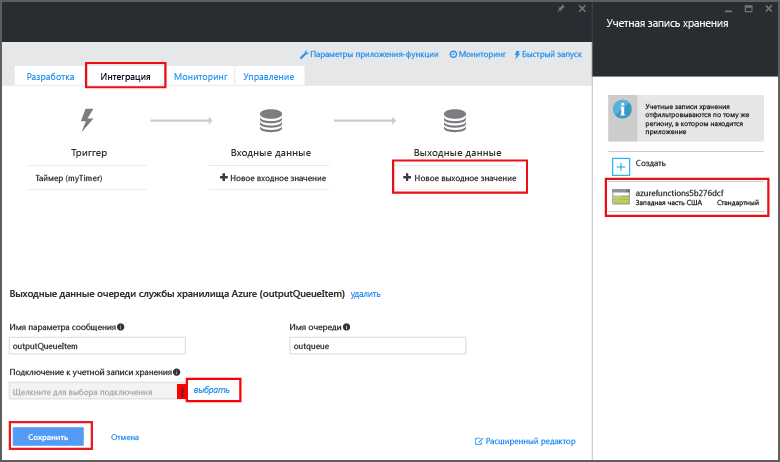

<properties
   pageTitle="Создание функции обработки событий | Microsoft Azure"
   description="Использование Функций Azure для создания функций на C#, которые срабатывают по таймеру событий."
   services="functions"
   documentationCenter="na"
   authors="ggailey777"
   manager="erikre"
   editor=""
   tags=""
   />

<tags
   ms.service="functions"
   ms.devlang="multiple"
   ms.topic="get-started-article"
   ms.tgt_pltfrm="multiple"
   ms.workload="na"
   ms.date="09/25/2016"
   ms.author="glenga"/>
   
# Создание функции Azure для обработки событий

Функции Azure — это ориентированная на события среда вычислений по требованию, которая позволяет создавать выполняемые по расписанию или активируемые блоки кода, реализованные с помощью разных языков программирования. Дополнительные сведения о функциях Azure см. в статье [Обзор функций Azure](functions-overview.md).

В этой статье показано, как создать функцию на C#, которая добавляет сообщения в очередь хранилища, срабатывая по таймеру событий.

## Предварительные требования 

Для создания функций необходима активная учетная запись Azure. Если у вас ее нет, воспользуйтесь [бесплатной учетной записью Azure](https://azure.microsoft.com/free/).

## Создание активируемой по таймеру функции на основе шаблона

Выполнение функций в Azure происходит с помощью приложения функций. Для создания функций необходима активная учетная запись Azure. Если у вас ее нет, воспользуйтесь [бесплатной учетной записью Azure](https://azure.microsoft.com/free/).

1. Перейдите на [портал функций Azure](https://functions.azure.com/signin) и войдите, используя свою учетную запись Azure.

2. Если у вас есть готовое приложение функций, выберите его в списке **приложений функций** и нажмите кнопку **Открыть**. Чтобы создать приложение функций, введите уникальное **имя** нового приложения функций или воспользуйтесь созданным, выберите предпочтительный **регион**, а затем щелкните **Создать + приступить к работе**.

3. В приложении-функции щелкните **+ New Function** (+ Создать функцию) > **TimerTrigger — C#** > **Создать**. Таким образом будет создана функция с именем по умолчанию, которая выполняется согласно расписанию по умолчанию — каждую минуту.

	

4. В разделе новой функции щелкните вкладку **Интеграция** > **Новые выходные данные** > **Azure Storage Queue** (Очередь службы хранилища Azure) > **Выбрать**.

	

5. В разделе **выходных данных очереди службы хранилища Azure** выберите существующее **Подключение к учетной записи хранения** или создайте новое, а затем нажмите кнопку **Сохранить**.

	

6. Вернитесь на вкладку **Разработка**, замените существующий сценарий C# в окне **Код** следующим кодом:

		using System;
		
		public static void Run(TimerInfo myTimer, out string outputQueueItem, TraceWriter log)
		{
		    // Add a new scheduled message to the queue.
		    outputQueueItem = $"Ping message added to the queue at: {DateTime.Now}.";
		    
		    // Also write the message to the logs.
		    log.Info(outputQueueItem);
		}

	Этот код добавляет новое сообщение в очередь с текущей датой и временем выполнения функции.

7. Нажмите кнопку **Сохранить**. Следующее выполнение функции можно просмотреть в окне **Журналы**.

8. Перейдите к учетной записи хранения и убедитесь, что сообщения добавлены в очередь (необязательно).

9. Вернитесь на вкладку **Интеграция** и измените значение поля расписания на `0 0 * * * *`. Теперь функция будет выполняться каждый час.

Это простой пример триггера таймера и выходной привязки очереди службы хранилища. Дополнительные сведения см. в статьях [Триггеры с таймерами в функциях Azure](functions-bindings-timer.md) и [Триггеры и привязки для службы хранилища Azure в функциях Azure](functions-bindings-storage.md).

##Дальнейшие действия

Дополнительные сведения о функциях Azure см. в следующих статьях.

+ [Azure Functions developer reference](functions-reference.md) (Справочник разработчика функций Azure) Справочник программиста по созданию функций, а также определению триггеров и привязок.
+ [Testing Azure Functions](functions-test-a-function.md) (Тестирование функций Azure) Описание различных средств и методов тестирования функций.
+ [How to scale Azure Functions](functions-scale.md) (Масштабирование функций Azure). Обсуждение планов обслуживания Azure, доступных для использования с функциями Azure (включая динамический план обслуживания), а также выбор подходящего плана.

[AZURE.INCLUDE [Начало работы](../../includes/functions-get-help.md)]

<!---HONumber=AcomDC_0928_2016-->