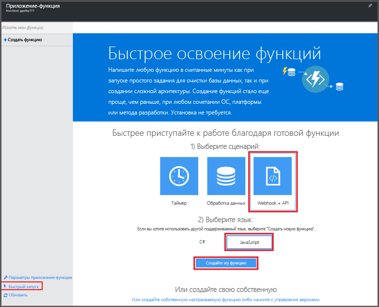

# Создание первой функции на портале Azure

В этом разделе объясняется, как создать простую функцию Azure под названием hello world, которая вызывается с помощью HTTP-запроса. Перед созданием функции на портале Azure необходимо создать приложение-функцию в службе приложений Azure, чтобы выполнять в нем свою функцию.

Для работы с этим кратким руководством необходима учетная запись Azure. Вы можете воспользоваться [бесплатной учетной записью](https://azure.microsoft.com/free/). Также вы можете [работать с Функциями Azure](https://azure.microsoft.com/try/app-service/functions/) без регистрации в Azure.

## Создание приложения-функции

[!INCLUDE [functions-create-function-app-portal](../../includes/functions-create-function-app-portal.md)]

Дополнительные сведения см. в разделе [Создание приложения-функции на портале Azure](functions-create-function-app-portal.md).

## Создание функции
Следуйте инструкциям ниже, чтобы создать функцию в новом приложении-функции с помощью вкладки "Быстрый запуск" в Функциях Azure.

1. На вкладке **Быстрый запуск** щелкните **WebHook + API**, выберите язык для функции, а затем щелкните **Создать функцию**. Будет создана предопределенная функция на выбранном вами языке.  
   
    

4. (Необязательно) На этом этапе быстрой настройки вы можете бегло ознакомиться с возможностями функций Azure на портале. Завершив (или пропустив) этот шаг, вы можете проверить новую функцию, отправив HTTP-запрос.

## Проверка функции
[!INCLUDE [Functions quickstart test](../../includes/functions-quickstart-test.md)]

## Дальнейшие действия
[!INCLUDE [Functions quickstart next steps](../../includes/functions-quickstart-next-steps.md)]

[!INCLUDE [Getting Started Note](../../includes/functions-get-help.md)]

