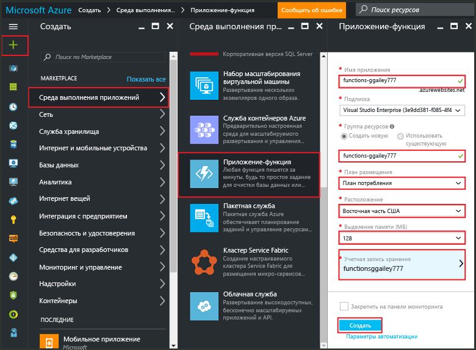

<properties
   pageTitle="Создание функции на портале Azure | Microsoft Azure"
   description="Создайте свою первую функцию Azure (независимое приложение) менее чем за две минуты."
   services="functions"
   documentationCenter="na"
   authors="ggailey777"
   manager="erikre"
   editor=""
   tags=""
/>

<tags
   ms.service="functions"
   ms.devlang="multiple"
   ms.topic="article"
   ms.tgt_pltfrm="multiple"
   ms.workload="na"
   ms.date="09/08/2016"
   ms.author="glenga"/>

#Создание функции на портале Azure

##Обзор
Функции Azure — это решение для выделения вычислительных мощностей по требованию, в частности при возникновении определенных событий. Решение добавляет в существующую платформу приложений Azure возможности выполнения кода после событий, которые происходят в других службах Azure, продуктах SaaS и локальных системах. Функции Azure позволяют масштабировать приложения тогда, когда это нужно, и оплачивать только используемые ресурсы. Функции Azure позволяют создавать выполняемые по расписанию или активируемые блоки кода, реализованные с помощью разных языков программирования. Дополнительные сведения о функциях Azure см. в статье [Обзор функций Azure](functions-overview.md).

В этой статье объясняется, как использовать портал Azure для создания простой функции Azure Node.js под названием hello world, которая вызывается с помощью HTTP-триггера. Перед созданием функции на портале Azure необходимо явным образом создать приложение-функцию в службе приложений Azure. Если вы хотите, чтобы приложение-функция было создано автоматически, см. [руководство по быстрому запуску других функций Azure](functions-create-first-azure-function.md), которое содержит упрощенные инструкции и видео.

##Создание приложения-функции

Выполнение функций в Azure происходит в рамках приложений-функций. Чтобы создать приложение-функцию на портале Azure, выполните приведенные ниже инструкции.

Чтобы создавать функции, вам нужна активная учетная запись Azure. Если у вас ее нет, воспользуйтесь [бесплатной учетной записью Azure](https://azure.microsoft.com/free/).

1. Перейдите на [портал Azure](https://portal.azure.com) и войдите, используя свою учетную запись Azure.

2. Щелкните **+ Создать** > **Интернет + мобильные устройства** > **Приложение-функция**, выберите свою **подписку** и введите уникальное **имя приложения**, с помощью которого можно будет идентифицировать приложение-функцию. Затем укажите следующие параметры.

	+ **[Группа ресурсов](../azure-portal/resource-group-portal.md/)**: щелкните **Создать новую** и введите имя группы ресурсов. Вы также можете выбрать существующую группу ресурсов, но в таком случае вы не сможете создать динамический план службы приложений для приложения-функции.
	+ **[План службы приложений](../app-service/azure-web-sites-web-hosting-plans-in-depth-overview.md)**: выберите *динамический* или *классический*.
		+ **Динамический** — план по умолчанию для функций Azure. Если выбран динамический план, необходимо также задать параметры **Расположение** и **Выделение памяти** (МБ). Сведения о влиянии выделения памяти на затраты см. на странице с [ценами на функции Azure](https://azure.microsoft.com/pricing/details/functions/).
		+ **Классический** — чтобы использовать классический план службы приложений, необходимо создать **расположение или план службы приложений** или выбрать существующие. Эти параметры определяют [расположение, функции, стоимость и вычислительные ресурсы](https://azure.microsoft.com/pricing/details/app-service/), связанные с вашим приложением.
	+ **Учетная запись хранения** — для каждого приложения-функции нужна учетная запись хранения. Вы можете выбрать существующую учетную запись хранения или создать новую.

	

3. Щелкните **Создать**, чтобы подготовить и развернуть новое приложение-функцию.

Теперь, когда приложение-функция подготовлено, вы можете создать свою первую функцию.

## Создание функции

Следуйте инструкциям ниже, чтобы создать функцию с помощью вкладки "Быстрый запуск" в функциях Azure.

1. На вкладке **Быстрый запуск** щелкните **Webhook + API** и **JavaScript**, а затем щелкните **Create a function** (Создать функцию). Будет создана предварительно определенная функция Node.js.

	

2. (Необязательно) На этом этапе быстрой настройки вы можете бегло ознакомиться с возможностями функций Azure на портале. Когда вы завершите или пропустите этот шаг, вы сможете проверить новую функцию с помощью HTTP-триггера.

##Проверка функции

Так как при быстрой настройке функций Azure используется функциональный код, вы можете протестировать функцию сразу же.

1. На вкладке **Разработка** откройте окно **Код** и убедитесь, что этот код Node.js ожидает HTTP-запрос со значением свойства *name*, передаваемым либо в тексте сообщения, либо в строке запроса. При выполнении функции это значение возвращается в сообщении с ответом.

	

2. Прокрутите вниз до текстового поля **Текст запроса**, измените значение свойства *name* и щелкните **Запустить**. Вы видите, что выполнение активируется HTTP-запросом, данные записываются в журналы потоковой передачи, а ответ "hello" отображается в окне **выходных данных**.

3. Чтобы активировать выполнение этой же функции в другом окне или на другой вкладке браузера, скопируйте **URL-адрес функции** на вкладке **Разработка** и вставьте его в адресную строку браузера, а затем добавьте значение строки запроса `&name=yourname` и нажмите клавишу ВВОД. В журналы будут записаны те же данные, а в браузере отобразится тот же ответ "hello".

##Дальнейшие действия

С помощью быстрой настройки можно очень просто выполнить базовую функцию, инициируемую HTTP-запросом. Дополнительные сведения об использовании возможностей функций Azure в приложениях см. в следующих статьях.

+ [Azure Functions developer reference](functions-reference.md) (Справочник разработчика функций Azure). Справочник программиста по созданию функций, а также определению триггеров и привязок.
+ [Testing Azure Functions](functions-test-a-function.md) (Тестирование функций Azure). Описание различных средств и методов тестирования функций.
+ [How to scale Azure Functions](functions-scale.md) (Масштабирование функций Azure). Описание планов обслуживания Azure, доступных для использования с функциями Azure (включая динамический план обслуживания), а также выбор подходящего плана.
+ [Что такое служба приложений Azure?](../app-service/app-service-value-prop-what-is.md) Функции Azure используют платформу службы приложений Azure для таких базовых операций, как развертывание, диагностика и использование переменных среды.

[AZURE.INCLUDE [Начало работы](../../includes/functions-get-help.md)]

<!---HONumber=AcomDC_0914_2016-->