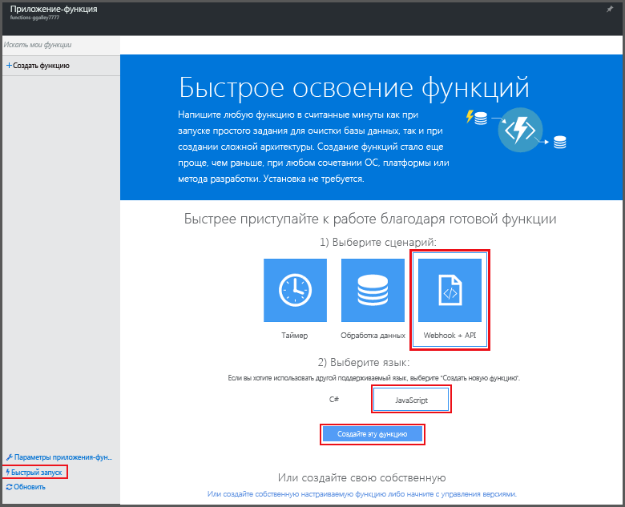

# Создание первой функции Azure

В этой статье показано, как с помощью руководства по быстрому запуску функций Azure на портале можно создать простую функцию "hello world", вызываемую с помощью HTTP-запроса. Дополнительные сведения о функциях Azure см. в статье [Обзор функций Azure](functions-overview.md).

Вам понадобится учетная запись Azure. Вы можете воспользоваться [бесплатной учетной записью](https://azure.microsoft.com/free/). Также вы можете [поработать с Функциями Azure](https://azure.microsoft.com/try/app-service/functions/) без регистрации в Azure.

## Создание функции на портале с помощью средств быстрого запуска

1. Перейдите на [портал Функций Azure](https://functions.azure.com/signin) и войдите, используя свою учетную запись Azure. 
 
2. Введите уникальное **имя** нового приложения-функции или воспользуйтесь созданным автоматически, выберите предпочтительный **регион**, а затем щелкните **Создать и начать работу**. Допустимое имя может содержать только буквы, цифры и дефисы. Символ подчеркивания (**_**) использовать нельзя.

3. На вкладке **Быстрый запуск** щелкните **WebHook + API**, выберите язык для функции, а затем щелкните **Создать функцию**. Будет создана предопределенная функция на выбранном вами языке. 
   
    

4. (Необязательно) На этом этапе быстрой настройки вы можете бегло ознакомиться с возможностями функций Azure на портале. Завершив (или пропустив) этот шаг, вы можете проверить новую функцию, отправив HTTP-запрос.

## Проверка функции
[!INCLUDE [Functions quickstart test](../../includes/functions-quickstart-test.md)]

## Просмотреть видео
В этом видео показано, как выполнять основные шаги, описанные в этом руководстве. 

> [!VIDEO https://channel9.msdn.com/Series/Windows-Azure-Web-Sites-Tutorials/Create-your-first-Azure-Function-simple/player]
> 

## Дальнейшие действия
[!INCLUDE [Functions quickstart next steps](../../includes/functions-quickstart-next-steps.md)]

[!INCLUDE [Getting Started Note](../../includes/functions-get-help.md)]

