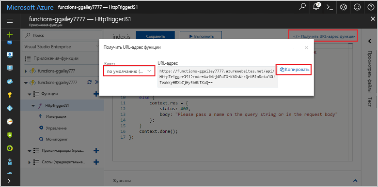

# Создание первой функции Azure
## Обзор
Функции Azure — это решение для выделения вычислительных мощностей по требованию, в частности при возникновении определенных событий. Решение добавляет в существующую платформу приложений Azure возможности выполнения кода после событий, которые происходят в других службах Azure, продуктах SaaS и локальных системах. Функции Azure позволяют масштабировать приложения тогда, когда это нужно, и оплачивать только использованные ресурсы. Функции Azure позволяют создавать выполняемые по расписанию или активируемые блоки кода, реализованные с помощью разных языков программирования. Дополнительные сведения о функциях Azure см. в статье [Обзор функций Azure](functions-overview.md).

В этой статье показано, как использовать быстрый запуск функций Azure на портале для создания простой функции Node.js (hello world), вызываемой с помощью HTTP-триггера. Вы также можете ознакомиться с коротким видео, чтобы увидеть, как эти действия выполняются на портале.

## Просмотреть видео
В этом видео показано, как выполнять основные шаги, описанные в этом руководстве. 

> [!VIDEO https://channel9.msdn.com/Series/Windows-Azure-Web-Sites-Tutorials/Create-your-first-Azure-Function-simple/player]
> 
> 

## Создание функции при помощи быстрого запуска
Выполнение функций в Azure происходит с помощью приложения функций. Ниже описано, как можно создать приложение функций, а также функцию. Новое приложение-функцию создается с использованием конфигурации по умолчанию. Пример того явного создания приложения-функцию, см. в [этом руководстве по функциям Azure](functions-create-first-azure-function-azure-portal.md).

Чтобы создавать функции, вам нужна активная учетная запись Azure. Если у вас ее нет, воспользуйтесь [бесплатной учетной записью Azure](https://azure.microsoft.com/free/).

1. Перейдите на [портал функций Azure](https://functions.azure.com/signin) и войдите, используя свою учетную запись Azure.
2. Введите уникальное **имя** нового приложения функций или воспользуйтесь созданным, выберите предпочтительный **регион**, а затем щелкните **Создать+приступить к работе**. 
3. На вкладке **Быстрый запуск** щелкните **WebHook + API** и **JavaScript**, а затем щелкните **Создать функцию**. Будет создана предварительно определенная функция Node.js. 
   
    
4. (Необязательно) На этом этапе быстрой настройки вы можете бегло ознакомиться с возможностями функций Azure на портале.    Когда вы завершите или пропустите этот шаг, вы сможете проверить новую функцию с помощью HTTP-триггера.

## Проверка функции
Так как при быстрой настройке функций Azure используется функциональный код, вы можете протестировать функцию сразу же.

1. На вкладке **Разработка** откройте окно **Код** и убедитесь, что этот код Node.js ожидает HTTP-запрос со значением свойства *name*, передаваемым либо в тексте сообщения, либо в строке запроса. При выполнении функции это значение возвращается в сообщении с ответом.
   
    
2. Прокрутите вниз до текстового поля **Текст запроса**, измените значение свойства *name* и щелкните **Запустить**. Вы увидите, что выполнение инициируется HTTP-запросом, данные записываются в журналы потоковой передачи, а ответ "hello" отображается в окне **выходных данных**. 
3. Чтобы активировать выполнение этой же функции в другом окне или на другой вкладке браузера, скопируйте **URL-адрес функции** на вкладке **Разработка** и вставьте его в адресную строку браузера, а затем добавьте значение строки запроса `&name=yourname` и нажмите клавишу ВВОД. В журналы будут записаны те же данные, а в браузере отобразится тот же ответ "hello".

## Дальнейшие действия
С помощью быстрой настройки можно очень просто выполнить базовую функцию, инициируемую HTTP-запросом. Дополнительные сведения об использовании возможностей функций Azure в приложениях см. в следующих статьях.

* [Справочник разработчика по функциям Azure](functions-reference.md)  
   Справочник программиста по созданию функций, а также определению триггеров и привязок.
* [Testing Azure Functions](functions-test-a-function.md)  
   Описание различных средств и методов тестирования функций.
* [Масштабирование функций Azure](functions-scale.md)  
   (Масштабирование функций Azure) Обсуждение планов обслуживания Azure, доступных для использования с функциями Azure (включая динамический план обслуживания), а также выбор подходящего плана. 
* [Что такое служба приложений Azure?](../app-service/app-service-value-prop-what-is.md)  
   Функции Azure используют платформу службы приложений Azure для таких базовых операций, как развертывание, диагностика и использование переменных среды. 

[!INCLUDE [Getting Started Note](../../includes/functions-get-help.md)]

<!--HONumber=Nov16_HO2-->

