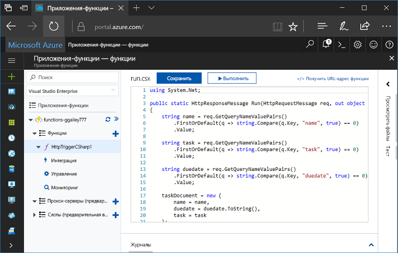
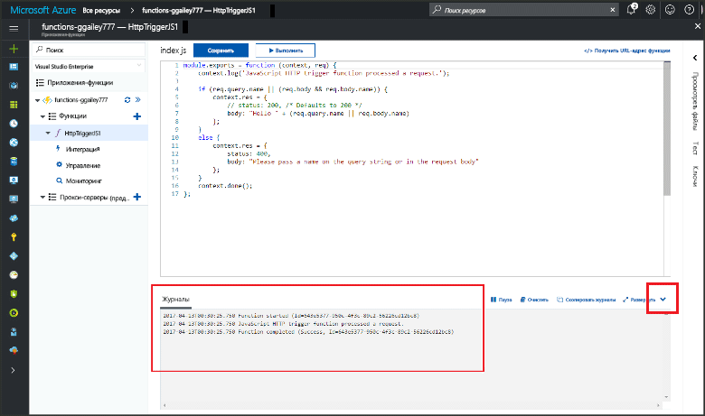

# Создание первой функции на портале Azure

Решение "Функции Azure" позволяет выполнять код в [бессерверной](https://azure.microsoft.com/overview/serverless-computing/) среде без необходимости создавать виртуальную машину или публиковать веб-приложение. В этой статье вы узнаете, как создать функцию Hello World на портале Azure с помощью Функций.

[!INCLUDE [quickstarts-free-trial-note](../../includes/quickstarts-free-trial-note.md)]

## Вход в Azure

Войдите на [портал Azure](https://portal.azure.com/).

## Создание приложения-функции

Для выполнения функций вам понадобится приложение-функция, позволяющее группировать функции в логические единицы и упростить развертывание и совместное использование ресурсов, а также управление ими. 

[!INCLUDE [Create function app Azure portal](../../includes/functions-create-function-app-portal.md)]

[!INCLUDE [functions-portal-favorite-function-apps](../../includes/functions-portal-favorite-function-apps.md)]

Затем создайте функцию в новом приложении-функции.

## Создание функции, активируемой HTTP

1. Разверните новое приложение-функцию, нажмите кнопку **+** рядом с **Функции**.

2.  На странице **быстрого начала работы** щелкните **Веб-перехватчик + API**, **выберите язык для функции** и щелкните **Создать функцию**. 
   
    

С помощью шаблона функции, активируемой HTTP, будет создана функция на выбранном вами языке. Вы можете запустить новую функцию, отправив HTTP-запрос.

## Проверка функции

1. В новой функции щелкните **</> Получить URL-адрес функции**, выберите **По умолчанию (ключ функции)**и нажмите кнопку **Копировать**. 

    

2. Вставьте URL-адрес функции в адресную строку браузера. Добавьте строку запроса `&name=<yourname>` в этот URL-адрес и нажмите клавишу `Enter` на клавиатуре, чтобы выполнить этот запрос. Ниже приведен пример ответа, возвращаемого функцией в браузере Edge:

    

    URL-адрес запроса включает ключ, который по умолчанию необходим для доступа к функции по протоколу HTTP.   

3. При выполнении функции сведения о трассировке записываются в журналы. Для просмотра выходных данных трассировки из предыдущего выполнения вернитесь к своей функции на портале и щелкните стрелку вверх в нижней части экрана, чтобы развернуть **Журналы**. 

   

## Очистка ресурсов

[!INCLUDE [Clean up resources](../../includes/functions-quickstart-cleanup.md)]

## Дальнейшие действия

Вы создали приложение-функцию с простой функцией, активируемой HTTP.  

[!INCLUDE [Next steps note](../../includes/functions-quickstart-next-steps.md)]

Дополнительные сведения см. в статье [Привязки HTTP и webhook в функциях Azure](functions-bindings-http-webhook.md).

