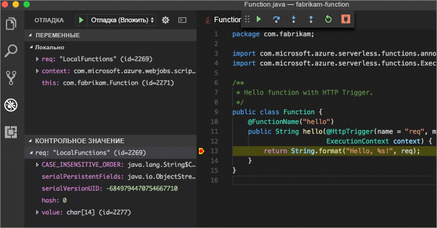

# <a name="create-your-first-function-with-java-and-maven-preview"></a>Создание первой функции с помощью Java и Maven (предварительная версия)

В этом кратком руководстве содержится информация о том, как создать проект функции без сервера с помощью Maven, локально протестировать и развернуть его в Функциях Azure. После выполнения этих действий, приложение-функция активированного HTTP будет запущена в Azure.

 

[!INCLUDE [quickstarts-free-trial-note](../../includes/quickstarts-free-trial-note.md)]

## <a name="prerequisites"></a>Предварительные требования
Для разработки функций приложения с помощью Java, должны быть установлены следующие компоненты:

-  [.NET Core](https://www.microsoft.com/net/core) последней версии.
-  [Java Developer Kit (JDK)](https://www.azul.com/downloads/zulu/) версии 1.8.
-  [Интерфейс командной строки Azure](https://docs.microsoft.com/cli/azure)
-  [Apache Maven](https://maven.apache.org) 3.0 или более поздней версии.
-  [Node.js ](https://nodejs.org/download/)версии 8.6 или выше.

> [!IMPORTANT] 
> Переменной среде JAVA_HOME необходимо присвоить расположение установки JDK, чтобы завершить выполнение заданий этого краткого руководства.

## <a name="install-the-azure-functions-core-tools"></a>Установка основных инструментов Функций Azure

[Основные средства Функций Azure версии 2.0](https://www.npmjs.com/package/azure-functions-core-tools) предоставляют локальной среде разработки возможность записи, выполнения и отладки Функций Azure. Установите средства с помощью [npm](https://www.npmjs.com/) вместе с [Node.js](https://nodejs.org/).

```
npm install -g azure-functions-core-tools@core
```

> [!NOTE]
> Если возникли проблемы при установке основных средств Функций Azure версии 2.0, см. раздел [Среда выполнения версии 2.x](/azure/azure-functions/functions-run-local#version-2x-runtime).

## <a name="generate-a-new-functions-project"></a>Создание нового проекта функций

В пустой папке выполните следующую команду, чтобы создать проект функций из [архетипа Maven](https://maven.apache.org/guides/introduction/introduction-to-archetypes.html).

### <a name="linuxmacos"></a>Linux/MacOS

```bash
mvn archetype:generate \
    -DarchetypeGroupId=com.microsoft.azure \
    -DarchetypeArtifactId=azure-functions-archetype 
```

### <a name="windows-cmd"></a>Windows (CMD)
```cmd
mvn archetype:generate ^
    -DarchetypeGroupId=com.microsoft.azure ^
    -DarchetypeArtifactId=azure-functions-archetype
```

Maven запрашивает значения, необходимые для завершения создания проекта. Дополнительную информацию о значениях _groupId_, _artifactId_ и о _версии_ см. по ссылке [соглашения об именовании Maven](https://maven.apache.org/guides/mini/guide-naming-conventions.html). Значение _appName_ должно быть уникальным в Azure, поэтому Maven создает имя приложения на основе ранее заданного по умолчанию _artifactId_. Значение _ackageName_ определяет пакет Java для создаваемого кода функции.

```Output
Define value for property 'groupId': com.fabrikam.functions
Define value for property 'artifactId' : fabrikam-functions
Define value for property 'version' 1.0-SNAPSHOT : 
Define value for property 'package': com.fabrikam.functions
Define value for property 'appName' fabrikam-functions-20170927220323382:
Confirm properties configuration: Y
```

Maven создает файлы проекта в новой папке с именем _artifactId_. Созданный в проекте код — это простая функция [активации HTTP](/azure/azure-functions/functions-bindings-http-webhook), возвращающая текст запроса.

```java
public class Function {
    @FunctionName("hello")
    public String hello(@HttpTrigger(name = "req", methods = {"get", "post"}, authLevel = AuthorizationLevel.ANONYMOUS) String req,
                        ExecutionContext context) {
        return String.format("Hello, %s!", req);
    }
}
```

## <a name="run-the-function-locally"></a>Локальное выполнение функции

Измените каталог на только что созданную папку проекта, создайте и запустите функцию с помощью Maven.

```
cd fabrikam-function
mvn clean package 
mvn azure-functions:run
```

При выполнении функции отображаются такие выходные данные:

```Output
Listening on http://localhost:7071
Hit CTRL-C to exit...

Http Functions:

   hello: http://localhost:7071/api/hello
```

Вызовите функцию из командной строки, используя перелистывание в новом терминале.

```
curl -w '\n' -d LocalFunction http://localhost:7071/api/hello
```

```Output
Hello LocalFunction!
```

Используйте `Ctrl-C` в терминале, чтобы остановить код функции.

## <a name="deploy-the-function-to-azure"></a>Развертывание функции для Azure

В процессе развертывания для Функций Azure используются данные учетной записи из Azure CLI. [Войдите с помощью Azure CLI](/cli/azure/authenticate-azure-cli?view=azure-cli-latest), а затем разверните свой код в новом приложении-функции, используя целевой объект Maven `azure-functions:deploy`.

```
az login
mvn azure-functions:deploy
```

После завершения развертывания появится URL-адрес, который можно использовать для доступа к приложению-функции Azure:

```output
[INFO] Successfully deployed Function App with package.
[INFO] Deleting deployment package from Azure Storage...
[INFO] Successfully deleted deployment package fabrikam-function-20170920120101928.20170920143621915.zip
[INFO] Successfully deployed Function App at https://fabrikam-function-20170920120101928.azurewebsites.net
[INFO] ------------------------------------------------------------------------
```

Проверьте функцию-приложение, работающее в Azure, используя перелистывание.

```
curl -w '\n' https://fabrikam-function-20170920120101928.azurewebsites.net/api/hello -d AzureFunctions
```

```Output
Hello AzureFunctions!
```

## <a name="next-steps"></a>Дальнейшие действия

Вы создали функцию-приложение Java с помощью простого триггера HTTP и развернули его в Функциях Azure.

- Дополнительные сведения о разработке функции Java см. в статье [Azure Functions Java developer guide](functions-reference-java.md) (Руководство разработчика Java для Функций Azure).
- Добавьте в проект дополнительные функции с помощью различных триггеров целевого объекта Maven`azure-functions:add`.
- Проведите отладку функций локально с помощью Visual Studio Code. С помощью установленного [пакета расширения Java](https://marketplace.visualstudio.com/items?itemName=vscjava.vscode-java-pack) и проекта функций, открытого в Visual Studio Code, [присоедините отладчик](https://code.visualstudio.com/Docs/editor/debugging#_launch-configurations) к порту 5005. Затем установите точку останова в редакторе и активируйте функции во время локального выполнения: 


