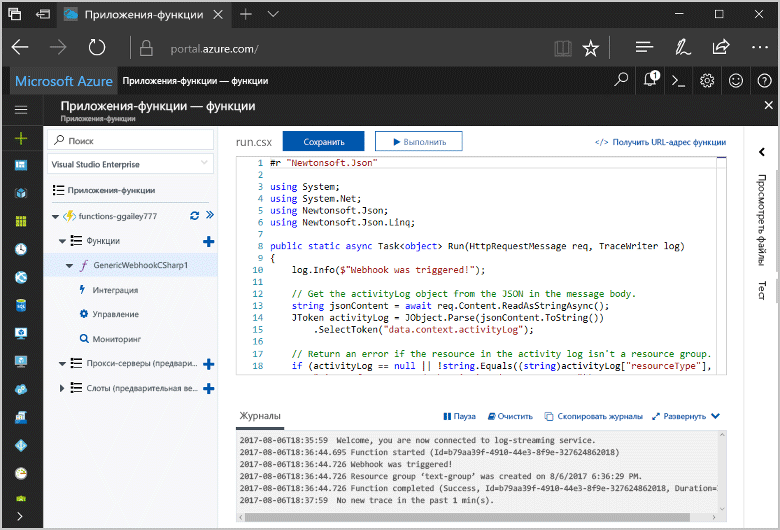
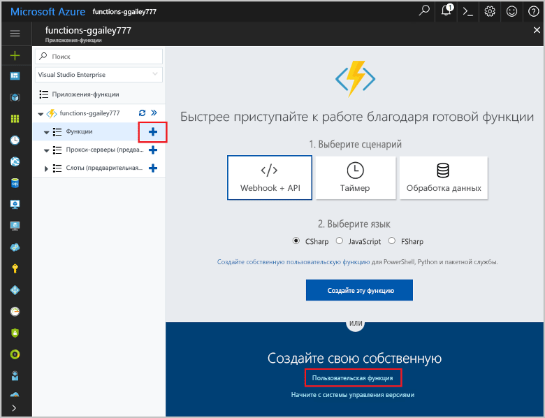
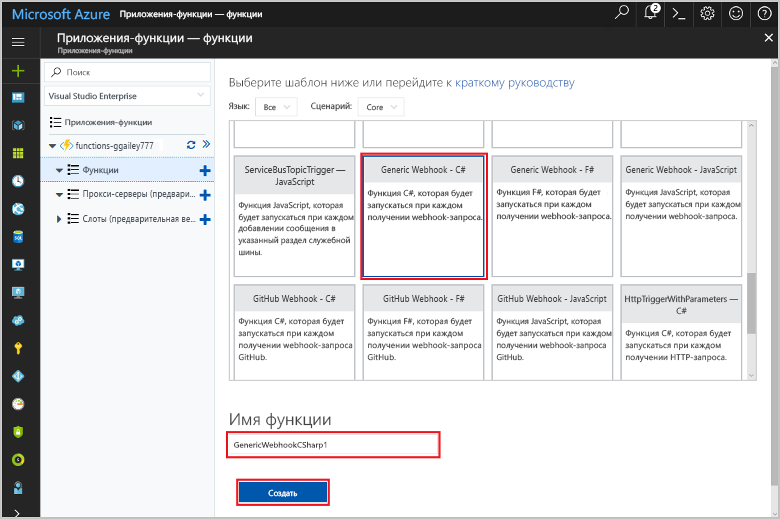
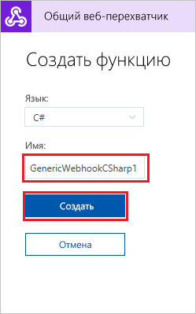
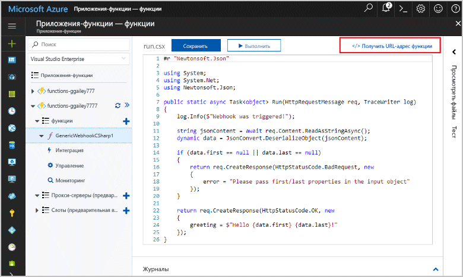
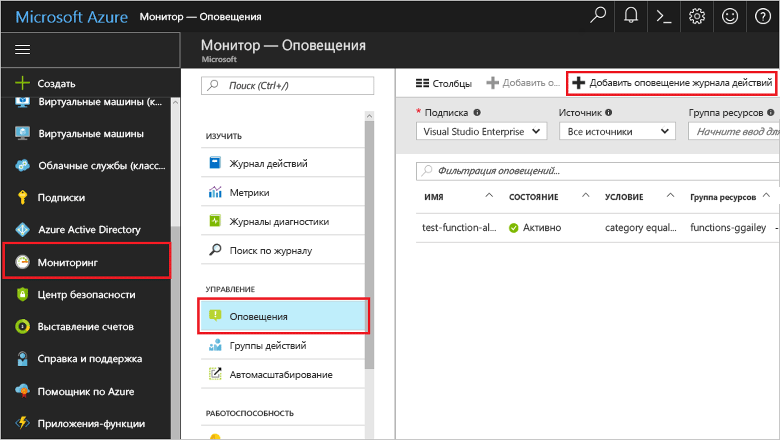
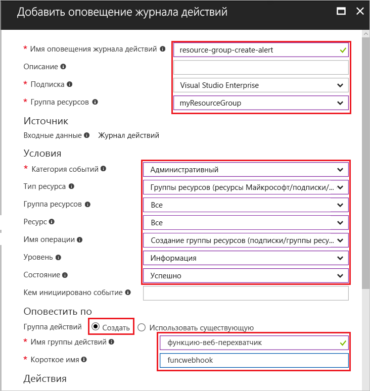
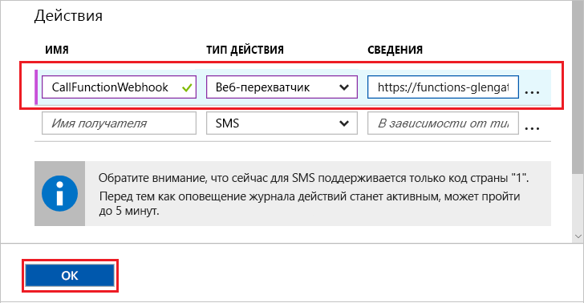
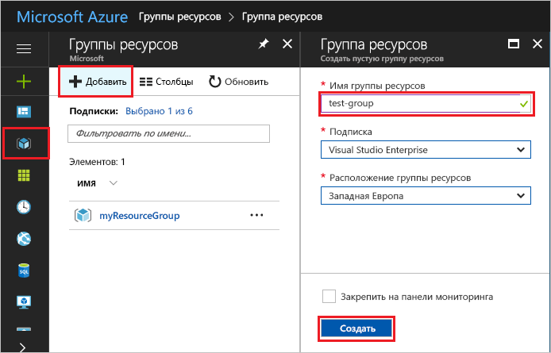

# <a name="create-a-function-triggered-by-a-generic-webhook"></a>Создание функции, активируемой универсальным веб-перехватчиком

Функции Azure позволяют вам выполнять свой код в бессерверной среде без необходимости создавать виртуальную машину или публиковать веб-приложение. Например, можно настроить функцию, вызываемую оповещением, вызванным Azure Monitor. Здесь показано, как выполнять код C#, если группа ресурсов добавлена в подписку.   



## <a name="prerequisites"></a>предварительным требованиям 

Для работы с этим руководством:

+ Если у вас еще нет подписки Azure, [создайте бесплатную учетную запись Azure](https://azure.microsoft.com/free/?WT.mc_id=A261C142F), прежде чем начинать работу.

## <a name="create-an-azure-function-app"></a>Создание приложения-функции Azure

[!INCLUDE [Create function app Azure portal](../../includes/functions-create-function-app-portal.md)]

Затем создайте функцию в новом приложении-функции.

## <a name="create-function"></a>Создание функции, активируемой универсальным веб-перехватчиком

1. Разверните приложение-функцию и нажмите кнопку **+** рядом с элементом **Функции**. Если это первая функция в приложении-функции, выберите **Пользовательская функция**. Откроется полный набор шаблонов функций.

    

2. В поле поиска введите `generic` и выберите нужный язык для шаблона триггера универсального веб-перехватчика. В этой статье используется функция C#.

     

2. Введите **имя** для функции и выберите **Создать**. 

      

2. В новой функции щелкните **</> Получить URL-адрес функции**, а затем скопируйте и сохраните значения. Это значение используется для настройки веб-перехватчика. 

    
         
Затем вы создадите конечную точку веб-перехватчика в оповещении журнала действий в Azure Monitor. 

## <a name="create-an-activity-log-alert"></a>Создание оповещения журнала действий

1. На портале Azure перейдите к службе **Monitor**, выберите **Оповещения** и щелкните **Добавить оповещение журнала действий**.   

    

2. Используйте настройки, указанные в таблице:

    

    | Параметр      |  Рекомендуемое значение   | ОПИСАНИЕ                              |
    | ------------ |  ------- | -------------------------------------------------- |
    | **Имя оповещения журнала действий** | resource-group-create-alert | Имя оповещения журнала действий. |
    | **Подписка** | Ваша подписка | Подписка, используемая в этом руководстве. | 
    |  **Группа ресурсов** | myResourceGroup | Группа ресурсов, куда развертываются ресурсы оповещения. Использование той же группы ресурсов, что и ваше приложение-функция, упрощает очистку после завершения руководства. |
    | **Категория событий** | Administrative | В эту категорию входят изменения, внесенные в ресурсы Azure.  |
    | **Тип ресурса** | Группы ресурсов | Фильтрует оповещения для действий группы ресурсов. |
    | **Группа ресурсов**<br/>и **ресурс** | Все | Отслеживает все ресурсы. |
    | **Имя операции** | Создать группу ресурсов | Фильтрует оповещения для операций создания. |
    | **Level** | Информация | Учитывает оповещения на уровне сведений. | 
    | **Состояние** | Succeeded | Фильтрует оповещения для действий, которые были успешно завершены. |
    | **Группа действий** | Создать | Создайте группу действий, которая определяет, какие действия будут предприняты при возникновении оповещения. |
    | **Имя группы действий** | function-webhook | Имя для идентификации группы действий.  | 
    | **Краткое название** | funcwebhook | Короткое имя для группы действий. |  

3. В разделе **Действия** добавьте действие с помощью параметров, как указано в таблице: 

    

    | Параметр      |  Рекомендуемое значение   | Описание                              |
    | ------------ |  ------- | -------------------------------------------------- |
    | **Имя** | CallFunctionWebhook | Имя действия. |
    | **Тип действия** | webhook | Ответ на оповещение — это вызов URL-адреса веб-перехватчика. |
    | **Дополнительные сведения** | URL-адрес функции | Вставьте URL-адрес веб-перехватчика функции, скопированный ранее. |v

4. Нажмите кнопку **ОК**, чтобы создать оповещение и группу действий.  

Теперь веб-перехватчик вызывается при создании группы ресурсов в подписке. После это нужно обновить код в функции для обработки данных журнала JSON в теле запроса.   

## <a name="update-the-function-code"></a>Обновление кода функции

1. Перейдите обратно к приложению-функции на портале и разверните свою функцию. 

2. Замените код скрипта C# в функции на портале следующим кодом:

    ```csharp
    #r "Newtonsoft.Json"
    
    using System;
    using System.Net;
    using Newtonsoft.Json;
    using Newtonsoft.Json.Linq;
    
    public static async Task<object> Run(HttpRequestMessage req, TraceWriter log)
    {
        log.Info($"Webhook was triggered!");
    
        // Get the activityLog object from the JSON in the message body.
        string jsonContent = await req.Content.ReadAsStringAsync();
        JToken activityLog = JObject.Parse(jsonContent.ToString())
            .SelectToken("data.context.activityLog");
    
        // Return an error if the resource in the activity log isn't a resource group. 
        if (activityLog == null || !string.Equals((string)activityLog["resourceType"], 
            "Microsoft.Resources/subscriptions/resourcegroups"))
        {
            log.Error("An error occurred");
            return req.CreateResponse(HttpStatusCode.BadRequest, new
            {
                error = "Unexpected message payload or wrong alert received."
            });
        }
    
        // Write information about the created resource group to the streaming log.
        log.Info(string.Format("Resource group '{0}' was {1} on {2}.",
            (string)activityLog["resourceGroupName"],
            ((string)activityLog["subStatus"]).ToLower(), 
            (DateTime)activityLog["submissionTimestamp"]));
    
        return req.CreateResponse(HttpStatusCode.OK);    
    }
    ```

Теперь можно протестировать функцию, создав группу ресурсов в подписке.

## <a name="test-the-function"></a>Проверка функции

1. Щелкните значок группы ресурсов в левой части портала Azure, выберите **+ Добавить**, введите **имя группы ресурсов** и выберите **Создать** для создания пустой группы ресурсов.
    
    

2. Вернитесь обратно к функции и разверните окно **Журналы**. После создания группы ресурсов оповещение журнала действий активирует веб-перехватчик и начнется выполнение функции. В журналы будет записано имя новой группы ресурсов.  

    

3. (Необязательно.) Вернитесь назад и удалите созданную группу ресурсов. Обратите внимание, что это действие не приводит к активации функции. Это связано с тем, что операции удаления отфильтровываются оповещением. 

## <a name="clean-up-resources"></a>Очистка ресурсов

[!INCLUDE [Next steps note](../../includes/functions-quickstart-cleanup.md)]

## <a name="next-steps"></a>Дополнительная информация

Вы создали функцию, которая выполняется при получении запроса от универсального веб-перехватчика. 

[!INCLUDE [Next steps note](../../includes/functions-quickstart-next-steps.md)]

Дополнительные сведения см. в статье [Привязки HTTP и веб-перехватчика в функциях Azure](functions-bindings-http-webhook.md). Дополнительные сведения о разработке функций на C# см. в статье [Справочник разработчика скриптов C# по Функциям Azure](functions-reference-csharp.md).

