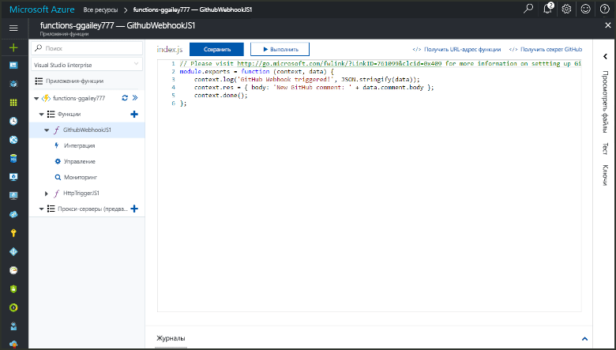
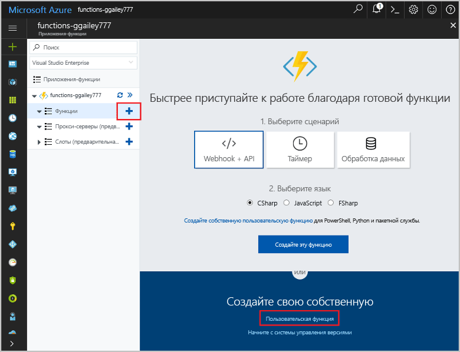
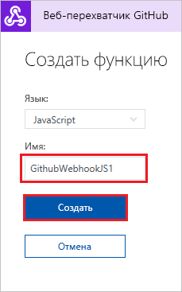
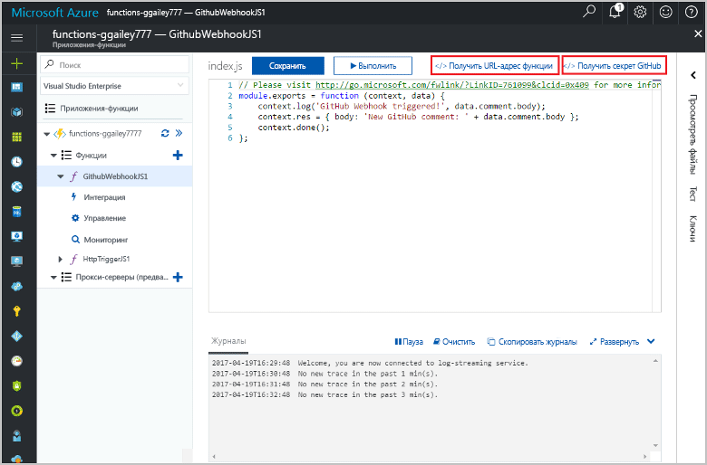

# Создание функции, активируемой объектом webhook GitHub

Узнайте, как создать функцию, активируемую с помощью запроса HTTP объекта webhook с полезными данными GitHub.

## предварительным требованиям

+ Учетная запись GitHub с хотя бы одним проектом.
+ Подписка Azure. Если у вас еще нет подписки Azure, создайте [бесплатную учетную запись](https://azure.microsoft.com/free/?WT.mc_id=A261C142F), прежде чем начать работу.

## Создание приложения-функции Azure

[!INCLUDE [Create function app Azure portal](../../includes/functions-create-function-app-portal.md)]

Затем создайте функцию в новом приложении-функции.

## Создание функции, активируемой объектом webhook GitHub

1. Разверните приложение-функцию и нажмите кнопку **+** рядом с элементом **Функции**. Если это первая функция в приложении-функции, выберите **Пользовательская функция**. Откроется полный набор шаблонов функций.

    

2. В поле поиска введите `github` и выберите нужный язык для шаблона триггера веб-перехватчика GitHub. 

      

2. Введите **имя** функции и выберите **Создать**. 

      

3. В новой функции щелкните **</> Получить URL-адрес функции**, а затем скопируйте и сохраните значения. Сделайте то же самое для **получения секрета GitHub**. Эти значения используются для настройки объекта webhook на сайте GitHub.

    

Затем создайте объект webhook в репозитории GitHub.

## Настройка объекта webhook

1. На сайте GitHub перейдите в свой репозиторий. Вы можете использовать любые репозитории, для которых создали ответвления. Если вам нужно создать вилку, используйте <https://github.com/Azure-Samples/functions-quickstart>.

2. Последовательно выберите **Настройки** > **Параметры** и убедитесь, что в разделе **Функции** включен параметр **Проблемы**.

   

1. В разделе **Настройки** последовательно выберите **Веб-перехватчики** > **Добавить веб-перехватчик**.

    

1. Используйте настройки, указанные в следующей таблице, и щелкните**Добавить веб-перехватчик**:

    

| Параметр | Рекомендуемое значение | ОПИСАНИЕ |
|---|---|---|
| **Payload URL** (URL-адрес полезных данных) | Скопированное значение | Используйте значение, возвращенное командой **< /> Получить URL-адрес функции**. |
| **Тип содержимого** | приложение/json | Функция ожидает полезных данных JSON. |
| **Секрет**   | Скопированное значение | Используйте значение, возвращенное командой **< /> Получить секрет GitHub**. |
| Триггеры событий | Let me select individual events (Я выбираю отдельные события) | Активация происходит только во время события примечания к вопросу.  |
| | Issue comment (Примечание к вопросу) |  |

Теперь объект webhook настраивается для активации функции при добавлении нового примечания к вопросу.

## Проверка функции

1. В репозитории GitHub откройте вкладку **Issues** (Вопросы) в новом окне браузера,

1. В новом окне щелкните **New Issue** (Создать вопрос), введите название, а затем щелкните **Submit new issue** (Отправить новый вопрос).

1. В вопросе введите комментарий и нажмите кнопку **Comment**(Добавить примечание).

    

1. Вернитесь на портал и просмотрите журнал. Вы должны увидеть запись трассировки с текстом нового комментария.

     

## Очистка ресурсов

[!INCLUDE [Next steps note](../../includes/functions-quickstart-cleanup.md)]

## Дополнительная информация

Вы создали функцию, которая активируется при получении запроса из веб-перехватчика GitHub.

[!INCLUDE [Next steps note](../../includes/functions-quickstart-next-steps.md)]

Дополнительные сведения см. в статье [Привязки HTTP и веб-перехватчика в функциях Azure](functions-bindings-http-webhook.md).
