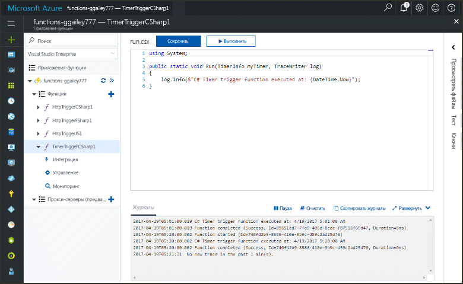
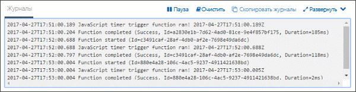
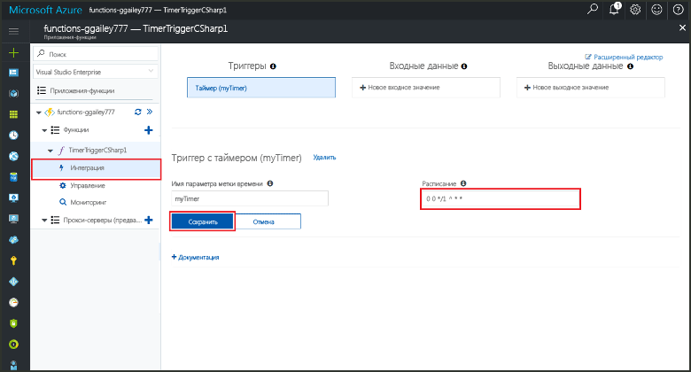

#  Создание в Azure функции, активируемой по таймеру

Узнайте, как создать функцию, которая выполняется на основе определенного расписания с помощь Функций Azure. 

Выполнение всех шагов в этой статье займет меньше пяти минут.

## Предварительные требования 

[!INCLUDE [Previous quickstart note](../../includes/functions-quickstart-previous-topics.md)]

В этой статье вы создадите функцию, активируемую по таймеру, в имеющемся приложении-функции. 

[!INCLUDE [functions-portal-favorite-function-apps](../../includes/functions-portal-favorite-function-apps.md)] 

## Создание функции, активируемой по таймеру

1. Разверните свое приложение-функцию, нажмите кнопку **+** рядом с пунктом **Функции**, а затем щелкните шаблон **TimerTrigger** для нужного языка. Затем используйте настройки, указанные в таблице, и щелкните**Создать**:

    | Настройка      |  Рекомендуемое значение   | Описание                              |
    | ------------ |  ------- | -------------------------------------------------- |
    | **Имя функции** | TimerTriggerCSharp1 | Определяет имя функции, активируемой по таймеру.
    | **[Расписание](http://en.wikipedia.org/wiki/Cron#CRON_expression)** | 0 */1 * * * * | [Выражение CRON](http://en.wikipedia.org/wiki/Cron#CRON_expression) с шестью полями, в котором запланировано ежеминутное выполнение функции. |

    Будет создана функция на выбранном вами языке, которая будет выполняться каждую минуту. 

4. Проверьте выполнение, просмотрев записанные в журналах сведения трассировки. 

    

Теперь вы можете изменить расписание функции, чтобы она выполнялась реже, например раз в час. 

## Обновление расписания таймера

1. Разверните вашу функцию и щелкните **Интеграция**. Здесь вы определяете входные и выходные привязки для вашей функции, а также задаете расписание. 

2. Введите в поле **Расписания** новое значение `0 0 */1 * * *`, а затем щелкните **Сохранить**.  

Теперь функция будет выполняться раз в час. 

## Очистка ресурсов

[!INCLUDE [Next steps note](../../includes/functions-quickstart-cleanup.md)]

## Дальнейшие действия
Вы создали функцию, которая выполняется на основе расписания. 

[!INCLUDE [Next steps note](../../includes/functions-quickstart-next-steps.md)]

Дополнительные сведения о триггерах см.в статье [Настройка триггеров для выполнения кода с помощью Функций Azure](functions-bindings-timer.md). 

