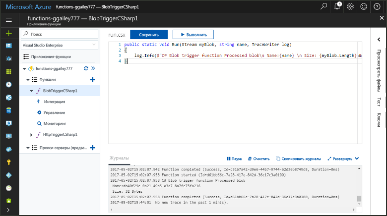
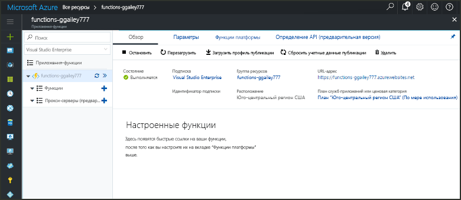
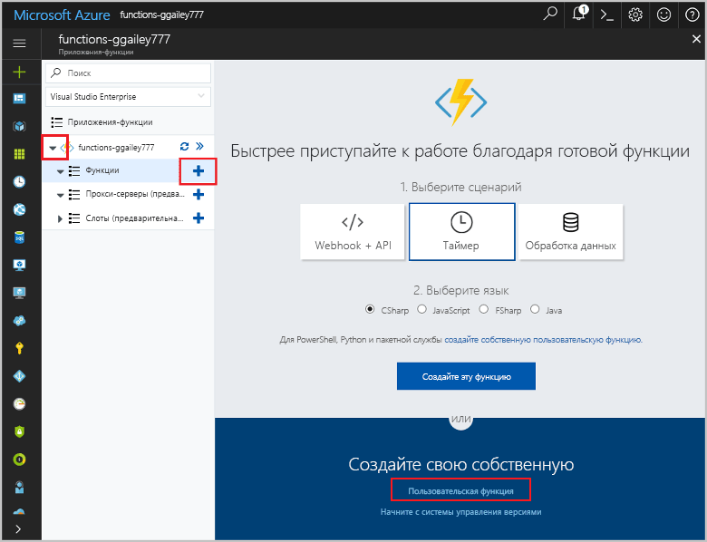
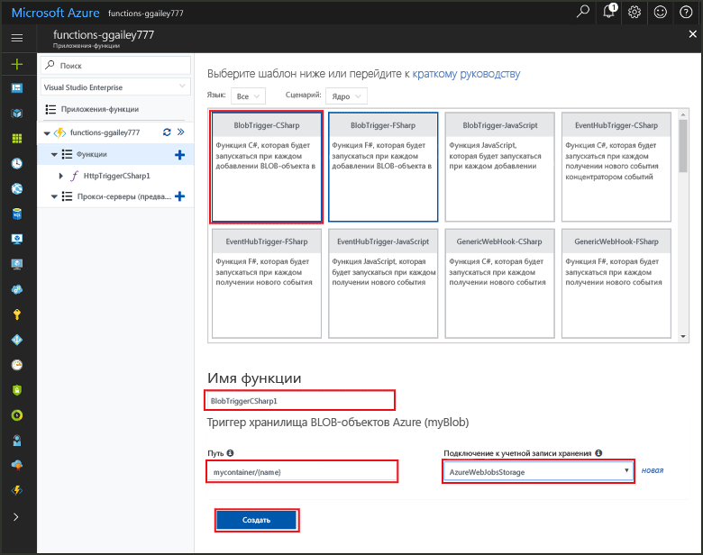
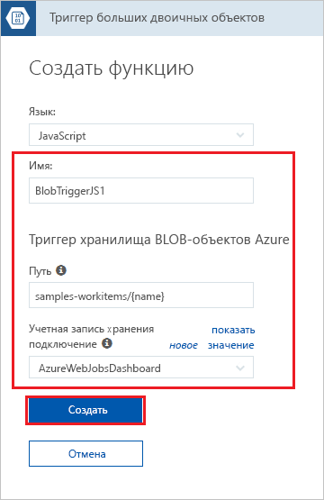
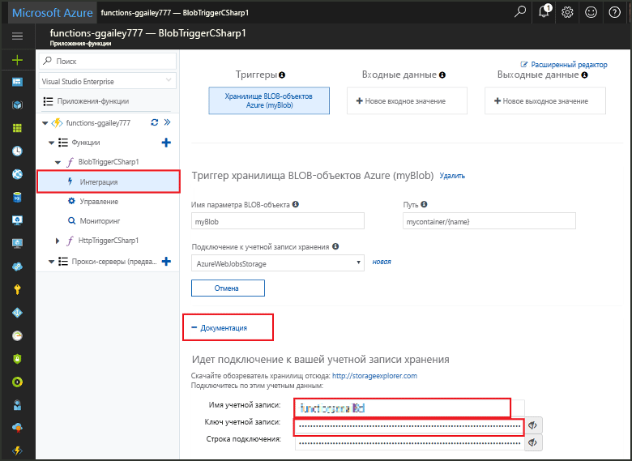
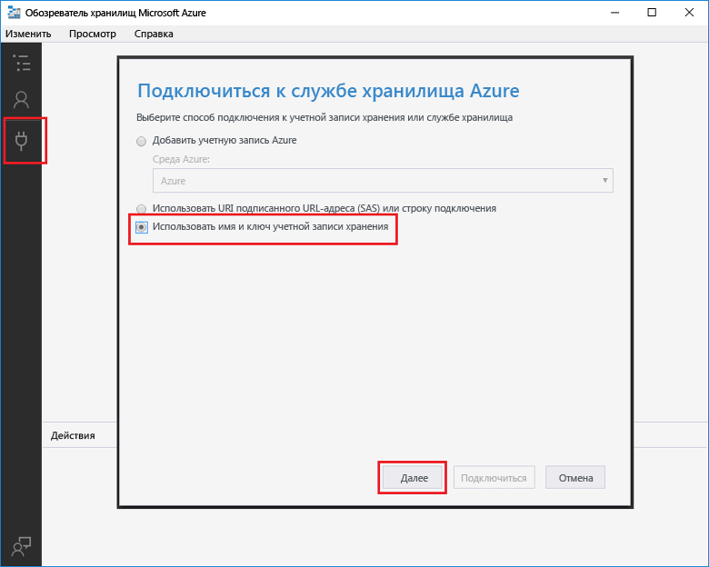
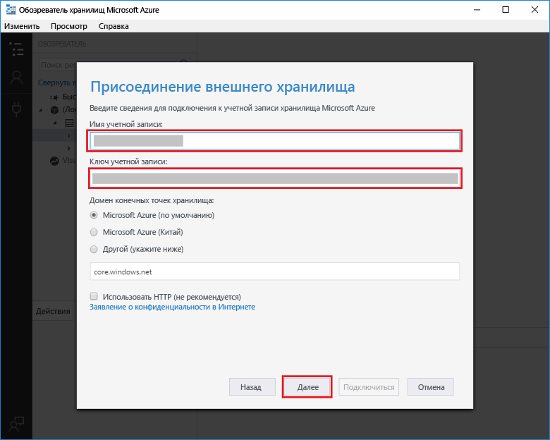
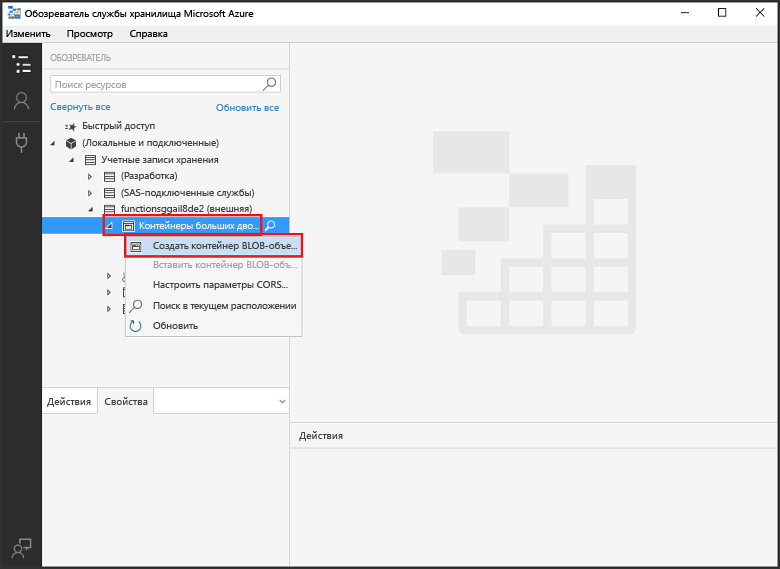
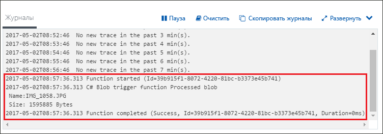

# Создание функции, активируемой хранилищем BLOB-объектов Azure

Узнайте, как создавать функцию, активируемую при добавлении файлов или их обновлении в хранилище BLOB-объектов Azure.

## предварительным требованиям

+ Скачайте и установите [обозреватель хранилищ Microsoft Azure](http://storageexplorer.com/).
+ Подписка Azure. Если у вас еще нет подписки Azure, создайте [бесплатную учетную запись](https://azure.microsoft.com/free/?WT.mc_id=A261C142F), прежде чем начать работу.

## Создание приложения-функции Azure

[!INCLUDE [Create function app Azure portal](../../includes/functions-create-function-app-portal.md)]

Затем создайте функцию в новом приложении-функции.

## Создание функции, активируемой хранилищем BLOB-объектов

1. Разверните приложение-функцию и нажмите кнопку **+** рядом с элементом **Функции**. Если это первая функция в приложении-функции, выберите **Пользовательская функция**. Откроется полный набор шаблонов функций.

    

2. В поле поиска введите `blob` и выберите нужный язык для шаблона триггера для хранилища BLOB-объектов.

    
 
3. Затем используйте настройки, указанные в таблице под изображением.

    

    | Параметр | Рекомендуемое значение | Описание |
    |---|---|---|
    | **Имя** | Уникальное для вашего приложения-функции | Имя функции, активируемой большим двоичным объектом. |
    | **Путь**   | samples-workitems/{name}    | Расположение в хранилище BLOB-объектов отслеживается. Имя файла большого двоичного объекта передается в привязке как параметр _name_.  |
    | **Подключение к учетной записи хранения** | AzureWebJobsStorage | Вы можете использовать подключение к учетной записи хранения, которое уже используется вашим приложением-функцией, или создать его.  |

3. Щелкните **Создать**, чтобы создать функцию.

Затем необходимо подключиться к своей учетной записи хранения Azure и создать контейнер **samples-workitems**.

## Создание контейнера

1. Щелкните **Интегрировать** в своей функции, затем разверните узел **Документация** и скопируйте **имя учетной записи** и **ключ учетной записи**. Эти учетные данные используются для подключения к учетной записи хранения. Если вы уже подключились к учетной записи хранения, перейдите к шагу 4.

    

1. Запустите инструмент [Обозреватель службы хранилища Microsoft Azure](http://storageexplorer.com/), щелкните значок подключения слева, выберите **Use a storage account name and key** (Использовать имя и ключ учетной записи хранения), а затем щелкните **Далее**.

    

1. Введите **имя учетной записи** и **ключ учетной записи** из шага 1, щелкните **Далее**, а затем — **Подключить**. 

    

1. Разверните подключенные учетную запись хранения, щелкните правой кнопкой мыши **Blob containers** (Контейнеры больших двоичных объектов), а затем щелкните **Create blob container** (Создать контейнер больших двоичных объектов), введите `samples-workitems` и нажмите клавишу ВВОД.

    

Теперь, когда у вас есть контейнер больших двоичных объектов, вы можете проверить функцию, отправив файл в контейнер.

## Проверка функции

1. На портале Azure перейдите к вашей функции, в нижней части страницы разверните **Журналы** и убедитесь, что потоковая передача журналов не остановлена.

1. В обозревателе службы хранилища разверните свою учетную запись хранения, **контейнеры больших двоичных объектов** и **samples-workitems**. Щелкните **Отправка**, а затем **Отправка файлов**.

    

1. В диалоговом окне **Отправка файлов** щелкните поле **Файлы**. Перейдите к файлу на вашем локальном компьютере, например к файлу изображения, выберите его и щелкните **Открыть**, а затем **Отправить**.

1. Вернитесь к журналам функции и убедитесь, что большой двоичный объект был считан.

   

    >[!NOTE]
    > Если ваше приложение-функция выполняется в рамках плана потребления по умолчанию, между добавлением или обновлением большого двоичного объекта и активацией функции могут возникнуть задержки до нескольких минут. Выполняйте свое приложение-функцию в рамках плана службы приложений, если требуется малая задержка в функции, активируемой большим двоичным объектом.

## Очистка ресурсов

[!INCLUDE [Next steps note](../../includes/functions-quickstart-cleanup.md)]

## Дополнительная информация

Вы создали функцию, которая выполняется при добавлении или обновлении большого двоичного объекта в хранилище BLOB-объектов. 

[!INCLUDE [Next steps note](../../includes/functions-quickstart-next-steps.md)]

Дополнительные сведения о триггерах хранилища BLOB-объектов см.в статье [Привязки больших двоичных объектов службы хранилища для Функций Azure](functions-bindings-storage-blob.md).
