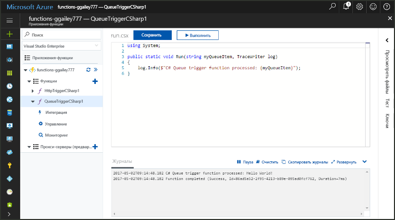
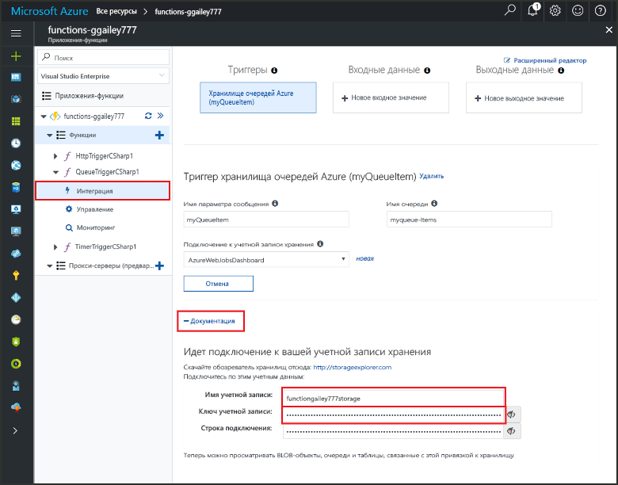
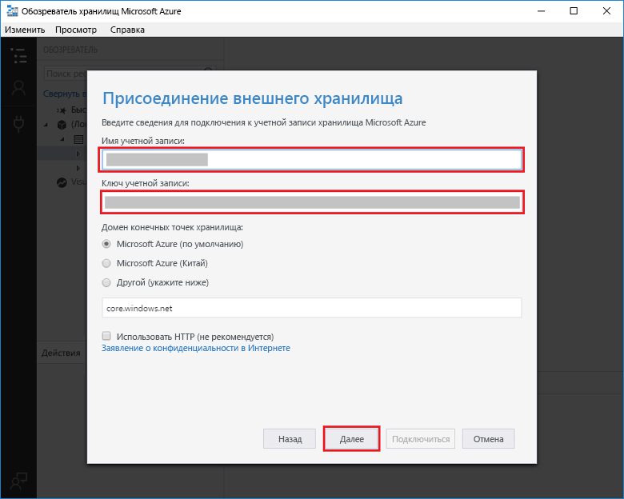
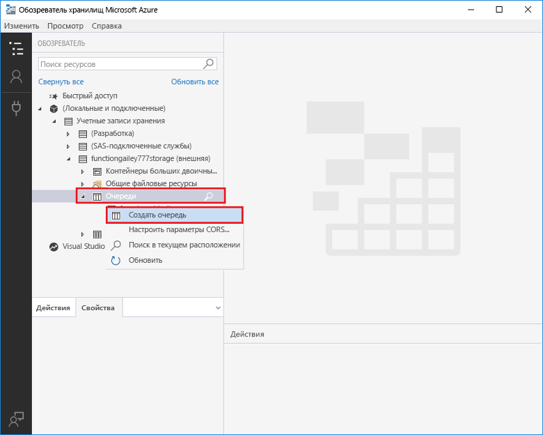
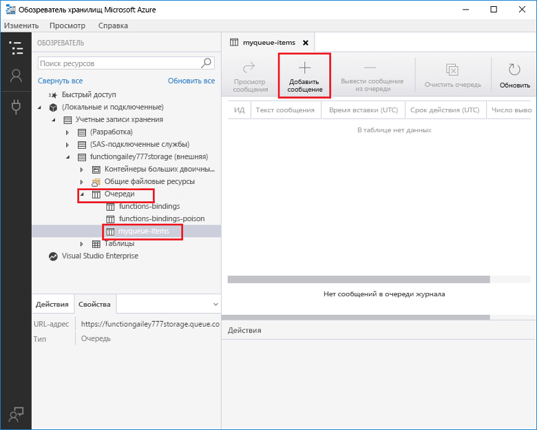
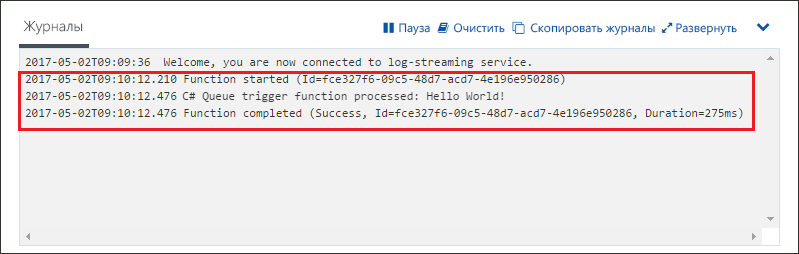

# Создание функции, активируемой хранилищем очередей Azure

Узнайте, как создавать функцию, активируемую при отправке сообщений в очередь службы хранилища Azure.

Выполнение всех шагов в этой статье займет меньше пяти минут.

## Предварительные требования

Перед выполнением этого примера вам понадобится сделать следующее:

- Скачайте и установите [обозреватель хранилищ Microsoft Azure](http://storageexplorer.com/).

Если у вас еще нет подписки Azure, [создайте бесплатную учетную запись Azure](https://azure.microsoft.com/free/?WT.mc_id=A261C142F) , прежде чем начинать работу.

[!INCLUDE [functions-portal-favorite-function-apps](../../includes/functions-portal-favorite-function-apps.md)]

## Создание приложения-функции Azure

[!INCLUDE [Create function app Azure portal](../../includes/functions-create-function-app-portal.md)]

Затем создайте функцию в новом приложении-функции.

## Создание функции, активируемой очередью

Разверните свое приложение-функцию, нажмите кнопку **+** рядом с **Функции**, а затем щелкните шаблон **QueueTrigger** для нужного языка. Затем используйте настройки, указанные в таблице, и щелкните **Создать**.

| Настройка | Рекомендуемое значение | Описание |
|---|---|---|
| **Имя очереди**   | myqueue-items    | Имя очереди для подключения к вашей учетной записи хранения. |
| **Подключение к учетной записи хранения** | AzureWebJobStorage | Вы можете использовать подключение к учетной записи хранения, которое уже используется вашим приложением-функцией, или создать его.  |
| **Имя функции** | Уникальное для вашего приложения-функции | Имя функции, активируемой очередью. |

Затем необходимо подключиться к своей учетной записи хранения Azure и создать очередь службы хранилища **myqueue-items**.

## Создание очереди

1. Щелкните **Интегрировать** в своей функции, затем разверните узел **Документация** и скопируйте **имя учетной записи** и **ключ учетной записи**. Эти учетные данные используются для подключения к учетной записи хранения. Если вы уже подключились к учетной записи хранения, перейдите к шагу 4.

    v

1. Запустите инструмент [Обозреватель службы хранилища Microsoft Azure](http://storageexplorer.com/), щелкните значок подключения слева, выберите **Use a storage account name and key** (Использовать имя и ключ учетной записи хранения), а затем щелкните **Далее**.

    

1. Введите **имя учетной записи** и **ключ учетной записи** из шага 1, щелкните **Далее**, а затем — **Подключить**.

    

1. Разверните подключенную учетную запись хранения, щелкните правой кнопкой мыши **Очереди** (Контейнеры больших двоичных объектов), а затем щелкните **Создать очередь**, введите `myqueue-items` и нажмите клавишу ВВОД.

    

Теперь, когда вы создали очередь хранилища, испытайте функцию, добавив сообщение в очередь.

## Проверка функции

1. На портале Azure перейдите к вашей функции, в нижней части страницы разверните **Журналы** и убедитесь, что потоковая передача журналов не остановлена.

1. Разверните свою учетную запись в обозревателе хранилищ, узел **Очереди** и **myqueue-items**, а затем щелкните **Add message** (Добавить сообщение).

    

1. Введите сообщение Hello World в поле **Текст сообщения** и щелкните **ОК**.

1. Подождите несколько секунд, а затем вернитесь в журналы функции и убедитесь, что новое сообщение было считано из очереди.

    

1. Вернитесь в обозреватель хранилища, щелкните **Обновить** и убедитесь, что сообщение было обработано и больше не находится в очереди.

## Очистка ресурсов

[!INCLUDE [Next steps note](../../includes/functions-quickstart-cleanup.md)]

## Дальнейшие действия

Вы создали функцию, которая выполняется при добавлении сообщения в очередь хранилища.

[!INCLUDE [Next steps note](../../includes/functions-quickstart-next-steps.md)]

Дополнительные сведения о триггерах хранилища очередей см. в статье [Привязки очередей службы хранилища для Функций Azure](functions-bindings-storage-queue.md).
