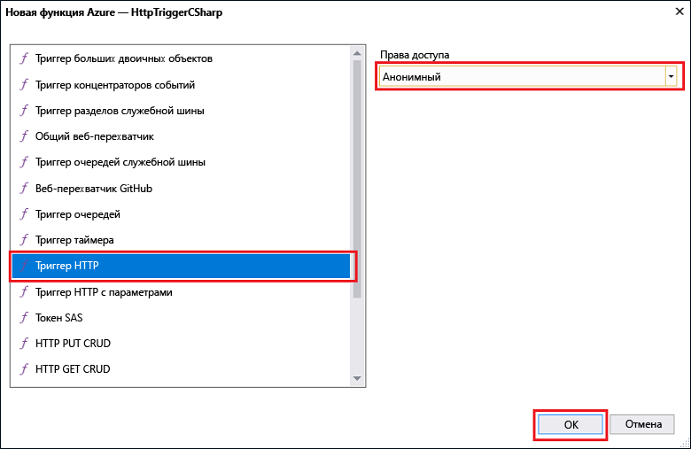

# Создание первой функции с помощью Visual Studio

Функции Azure позволяют вам выполнять свой код в бессерверной среде без необходимости создавать виртуальную машину или публиковать веб-приложение.

Изучив эту статью, вы научитесь использовать инструменты функций Azure для Visual Studio 2017 и локально тестировать функцию hello world. Затем вы опубликуете код функции в Azure. Эти средства доступны как часть рабочей нагрузки Azure для разработки в Visual Studio 2017 версии 15.3 или более поздней.

## Предварительные требования

Для работы с этим руководством установите следующие компоненты.

* [Visual Studio 2017 версия 15.3](https://www.visualstudio.com/vs/preview/), включая рабочую нагрузку**разработки в Azure**.

    

[!INCLUDE [quickstarts-free-trial-note](../../includes/quickstarts-free-trial-note.md)] 

## Создание проекта функций Azure в Visual Studio

[!INCLUDE [Create a project using the Azure Functions template](../../includes/functions-vstools-create.md)]

После создания проекта можно приступать к созданию первой функции.

## Создание функции

1. Щелкните правой кнопкой мыши узел проекта в **обозревателе решений** и выберите **Добавить** > **Новый элемент**. Выберите **Функция Azure** и нажмите кнопку **Добавить**.

2. Выберите **HttpTrigger**, укажите **имя функции**, выберите для параметра **Права доступа** значение **Анонимно** и нажмите кнопку **Создать**. Созданная функция доступна для HTTP-запроса из любого клиента. 

    

Созданную функцию, активируемую HTTP, можно протестировать на локальном компьютере.

## Локальное тестирование функции

Основные инструменты службы Функции Azure позволяют запускать проекты функций Azure на локальном компьютере разработчика. Вам будет предложено установить эти инструменты при первом запуске функции из Visual Studio.  

1. Чтобы проверить работу функции, нажмите клавишу F5. Если будет предложено, примите запрос от Visual Studio на скачивание и установку основных инструментов службы Функции Azure (CLI).  Кроме того, вам может понадобиться включить исключение брандмауэра, чтобы инструменты могли обрабатывать HTTP-запросы.

2. Скопируйте URL-адрес функции из выходных данных среды выполнения функций Azure.  

    

3. Вставьте URL-адрес запроса в адресную строку браузера. Добавьте строку запроса `&name=<yourname>` в этот URL-адрес и выполните запрос. Ниже показан ответ в браузере на локальный запрос GET, возвращаемый функцией: 

    

4. Чтобы остановить отладку, нажмите кнопку **Остановить** на панели инструментов Visual Studio.

Убедитесь, что функция правильно работает на локальном компьютере. Затем опубликуйте проект в Azure.

## Публикация проекта в Azure

Перед публикацией проекта убедитесь, что в вашей подписке Azure есть приложения-функция. Можно создать приложение-функцию непосредственно в Visual Studio.

[!INCLUDE [Publish the project to Azure](../../includes/functions-vstools-publish.md)]

## Тестирование функции в Azure

1. Скопируйте базовый URL-адрес приложения-функции на странице профиля публикации. Замените часть `localhost:port` URL-адреса, который использовался при локальной проверке функции новым базовым URL-адресом. Как и ранее, добавьте строку запроса `&name=<yourname>` в этот URL-адрес и выполните запрос.

    URL-адрес, который вызывает функцию, активируемую HTTP, выглядит так:

        http://<functionappname>.azurewebsites.net/api/<functionname>?name=<yourname> 

2. Вставьте этот URL-адрес HTTP-запроса в адресную строку браузера. Ниже показан ответ в браузере на удаленный запрос GET, возвращаемый функцией: 

    
 
## Дальнейшие действия

С помощью Visual Studio вы создали приложение-функцию C# с простой функцией, активируемой HTTP. 

+ Дополнительные сведения о настройке проекта для поддержки других типов триггеров и привязок см. в разделе [Настройка проекта для локальной разработки](functions-develop-vs.md#configure-the-project-for-local-development) в статье [Инструменты Функций Azure для Visual Studio](functions-develop-vs.md).
+ Дополнительные сведения о локальном тестировании и отладке с помощью основных инструментов функций Azure см. в статье [Как программировать и тестировать функции Azure в локальной среде](functions-run-local.md). 
+ Дополнительные сведения о разработке функций, таких как библиотек классов .NET, см. в статье [Using .NET class libraries with Azure Functions](functions-dotnet-class-library.md) (Использование библиотек классов .NET с помощью Функций Azure). 

