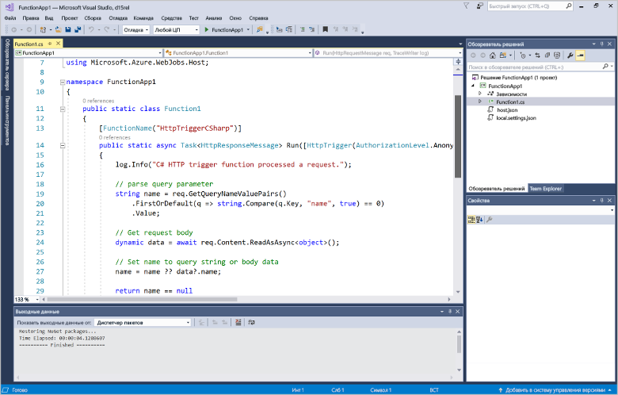
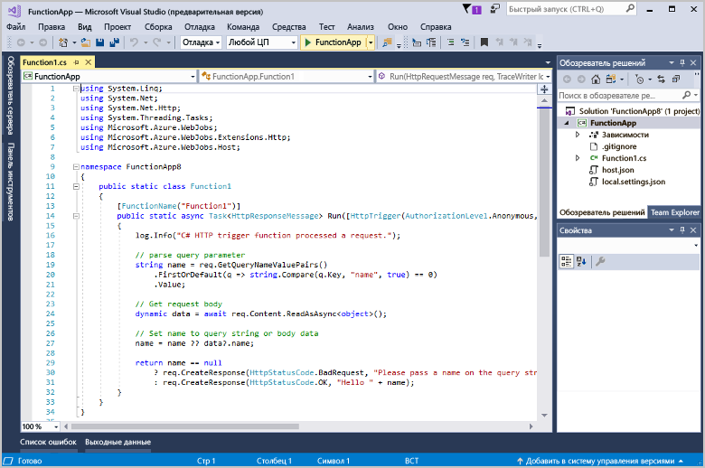
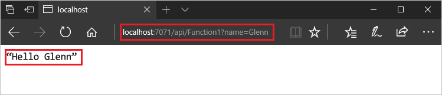
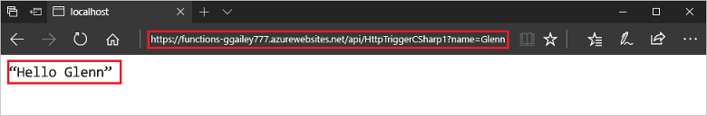

# Создание первой функции с помощью Visual Studio

Решение "Функции Azure" позволяет выполнять код в [бессерверной](https://azure.microsoft.com/overview/serverless-computing/) среде без необходимости создавать виртуальную машину или публиковать веб-приложение.

Изучив эту статью, вы научитесь использовать инструменты Visual Studio 2017 для службы "Функции Azure" и локально тестировать функцию hello world. Затем вы опубликуете код функции в Azure. Эти средства доступны как часть рабочей нагрузки Azure для разработки в Visual Studio 2017.

В этом разделе содержится [видео](#watch-the-video), демонстрирующее те же основные действия.

## предварительным требованиям

Для работы с этим руководством:

* Установите [Visual Studio 2017 15.5](https://www.visualstudio.com/vs/) или более поздней версии, а также рабочую нагрузку **разработки в Azure**.

    

    Если вы уже установили Visual Studio, убедитесь, что установлены все последние обновления. 

* Если вы установили рабочую нагрузку разработки Azure вместе с Visual Studio 2017 15.4 или более ранней версии, возможно, также потребуется [обновить средства решения "Функции Azure"](functions-develop-vs.md#check-your-tools-version). 
    
[!INCLUDE [quickstarts-free-trial-note](../../includes/quickstarts-free-trial-note.md)] 

## Создание проекта приложения-функции

[!INCLUDE [Create a project using the Azure Functions template](../../includes/functions-vstools-create.md)]

Visual Studio создает проект и класс в нем, содержащий стандартный код для выбранного типа функции. Атрибут метода **FunctionName** задает имя функции. Атрибут **HttpTrigger** указывает, что функция вызывается HTTP-запросом. Стандартный код отправляет HTTP-ответ, включающий в себя значение из текста или строки запроса. Вы можете добавить выходные привязки данных к функции, применив для метода соответствующие атрибуты. Дополнительные сведения см. в разделе [Триггеры и привязки](functions-dotnet-class-library.md#triggers-and-bindings) в статье [Справочник разработчика C# по функциям Azure](functions-dotnet-class-library.md).

Созданный проект функции и функцию, активируемую HTTP, можно протестировать на локальном компьютере.

## Локальное тестирование функции

Основные инструменты службы "Функции Azure" позволяют запускать проекты функций Azure на локальном компьютере разработчика. Вам будет предложено установить эти инструменты при первом запуске функции из Visual Studio.  

1. Чтобы проверить работу функции, нажмите клавишу F5. Если будет предложено, примите запрос от Visual Studio на скачивание и установку основных инструментов службы Функции Azure (CLI). Кроме того, вам может понадобиться включить исключение брандмауэра, чтобы инструменты могли обрабатывать HTTP-запросы.

2. Скопируйте URL-адрес функции из выходных данных среды выполнения функций Azure.  

    

3. Вставьте URL-адрес запроса в адресную строку браузера. Добавьте строку запроса `?name=<yourname>` в этот URL-адрес и выполните запрос. Ниже показан ответ в браузере на локальный запрос GET, возвращаемый функцией: 

    

4. Нажмите клавиши SHIFT+F5, чтобы остановить отладку.

Убедитесь, что функция правильно работает на локальном компьютере. Затем опубликуйте проект в Azure.

## Публикация проекта в Azure

Перед публикацией проекта убедитесь, что в вашей подписке Azure есть приложения-функция. Можно создать приложение-функцию непосредственно в Visual Studio.

[!INCLUDE [Publish the project to Azure](../../includes/functions-vstools-publish.md)]

## Тестирование функции в Azure

1. Скопируйте базовый URL-адрес приложения-функции на странице профиля публикации. Замените часть `localhost:port` URL-адреса, который использовался при локальной проверке функции новым базовым URL-адресом. Как и ранее, добавьте строку запроса `?name=<yourname>` в этот URL-адрес и выполните запрос.

    URL-адрес, вызывающий функцию, активирующую HTTP, должен быть в следующем формате:

        http://<functionappname>.azurewebsites.net/api/<functionname>?name=<yourname> 

2. Вставьте этот URL-адрес HTTP-запроса в адресную строку браузера. Ниже показан ответ в браузере на удаленный запрос GET, возвращаемый функцией: 

    

## Просмотреть видео

> [!VIDEO https://www.youtube-nocookie.com/embed/DrhG-Rdm80k]

## Дополнительная информация

С помощью Visual Studio вы создали и опубликовали приложение-функцию C# с простой функцией, активируемой HTTP. 

+ Дополнительные сведения о настройке проекта для поддержки других типов триггеров и привязок см. в разделе [Настройка проекта для локальной разработки](functions-develop-vs.md#configure-the-project-for-local-development) в статье [Инструменты Функций Azure для Visual Studio](functions-develop-vs.md).
+ Дополнительные сведения о локальном тестировании и отладке с помощью основных инструментов функций Azure см. в статье [Как программировать и тестировать функции Azure в локальной среде](functions-run-local.md). 
+ Дополнительные сведения о разработке функций, таких как библиотек классов .NET, см. в статье [Using .NET class libraries with Azure Functions](functions-dotnet-class-library.md) (Использование библиотек классов .NET с помощью Функций Azure). 

