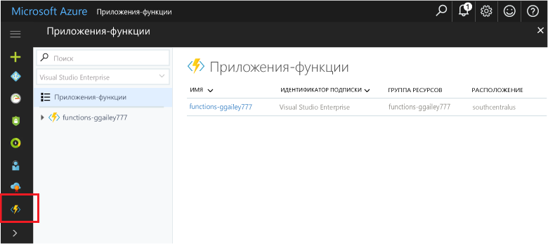

# Управление приложением-функцией на портале Azure 

В функциях Azure приложение-функция предоставляет контекст выполнения для отдельных функций. Поведение приложения-функции применяется ко всем содержащимся в нем функциям. Эта статья описывает настройку приложений-функций и управление ими на портале Azure.

Для начала перейдите на [портал Azure](http://portal.azure.com) и войдите, используя свою учетную запись Azure. На панели поиска в верхней части портала введите имя приложения-функции и выберите его в списке. После выбора приложения-функции появляется следующая страница:

## Избранные функции на портале 

Иногда бывает трудно найти ресурсы на [портале Azure]. Чтобы упростить поиск приложений-функций, которые вы создали, добавьте их в список "Избранное" на портале. 

1. Войдите на [портале Azure].

2. Щелкните стрелку в нижнем левом углу, чтобы развернуть все службы, введите `Functions` в поле **Фильтр**, а затем щелкните звездочку рядом с пунктом **Приложения-функции**.  
 
    

    При этом значок Функций добавится в меню слева на портале.

3. Закройте меню, а затем прокрутите вниз, чтобы увидеть значок функции. Щелкните этот значок, чтобы просмотреть список всех приложений-функций. Щелкните приложение-функцию для работы с функциями в этом приложении. 
 
    
 
[портале Azure]: https://portal.azure.com/

## Вкладка параметров приложения-функции

На вкладке **Параметры** можно обновить версию среды выполнения функций, используемую приложением-функцией. Кроме того, здесь также можно управлять ключами узла, используемыми для ограничения доступа по протоколу HTTP ко всем функциям, размещенным в приложении-функции.

Компонент функции поддерживает планы размещения как для потребления, так и для службы приложений. Сведения см. в статье [Выбор правильного плана обслуживания для функций Azure](functions-scale.md). Чтобы повысить прогнозируемость плана потребления, компонент функции позволяет ограничить использование платформы, задав квоту ежедневного использования в гигабайтах в секунду. По достижении квоты использования приложение-функция останавливается. Приложение-функция, остановленное в связи с достижением квоты, можно снова включить из того же контекста, где устанавливается квота на дневной расход. Сведения о выставлении счетов см. на [странице с ценами на Функции Azure](http://azure.microsoft.com/pricing/details/functions/).   

## Вкладка функций платформы

Приложения-функции выполняются на платформе службы приложения Azure и обслуживаются ею. Поэтому они имеют доступ к большинству функций базовой платформы веб-хостинга Azure. Вкладка **Функции платформы** предоставляет доступ ко многим функциям платформы службы приложений, которые можно использовать в приложениях-функциях. 

> [!NOTE]
> Не все функции службы приложений доступны при выполнении приложения с планом размещения потребления.

Ниже приводится более подробное описание следующих функций службы приложений на портале Azure, которые могут пригодиться при работе с функциями:

+ [Редактор службы приложений](#editor)
+ [Параметры приложения](#settings) 
+ [Console](#console)
+ [Дополнительные инструменты (Kudu)](#kudu)
+ [Варианты развертывания](#deployment)
+ [CORS](#cors)
+ [Аутентификация](#auth)
+ [Определение интерфейса API](#swagger)

Дополнительные сведения о работе с параметрами службы приложений см. в статье [Настройка параметров в службе приложений Azure](../app-service/web-sites-configure.md).

### Редактор службы приложений

| | |
|-|-|
|   | Редактор службы приложений — это расширенный редактор на портале, который можно использовать для изменения JSON-файлов конфигурации и файлов с кодом. При выборе этого параметра откроется отдельная вкладка браузера с базовым редактором. Он позволяет выполнять интеграцию с репозиторием Git, запускать и отлаживать код и изменять параметры приложения-функции. Этот редактор предоставляет расширенную среду разработки для функций по сравнению со стандартной колонкой приложения-функции.    |

### Параметры приложения

| | |
|-|-|
|  | Колонка **Параметры приложения** службы приложений позволяет настроить версии платформы, удаленную отладку, параметры приложения и строки подключения. При интеграции приложения-функции с Azure и сторонними службами соответствующие параметры можно изменить здесь. Чтобы удалить параметр, прокрутите вправо и выберите значок **X** в правом конце строки (не показано на следующем рисунке).

### Консоль

| | |
|-|-|
|  | Консоль на портале оптимально подходит разработчикам, желающим взаимодействовать с приложением-функцией из командной строки. Стандартные команды включают создание каталогов и файлов и навигацию по ним, а также выполнение пакетных файлов и сценариев. |

### Дополнительные инструменты (Kudu)

| | |
|-|-|
|  | Дополнительные средства для службы приложений (которые также называются Kudu) предоставляют доступ к расширенным административным функциям для приложения-функции. С помощью Kudu можно управлять системными сведениями, параметрами приложения, переменными среды, заголовками HTTP и переменными сервера. Кроме того, можно также запустить **Kudu**, перейдя на конечную точку SCM для приложения-функции, например `https://<myfunctionapp>.scm.azurewebsites.net/`. |

### <a name="deployment">Варианты развертывания

| | |
|-|-|
|  | Компонент функции позволяет разрабатывать код функций на локальном компьютере. Позднее вы можете передать локальный проект приложения-функции в Azure. Кроме традиционной передачи по FTP, компонент функции позволяет развернуть приложение-функцию с помощью популярных решений непрерывной интеграции, таких как GitHub, VSTS, Dropbox, Bitbucket и др. Дополнительные сведения см. в статье [Непрерывное развертывание для функций Azure](functions-continuous-deployment.md). Чтобы отправить данные вручную с помощью FTP или локального Git, нужно [настроить учетные данные развертывания](functions-continuous-deployment.md#credentials). |

### CORS

| | |
|-|-|
|  | Чтобы предотвратить выполнение вредоносного кода в службах, служба приложений блокирует вызовы приложений-функций из внешних источников. Компонент функции поддерживает общий доступ к ресурсам независимо от источника (CORS), чтобы вы могли определить "список разрешений" из источников, откуда функции могут принимать удаленные запросы.  |

### Проверка подлинности

| | |
|-|-|
|  | Если функции используют триггер HTTP, можно настроить обязательную предварительную проверку подлинности для вызовов. Служба приложений поддерживает проверку подлинности Azure Active Directory и вход в систему с помощью поставщиков социальных сетей, таких как Facebook, Майкрософт и Twitter. Дополнительные сведения о настройке определенных поставщиков аутентификации см. в разделе [Проверка подлинности и авторизация в службе приложений Azure](../app-service/app-service-authentication-overview.md). |

### Определение интерфейса API

| | |
|-|-|
|  | Компонент функции поддерживает Swagger, что позволяет упростить использование функций, активируемых по HTTP, клиентами. Дополнительные сведения о создании определений API с помощью Swagger см. в статье [Размещение API-интерфейсов RESTful с поддержкой CORS в службе приложений Azure](../app-service/app-service-web-tutorial-rest-api.md). Можно также использовать прокси-серверы для функций, чтобы определить единую поверхность API для нескольких функций. Дополнительные сведения см. в статье [Работа с прокси-серверами для функций Azure](functions-proxies.md). |

## Дополнительная информация

+ [Настройка параметров службы приложений Azure](../app-service/web-sites-configure.md)
+ [Непрерывное развертывание для функций Azure](functions-continuous-deployment.md)

