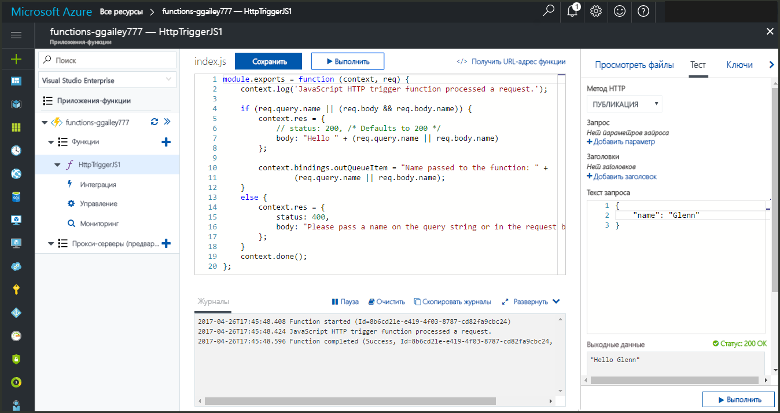

# <a name="add-messages-to-an-azure-storage-queue-using-functions"></a>Добавление сообщений в очередь службы хранилища Azure с помощью Функций

В Функциях Azure входные и выходные привязки предоставляют декларативный способ подключения данных внешних служб к функции. В этой статье вы узнаете, как обновить имеющуюся функцию, добавив выходную привязку, которая отправляет сообщения в хранилище очередей Azure.  



## <a name="prerequisites"></a>Предварительные требования 

[!INCLUDE [Previous topics](../../includes/functions-quickstart-previous-topics.md)]

* Установите [обозреватель службы хранилища Microsoft Azure](http://storageexplorer.com/).

## <a name="add-binding"></a>Добавление выходной привязки
 
1. Разверните ваше приложение-функцию и функцию.

2. Выберите **Интегрировать** и **+Новые выходные данные**, а затем выберите **Хранилище очередей Azure** и **Выбрать**.
    
    

3. Используйте настройки, указанные в таблице: 

    

    | Настройка      |  Рекомендуемое значение   | Описание                              |
    | ------------ |  ------- | -------------------------------------------------- |
    | **Имя очереди**   | myqueue-items    | Имя очереди для подключения к вашей учетной записи хранения. |
    | **Подключение к учетной записи хранения** | AzureWebJobStorage | Вы можете использовать подключение к учетной записи хранения, которое уже используется вашим приложением-функцией, или создать его.  |
    | **Имя параметра сообщения** | outputQueueItem | Имя параметра выходной привязки. | 

4. Щелкните **Сохранить**, чтобы добавить привязку.
 
Теперь, когда выходная привязка определена, вам нужно обновить код, чтобы использовать привязку для добавления сообщений в очередь.  

## <a name="update-the-function-code"></a>Обновление кода функции

1. Щелкните функцию для отображения ее кода в редакторе. 

2. Обновите определение функции C#, как показано ниже, чтобы добавить параметр привязки хранилища **outputQueueItem**. Пропустите этот шаг для функции JavaScript.

    ```cs   
    public static async Task<HttpResponseMessage> Run(HttpRequestMessage req, 
        ICollector<string> outputQueueItem, TraceWriter log)
    {
        ....
    }
    ```

3. Добавьте следующий код к функции непосредственно перед возвращением метода. Используйте соответствующий фрагмент для языка функции.

    ```javascript
    context.bindings.outputQueueItem = "Name passed to the function: " + 
                (req.query.name || req.body.name);
    ```

    ```cs
    outputQueueItem.Add("Name passed to the function: " + name);     
    ```

4. Щелкните **Сохранить**, чтобы сохранить изменения.

Значение, переданное триггеру HTTP, включено в сообщение, которое добавлено в очередь.
 
## <a name="test-the-function"></a>Проверка функции 

1. Сохранив изменения в коде, щелкните **ОК**. 

    

2. Проверьте журналы, чтобы убедиться, что функция успешно выполнена. Новая очередь с именем **outqueue** создается в вашей учетной записи хранения средой выполнения Функции при первом использовании выходной привязки.

Затем вы можете подключиться к своей учетной записи хранения, чтобы проверить новую очередь и добавленное в нее сообщение. 

## <a name="connect-to-the-queue"></a>Подключение к очереди

Пропустите первые три шага, если вы уже установили обозреватель хранилищ и подключили его к своей учетной записи хранения.    

1. Выберите **Интегрировать** в своей функции, затем новую выходную привязку **Хранилище очередей Azure**, после чего разверните узел **Документация**. Скопируйте **имя учетной записи** и **ключ учетной записи**. Эти учетные данные используются для подключения к учетной записи хранения.
 
    

2. Запустите инструмент [Обозреватель службы хранилища Microsoft Azure](http://storageexplorer.com/), щелкните значок подключения слева, выберите **Использовать имя и ключ учетной записи хранения**, а затем щелкните **Далее**.

    
    
3. Укажите **имя учетной записи** и **ключ учетной записи** из шага 1 в соответствующих полях, а затем щелкните **Далее** и **Подключить**. 
  
    

4. Разверните подключенную учетную запись хранения, разверните элемент **Очереди** и убедитесь, что очередь с именем **myqueue-items** существует. Также вы увидите сообщение, которое уже находится в очереди.  
 
    
 

## <a name="clean-up-resources"></a>Очистка ресурсов

[!INCLUDE [Next steps note](../../includes/functions-quickstart-cleanup.md)]

## <a name="next-steps"></a>Дальнейшие действия

Вы добавили выходную привязку в имеющуюся функцию. 

[!INCLUDE [Next steps note](../../includes/functions-quickstart-next-steps.md)]

Дополнительные сведения о привязках к хранилищу очередей см.в статье [Привязки очередей службы хранилища для Функций Azure](functions-bindings-storage-queue.md). 


