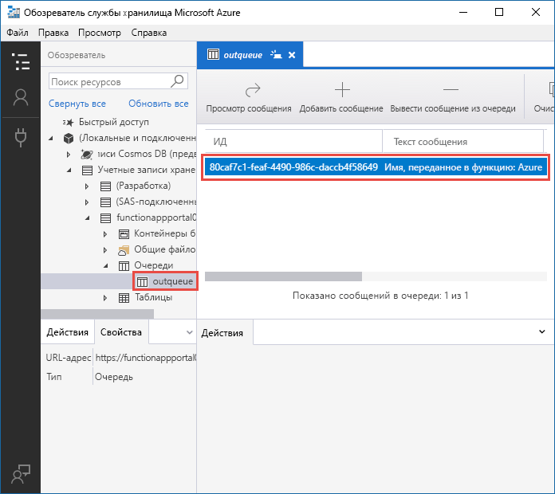
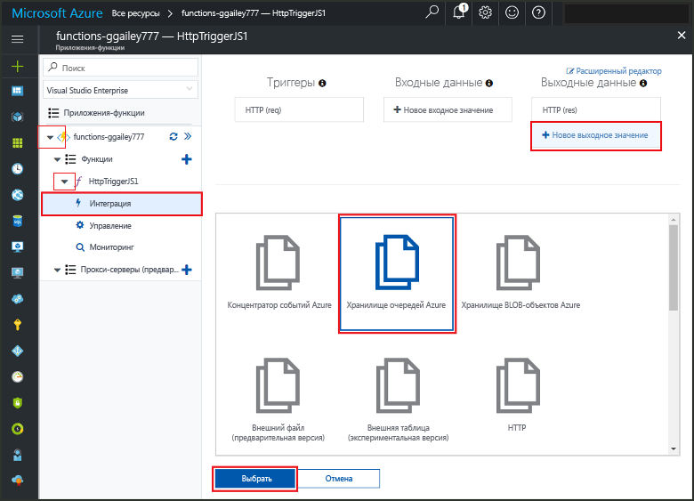
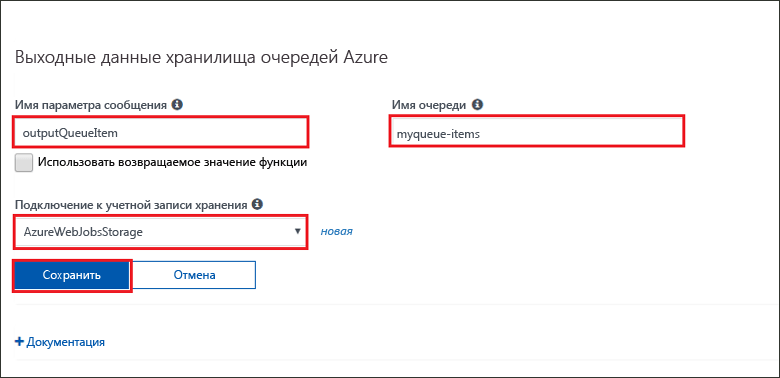
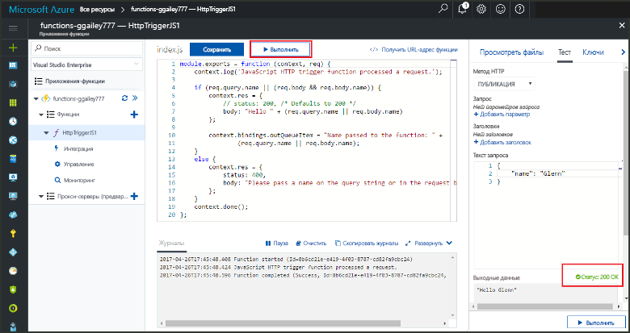
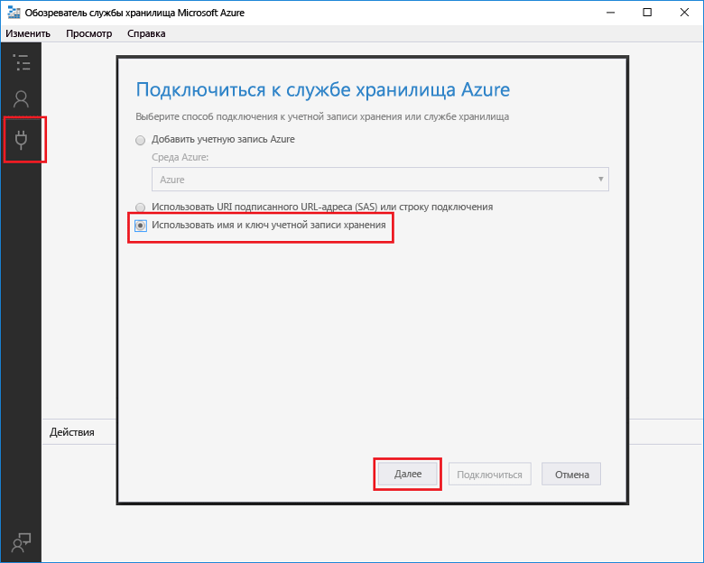
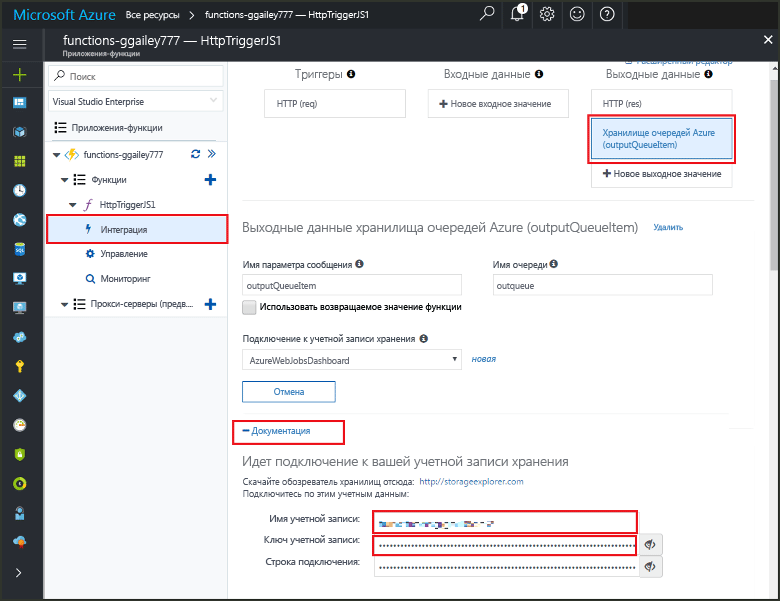
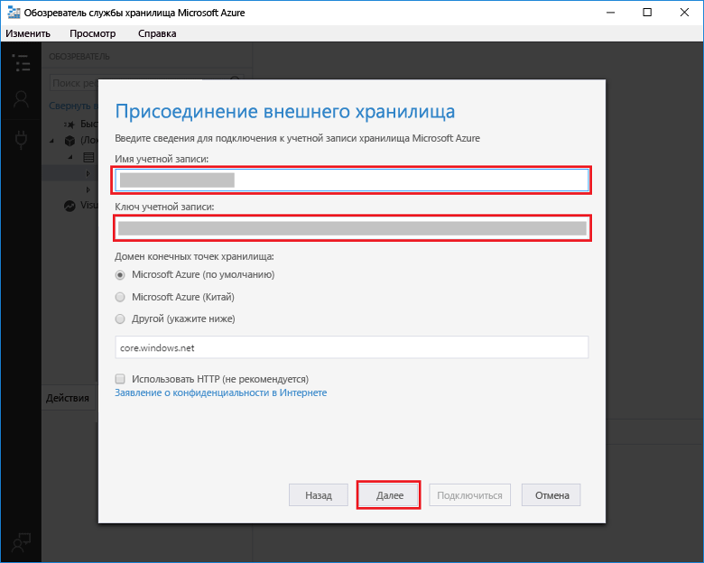

# <a name="add-messages-to-an-azure-storage-queue-using-functions"></a>Добавление сообщений в очередь службы хранилища Azure с помощью Функций

В службе "Функции Azure" входные и выходные привязки предоставляют декларативный способ предоставления коду данных внешних служб. В этом кратком руководстве используется выходная привязка для создания сообщения в очереди при активации функции HTTP-запросом. Используйте обозреватель службы хранилища Azure для просмотра сообщений очереди, создаваемых вашей функцией:



## <a name="prerequisites"></a>предварительным требованиям 

Для работы с этим кратким руководством сделайте следующее:

* Следуйте указаниям, приведенным в статье [Создание первой функции на портале Azure](functions-create-first-azure-function.md), пропустив шаг **Очистка ресурсов**. При работе с этим кратким руководством создаются приложение-функция и функция, которые вы будете использовать здесь.

* Установите [Обозреватель службы хранилища Microsoft Azure](http://storageexplorer.com/). Это инструмент, который вы будете использовать для проверки сообщений очереди, создаваемых с помощью выходной привязки.

## <a name="add-binding"></a>Добавление выходной привязки

В этом разделе вам нужно будет добавить выходную привязку хранилища очередей для функции, созданной ранее, с помощью пользовательского интерфейса портала. Эта привязка позволит написать минимальный код для создания сообщения в очереди. Вам не нужно писать код для таких задач, как открытие подключения к хранилищу, создание очереди или получение ссылки на очередь. Эти задачи выполняет среда выполнения службы "Функции Azure" и выходная привязка очереди.

1. На портале Azure откройте страницу приложения-функции для приложения, созданного [ранее](functions-create-first-azure-function.md). Для этого последовательно выберите **Все службы > Приложения-функции**, а затем выберите приложение-функцию.

2. Выберите созданную ранее функцию.

1. Выберите **Интегрировать > Создать выходные данные > Хранилище очередей Azure**.

1. Нажмите кнопку **Выбрать**.
    
    

3. В разделе **Azure Queue Storage output** (Выходные данные хранилища очередей Azure) используйте параметры, указанные в следующей таблице: 

    

    | Параметр      |  Рекомендуемое значение   | ОПИСАНИЕ                              |
    | ------------ |  ------- | -------------------------------------------------- |
    | **Имя параметра сообщения** | outputQueueItem | Имя параметра выходной привязки. | 
    | **Подключение к учетной записи хранения** | AzureWebJobsStorage | Вы можете использовать подключение к учетной записи хранения, которое уже используется вашим приложением-функцией, или создать его.  |
    | **Имя очереди**   | outqueue    | Имя очереди для подключения к вашей учетной записи хранения. |

4. Щелкните **Сохранить**, чтобы добавить привязку.
 
Теперь, когда выходная привязка определена, вам нужно обновить код, чтобы использовать привязку для добавления сообщений в очередь.  

## <a name="add-code-that-uses-the-output-binding"></a>Добавление кода, который использует выходную привязку

В этом разделе вы добавляете код, который записывает сообщение в выходную очередь. Сообщение содержит значение, которое передается в триггер HTTP в строке запроса. Например, если строка запроса содержит `name=Azure`, в сообщении очереди будет указано: *Имя передано функции: Azure*.

1. Щелкните функцию для отображения ее кода в редакторе. 

2. Для функции C # добавьте параметр метода для привязки и напишите код, чтобы использовать его:

   Добавьте параметр **outputQueueItem** в сигнатуру метода, как показано в следующем примере. Имя параметра совпадает с тем, что вы ввели в поле **Имя параметра сообщения** при создании привязки.

   ```cs   
   public static async Task<HttpResponseMessage> Run(HttpRequestMessage req, 
       ICollector<string> outputQueueItem, TraceWriter log)
   {
       ...
   }
   ```

   В теле функции C # непосредственно перед инструкцией `return` добавьте код, который создает сообщения очереди с помощью этого параметра.

   ```cs
   outputQueueItem.Add("Name passed to the function: " + name);     
   ```

3. Для функции JavaScript добавьте код, который использует выходную привязку, к объекту `context.bindings` для создания сообщения очереди. Добавьте этот код перед инструкцией `context.done`.

   ```javascript
   context.bindings.outputQueueItem = "Name passed to the function: " + 
               (req.query.name || req.body.name);
   ```

4. Щелкните **Сохранить**, чтобы сохранить изменения.
 
## <a name="test-the-function"></a>Проверка функции 

1. Сохранив изменения в коде, щелкните **ОК**. 

    

   Обратите внимание, что **тело запроса** содержит `name` значение *Azure*. Это значение находится в сообщении очереди, которое создается при вызове функции.

   Кроме выбора элемента **Запуск** можно вызвать функцию, введя URL-адрес в браузере и указав значение `name` в строке запроса. Метод браузера описан в предыдущем [кратком руководстве](functions-create-first-azure-function.md#test-the-function).

2. Проверьте журналы, чтобы убедиться, что функция успешно выполнена. 

Новая очередь с именем **outqueue** создается в вашей учетной записи хранения средой выполнения Функции при первом использовании выходной привязки. Чтобы убедиться, что очередь и сообщение в ней были созданы, вам нужно будет использовать Обозреватель службы хранилища.

### <a name="connect-storage-explorer-to-your-account"></a>Подключение Обозревателя службы хранилища к учетной записи

Пропустите этот раздел, если вы уже установили Обозреватель службы хранилища и подключили его к используемой учетной записи хранения.

2. Запустите инструмент [Обозреватель службы хранилища Microsoft Azure](http://storageexplorer.com/), щелкните значок подключения слева, выберите **Использовать имя и ключ учетной записи хранения**, а затем щелкните **Далее**.

    

1. На портале Azure на странице приложения-функции выберите свою функцию, а затем **Интегрировать**.

1. Выберите выходную привязку **Хранилище очередей Azure**, добавленную ранее.

1. В нижней части страницы разверните раздел **Документация**. 

   На портале показаны учетные данные, которые вы можете использовать в Обозревателе службы хранилища для подключения к учетной записи хранения.

   

1. Скопируйте значение **имени учетной записи** с портала и вставьте его в поле **Имя учетной записи** в Обозреватель службы хранилища.
 
1. Нажмите значок "Показать/Скрыть" рядом с полем **Ключ учетной записи**, чтобы отобразить это значение. Затем скопируйте значение **ключа учетной записи** и вставьте его в поле **Учетная запись** в Обозревателе службы хранилища.
  
3. Выберите **Далее > Подключить**.

   

### <a name="examine-the-output-queue"></a>Проверка выходной очереди

4. В Обозревателе службы хранилища выберите используемую учетную запись хранения.

1. Разверните узел **Очереди**, а затем выберите очередь с именем **outqueue**. 

   В ней содержится сообщение о том, что выходная привязка очереди создана при запуске функции, активируемой HTTP. Если вы вызывали функцию со значением по умолчанию `name` *Azure*, в сообщении очереди будет указано *Имя переданной функции: Azure*.

    

2. Запустите функцию еще раз, и в очереди появится новое сообщение.  

## <a name="clean-up-resources"></a>Очистка ресурсов

[!INCLUDE [Clean up resources](../../includes/functions-quickstart-cleanup.md)]

## <a name="next-steps"></a>Дополнительная информация

Выполнив указания этого краткого руководства, вы добавили выходную привязку в имеющуюся функцию. Дополнительные сведения о привязках к хранилищу очередей см.в статье [Привязки очередей службы хранилища для Функций Azure](functions-bindings-storage-queue.md). 

[!INCLUDE [Next steps note](../../includes/functions-quickstart-next-steps.md)]
